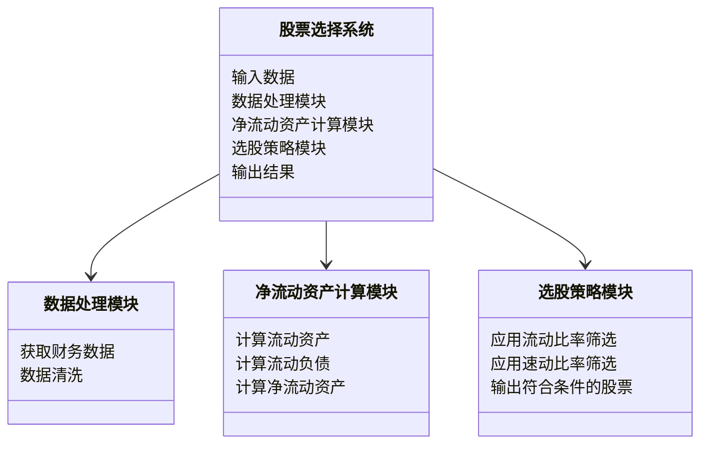
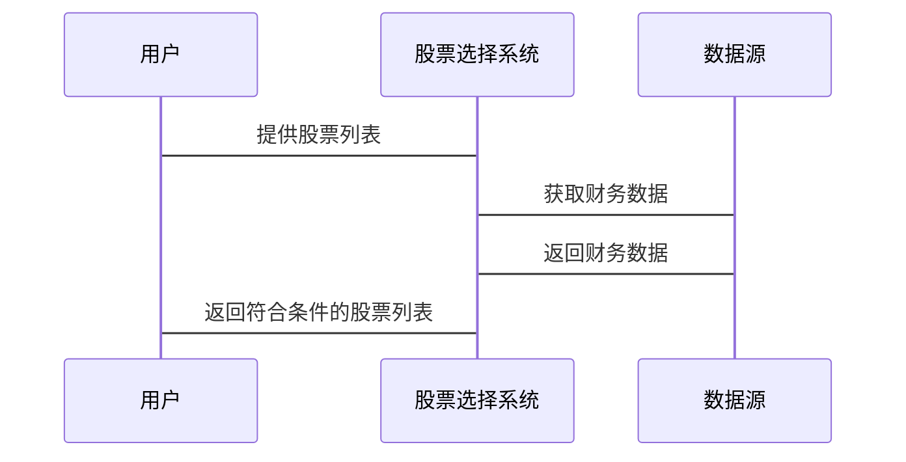

                 


# 净流动资产价值在股票选择中的重要性

> 关键词：净流动资产，股票选择，财务分析，投资决策，流动性分析

> 摘要：净流动资产是企业在短期内偿还债务和维持运营的关键指标，对股票选择具有重要意义。本文从净流动资产的定义、分析方法及其在选股中的应用入手，探讨其在投资决策中的重要性。

---

## 第一部分：净流动资产的定义与核心概念

### 第1章：净流动资产的定义与核心概念

#### 1.1 净流动资产的定义

**净流动资产**是指流动资产减去流动负债，反映企业短期内的财务健康状况。流动资产包括现金、应收账款、存货等，流动负债包括应付账款、短期借款等。

- **流动性分析**：净流动资产越高，企业偿还短期债务的能力越强。
- **经济意义**：净流动资产是企业维持日常运营和应对突发事件的关键资源。

#### 1.2 净流动资产的核心属性

- **流动性**：净流动资产代表企业短期内可变现的资产，确保企业能够偿还短期债务。
- **偿债能力**：净流动资产是衡量企业财务安全的重要指标，高净流动资产意味着较低的短期偿债风险。
- **资产结构**：净流动资产影响企业的运营效率和资金周转速度。

#### 1.3 净流动资产与企业财务健康的关系

- **短期偿债能力**：净流动资产充足的公司更能应对突发的资金需求。
- **运营效率**：高净流动资产意味着企业能够高效利用资金，提高盈利能力。
- **长期发展**：净流动资产为企业的扩展和研发投入提供资金支持。

---

## 第二部分：净流动资产在股票选择中的应用背景

### 第2章：净流动资产在股票选择中的应用背景

#### 2.1 股票选择的基本原则

股票选择是一个复杂的过程，涉及多个维度的分析，包括基本面、技术面和市场情绪等。其中，基本面分析尤为重要，而净流动资产是基本面分析中的关键指标之一。

##### 2.1.1 股票选择的多维度分析

股票选择通常包括以下步骤：

1. **行业分析**：选择具有增长潜力的行业。
2. **财务指标分析**：评估企业的盈利能力、成长性和财务健康。
3. **估值分析**：比较股票的市场价格与内在价值。
4. **技术分析**：通过价格和成交量走势预测未来走势。

##### 2.1.2 财务指标在选股中的重要性

财务指标是选股的核心依据，主要包括：

- **盈利能力**：如净利润率、ROE（股东权益回报率）。
- **成长能力**：如收入增长率、净利润增长率。
- **财务健康**：如流动比率、速动比率、净流动资产。

##### 2.1.3 净流动资产在财务指标中的地位

净流动资产是衡量企业短期偿债能力的关键指标，其重要性体现在以下几个方面：

- **反映企业流动性**：净流动资产高意味着企业有足够的流动资金应对短期债务。
- **评估财务风险**：低净流动资产可能意味着企业面临短期偿债压力，增加投资风险。
- **预测企业稳定性**：高净流动资产的企业在市场波动中更具稳定性，吸引长期投资者。

##### 2.1.4 净流动资产与其他财务指标的关系

净流动资产与其他财务指标密切相关，例如：

- **流动比率**：流动资产/流动负债，净流动资产=流动资产-流动负债，因此流动比率=1 + (流动负债/净流动资产)。
- **速动比率**：(流动资产-存货)/流动负债，与净流动资产密切相关。

#### 2.2 传统选股方法的局限性

传统选股方法虽然提供了基础框架，但在实际应用中存在诸多局限性。

##### 2.2.1 市盈率法的局限

市盈率（P/E比率）=股价/每股收益，其局限性在于：

- **行业偏差**：市盈率在不同行业间缺乏可比性，例如科技行业通常市盈率较高，但不一定代表高风险。
- **周期性影响**：市盈率受经济周期影响较大，难以反映企业的实际盈利能力。
- **未来盈利能力的不确定性**：高市盈率可能反映市场对未来增长的预期，但若企业无法实现，则可能导致股价下跌。

##### 2.2.2 市净率法的局限

市净率（P/B比率）=股价/每股净资产，其局限性在于：

- **资产结构影响**：市净率受企业资产结构影响较大，例如重资产行业市净率较高，但并不一定代表企业盈利能力强。
- **无形资产的忽视**：市净率难以衡量无形资产的价值，如品牌、技术等。
- **杠杆效应**：高负债企业可能通过杠杆效应影响市净率，掩盖实际的财务健康状况。

##### 2.2.3 股息率法的局限

股息率=每股股息/股价，其局限性在于：

- **收益不稳定**：高股息率可能源于低股价，但如果企业盈利不稳定，股息可能不可持续。
- **成长性忽视**：高成长性的企业可能选择 reinvest profits rather than pay dividends，导致股息率低，但长期回报更高。
- **行业差异**：某些行业如公用事业可能股息率较高，但增长潜力有限。

#### 2.3 净流动资产分析的优势

净流动资产分析在选股中的优势显著，弥补了传统方法的不足。

##### 2.3.1 净流动资产作为选股指标的独特性

- **短期偿债能力的直接反映**：净流动资产高意味着企业短期内财务压力小，降低投资风险。
- **流动性分析的精准性**：通过净流动资产可以更准确地评估企业的资金周转能力和运营效率。
- **风险控制的工具**：净流动资产高的企业更能抵御短期市场波动，为投资者提供安全边际。

##### 2.3.2 净流动资产在风险控制中的作用

- **降低投资风险**：高净流动资产企业具备较强的抗风险能力，减少因短期流动性不足导致的财务危机。
- **评估管理质量**：净流动资产的管理效率反映企业的运营能力，优秀的管理团队通常能更好地维护和提升净流动资产。

##### 2.3.3 净流动资产与企业长期发展的结合

- **支持企业扩张**：净流动资产为企业的研发、并购等长期发展项目提供资金支持。
- **增强市场信心**：高净流动资产增强投资者对企业的信心，提升股价稳定性。

---

## 第三部分：净流动资产的财务分析方法

### 第3章：净流动资产的财务分析方法

#### 3.1 净流动资产比率分析

##### 3.1.1 流动比率的计算与意义

流动比率=流动资产/流动负债，反映企业短期偿债能力。

- **计算公式**：流动比率 = 流动资产 / 流动负债
- **意义**：流动比率越高，企业偿还短期债务的能力越强，通常认为流动比率在1.5-2之间为合理。

##### 3.1.2 速动比率的计算与意义

速动比率=（流动资产-存货）/流动负债，比流动比率更保守。

- **计算公式**：速动比率 = (流动资产 - 存货) / 流动负债
- **意义**：速动比率衡量企业迅速变现能力，通常认为速动比率在1-1.5之间为合理。

##### 3.1.3 现金比率的计算与意义

现金比率=现金及现金等价物/流动负债，最直接反映企业短期偿债能力。

- **计算公式**：现金比率 = (现金 + 现金等价物) / 流动负债
- **意义**：现金比率越高，企业应对突发债务的能力越强，通常认为现金比率在0.5以上为合理。

##### 3.1.4 净流动资产比率与企业信用评级的关系

企业信用评级与净流动资产比率密切相关，高信用评级企业通常具有较高的流动比率和速动比率。

---

### 第4章：净流动资产在股票选择中的具体应用

#### 4.1 净流动资产比率与选股策略

##### 4.1.1 流动比率在选股中的应用

- **筛选标准**：选择流动比率在1.5-2之间的企业，排除流动比率过低的企业。
- **行业比较**：不同行业的流动比率标准不同，需结合行业特点进行调整。

##### 4.1.2 速动比率在选股中的应用

- **筛选标准**：选择速动比率在1-1.5之间的企业，排除速动比率过低的企业。
- **案例分析**：以制造业为例，分析速动比率对选股的影响。

##### 4.1.3 现金比率在选股中的应用

- **筛选标准**：选择现金比率在0.5以上的公司，确保企业具备足够的现金储备。
- **行业差异**：例如，科技企业可能存货较高，影响现金比率，需结合具体情况分析。

---

## 第五部分：系统分析与架构设计方案

### 第5章：系统分析与架构设计方案

#### 5.1 问题场景介绍

在实际选股过程中，投资者需要综合考虑多个财务指标，包括净流动资产。为了提高选股效率，可以构建一个基于净流动资产的选股系统。

#### 5.2 项目介绍

本项目旨在开发一个基于净流动资产的选股系统，帮助投资者筛选出具备较强短期偿债能力和财务健康的企业。

#### 5.3 系统功能设计（领域模型）

##### 5.3.1 领域模型（mermaid 类图）



#### 5.4 系统架构设计（mermaid 架构图）


#### 5.5 系统接口设计

- **输入接口**：接收股票代码、财务数据等输入。
- **输出接口**：输出符合条件的股票列表。

#### 5.6 系统交互设计（mermaid 序列图）



---

## 第六部分：项目实战

### 第6章：项目实战

#### 6.1 环境安装

- **工具选择**：使用Python的Pandas库进行数据处理，使用Matplotlib进行数据可视化。
- **数据来源**：使用Yahoo Finance获取股票数据。

#### 6.2 核心实现源代码

```python
import pandas as pd
import requests

# 获取股票数据
def get_stock_data(ticker):
    url = f"https://query1.finance.yahoo.com/ws/v1/finance/quote/{ticker}"
    response = requests.get(url)
    data = response.json()
    return data['quoteResponse']['result'][0]

# 计算净流动资产
def calculate_net_current_assets(data):
    current_assets = data['totalCurrentAssets']
    current_liabilities = data['totalCurrentLiabilities']
    return current_assets - current_liabilities

# 选股策略
def stock_selection(tickers):
    selected_stocks = []
    for ticker in tickers:
        data = get_stock_data(ticker)
        nca = calculate_net_current_assets(data)
        # 筛选条件：流动比率在1.5-2之间，速动比率在1-1.5之间
        if 1.5 <= (data['totalCurrentAssets'] / data['totalCurrentLiabilities']) <= 2:
            selected_stocks.append(ticker)
    return selected_stocks

# 实战案例：筛选制造业股票
manufacturing_stocks = ['AAPL', 'MSFT', 'IBM', 'ORCL', 'DE']
selected = stock_selection(manufacturing_stocks)
print("符合条件的股票:", selected)
```

#### 6.3 代码应用解读与分析

- **数据获取**：使用Yahoo Finance API获取股票的财务数据。
- **净流动资产计算**：通过流动资产减去流动负债得到净流动资产。
- **选股策略**：基于流动比率和速动比率筛选股票，确保企业具备较强的短期偿债能力。

#### 6.4 实际案例分析

以制造业为例，筛选出符合条件的股票，并分析其财务状况和市场表现。

---

## 第七部分：总结与展望

### 第7章：总结与展望

#### 7.1 总结

净流动资产是股票选择中的关键指标，其重要性体现在以下几个方面：

- **反映企业短期偿债能力**：净流动资产高的企业具备较强的风险承受能力。
- **评估企业财务健康**：净流动资产是衡量企业财务稳定性的重要指标。
- **支持投资决策**：基于净流动资产的选股策略有助于降低投资风险，提高投资收益。

#### 7.2 展望

未来，随着大数据和人工智能技术的发展，净流动资产分析将更加智能化和个性化。投资者可以利用先进的技术手段，结合净流动资产和其他财务指标，构建更精准的选股模型，实现更优的投资回报。

---

## 第八部分：最佳实践与注意事项

### 第8章：最佳实践与注意事项

#### 8.1 最佳实践

- **定期更新数据**：市场环境和企业财务状况不断变化，需定期更新数据以保持选股模型的有效性。
- **结合其他指标**：净流动资产分析应与其他财务指标相结合，如ROE、收入增长率等，全面评估企业价值。
- **行业差异分析**：不同行业的净流动资产标准不同，需结合行业特点进行调整。

#### 8.2 注意事项

- **数据准确性**：确保数据来源可靠，避免因数据错误导致选股失误。
- **模型适用性**：净流动资产分析适用于短期投资，长期投资者需综合考虑其他因素。
- **市场环境影响**：宏观经济环境和行业趋势会影响企业净流动资产的表现，需密切关注相关变化。

---

## 第九部分：附录

### 附录A：进一步阅读的资源

- **书籍推荐**：
  - 《投资学》（书籍名称）：深入讲解股票选择的基本原理。
  - 《财务报表分析》（书籍名称）：详细分析财务报表中的各项指标。
- **在线资源**：推荐几个专业的财务分析网站和工具，如 Yahoo Finance、Morningstar等。

---

以上是《净流动资产价值在股票选择中的重要性》的技术博客文章的详细目录和部分章节内容。通过系统的分析和实际案例，本文全面探讨了净流动资产在股票选择中的重要性，并为投资者提供了实用的选股策略和工具。

