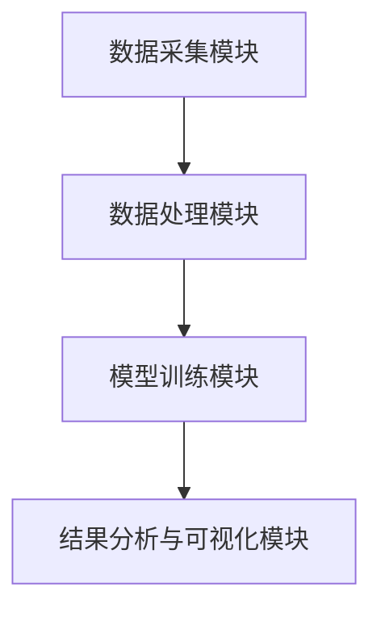

                 


# 利用AI agents分析替代数据：挖掘非传统投资信号

**关键词：** AI代理, 替代数据, 投资信号, 非传统数据, 金融分析, 自然语言处理, 计算机视觉

**摘要：**  
本文探讨了利用AI代理分析替代数据以挖掘非传统投资信号的方法。文章首先介绍了替代数据的定义、特点及其在投资分析中的重要性，然后详细阐述了AI代理的核心概念与工作原理。接着，文章分析了替代数据的特征提取、质量评估及预处理方法，并结合具体案例展示了AI代理在实际投资分析中的应用场景。最后，本文总结了利用AI代理分析替代数据的优势与挑战，并展望了未来的研究方向。

---

# 第1章 替代数据与AI代理概述

## 1.1 替代数据的定义与特点

### 1.1.1 什么是替代数据  
替代数据是指那些传统金融数据之外的其他数据源，例如社交媒体帖子、卫星图像、供应链数据、专利申请、招聘信息等。这些数据通常不直接反映市场交易情况，但可以通过分析挖掘出潜在的投资信号。

### 1.1.2 替代数据的分类与应用场景  
替代数据可以分为以下几类：  
1. **文本数据**：如社交媒体评论、新闻文章、公司财报等。  
2. **图像数据**：如卫星图像（用于分析供应链情况）或市场情绪图像。  
3. **结构化数据**：如供应链物流数据、专利申请数据等。  

替代数据的应用场景包括：  
- **情绪分析**：通过社交媒体情绪预测市场走势。  
- **供应链分析**：通过卫星图像监测物流情况。  
- **创新预测**：通过专利数据预测公司技术创新能力。  

### 1.1.3 替代数据在投资分析中的重要性  
替代数据能够提供传统金融数据无法捕捉的市场信息，例如投资者情绪、市场参与度和行业趋势。通过分析替代数据，投资者可以更全面地评估公司的基本面和市场前景，从而做出更明智的投资决策。

---

## 1.2 AI代理的核心概念

### 1.2.1 什么是AI代理  
AI代理是一种能够感知环境并采取行动以实现目标的智能系统。在投资分析中，AI代理可以通过分析替代数据来识别潜在的投资机会或风险。

### 1.2.2 AI代理的类型与特点  
AI代理可以分为以下几种类型：  
1. **基于规则的代理**：根据预定义的规则采取行动。  
2. **基于机器学习的代理**：通过训练数据学习投资模式。  
3. **基于自然语言处理的代理**：通过分析文本数据识别市场情绪。  

### 1.2.3 AI代理在金融投资中的应用潜力  
AI代理可以通过分析替代数据，帮助投资者识别市场趋势、预测公司业绩，并优化投资组合。例如，通过分析社交媒体情绪，AI代理可以预测市场波动并提前做出投资决策。

---

## 1.3 替代数据与传统金融数据的对比

### 1.3.1 传统金融数据的局限性  
传统金融数据（如股票价格、财务报表）虽然重要，但其信息往往是滞后且有限的。例如，公司财报通常只能反映过去的财务状况，无法预测未来的市场变化。

### 1.3.2 替代数据的独特优势  
替代数据具有以下优势：  
- 数据来源多样化，能够提供更全面的市场信息。  
- 数据更新速度快，可以捕捉市场变化的实时动态。  
- 数据量大，能够发现传统金融数据难以捕捉的模式。  

### 1.3.3 两种数据的结合与互补  
将传统金融数据与替代数据结合使用，可以提高投资分析的准确性和全面性。例如，通过结合社交媒体情绪和公司财报，投资者可以更全面地评估公司的市场表现。

---

## 1.4 本章小结  
本章介绍了替代数据的定义、分类及其在投资分析中的重要性，同时阐述了AI代理的核心概念和其在金融投资中的应用潜力。通过对比传统金融数据与替代数据的优缺点，本文为后续章节的分析奠定了基础。

---

# 第2章 替代数据的特征与AI代理的核心原理

## 2.1 替代数据的特征分析

### 2.1.1 文本数据的特征提取  
文本数据可以通过自然语言处理技术提取关键词、情感倾向等特征。例如，使用TF-IDF方法提取文本中的重要关键词，或者使用情感分析模型判断文本的情感倾向。

### 2.1.2 图像数据的特征提取  
图像数据可以通过计算机视觉技术提取特征。例如，使用卷积神经网络（CNN）提取图像中的物体特征，或者使用目标检测算法识别图像中的特定物体。

### 2.1.3 结构化数据的特征提取  
结构化数据可以通过数据分析技术提取特征。例如，通过统计分析提取数据中的趋势、周期性等特征。

### 2.2 替代数据的质量评估  
替代数据的质量直接影响分析结果的准确性。常见的数据质量评估指标包括：  
- **完整性**：数据是否缺失。  
- **准确性**：数据是否真实可靠。  
- **一致性**：数据是否符合预期格式。  

### 2.3 替代数据的预处理方法  
- **数据清洗**：去除重复数据、填补缺失值。  
- **数据增强**：通过数据增强技术增加数据多样性。  
- **数据标注**：为数据添加标签以便后续分析。  

---

## 2.2 AI代理的核心原理

### 2.2.1 代理的定义与功能  
AI代理通过感知环境（替代数据）并采取行动（生成投资信号）来实现投资目标。

### 2.2.2 基于替代数据的AI代理设计  
AI代理的设计需要考虑以下方面：  
- 数据输入与特征提取：将替代数据转换为可输入模型的特征向量。  
- 模型选择与训练：选择合适的机器学习模型并进行训练。  
- 结果输出与反馈机制：将模型输出的投资信号反馈给投资者并进行优化。  

### 2.2.3 AI代理的算法实现  
- **基于NLP的文本分析**：使用BERT模型进行文本情感分析。  
- **基于CV的图像识别**：使用YOLO算法进行图像目标检测。  
- **基于机器学习的预测模型**：使用随机森林或神经网络模型进行预测。  

---

## 2.3 本章小结  
本章详细介绍了替代数据的特征分析方法，并阐述了AI代理的核心原理。通过结合自然语言处理、计算机视觉和机器学习技术，AI代理能够有效地分析替代数据并生成投资信号。

---

# 第3章 系统分析与架构设计

## 3.1 系统分析

### 3.1.1 问题场景介绍  
本文设计了一个基于AI代理的投资信号分析系统，旨在通过分析替代数据（如社交媒体情绪、供应链数据）来辅助投资者做出投资决策。

### 3.1.2 项目介绍  
系统目标：通过替代数据分析生成投资信号。  
系统功能：数据采集、数据处理、模型训练、结果分析与可视化。

---

## 3.2 系统功能设计

### 3.2.1 数据采集模块  
- 采集社交媒体数据、供应链数据等替代数据。  

### 3.2.2 数据处理模块  
- 数据清洗、特征提取、数据标注。  

### 3.2.3 模型训练模块  
- 使用机器学习模型训练投资信号生成模型。  

### 3.2.4 结果分析与可视化模块  
- 可视化投资信号并生成报告。  

---

## 3.3 系统架构设计

### 3.3.1 分层架构设计  
- **数据层**：存储原始数据和特征数据。  
- **计算层**：处理数据并训练模型。  
- **应用层**：展示结果并生成投资信号。  

### 3.3.2 模块间交互关系  
使用Mermaid图展示模块交互关系：



---

## 3.4 本章小结  
本章通过系统分析与架构设计，详细描述了基于AI代理的投资信号分析系统的功能和结构。通过分层架构设计，确保系统各模块能够高效协同工作。

---

# 第4章 项目实战：基于社交媒体情绪的股票分析

## 4.1 环境安装与配置

```bash
pip install numpy pandas scikit-learn transformers
```

---

## 4.2 核心代码实现

```python
from transformers import pipeline

# 初始化情感分析模型
sentiment_analyzer = pipeline("sentiment-analysis")

# 定义数据预处理函数
def preprocess(text):
    return sentiment_analyzer(text)[0]['label']

# 数据分析与可视化
import pandas as pd
import matplotlib.pyplot as plt

data = pd.read_csv('social_media_data.csv')
data['sentiment'] = data['text'].apply(preprocess)
data['sentiment'].value_counts().plot(kind='bar')
plt.show()
```

---

## 4.3 结果分析与解读  
通过分析社交媒体情绪，AI代理可以预测市场走势。例如，当社交媒体情绪从“中性”转向“积极”时，AI代理可以生成买入信号。

---

## 4.4 本章小结  
本章通过一个具体案例展示了如何利用AI代理分析替代数据。通过社交媒体情绪分析，投资者可以更好地理解市场情绪并做出投资决策。

---

# 第5章 总结与展望

## 5.1 总结  
本文探讨了利用AI代理分析替代数据的方法，详细介绍了替代数据的特征分析、AI代理的核心原理以及系统架构设计。通过具体案例展示了AI代理在实际投资分析中的应用场景。

## 5.2 展望  
未来的研究可以进一步探索更复杂的替代数据类型（如视频数据）以及更先进的AI代理算法（如强化学习）。同时，如何提高AI代理的可解释性也是一个重要的研究方向。

---

## 5.3 最佳实践 Tips  
- 数据质量是分析结果准确性的关键，需重视数据清洗与预处理。  
- 在实际应用中，建议结合多种替代数据源以提高分析结果的全面性。  
- AI代理的投资决策需结合市场实际情况，避免过度依赖模型预测。  

---

通过本文的分析，读者可以全面理解如何利用AI代理挖掘非传统投资信号，并在实际投资分析中应用这些方法。

