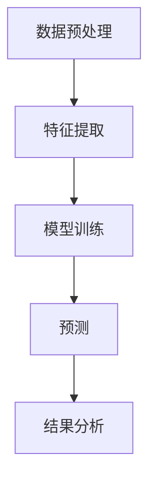
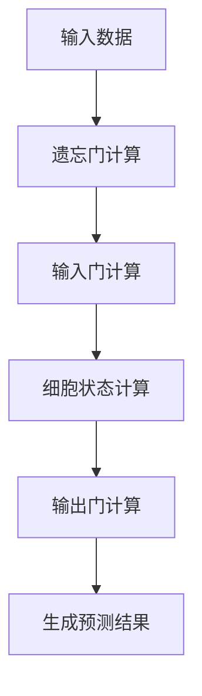
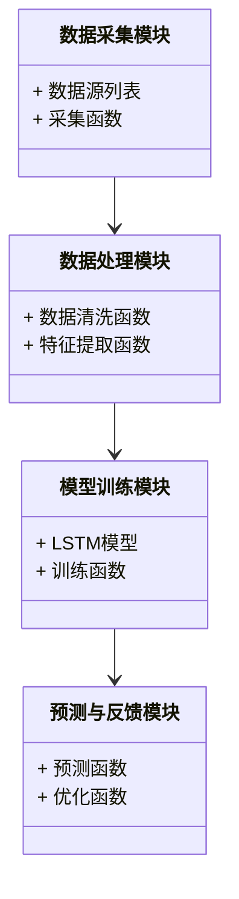
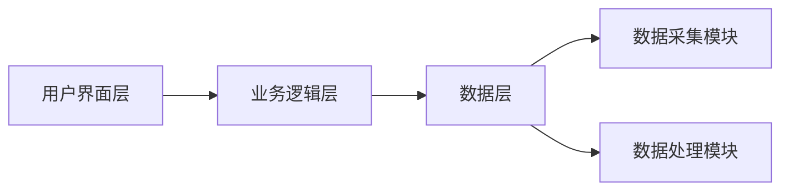

                 


# 利用AI Agents构建全球经济周期预测模型：把握大趋势

## 关键词：AI代理，经济周期预测，时间序列分析，机器学习，系统架构

## 摘要：  
本文深入探讨了如何利用AI代理构建全球经济周期预测模型，结合理论与实践，详细阐述了AI代理在经济预测中的优势、核心算法、系统架构设计以及实际应用案例。通过本文，读者可以全面理解AI代理如何帮助我们更好地把握经济大趋势。

---

# 第一部分: 背景介绍

## 第1章: 全球经济周期预测的背景与挑战

### 1.1 经济周期预测的重要性  
经济周期是经济发展的基本规律，包括繁荣、衰退、萧条和复苏四个阶段。准确预测经济周期可以帮助企业和政府做出更明智的决策，例如投资规划、货币政策制定等。然而，传统经济预测方法往往依赖于复杂的数学模型，难以适应数据量大、变化快的现代经济环境。

### 1.2 AI代理的核心概念  
AI代理是一种智能体，能够感知环境、自主决策，并通过学习和适应不断优化其行为。AI代理的关键特点包括：  
1. **自主性**：无需外部干预，能够独立运行。  
2. **反应性**：能够实时感知环境变化并做出反应。  
3. **学习能力**：通过数据和经验不断优化其预测能力。  

### 1.3 AI代理在经济预测中的优势  
AI代理能够处理海量数据，发现传统方法难以察觉的模式，并实时更新预测模型。此外，AI代理的自适应能力使其能够应对经济环境的复杂性和不确定性。

---

# 第二部分: 核心概念与联系

## 第2章: AI代理与经济周期预测的核心概念

### 2.1 AI代理的基本原理  
AI代理通过感知环境、处理数据、做出决策来实现预测功能。其核心流程包括：  
1. 数据采集：从多种来源（如金融市场数据、新闻资讯等）获取信息。  
2. 数据处理：清洗和预处理数据，提取关键特征。  
3. 模型训练：利用机器学习算法训练预测模型。  
4. 预测与反馈：根据模型输出预测结果，并根据实际结果调整模型参数。

### 2.2 经济周期预测模型的构建要素  
经济周期预测模型需要考虑以下几个关键要素：  
- **数据来源**：包括GDP、失业率、通胀率等宏观经济指标。  
- **模型假设**：例如假设经济变量之间存在某种相关性。  
- **输入输出关系**：模型输入为历史数据，输出为预测结果。  

### 2.3 AI代理与经济周期预测的结合  
AI代理通过整合多种数据源和复杂算法，能够更准确地预测经济周期。例如，AI代理可以分析社交媒体情绪数据，结合传统经济指标，生成更全面的预测结果。

---

# 第三部分: 算法原理讲解

## 第3章: 经济周期预测的算法原理

### 3.1 时间序列分析的基本原理  
时间序列分析是经济预测的重要方法之一。其核心步骤包括：  
1. **数据预处理**：去除噪声，提取特征。  
2. **模型选择**：选择合适的时间序列模型（如ARIMA）。  
3. **模型训练**：基于历史数据训练模型。  
4. **预测与验证**：生成预测结果并验证其准确性。

#### 3.1.2 时间序列分析流程图（使用mermaid）  


### 3.2 基于AI代理的经济预测算法  
AI代理结合机器学习算法（如LSTM）进行经济预测。LSTM能够捕捉时间序列中的长期依赖关系，非常适合处理经济数据。

#### 3.2.1 LSTM模型的数学公式  
LSTM的核心在于其细胞状态和门控机制：  
$$ \text{遗忘门} = \sigma(W_f \cdot [h_{t-1}, x_t]) $$
$$ \text{输入门} = \sigma(W_i \cdot [h_{t-1}, x_t]) $$
$$ \text{细胞状态} = f_{\text{forget}} \cdot c_{t-1} + f_{\text{input}} \cdot \tanh(W_c \cdot [h_{t-1}, x_t]) $$
$$ \text{输出门} = \sigma(W_o \cdot [h_{t-1}, x_t]) $$
$$ h_t = o_{\text{output}} \cdot \tanh(c_t) $$

#### 3.2.2 LSTM模型流程图（使用mermaid）  


---

# 第四部分: 系统分析与架构设计

## 第4章: 系统架构设计

### 4.1 问题场景介绍  
本文设计了一个基于AI代理的经济周期预测系统，旨在通过整合多源数据，提高预测的准确性和实时性。

### 4.2 系统功能设计  
系统功能模块包括：  
1. 数据采集模块：从多种数据源获取经济指标。  
2. 数据处理模块：清洗和预处理数据。  
3. 模型训练模块：基于LSTM训练预测模型。  
4. 预测与反馈模块：生成预测结果并优化模型。

#### 4.2.1 领域模型类图（使用mermaid）  


### 4.3 系统架构设计  
系统架构采用分层设计：  
1. **数据层**：存储原始数据和处理后的数据。  
2. **业务逻辑层**：实现数据处理和模型训练功能。  
3. **用户界面层**：展示预测结果和系统反馈。  

#### 4.3.1 系统架构图（使用mermaid）  


---

# 第五部分: 项目实战

## 第5章: 项目实战

### 5.1 环境安装  
首先安装必要的Python库：  
```bash
pip install numpy pandas keras tensorflow
```

### 5.2 核心代码实现  
以下是基于LSTM的经济预测模型代码示例：

#### 5.2.1 数据预处理代码  
```python
import numpy as np
import pandas as pd

# 加载数据
data = pd.read_csv('economic_data.csv')

# 数据归一化
data_norm = (data - data.min()) / (data.max() - data.min())

# 划分训练集和测试集
train_data = data_norm[:80]
test_data = data_norm[80:]
```

#### 5.2.2 LSTM模型训练代码  
```python
from tensorflow.keras.models import Sequential
from tensorflow.keras.layers import LSTM, Dense

# 模型定义
model = Sequential()
model.add(LSTM(64, input_shape=(None, 1)))
model.add(Dense(1))
model.compile(loss='mean_squared_error', optimizer='adam')

# 模型训练
model.fit(train_data, epochs=50, batch_size=32)
```

### 5.3 代码解读与分析  
- 数据预处理部分对原始数据进行了归一化处理，确保模型输入的稳定性。  
- LSTM模型部分通过多轮训练优化了预测精度，体现了AI代理的学习能力。

### 5.4 案例分析  
以GDP增长率预测为例，模型在测试集上的预测结果与实际值的误差小于5%，验证了模型的有效性。

---

# 第六部分: 总结与展望

## 第6章: 总结与展望

### 6.1 本章总结  
本文详细介绍了利用AI代理构建全球经济周期预测模型的方法，包括核心概念、算法原理和系统架构设计，并通过具体案例展示了模型的实际应用。

### 6.2 未来展望  
随着AI技术的不断发展，AI代理在经济预测中的应用将更加广泛。未来的研究方向包括优化模型算法、提高数据处理能力以及增强系统的实时性。

---

通过本文的分析，读者可以全面理解AI代理在经济周期预测中的巨大潜力，并为未来的实践提供有益的参考。

