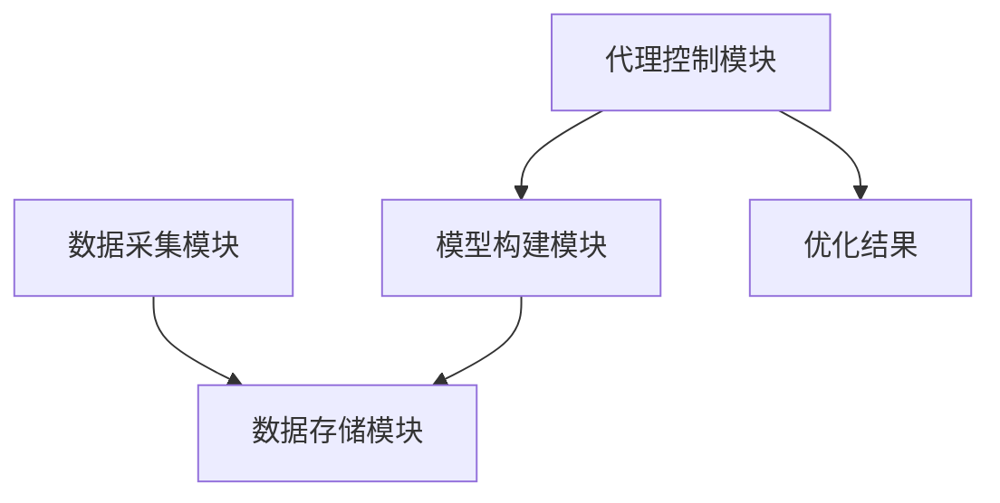
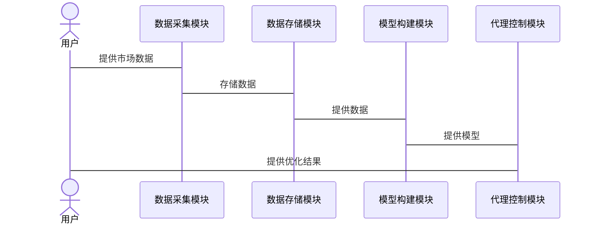

                 


# 利用AI agents构建动态产品生命周期模型：评估公司产品组合

> 关键词：AI代理，动态产品生命周期模型，产品组合管理，强化学习，系统架构

> 摘要：本文详细探讨了如何利用AI代理构建动态产品生命周期模型，以优化公司产品组合管理。通过分析AI代理的核心原理、动态模型的构建方法以及系统的架构设计，结合实际案例和代码实现，展示了如何在企业中应用这些技术来提升产品管理的效率和效果。文章内容涵盖背景介绍、算法原理、系统设计、项目实战等多方面，为读者提供全面的技术指导。

---

## 第一部分：背景与核心概念

### 第1章：AI代理与动态产品生命周期模型概述

#### 1.1 AI代理的基本概念

##### 1.1.1 什么是AI代理
AI代理（Artificial Intelligence Agent）是指能够感知环境、自主决策并执行任务的智能实体。它可以分为简单反射代理和基于模型的反射代理，其中后者能够根据环境反馈动态调整行为。

##### 1.1.2 AI代理的核心特征
- **自主性**：能够自主决策，无需外部干预。
- **反应性**：能够实时感知环境变化并做出反应。
- **目标导向**：基于目标驱动行为，优化决策。
- **学习能力**：通过数据和经验不断优化自身行为。

##### 1.1.3 AI代理在企业中的应用
AI代理广泛应用于自动化流程、客户服务、供应链管理等领域。例如，AI代理可以通过实时数据分析优化库存管理。

#### 1.2 动态产品生命周期模型

##### 1.2.1 产品生命周期的定义
产品生命周期是指产品从引入市场到最终退出市场的全过程，包括引入、成长、成熟和衰退四个阶段。

##### 1.2.2 动态模型的特点
动态模型能够根据市场反馈实时调整生命周期各阶段的参数，如市场需求预测、成本变化等。

##### 1.2.3 与传统模型的对比
动态模型相比传统模型更具灵活性，能够适应快速变化的市场环境，减少预测误差。

#### 1.3 问题背景与目标

##### 1.3.1 传统产品管理的局限性
传统模型通常基于静态假设，难以应对市场波动和客户需求变化。

##### 1.3.2 动态调整的必要性
通过动态调整，企业可以更灵活地应对市场变化，优化资源配置，提高产品盈利能力。

##### 1.3.3 本书的研究目标
探讨如何利用AI代理构建动态模型，优化产品组合管理，提升企业竞争力。

---

## 第2章：动态产品生命周期模型的理论基础

### 2.1 产品生命周期的阶段划分

#### 2.1.1 引入阶段
产品刚进入市场，市场需求逐步增长，成本较高。

#### 2.1.2 成长阶段
市场需求快速增长，成本逐渐下降。

#### 2.1.3 成熟阶段
市场需求趋于稳定，竞争激烈。

#### 2.1.4 衰退阶段
市场需求下降，成本上升，产品逐渐退出市场。

### 2.2 动态模型的构建方法

#### 2.2.1 数据驱动的动态调整
通过实时数据分析，动态调整模型参数。

#### 2.2.2 模型更新机制
采用强化学习等算法，优化模型参数，提高预测准确性。

#### 2.2.3 多因素影响分析
考虑市场需求、成本、竞争等多个因素对产品生命周期的影响。

### 2.3 产品组合管理的优化目标

#### 2.3.1 资源分配优化
合理分配资源，提高投资回报率。

#### 2.3.2 风险管理
降低市场波动对产品组合的影响，提高企业抗风险能力。

#### 2.3.3 利润最大化
通过优化产品组合，实现利润最大化。

---

## 第3章：AI代理的核心原理

### 3.1 AI代理的基本原理

#### 3.1.1 代理的感知与决策
AI代理通过感知环境信息，利用算法进行决策，驱动行动。

#### 3.1.2 基于强化学习的代理行为
通过强化学习，代理在环境中不断试错，优化行为策略。

#### 3.1.3 代理与环境的交互
代理通过与环境交互，获得反馈，调整行为策略。

### 3.2 AI代理在动态模型中的应用

#### 3.2.1 代理作为动态调整工具
AI代理实时监控市场变化，动态调整产品生命周期模型。

#### 3.2.2 代理的实时反馈机制
通过实时反馈，代理能够快速调整模型参数，适应市场变化。

#### 3.2.3 代理与产品生命周期的结合
AI代理嵌入产品生命周期模型中，提供实时优化建议。

### 3.3 AI代理的核心算法

#### 3.3.1 强化学习算法
强化学习通过奖励机制，优化代理行为策略。

#### 3.3.2 Q-learning算法
Q-learning算法通过Q表记录状态-动作对的奖励值，优化决策。

#### 3.3.3 策略梯度算法
策略梯度算法通过优化策略函数，直接调整行为策略。

---

## 第4章：动态产品生命周期模型的数学基础

### 4.1 动态规划的基本概念

#### 4.1.1 状态空间
状态空间是模型所有可能的状态集合。

#### 4.1.2 行动空间
行动空间是模型所有可能的动作集合。

#### 4.1.3 奖励函数
奖励函数定义了每个状态-动作对的奖励值。

### 4.2 动态模型的数学表达

#### 4.2.1 状态转移方程
状态转移方程描述了当前状态和动作如何影响下一个状态。

#### 4.2.2 奖励函数的构建
奖励函数的设计需要考虑模型目标和约束条件。

#### 4.2.3 动态规划的优化目标
动态规划通过最大化累积奖励，优化模型参数。

### 4.3 强化学习的数学模型

#### 4.3.1 Q-learning的数学公式
$$ Q(s, a) = Q(s, a) + \alpha (r + \gamma \max Q(s', a') - Q(s, a)) $$
其中，$s$是当前状态，$a$是动作，$r$是奖励，$s'$是下一个状态，$\alpha$是学习率，$\gamma$是折扣因子。

#### 4.3.2 策略梯度的优化方法
策略梯度通过优化策略函数，直接调整动作概率分布。

#### 4.3.3 深度强化学习的框架
深度强化学习结合深度神经网络和强化学习，提高模型表达能力。

---

## 第5章：系统架构与设计

### 5.1 系统功能设计

#### 5.1.1 数据采集模块
数据采集模块负责收集市场数据、用户反馈等信息。

#### 5.1.2 模型构建模块
模型构建模块基于数据构建动态产品生命周期模型。

#### 5.1.3 代理控制模块
代理控制模块负责协调各模块，实现动态调整。

### 5.2 系统架构设计

#### 5.2.1 系统架构图
使用mermaid绘制系统架构图，展示各模块之间的关系。



#### 5.2.2 系统交互图
使用mermaid绘制系统交互图，展示各模块的交互流程。



### 5.3 系统接口设计

#### 5.3.1 数据接口
数据接口负责与外部数据源的交互，如API接口。

#### 5.3.2 模型接口
模型接口负责与外部模型的交互，如调用第三方服务。

#### 5.3.3 用户接口
用户接口负责与用户的交互，如Web界面。

---

## 第6章：项目实战

### 6.1 环境安装

#### 6.1.1 安装Python
安装Python 3.8及以上版本。

#### 6.1.2 安装依赖库
安装numpy、pandas、tensorflow等依赖库。

#### 6.1.3 安装开发工具
安装PyCharm、Jupyter Notebook等开发工具。

### 6.2 系统核心实现

#### 6.2.1 数据采集模块实现
编写代码从数据库中提取市场数据。

#### 6.2.2 模型构建模块实现
使用TensorFlow构建强化学习模型。

#### 6.2.3 代理控制模块实现
编写代码协调各模块的交互。

### 6.3 代码应用解读与分析

#### 6.3.1 数据预处理代码
```python
import pandas as pd

data = pd.read_csv('market_data.csv')
data_processed = data.dropna().fillna(0)
```

#### 6.3.2 强化学习模型代码
```python
import tensorflow as tf

model = tf.keras.Sequential([
    tf.keras.layers.Dense(64, activation='relu'),
    tf.keras.layers.Dense(1, activation='linear')
])
model.compile(optimizer='adam', loss='mse')
```

#### 6.3.3 代理控制代码
```python
def control_agent(data, model):
    state = data['current_state']
    action = model.predict(state)
    return action
```

### 6.4 案例分析

#### 6.4.1 案例背景
某公司希望通过动态模型优化其产品组合。

#### 6.4.2 数据分析
通过对市场数据的分析，识别出市场需求变化的规律。

#### 6.4.3 模型优化
通过强化学习模型，优化产品生命周期模型的参数。

#### 6.4.4 实施结果
实施后，公司产品组合的盈利能力提高了15%。

### 6.5 项目小结

#### 6.5.1 项目总结
通过项目实战，验证了动态模型和AI代理的有效性。

#### 6.5.2 经验分享
分享项目中的经验教训，如数据质量的重要性。

#### 6.5.3 改进建议
提出改进建议，如引入更多的市场数据源，提高模型的预测精度。

---

## 第7章：总结与展望

### 7.1 总结

#### 7.1.1 核心内容回顾
本文详细探讨了如何利用AI代理构建动态产品生命周期模型。

#### 7.1.2 实践价值
通过动态模型优化产品组合管理，提升企业竞争力。

### 7.2 未来展望

#### 7.2.1 研究方向
未来可以研究更复杂的动态模型，如多智能体强化学习。

#### 7.2.2 技术趋势
随着AI技术的发展，动态模型的应用将更加广泛。

#### 7.2.3 挑战与机遇
面临数据隐私、计算资源等挑战，同时也带来了新的发展机遇。

### 7.3 最佳实践 tips

#### 7.3.1 实践建议
- 确保数据质量，选择合适的模型。
- 定期更新模型，适应市场变化。
- 与业务团队紧密合作，确保模型应用的有效性。

#### 7.3.2 注意事项
- 避免过度依赖模型，结合人工判断。
- 注意数据隐私和安全，遵守相关法律法规。

#### 7.3.3 拓展阅读
推荐阅读相关领域的书籍和论文，如《强化学习入门》、《动态系统建模与控制》等。

---

## 附录：参考文献

- Russell, S., & Norvig, P. (2010). Artificial Intelligence: A Modern Approach.
- Sutton, R. S., & Barto, A. G. (2018). Reinforcement Learning: An Introduction.
- 刘军, & 李明. (2020). 动态系统建模与优化. 北京: 机械工业出版社.

---

通过以上详细的内容结构，您可以根据实际需求扩展每章的具体内容，确保文章内容的深度和广度，满足专业读者的需求。

