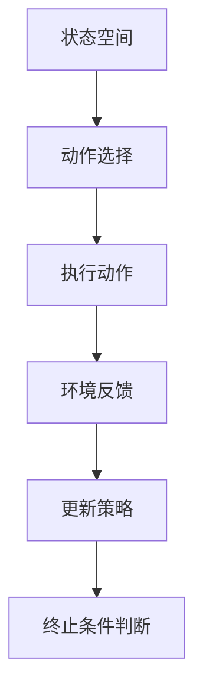
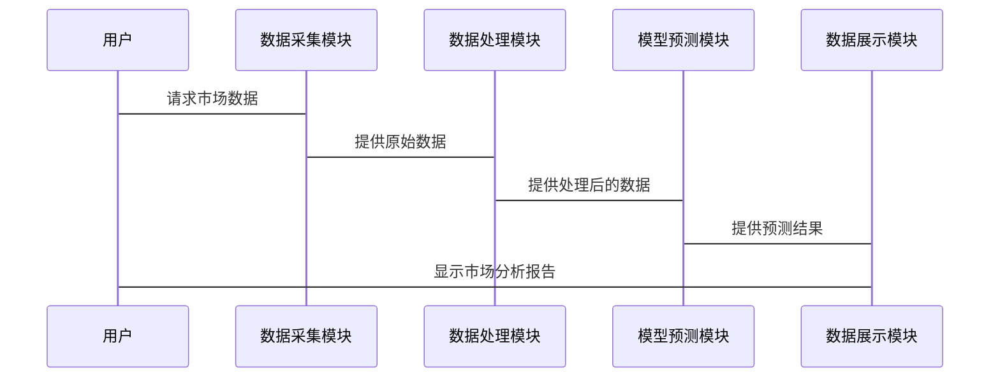

                 


# 利用AI代理构建动态市场份额预测模型：把握竞争态势

> 关键词：AI代理，市场份额预测，动态预测模型，强化学习，实时数据处理

> 摘要：本文将详细介绍如何利用AI代理构建动态市场份额预测模型，分析其核心概念、算法原理、系统架构设计以及实际项目中的应用。通过逐步分析和实例解读，帮助读者掌握如何利用AI技术在竞争激烈的市场环境中预测和把握市场份额变化。

---

# 第一部分: 利用AI代理构建动态市场份额预测模型概述

## 第1章: AI代理与市场份额预测概述

### 1.1 AI代理的基本概念

#### 1.1.1 什么是AI代理
AI代理（Artificial Intelligence Agent）是指能够感知环境、自主决策并采取行动的智能体。它通过接收输入数据、分析信息、制定策略并执行操作来实现特定目标。AI代理可以是软件程序、机器人或其他智能系统，广泛应用于自动化控制、数据处理和商业分析等领域。

#### 1.1.2 AI代理的核心特征
- **自主性**：AI代理能够独立运行，无需外部干预。
- **反应性**：能够实时感知环境变化并做出响应。
- **目标导向**：基于预设目标采取行动。
- **学习能力**：通过数据和经验不断优化自身性能。

#### 1.1.3 AI代理在商业分析中的应用
AI代理在商业分析中的应用广泛，包括市场趋势预测、竞争对手分析、客户行为预测等。在市场份额预测中，AI代理能够实时监控市场动态、分析竞争对手策略，并为企业提供数据支持的决策依据。

### 1.2 市场份额预测的背景与重要性

#### 1.2.1 市场份额预测的定义
市场份额预测是指通过分析市场数据和趋势，预测某企业在特定市场中所占的销售比例。准确的市场份额预测可以帮助企业制定合理的市场策略、优化资源配置和提高竞争力。

#### 1.2.2 市场份额预测的商业价值
- **优化资源配置**：通过预测市场需求，企业可以合理分配资金、人力和时间资源。
- **制定精准策略**：基于市场份额预测，企业能够制定更具针对性的营销策略和产品开发计划。
- **提高竞争力**：及时了解市场动态和竞争对手的动向，有助于企业在竞争中占据优势。

#### 1.2.3 动态市场份额预测的挑战
- **数据复杂性**：市场数据往往涉及多方面因素，如经济环境、政策变化、消费者偏好等，导致数据复杂且动态变化。
- **模型实时性要求高**：市场份额预测需要实时更新，对模型的响应速度和准确性提出更高要求。
- **数据稀疏性和噪声**：市场数据可能存在缺失或噪声，影响预测模型的准确性和稳定性。

### 1.3 本章小结
本章主要介绍了AI代理的基本概念及其在商业分析中的应用，并强调了市场份额预测的重要性。同时，也指出了动态市场份额预测面临的挑战，为后续章节的深入探讨奠定了基础。

---

# 第二部分: 动态市场份额预测模型的核心概念与原理

## 第2章: 动态市场份额预测模型的构建基础

### 2.1 数据驱动的市场份额预测

#### 2.1.1 数据来源与特征
市场份额预测的数据来源包括：
- **历史销售数据**：企业的销售记录、订单数据等。
- **市场调研数据**：消费者调查、竞争对手分析等。
- **外部经济指标**：GDP增长率、行业发展趋势等。
- **社交媒体数据**：消费者评论、热门话题等。

#### 2.1.2 数据预处理与清洗
数据预处理是构建预测模型的重要步骤，主要包括：
- **数据清洗**：去除无效数据、填充缺失值、处理异常值。
- **数据转换**：标准化、归一化、特征提取等。
- **数据分割**：将数据划分为训练集、验证集和测试集。

#### 2.1.3 特征工程与选择
特征工程是提升模型性能的关键，需要根据业务需求和数据特征选择合适的特征，例如：
- **时间序列特征**：如过去几个月的销售数据、季节性因素。
- **竞争性特征**：如竞争对手的市场份额、价格变动。
- **市场环境特征**：如经济指标、政策变化。

### 2.2 AI代理在动态数据处理中的应用

#### 2.2.1 实时数据流处理
AI代理能够实时接收和处理市场数据流，确保预测模型始终基于最新的市场信息进行预测。例如，利用流处理技术（如Apache Kafka、Apache Flink）实时更新市场数据。

#### 2.2.2 动态特征提取与更新
AI代理可以通过机器学习算法动态提取特征，并根据市场变化自动更新特征集合。例如，使用在线学习算法（如在线随机森林、在线支持向量机）进行实时特征更新。

#### 2.2.3 基于反馈的自适应调整
AI代理能够根据预测结果与实际市场的差异，调整预测模型的参数和策略。例如，使用强化学习算法，通过奖励机制优化预测模型的性能。

### 2.3 模型选择与评估指标

#### 2.3.1 常见市场份额预测模型
- **时间序列模型**：如ARIMA、Prophet。
- **机器学习模型**：如随机森林、XGBoost。
- **深度学习模型**：如LSTM、Transformer。

#### 2.3.2 模型评估与验证
评估市场份额预测模型的指标包括：
- **均方误差（MSE）**：衡量预测值与真实值之间的差异。
- **均方根误差（RMSE）**：MSE的平方根，与实际数据单位一致。
- **平均绝对误差（MAE）**：预测值与真实值绝对值的平均值。
- **R²系数**：衡量模型解释能力。

#### 2.3.3 模型性能优化
通过交叉验证、超参数调优和特征选择等方法优化模型性能，例如使用网格搜索或随机搜索寻找最优超参数。

---

## 第3章: 基于强化学习的动态预测模型

### 3.1 强化学习基础

#### 3.1.1 强化学习的基本概念
强化学习是一种机器学习范式，通过智能体与环境的交互，学习如何采取最优动作以最大化累积奖励。核心概念包括：
- **状态（State）**：智能体所处的环境信息。
- **动作（Action）**：智能体采取的操作。
- **奖励（Reward）**：智能体行为的反馈，衡量行为的好坏。
- **策略（Policy）**：智能体选择动作的规则。
- **价值函数（Value Function）**：衡量状态或动作-状态对的价值。

#### 3.1.2 状态、动作与奖励的定义
在动态市场份额预测中：
- **状态（State）**：市场数据、竞争对手行为、经济指标等。
- **动作（Action）**：调整预测模型参数、更新特征集合。
- **奖励（Reward）**：预测准确度的提升或预测误差的减少。

#### 3.1.3 策略与价值函数的实现
策略函数（Policy Function）和价值函数（Value Function）是强化学习的核心。策略函数定义了在给定状态下采取动作的概率分布，而价值函数则衡量了状态-动作对的预期回报。

### 3.2 基于强化学习的市场份额预测算法

#### 3.2.1 算法流程图


#### 3.2.2 算法实现代码
```python
class Agent:
    def __init__(self, state_space, action_space):
        self.state_space = state_space
        self.action_space = action_space
        self.policy = self.initialize_policy()
    
    def act(self, state):
        # 动作选择逻辑
        pass
    
    def update_policy(self, reward):
        # 策略更新逻辑
        pass
```

#### 3.2.3 算法数学模型与公式
强化学习的核心是优化策略函数和价值函数。策略梯度（Policy Gradient）方法通过梯度上升优化策略函数，公式如下：
$$ J(\theta) = \mathbb{E}_{\tau}[ \nabla_\theta \log \pi_\theta(a|s) Q(s,a) ] $$

---

## 第4章: 动态市场份额预测模型的系统架构设计

### 4.1 问题场景介绍
在竞争激烈的市场环境中，企业需要实时监控市场份额变化，快速响应市场动态。动态市场份额预测模型需要具备实时数据处理能力、高准确性以及良好的可扩展性。

### 4.2 系统功能设计
系统功能设计包括：
- **数据采集**：实时采集市场数据，包括销售数据、竞争对手信息、消费者行为等。
- **数据处理**：对采集的数据进行清洗、转换和特征提取。
- **模型预测**：基于强化学习算法进行动态市场份额预测。
- **结果展示**：将预测结果可视化，提供直观的市场分析报告。

### 4.3 系统架构设计


### 4.4 系统接口设计
系统接口设计包括：
- 数据采集接口：从数据库、API或其他数据源获取市场数据。
- 模型预测接口：接收输入数据，返回预测结果。
- 结果展示接口：将预测结果以可视化形式展示给用户。

### 4.5 系统交互设计


---

## 第5章: 项目实战——构建动态市场份额预测模型

### 5.1 环境安装与配置
安装必要的工具和库，例如：
- Python 3.8+
- NumPy、Pandas、Scikit-learn
- TensorFlow、Keras
- Apache Kafka、Apache Flink

### 5.2 核心代码实现

#### 5.2.1 数据预处理代码
```python
import pandas as pd
import numpy as np

# 加载数据
data = pd.read_csv('market_data.csv')

# 数据清洗
data.dropna(inplace=True)
data['date'] = pd.to_datetime(data['date'])
data.set_index('date', inplace=True)

# 特征提取
features = data[['sales', 'competitor_sales', 'economic_indicator']]
labels = data['market_share']
```

#### 5.2.2 强化学习代理实现
```python
class MarketSharePredictor:
    def __init__(self, state_space, action_space):
        self.state_space = state_space
        self.action_space = action_space
        self.model = self.build_model()
    
    def build_model(self):
        # 构建神经网络模型
        pass
    
    def predict(self, state):
        # 返回预测的市场份额
        pass
    
    def update(self, state, action, reward):
        # 更新模型参数
        pass
```

### 5.3 案例分析与结果解读
通过实际案例分析，展示动态市场份额预测模型的应用效果。例如，假设企业在过去几个月的市场份额变化中，模型能够准确预测出未来三个月的市场份额趋势，并帮助企业制定相应的市场策略。

### 5.4 项目小结
总结项目实施过程中的关键点和经验教训，强调AI代理在动态市场份额预测中的优势和局限性。

---

## 第6章: 扩展阅读与未来展望

### 6.1 扩展阅读
推荐一些与动态市场份额预测相关的书籍和论文，例如：
- 《Competitive Intelligence and Market Analysis》
- 《Reinforcement Learning: Theory and Algorithms》

### 6.2 未来展望
随着AI技术的不断发展，动态市场份额预测模型将更加智能化和自动化。未来的研究方向可能包括：
- 更高效的强化学习算法
- 更精准的数据特征提取方法
- 更强大的模型可解释性

---

## 第7章: 最佳实践与小结

### 7.1 最佳实践
- **数据质量管理**：确保数据的准确性和完整性。
- **模型持续优化**：定期更新模型参数，适应市场变化。
- **多模型集成**：结合多种预测模型，提高预测准确性。

### 7.2 小结
本文详细介绍了利用AI代理构建动态市场份额预测模型的方法和步骤，从基本概念到算法实现，再到系统设计和项目实战，为读者提供了全面的指导。通过本文的学习，读者可以掌握如何利用AI技术在竞争激烈的市场环境中预测和把握市场份额变化。

---

通过以上目录结构，您可以根据需要进一步扩展每一章的具体内容，确保文章逻辑清晰、结构紧凑、内容详实。

