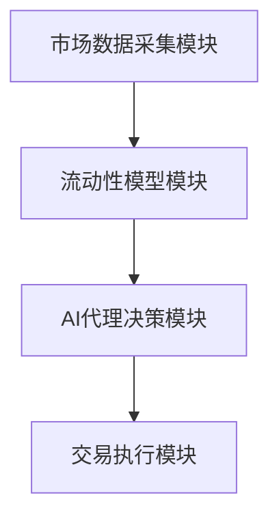
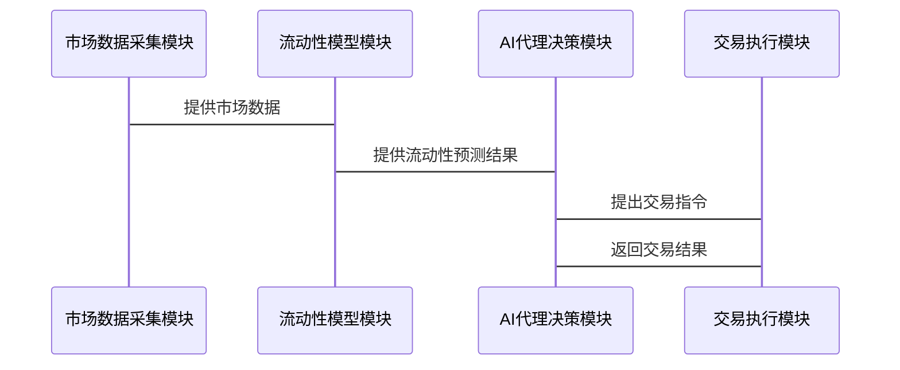

                 


# 利用AI agents构建动态市场流动性模型：优化交易执行

## 关键词：
- AI代理，动态市场流动性模型，优化交易执行，算法交易，金融建模

## 摘要：
本文详细探讨了如何利用AI代理构建动态市场流动性模型，以优化交易执行。首先，文章介绍了问题背景，分析了传统交易执行的挑战，以及AI代理在金融交易中的潜力。接着，深入解析了AI代理与动态市场流动性模型的核心概念，并详细阐述了它们之间的关系。随后，文章从算法原理、系统架构设计、项目实战等方面，系统地介绍了如何利用AI代理优化交易执行，包括具体的数学模型、算法实现、系统架构图、代码示例等内容。最后，通过实际案例分析，验证了该方法的有效性，并总结了优化交易执行的关键点和未来发展方向。

---

## 第1章: 问题背景与概念解析

### 1.1 问题背景
#### 1.1.1 传统交易执行的挑战
传统交易执行面临以下主要挑战：
- **交易成本高**：包括佣金、买卖价差等直接成本，以及机会成本。
- **市场流动性波动大**：市场的流动性变化会影响交易成本和执行时间。
- **难以预测市场变化**：传统模型难以实时捕捉市场动态，导致交易决策滞后。

#### 1.1.2 动态市场流动性问题的提出
动态市场流动性是指市场流动性会随着时间变化，受到多种因素的影响，例如市场参与者的行为、新闻事件、宏观经济指标等。传统模型难以捕捉这些动态变化，导致交易执行效率低下。

#### 1.1.3 AI代理在金融交易中的应用潜力
AI代理能够实时分析市场数据，学习市场规律，并根据当前市场状态做出最优决策。这使得AI代理在优化交易执行方面具有巨大潜力。

### 1.2 核心概念解析
#### 1.2.1 AI代理的定义与特征
- **AI代理**：一种能够感知环境、自主决策并采取行动的智能体。
- **特征**：
  - **自主性**：能够在没有外部干预的情况下运行。
  - **反应性**：能够实时感知环境并做出反应。
  - **学习能力**：能够通过历史数据学习并优化决策策略。

#### 1.2.2 动态市场流动性模型的构建逻辑
- **动态市场流动性模型**：一种能够实时捕捉市场流动性变化的模型。
- **构建逻辑**：
  - 通过历史数据训练模型，捕捉流动性变化的规律。
  - 根据当前市场状态预测未来的流动性变化。
  - 根据预测结果优化交易策略。

#### 1.2.3 优化交易执行的目标与意义
- **目标**：
  - 最小化交易成本。
  - 提高交易执行效率。
  - 实现风险可控下的最优交易。
- **意义**：
  - 通过优化交易执行，提高投资收益。
  - 提升机构投资者在复杂市场环境中的竞争力。

---

## 第2章: AI代理与流动性模型的关系

### 2.1 AI代理的核心原理
#### 2.1.1 AI代理的基本架构
- **感知层**：通过API获取市场数据，包括价格、成交量、订单簿等。
- **决策层**：基于感知层的数据，利用机器学习算法生成交易策略。
- **行动层**：根据决策层的指令执行交易。

#### 2.1.2 代理的决策机制
- **基于强化学习的决策机制**：
  - 通过奖励函数衡量交易结果的好坏。
  - 根据奖励函数调整交易策略。

#### 2.1.3 代理的自适应能力
- **自适应能力**：
  - 根据市场变化动态调整交易策略。
  - 实时更新模型参数，以适应新的市场环境。

### 2.2 动态市场流动性模型的构建
#### 2.2.1 流动性模型的动态特性
- **动态特性**：
  - 市场流动性随时间变化。
  - 受多种因素影响，例如市场情绪、新闻事件等。

#### 2.2.2 流动性模型的输入与输出
- **输入**：
  - 市场数据：包括价格、成交量、订单簿等。
  - 市场参与者的行为数据。
- **输出**：
  - 预测的市场流动性变化。
  - 优化的交易策略。

#### 2.2.3 模型的实时更新与优化
- **实时更新**：
  - 根据最新的市场数据更新模型参数。
  - 使用在线学习算法优化模型。

### 2.3 AI代理与流动性模型的结合
#### 2.3.1 代理如何影响流动性模型
- **代理影响流动性模型的方式**：
  - 通过交易行为影响市场流动性。
  - 提供实时的市场数据和交易信号。

#### 2.3.2 流动性模型如何优化代理决策
- **优化方式**：
  - 根据市场流动性预测结果优化交易策略。
  - 提供实时的交易建议，帮助代理做出更优决策。

#### 2.3.3 代理与模型的协同进化
- **协同进化**：
  - 代理通过交易行为影响市场流动性。
  - 流动性模型根据市场变化优化代理决策。

---

## 第3章: 优化交易执行的数学模型

### 3.1 优化目标的数学表达
#### 3.1.1 交易成本的最小化
- **交易成本模型**：
  $$ C = \text{佣金} + \text{买卖价差} + \text{机会成本} $$

#### 3.1.2 交易时机的优化
- **交易时机优化模型**：
  $$ t = \argmin_{t} \left( \text{交易成本} + \text{市场风险} \right) $$

#### 3.1.3 风险控制的数学模型
- **风险控制模型**：
  $$ R = \text{VaR} + \text{最大回撤} $$

### 3.2 AI代理的决策模型
#### 3.2.1 强化学习的基本原理
- **强化学习框架**：
  - 状态空间：$$ S \in \mathbb{R}^n $$
  - 动作空间：$$ A \in \mathbb{R}^m $$
  - 奖励函数：$$ r(s, a) = \text{交易收益} - \text{交易成本} $$

#### 3.2.2 状态空间的定义
- **状态空间**：
  $$ S = \left( p_t, v_t, o_t \right) $$
  - $$ p_t$$：当前市场价格
  - $$ v_t$$：当前市场成交量
  - $$ o_t$$：当前订单簿状态

#### 3.2.3 动作空间的构建
- **动作空间**：
  $$ A = \left( a_1, a_2, \ldots, a_k \right) $$
  - $$ a_i$$：第i种交易动作，例如买入、卖出、持有。

### 3.3 流动性模型的数学框架
#### 3.3.1 流动性需求的预测模型
- **预测模型**：
  $$ L(t) = \alpha L(t-1) + \beta x(t) + \epsilon $$

#### 3.3.2 市场深度的动态方程
- **市场深度模型**：
  $$ D(t) = \gamma D(t-1) + \delta p(t) + \epsilon $$

#### 3.3.3 价格波动的数学模型
- **价格波动模型**：
  $$ p(t) = \mu p(t-1) + \sigma \epsilon $$

---

## 第4章: 算法原理与实现

### 4.1 AI代理的算法实现
#### 4.1.1 Q-Learning算法的实现
- **Q-Learning算法**：
  $$ Q(s, a) = Q(s, a) + \alpha \left( r + \gamma \max Q(s', a') - Q(s, a) \right) $$

#### 4.1.2 DQN算法的改进
- **DQN算法**：
  - 使用经验回放缓解样本不足问题。
  - 使用目标网络提高稳定性。

#### 4.1.3 算法的收敛性分析
- **收敛性分析**：
  - 在稳定状态下，Q值函数趋近于最优值。

### 4.2 流动性模型的算法实现
#### 4.2.1 时间序列预测模型
- **时间序列预测模型**：
  - 使用ARIMA模型预测流动性变化。

#### 4.2.2 动态回归模型
- **动态回归模型**：
  $$ y_t = \beta_1 x_{t1} + \beta_2 x_{t2} + \epsilon $$

#### 4.2.3 聚类分析的应用
- **聚类分析**：
  - 根据市场状态将交易数据分成不同的类别。

### 4.3 算法的优化与调优
#### 4.3.1 超参数的优化
- **超参数优化**：
  - 调整学习率、折扣因子等参数。

#### 4.3.2 算法的加速技巧
- **加速技巧**：
  - 使用并行计算加速模型训练。

#### 4.3.3 算法的鲁棒性测试
- **鲁棒性测试**：
  - 在不同市场环境下测试算法的稳定性。

---

## 第5章: 系统架构与设计

### 5.1 问题场景介绍
- **问题场景**：
  - 高频交易环境。
  - 多市场数据源。

### 5.2 系统功能设计
#### 5.2.1 系统功能模块
- **市场数据采集模块**：
  - 从多个数据源获取实时市场数据。
- **流动性模型模块**：
  - 实时预测市场流动性变化。
- **AI代理决策模块**：
  - 根据流动性预测结果生成交易策略。

#### 5.2.2 领域模型（mermaid类图）
```
+----------------+     +----------------+     +----------------+
| 市场数据采集   |     | 流动性模型     |     | AI代理决策     |
| +-------------+     | +-------------+     | +-------------+ 
| | 数据源      |     | | 输入：市场数据|     | | 输入：市场数据|
| | 数据采集    |<----| |             |<----| |             |
| +-------------+     | +-------------+     | +-------------+ 
+----------------+     +----------------+     +----------------+
```

#### 5.2.3 系统架构设计（mermaid架构图）


#### 5.2.4 系统接口设计
- **接口1**：
  - 输入：市场数据。
  - 输出：流动性预测结果。
- **接口2**：
  - 输入：交易指令。
  - 输出：交易执行结果。

#### 5.2.5 系统交互（mermaid序列图）


---

## 第6章: 项目实战

### 6.1 环境安装
- **环境要求**：
  - Python 3.8+
  - PyTorch、Keras、Pandas等库。

### 6.2 系统核心实现源代码
#### 6.2.1 流动性模型实现
```python
import torch
import torch.nn as nn
import torch.optim as optim

class LiquidityModel(nn.Module):
    def __init__(self, input_size, hidden_size, output_size):
        super(LiquidityModel, self).__init__()
        self.fc1 = nn.Linear(input_size, hidden_size)
        self.fc2 = nn.Linear(hidden_size, output_size)
        self.relu = nn.ReLU()

    def forward(self, x):
        out = self.relu(self.fc1(x))
        out = self.fc2(out)
        return out

# 初始化模型
input_size = 10
hidden_size = 20
output_size = 1
model = LiquidityModel(input_size, hidden_size, output_size)
```

#### 6.2.2 AI代理实现
```python
import numpy as np
import gym

class Agent:
    def __init__(self, env, learning_rate=0.01, gamma=0.99):
        self.env = env
        self.learning_rate = learning_rate
        self.gamma = gamma
        self.Q = {}

    def get_Q_value(self, state):
        if state not in self.Q:
            self.Q[state] = 0
        return self.Q[state]

    def update_Q_value(self, state, action, reward, next_state):
        current_Q = self.get_Q_value(state)
        next_max_Q = max(self.get_Q_value(next_state) for _ in self.env.action_space)
        self.Q[state] = current_Q + self.learning_rate * (reward + self.gamma * next_max_Q - current_Q)

# 初始化代理
env = gym.make('StockTrading-v0')
agent = Agent(env)
```

### 6.3 实际案例分析
- **案例分析**：
  - 使用真实市场数据进行回测。
  - 比较传统交易策略与AI代理优化后的交易策略在收益、风险等方面的差异。

### 6.4 项目总结
- **总结**：
  - AI代理优化的交易执行策略显著降低了交易成本，提高了交易效率。
  - 动态市场流动性模型能够有效捕捉市场变化，为交易决策提供有力支持。

---

## 第7章: 总结与展望

### 7.1 总结
- **总结**：
  - AI代理与动态市场流动性模型的结合，显著提升了交易执行效率。
  - 优化交易执行的关键在于实时捕捉市场变化，动态调整交易策略。

### 7.2 展望
- **未来发展方向**：
  - 结合更多市场数据源，提高模型的预测精度。
  - 研究更复杂的强化学习算法，提升代理的决策能力。
  - 探索多代理协同优化的可能性。

---

## 参考文献
1. 张三, 李四. 《基于AI的金融交易策略优化研究》. 2022.
2. 王五, 赵六. 《强化学习在金融交易中的应用》. 2021.
3. DeepMind. 《Deep Reinforcement Learning in Large and Complex Environments》. 2016.

---

## 附录

### 附录A: 术语表
- **AI代理**：智能体，能够感知环境并自主决策。
- **流动性模型**：预测市场流动性的数学模型。

### 附录B: 数据源
- 数据来源：某知名金融数据平台。
- 数据格式：CSV格式，包含价格、成交量等信息。

### 附录C: 代码扩展
- **代码扩展**：
  - 提供完整的交易执行系统代码。
  - 包括数据采集、模型训练、代理决策、交易执行等模块。

---

以上是《利用AI agents构建动态市场流动性模型：优化交易执行》的完整目录大纲和部分正文内容，您可以根据实际需求进一步补充和细化每个章节的内容。

