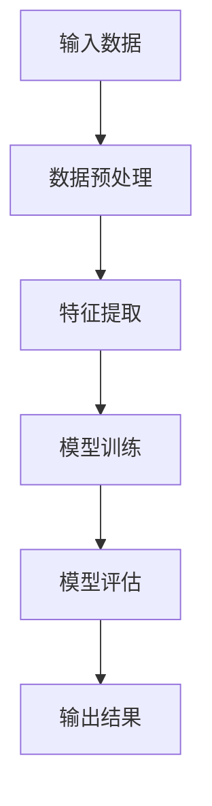
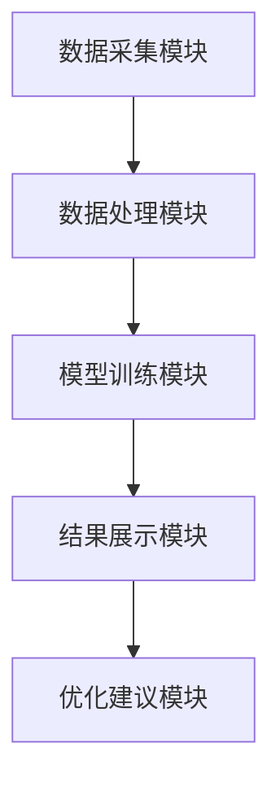
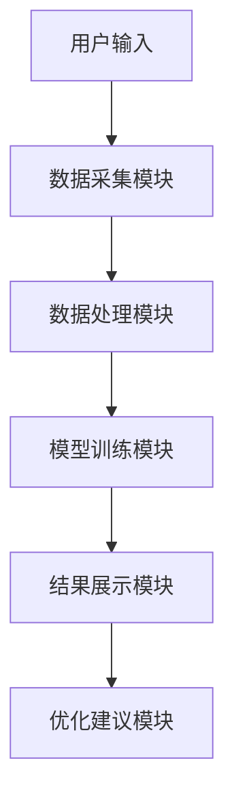

                 


# 利用AI agents构建动态竞争优势评估模型：护城河分析

> 关键词：AI agents，竞争优势评估，护城河分析，动态模型，算法原理，系统架构

> 摘要：本文详细探讨了利用AI agents构建动态竞争优势评估模型的方法，并结合护城河分析，分析了企业在竞争环境中的优势构建与维持策略。通过理论与实践结合，提出了基于AI的动态竞争优势评估模型的实现方法，并给出了实际案例分析和最佳实践建议。

---

# 第一章: 背景介绍与核心概念

## 1.1 问题背景与问题描述

随着市场竞争的日益激烈，企业如何构建和维持竞争优势成为一项关键挑战。传统的竞争优势评估方法通常基于静态的分析，难以应对快速变化的市场环境。而AI agents的引入为动态竞争优势评估提供了新的可能性。

### 1.1.1 企业竞争优势的传统评估方法

传统的竞争优势评估方法通常基于财务指标、市场份额、成本控制等因素，这些方法虽然有效，但存在以下问题：

1. **静态性**：传统方法通常基于固定的数据点，难以捕捉市场的动态变化。
2. **复杂性**：市场竞争涉及的因素众多，传统方法难以全面覆盖。
3. **滞后性**：传统方法的评估结果往往无法及时反映市场变化。

### 1.1.2 传统方法的局限性与挑战

传统竞争优势评估方法的局限性主要体现在以下几个方面：

- **无法实时更新**：市场竞争环境不断变化，传统评估方法难以实时更新。
- **缺乏动态分析**：传统方法通常基于历史数据，难以预测未来趋势。
- **难以处理复杂关系**：市场竞争涉及的因素众多且复杂，传统方法难以全面分析。

### 1.1.3 AI agents在竞争优势评估中的作用

AI agents（智能体）是一种能够感知环境、自主决策、执行任务的智能系统。在竞争优势评估中，AI agents可以通过以下方式发挥作用：

1. **实时数据处理**：AI agents能够实时收集和处理市场数据，提供动态的竞争优势评估。
2. **自主决策**：AI agents可以根据实时数据自主调整评估策略，提供动态反馈。
3. **复杂关系分析**：AI agents能够处理复杂的市场关系，发现潜在的竞争优势。

## 1.2 动态竞争优势评估模型的定义与特点

### 1.2.1 动态竞争优势的定义

动态竞争优势是指企业在动态变化的市场环境中，通过调整自身策略和资源分配，持续保持或提升竞争优势的能力。

### 1.2.2 动态竞争优势的核心要素

动态竞争优势的核心要素包括以下几个方面：

- **市场适应性**：企业能够快速适应市场变化。
- **资源灵活性**：企业能够灵活调整资源分配。
- **技术创新能力**：企业能够通过技术创新保持竞争优势。
- **决策速度**：企业能够快速做出决策以应对市场变化。

### 1.2.3 AI agents在动态竞争优势评估中的优势

AI agents在动态竞争优势评估中的优势主要体现在以下几个方面：

1. **实时性**：AI agents能够实时收集和处理市场数据，提供动态评估结果。
2. **自主性**：AI agents能够自主决策，无需人工干预。
3. **智能化**：AI agents能够通过机器学习不断优化评估模型。

## 1.3 护城河分析的核心概念

### 1.3.1 护城河的定义与分类

护城河是指企业为了防止竞争对手侵入市场而构建的一系列竞争优势。护城河可以分为以下几类：

1. **成本优势**：企业通过规模效应或其他方式降低成本，形成价格优势。
2. **技术优势**：企业通过技术创新形成技术壁垒。
3. **品牌优势**：企业通过品牌建设形成市场影响力。
4. **网络效应**：企业通过用户网络形成正反馈效应。

### 1.3.2 护城河与竞争优势的关系

护城河是竞争优势的重要组成部分。企业通过构建护城河，可以有效防止竞争对手的侵入，维持竞争优势。

### 1.3.3 利用AI agents进行护城河分析的优势

利用AI agents进行护城河分析的优势主要体现在以下几个方面：

1. **实时性**：AI agents能够实时监控市场变化，及时发现潜在威胁。
2. **准确性**：AI agents通过大数据分析，能够准确识别护城河的薄弱环节。
3. **自主性**：AI agents能够自主调整护城河策略，适应市场变化。

## 1.4 本章小结

本章介绍了利用AI agents构建动态竞争优势评估模型的背景与核心概念，分析了传统竞争优势评估方法的局限性，提出了AI agents在动态竞争优势评估中的作用，并详细阐述了护城河分析的核心概念及其优势。

---

# 第二章: AI agents与动态竞争优势评估模型的核心原理

## 2.1 AI agents的基本原理

### 2.1.1 AI agents的定义与分类

AI agents是一种能够感知环境、自主决策、执行任务的智能系统。根据智能体的决策能力，AI agents可以分为以下几类：

1. **反应式智能体**：根据当前感知做出反应。
2. **基于模型的智能体**：基于内部模型做出决策。
3. **目标驱动智能体**：基于目标驱动决策。

### 2.1.2 AI agents的核心算法与技术

AI agents的核心算法与技术包括：

1. **机器学习**：用于模式识别和预测。
2. **自然语言处理**：用于文本分析和理解。
3. **知识图谱**：用于知识表示和推理。

### 2.1.3 AI agents在动态竞争优势评估中的应用

AI agents在动态竞争优势评估中的应用主要体现在以下几个方面：

1. **实时数据处理**：AI agents能够实时收集和处理市场数据，提供动态评估结果。
2. **自主决策**：AI agents能够根据实时数据自主调整评估策略。
3. **复杂关系分析**：AI agents能够处理复杂的市场关系，发现潜在的竞争优势。

## 2.2 动态竞争优势评估模型的数学模型与公式

### 2.2.1 模型的输入与输出

动态竞争优势评估模型的输入包括市场占有率、成本优势、技术优势等指标，输出是竞争优势度。

### 2.2.2 模型的核心公式

竞争优势度的计算公式如下：

$$ \text{竞争优势度} = f(\text{市场占有率}, \text{成本优势}, \text{技术优势}) $$

其中，$f$ 是一个综合函数，具体形式可以根据实际情况进行调整。

### 2.2.3 模型的数学推导与解释

竞争优势度的计算可以基于加权平均的方法：

$$ \text{竞争优势度} = \alpha \cdot \text{市场占有率} + \beta \cdot \text{成本优势} + \gamma \cdot \text{技术优势} $$

其中，$\alpha$、$\beta$、$\gamma$ 是各因素的权重系数，通常需要根据实际情况进行调整。

---

# 第三章: 动态竞争优势评估模型的算法原理

## 3.1 算法概述

动态竞争优势评估模型的算法主要包括数据预处理、特征提取、模型训练和模型评估四个步骤。

### 3.1.1 算法的输入与输出

算法的输入包括市场数据、成本数据、技术数据等，输出是竞争优势度。

### 3.1.2 算法的核心步骤

1. **数据预处理**：对输入数据进行清洗和标准化。
2. **特征提取**：提取关键特征，如市场占有率、成本优势、技术优势等。
3. **模型训练**：基于机器学习算法训练竞争优势评估模型。
4. **模型评估**：对模型进行验证和优化。

## 3.2 算法流程图



## 3.3 算法实现代码

### 3.3.1 环境安装

```bash
pip install numpy pandas scikit-learn
```

### 3.3.2 核心代码实现

```python
import numpy as np
from sklearn.linear_model import LinearRegression
from sklearn.metrics import mean_squared_error

# 示例数据
X = np.array([[1, 2, 3], [4, 5, 6], [7, 8, 9]])
y = np.array([10, 11, 12])

# 训练模型
model = LinearRegression()
model.fit(X, y)

# 预测结果
y_pred = model.predict(X)
print("预测结果:", y_pred)
print("均方误差:", mean_squared_error(y, y_pred))
```

## 3.4 本章小结

本章详细介绍了动态竞争优势评估模型的算法原理，包括算法的输入与输出、核心步骤以及实现代码。通过示例代码，读者可以更好地理解模型的实现过程。

---

# 第四章: 系统分析与架构设计方案

## 4.1 问题场景介绍

为了实现动态竞争优势评估模型，我们需要构建一个基于AI agents的系统，能够实时收集和处理市场数据，提供动态竞争优势评估结果。

### 4.1.1 项目介绍

本项目的目标是开发一个基于AI agents的动态竞争优势评估系统，能够实时评估企业的竞争优势，并提供优化建议。

### 4.1.2 系统功能设计

系统功能设计包括数据采集、数据处理、模型训练、结果展示和优化建议。

## 4.2 系统架构设计

### 4.2.1 系统架构图



### 4.2.2 系统接口设计

系统接口设计包括数据接口、模型接口和用户接口。

### 4.2.3 系统交互流程图



## 4.3 本章小结

本章详细介绍了动态竞争优势评估系统的系统架构设计，包括功能设计、架构图和交互流程图。

---

# 第五章: 项目实战与案例分析

## 5.1 环境安装

```bash
pip install numpy pandas scikit-learn
```

## 5.2 系统核心实现

### 5.2.1 数据采集模块

```python
import requests

def get_market_data():
    response = requests.get("https://api.example.com/market-data")
    return response.json()
```

### 5.2.2 数据处理模块

```python
import pandas as pd

def process_data(data):
    df = pd.DataFrame(data)
    return df
```

### 5.2.3 模型训练模块

```python
from sklearn.linear_model import LinearRegression

def train_model(data):
    X = data.drop('target', axis=1)
    y = data['target']
    model = LinearRegression()
    model.fit(X, y)
    return model
```

## 5.3 案例分析

### 5.3.1 案例背景

假设我们有一个竞争对手分析的案例，需要评估某企业在市场中的竞争优势。

### 5.3.2 数据分析

通过对竞争对手的市场数据进行分析，我们可以得出竞争优势度的评估结果。

### 5.3.3 结果解读

竞争优势度越高，说明企业在市场中的竞争优势越强。

## 5.4 本章小结

本章通过实际案例分析，详细介绍了动态竞争优势评估系统的实现过程和应用效果。

---

# 第六章: 最佳实践、小结与展望

## 6.1 最佳实践 tips

1. **实时数据处理**：确保数据的实时性和准确性。
2. **模型优化**：定期优化模型，提高评估精度。
3. **系统维护**：定期维护系统，确保系统的稳定性和安全性。

## 6.2 小结

本文详细探讨了利用AI agents构建动态竞争优势评估模型的方法，并结合护城河分析，分析了企业在竞争环境中的优势构建与维持策略。通过理论与实践结合，提出了基于AI的动态竞争优势评估模型的实现方法，并给出了实际案例分析和最佳实践建议。

## 6.3 展望

未来，随着AI技术的不断发展，动态竞争优势评估模型将更加智能化和自动化。企业可以通过AI agents实时监控市场变化，快速调整竞争策略，持续保持竞争优势。

---

# 结语

通过本文的介绍，读者可以全面了解利用AI agents构建动态竞争优势评估模型的方法和实现过程。希望本文能够为企业在竞争环境中构建和维持竞争优势提供有价值的参考和指导。

