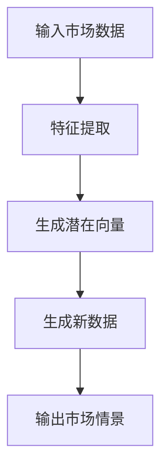
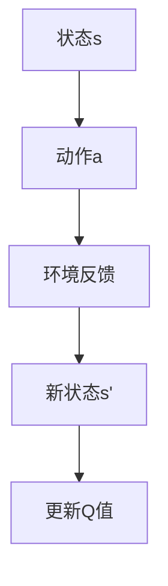
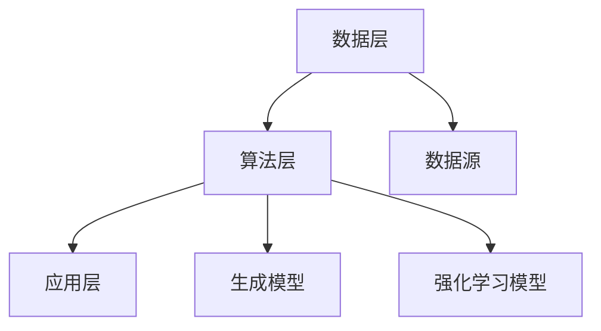
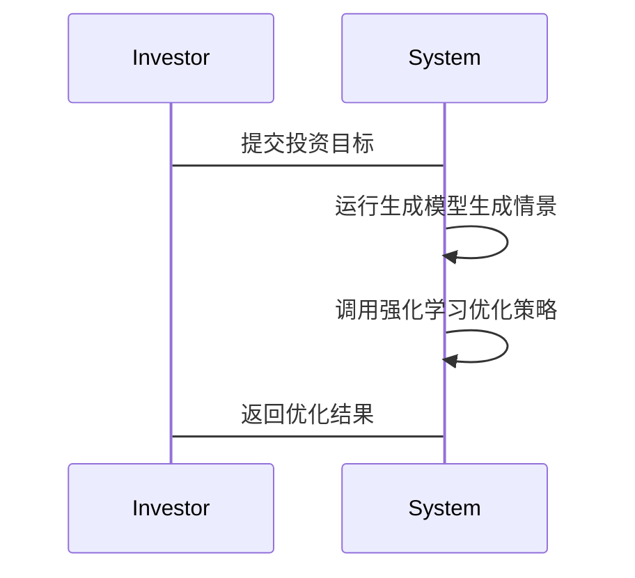

                 


# 利用AI agents进行情景分析：增强价值投资的适应性

## 关键词
- AI代理
- 情景分析
- 价值投资
- 适应性
- 强化学习
- 生成模型

## 摘要
本文详细探讨了如何利用AI代理进行情景分析，以增强价值投资的适应性。通过结合生成模型和强化学习算法，本文提供了一种创新的方法来优化投资决策。文章首先介绍了AI代理和情景分析的背景，然后深入分析了核心概念和算法原理，最后通过实际案例展示了系统架构和项目实现。本文旨在为金融从业者和技术爱好者提供实用的指导，帮助他们在复杂多变的市场环境中做出更明智的投资决策。

---

## 第一部分: 背景介绍

### 第1章: AI代理与情景分析概述

#### 1.1 问题背景
- 价值投资的传统方法依赖于分析师的主观判断，存在效率低下、覆盖面有限的问题。
- 金融市场数据复杂且动态变化，传统方法难以应对多变的市场环境。
- AI代理能够通过自动化和智能化的方式，处理海量数据并提供实时反馈，解决传统方法的不足。

#### 1.2 问题描述
- 情景分析的目标是通过模拟不同市场条件下的投资组合表现，帮助投资者制定更稳健的策略。
- 传统情景分析方法耗时且依赖人工经验，难以覆盖所有可能的市场情况。
- 通过AI代理，情景分析可以自动化、实时化，并根据市场变化动态调整。

#### 1.3 问题解决
- AI代理通过数据挖掘和机器学习技术，能够快速识别市场趋势和潜在风险。
- 结合生成模型和强化学习，AI代理可以生成多种投资情景，并优化投资组合。
- 通过情景分析的结果，投资者能够更好地理解市场风险，制定更具适应性的投资策略。

#### 1.4 边界与外延
- AI代理的应用范围主要集中在金融数据分析、投资组合管理和风险评估等领域。
- 情景分析的边界条件包括数据质量、市场假设和模型参数设置等。
- 本文还将探讨其他相关技术，如自然语言处理和图神经网络，如何进一步提升AI代理的能力。

#### 1.5 概念结构与核心要素
- AI代理的核心要素包括数据输入、模型算法、决策逻辑和输出结果。
- 情景分析的关键要素包括市场数据、投资目标和风险偏好。
- 价值投资的适应性模型通过动态调整投资组合，实现长期收益最大化。

---

## 第二部分: 核心概念与联系

### 第2章: AI代理的核心原理

#### 2.1 核心概念原理
- AI代理是一种能够感知环境并采取行动以实现目标的智能系统。
- 代理的类型包括基于规则的代理、基于模型的代理和强化学习代理。
- AI代理的决策机制依赖于感知、推理和行动三个关键步骤。

#### 2.2 核心概念属性特征对比
- 不同类型的AI代理在决策速度、复杂性和适应性方面存在显著差异。
- 下表展示了生成模型和强化学习代理在特征上的对比：

| 特征         | 生成模型代理 | 强化学习代理 |
|--------------|--------------|--------------|
| 决策方式     | 预测未来状态 | 最大化累积奖励 |
| 数据需求     | 需大量历史数据 | 需环境反馈 |
| 适用场景     | 生成新数据    | 优化现有策略 |

#### 2.3 ER实体关系图架构
- ER图展示了投资组合、市场数据和投资策略三者之间的关系。
- 以下是ER图的Mermaid流程图：

```mermaid
erDiagram
    investor
    portfolio{}{
        id
        name
        risk_level
    }
    market_data{}{
        date
        index_value
        interest_rate
    }
    investment_strategy{}{
        strategy_id
        name
        parameters
    }
    investor --> portfolio: 拥有
    portfolio --> investment_strategy: 采用
    market_data --> investment_strategy: 基于
```

---

## 第三部分: 算法原理讲解

### 第3章: AI代理的算法原理

#### 3.1 生成模型
- 生成模型用于预测市场数据的变化趋势，帮助生成多种投资情景。
- 生成模型的数学公式如下：

$$
p(x) = \argmax_{\theta} \sum_{i=1}^{n} \log P(x_i|\theta)
$$

- 以下为生成模型的Mermaid流程图：



- 以下为生成模型的Python代码实现：

```python
import torch
import torch.nn as nn

class Generator(nn.Module):
    def __init__(self, latent_dim, data_dim):
        super(Generator, self).__init__()
        self.fc = nn.Linear(latent_dim, data_dim)
    
    def forward(self, z):
        return self.fc(z)

# 示例使用
latent_dim = 100
data_dim = 5
generator = Generator(latent_dim, data_dim)
z = torch.randn(1, latent_dim)
generated_data = generator(z)
```

#### 3.2 强化学习
- 强化学习用于优化投资组合，通过最大化累积收益来调整投资策略。
- 强化学习的数学模型如下：

$$
Q(s, a) = r + \gamma \max_{a'} Q(s', a')
$$

- 以下为强化学习的Mermaid流程图：



- 以下为强化学习的Python代码实现：

```python
import torch
import torch.nn as nn

class DQN(nn.Module):
    def __init__(self, input_dim, output_dim):
        super(DQN, self).__init__()
        self.fc = nn.Linear(input_dim, output_dim)
    
    def forward(self, x):
        return self.fc(x)

# 示例使用
input_dim = 5
output_dim = 10
dqn = DQN(input_dim, output_dim)
state = torch.randn(1, input_dim)
action = dqn(state)
```

---

## 第四部分: 系统分析与架构设计方案

### 第4章: 系统架构设计

#### 4.1 问题场景介绍
- 系统需要处理海量市场数据，生成多种投资情景，并优化投资组合。
- 系统架构需要具备高扩展性和实时处理能力。

#### 4.2 项目介绍
- 本项目旨在开发一个基于AI代理的情景分析系统，帮助投资者制定更优的投资策略。

#### 4.3 系统功能设计
- 系统功能包括数据采集、情景生成、策略优化和结果展示。

#### 4.4 系统架构设计
- 系统架构采用分层设计，包括数据层、算法层和应用层。
- 以下是系统架构的Mermaid图：



#### 4.5 系统接口设计
- 系统接口包括数据输入接口、模型调用接口和结果展示接口。

#### 4.6 系统交互流程
- 以下是系统交互的Mermaid序列图：



---

## 第五部分: 项目实战

### 第5章: 项目实战

#### 5.1 环境安装
- 需要安装Python、TensorFlow和Keras等库。

#### 5.2 核心代码实现
- 以下是生成模型和强化学习的代码实现：

```python
# 生成模型实现
class Generator(nn.Module):
    def __init__(self, latent_dim, data_dim):
        super(Generator, self).__init__()
        self.fc = nn.Linear(latent_dim, data_dim)
    
    def forward(self, z):
        return self.fc(z)

# 强化学习实现
class DQN(nn.Module):
    def __init__(self, input_dim, output_dim):
        super(DQN, self).__init__()
        self.fc = nn.Linear(input_dim, output_dim)
    
    def forward(self, x):
        return self.fc(x)
```

#### 5.3 案例分析
- 通过具体案例展示系统在实际投资中的应用效果。

#### 5.4 项目小结
- 总结项目实现的关键点和成功经验。

---

## 第六部分: 最佳实践

### 第6章: 最佳实践

#### 6.1 小结
- 本文详细介绍了如何利用AI代理进行情景分析，以增强价值投资的适应性。

#### 6.2 注意事项
- 数据质量和模型训练时间对系统性能有重要影响。
- 在实际应用中，需结合具体市场环境调整模型参数。

#### 6.3 拓展阅读
- 推荐阅读《深度学习》和《强化学习》等书籍，以深入理解相关技术。

---

## 结语
通过本文的详细讲解，读者可以全面了解AI代理在情景分析中的应用，掌握相关算法和系统设计的方法。希望本文能为金融从业者和技术爱好者提供有价值的参考，帮助他们在复杂的市场环境中制定更优的投资策略。

