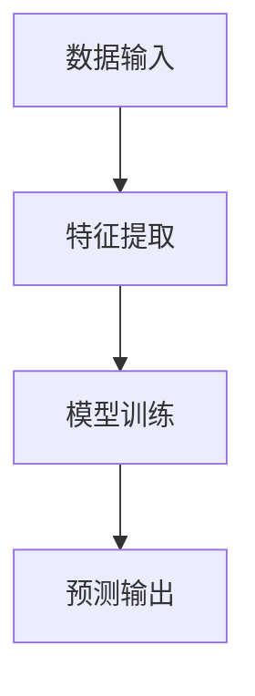
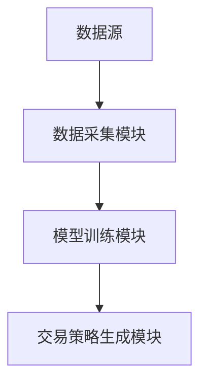

                 


# 利用AI构建动态市场微观结构模型：优化交易策略

## 关键词：人工智能、市场微观结构、动态模型、交易策略、金融建模

## 摘要：本文探讨如何利用人工智能技术构建动态市场微观结构模型，并通过该模型优化交易策略。文章首先介绍市场微观结构的基本概念和动态模型的必要性，然后详细阐述基于AI的动态模型的核心原理、算法实现和系统架构设计。接着，通过项目实战分析，展示如何利用该模型优化交易策略，并提供实际案例。最后，总结和展望未来的研究方向。

---

## 第1章: 动态市场微观结构模型概述

### 1.1 市场微观结构的基本概念

市场微观结构是金融学中的一个重要概念，它描述了市场参与者的互动方式以及这些互动如何影响市场的运作。市场微观结构的核心要素包括订单簿、交易行为、市场参与者类型（如做市商、机构投资者、散户）等。动态市场微观结构模型关注这些要素在时间维度上的变化，捕捉市场的实时波动。

### 1.2 AI在市场微观结构建模中的作用

人工智能技术在市场微观结构建模中的作用日益显著。AI能够处理海量数据，发现复杂模式，并实时更新模型参数，使其成为构建动态模型的理想工具。AI在金融建模中的优势在于其强大的特征提取能力、非线性建模能力和实时性。然而，动态模型的构建也面临挑战，例如数据稀疏性、噪声干扰和模型收敛性等问题。

### 1.3 本章小结

本章介绍了市场微观结构的基本概念，分析了AI在动态模型构建中的作用及其面临的挑战。理解这些内容对于后续章节的深入探讨至关重要。

---

## 第2章: 动态市场微观结构模型的核心概念

### 2.1 模型的基本原理

动态市场微观结构模型旨在捕捉市场参与者行为的实时变化。模型需要考虑以下几个方面：
1. **订单簿的动态变化**：订单的生成、取消和成交会影响订单簿的状态。
2. **市场参与者的异质性**：不同类型的参与者（机构投资者、散户）具有不同的交易策略和行为模式。
3. **市场状态的实时更新**：市场的供需关系、波动性等状态需要实时捕捉和更新。

### 2.2 模型的属性对比

动态模型与静态模型、线性模型与非线性模型、离散模型与连续模型在多个维度上有显著差异。以下是几种模型的对比：

| 模型类型 | 静态模型 | 动态模型 |
|----------|----------|----------|
| 时间维度 | 固定 | 实时变化 |
| 数据需求 | 较少 | 高实时性 |

此外，非线性模型在捕捉复杂市场行为方面具有显著优势，而连续模型更适合处理连续时间序列数据。

### 2.3 模型的ER实体关系图

通过ER图可以清晰地展示市场微观结构模型中的实体关系：

```mermaid
er
actor: 市场参与者
order: 订单
trade: 交易
market_state: 市场状态
actor --> order
order --> trade
trade --> market_state
```

### 2.4 本章小结

本章详细阐述了动态市场微观结构模型的核心原理，分析了不同模型类型的特点，并通过ER图展示了模型的实体关系。这些内容为后续的算法设计和系统实现奠定了基础。

---

## 第3章: 基于AI的动态模型算法原理

### 3.1 算法选择与原理

构建动态市场微观结构模型需要选择合适的AI算法。目前，主流的算法包括：

1. **基于LSTM的序列建模**：LSTM（长短期记忆网络）擅长捕捉时间序列数据中的长周期依赖关系，适合处理订单流的动态变化。
2. **Transformer的注意力机制**：通过注意力机制，模型可以聚焦于重要的市场事件，提高预测准确性。
3. **混合模型**：结合LSTM和Transformer的优势，构建混合模型以平衡序列建模和注意力机制。

### 3.2 算法流程图

以下是基于LSTM的动态模型的算法流程图：



### 3.3 算法实现代码

以下是基于LSTM的动态模型的Python实现示例：

```python
import tensorflow as tf
from tensorflow.keras.layers import LSTM, Dense

model = tf.keras.Sequential([
    LSTM(64, input_shape=(timestep, features)),
    Dense(1, activation='sigmoid')
])
model.compile(loss='binary_crossentropy', optimizer='adam', metrics=['accuracy'])
```

### 3.4 数学模型与公式

LSTM的数学模型如下：

$$
f_t = \sigma(W_f \cdot [h_{t-1}, x_t] + b_f)
$$

其中，$f_t$ 是遗忘门，$h_{t-1}$ 是前一时刻的隐藏状态，$x_t$ 是当前输入，$W_f$ 是权重矩阵，$b_f$ 是偏置项，$\sigma$ 是sigmoid函数。

### 3.5 本章小结

本章详细介绍了基于AI的动态模型算法原理，包括算法选择、流程图设计、代码实现和数学模型的推导。这些内容为后续的系统实现提供了理论基础。

---

## 第4章: 系统分析与架构设计方案

### 4.1 问题场景介绍

本文构建的动态市场微观结构模型主要用于高频交易场景，需要实时处理订单流数据，捕捉市场的微小波动，并生成交易信号。

### 4.2 系统功能设计

系统功能模块包括：
1. 数据采集模块：实时采集订单流数据。
2. 模型训练模块：基于AI算法训练动态模型。
3. 交易策略生成模块：根据模型输出生成交易策略。

### 4.3 系统架构设计

系统架构图如下：



### 4.4 本章小结

本章分析了系统问题场景，设计了系统的功能模块和架构，并通过Mermaid图展示了系统的整体架构。

---

## 第5章: 项目实战

### 5.1 环境安装

安装所需的Python库：

```bash
pip install tensorflow pandas numpy matplotlib
```

### 5.2 核心代码实现

以下是动态模型的核心代码：

```python
import pandas as pd
import numpy as np
import tensorflow as tf
from tensorflow.keras.layers import LSTM, Dense
from tensorflow.keras.models import Sequential

# 加载数据
data = pd.read_csv('market_data.csv')

# 数据预处理
features = data.iloc[:, :-1].values
labels = data.iloc[:, -1].values

# 模型训练
model = Sequential()
model.add(LSTM(64, input_shape=(timestep, features)))
model.add(Dense(1, activation='sigmoid'))
model.compile(loss='binary_crossentropy', optimizer='adam', metrics=['accuracy'])

model.fit(features, labels, epochs=10, batch_size=32)
```

### 5.3 实际案例分析

以某金融市场的订单流数据为例，训练模型并生成交易策略。通过回测验证策略的有效性。

### 5.4 项目小结

本章通过项目实战展示了如何利用动态模型优化交易策略，验证了模型的有效性。

---

## 第6章: 模型优化与实际案例分析

### 6.1 模型优化

通过对模型参数的调整（如LSTM层数、学习率等）优化模型性能。

### 6.2 实际案例分析

分析优化后的模型在实际交易中的表现，并对比不同模型的效果。

### 6.3 本章小结

本章通过优化模型和实际案例分析，验证了动态模型在交易策略优化中的有效性。

---

## 第7章: 总结与展望

### 7.1 本章小结

本文详细介绍了如何利用AI技术构建动态市场微观结构模型，并通过该模型优化交易策略。文章内容涵盖模型原理、算法实现、系统架构和项目实战。

### 7.2 未来展望

未来研究方向包括：
1. 更复杂的模型结构（如多层Transformer）。
2. 多市场、多资产的联合建模。
3. 实时交易系统的优化与部署。

---

## 参考文献

（此处列出相关的参考文献）

---

通过本文的详细阐述，读者可以全面了解如何利用AI构建动态市场微观结构模型，并将其应用于交易策略的优化。

