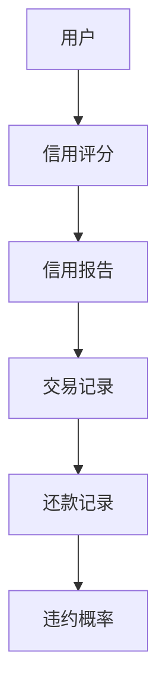

                 


# 利用AI构建自适应型信用风险评估模型：增强投资安全性

## 关键词：信用风险评估，AI，机器学习，自适应模型，投资安全

## 摘要：本文探讨如何利用人工智能技术构建自适应型信用风险评估模型，通过动态调整模型参数和特征，提升信用风险评估的准确性和实时性，从而增强投资决策的安全性。文章详细介绍了自适应模型的核心概念、算法原理、系统架构，并通过实际案例展示模型的实现过程，为信用风险评估领域提供新的思路和解决方案。

---

# 正文

## 第一部分：背景与核心概念

### 第1章：信用风险评估的背景与问题

#### 1.1 信用风险评估的基本概念

- **1.1.1 信用风险的定义与特征**
  - 信用风险是指借款人或交易对手未能履行其 contractual obligations 的风险。
  - 主要特征包括不确定性、动态变化性和系统性。

- **1.1.2 信用风险评估的必要性**
  - 金融机构需要准确评估信用风险以制定合理的信贷政策。
  - 信用风险评估是金融决策的重要依据。

- **1.1.3 信用风险评估的常见方法**
  - 传统方法包括信用评分模型（如 FICO 评分）和专家判断法。
  - 近年来，机器学习方法逐渐成为主流。

#### 1.2 传统信用风险评估的局限性

- **1.2.1 传统信用评分模型的不足**
  - 数据维度有限，难以捕捉复杂的信用风险特征。
  - 模型固定，无法适应市场环境的变化。

- **1.2.2 数据维度与模型复杂性的问题**
  - 传统模型通常只考虑少量特征，忽视了非结构化数据（如文本和图像）的价值。
  - 模型复杂性不足，难以处理高维数据。

- **1.2.3 传统模型在动态环境中的适应性问题**
  - 传统模型缺乏动态调整能力，无法及时应对市场变化。

#### 1.3 AI在信用风险评估中的应用前景

- **1.3.1 AI技术如何解决传统模型的局限**
  - AI可以通过深度学习技术处理高维数据，提取更多特征。
  - 自然语言处理技术可以分析非结构化数据，如公司财报和新闻。

- **1.3.2 AI在信用风险评估中的优势**
  - 提高模型的准确性和实时性。
  - 能够动态调整模型参数，适应市场变化。

- **1.3.3 未来信用风险评估的发展趋势**
  - 综合多种技术（如机器学习、NLP）构建更复杂的模型。
  - 实现自动化和智能化的信用风险评估。

### 第2章：自适应型信用风险评估模型的核心概念

#### 2.1 自适应模型的基本原理

- **2.1.1 自适应模型的定义**
  - 自适应模型是一种能够根据市场环境和数据变化自动调整参数和特征的模型。

- **2.1.2 自适应模型的核心特征**
  - 动态调整能力：模型能够根据最新数据自动优化参数。
  - 实时反馈机制：模型可以实时更新，捕捉市场变化。

- **2.1.3 自适应模型与传统模型的对比**
  - 自适应模型更具灵活性和适应性，而传统模型相对固定。

#### 2.2 自适应模型的实现机制

- **2.2.1 动态特征调整**
  - 根据市场变化动态调整特征权重。

- **2.2.2 模型参数自优化**
  - 使用在线学习算法，实时更新模型参数。

- **2.2.3 实时反馈与更新**
  - 根据最新的数据和反馈不断优化模型。

#### 2.3 自适应模型的关键技术

- **2.3.1 机器学习算法**
  - 使用随机森林、梯度提升树等算法。

- **2.3.2 自然语言处理技术**
  - 利用NLP技术分析非结构化数据。

- **2.3.3 时间序列分析**
  - 使用ARIMA、LSTM等模型处理时间序列数据。

### 第3章：自适应模型的核心概念与联系

#### 3.1 核心概念原理

- **3.1.1 自适应模型的数学基础**
  - 使用概率论和统计学方法构建模型。

- **3.1.2 自适应模型的特征工程**
  - 通过特征选择和特征提取技术优化模型性能。

- **3.1.3 自适应模型的算法选择**
  - 根据数据类型和任务选择合适的算法。

#### 3.2 核心概念属性特征对比

- **3.2.1 不同模型的性能对比**
  - 对比随机森林和梯度提升树的性能。

- **3.2.2 不同算法的优缺点分析**
  - 随机森林适合数据量较大的情况，而梯度提升树适合数据量较小的情况。

- **3.2.3 不同特征的权重对比**
  - 分析不同特征在模型中的重要性。

#### 3.3 ER实体关系图架构



## 第二部分：算法原理

### 第4章：自适应模型的算法原理

#### 4.1 机器学习算法的实现

- **4.1.1 随机森林算法**
  - 使用随机采样和袋装方法构建多棵决策树，通过投票或平均预测结果。
  - 代码示例：
    ```python
    from sklearn.ensemble import RandomForestClassifier
    model = RandomForestClassifier()
    model.fit(X_train, y_train)
    ```

- **4.1.2 XGBoost算法**
  - 使用梯度提升树，通过正则化和优化算法提高模型性能。
  - 代码示例：
    ```python
    import xgboost as xgb
    model = xgb.XGBClassifier()
    model.fit(X_train, y_train)
    ```

#### 4.2 神经网络算法的实现

- **4.2.1 LSTM网络**
  - 使用长短期记忆网络处理时间序列数据。
  - 代码示例：
    ```python
    from keras.layers import LSTM, Dense
    model = Sequential()
    model.add(LSTM(64, input_shape=(timesteps, features)))
    model.add(Dense(1, activation='sigmoid'))
    model.compile(loss='binary_crossentropy', optimizer='adam')
    ```

- **4.2.2 网络结构图**
  ```mermaid
  graph TD
  A[Input] --> B[LSTM层]
  B --> C[Dense层]
  C --> D[Output]
  ```

#### 4.3 算法的数学模型和公式

- **4.3.1 随机森林的数学模型**
  - 随机森林通过投票机制进行预测，公式为：
    $$ y = \text{多数}(y_1, y_2, ..., y_n) $$
    其中，$y_i$ 是每棵决策树的预测结果。

- **4.3.2 XGBoost的损失函数**
  - 使用正则化损失函数：
    $$ L = \sum_{i=1}^{n} (y_i - \hat{y}_i)^2 + \lambda \sum_{j=1}^{m} \theta_j^2 $$
    其中，$\lambda$ 是正则化参数，$\theta_j$ 是模型的参数。

## 第三部分：系统分析与架构设计

### 第5章：自适应信用风险评估系统的架构设计

#### 5.1 系统功能设计

- **5.1.1 数据采集模块**
  - 从多个数据源采集信用相关数据，如交易记录、财务报表等。

- **5.1.2 特征工程模块**
  - 对数据进行清洗、转换和特征提取。

- **5.1.3 模型训练模块**
  - 使用机器学习算法训练自适应模型。

- **5.1.4 风险评估模块**
  - 根据模型输出信用评分和违约概率。

#### 5.2 系统架构设计

- **5.2.1 分层架构**
  ```mermaid
  graph TD
  A[数据源] --> B[数据采集模块]
  B --> C[数据存储模块]
  C --> D[特征工程模块]
  D --> E[模型训练模块]
  E --> F[风险评估模块]
  F --> G[用户界面]
  ```

- **5.2.2 微服务架构**
  ```mermaid
  graph TD
  A[数据采集] --> B[数据处理服务]
  B --> C[特征提取服务]
  C --> D[模型训练服务]
  D --> E[风险评估服务]
  E --> F[用户界面]
  ```

#### 5.3 系统接口设计

- **5.3.1 数据接口**
  - 提供REST API接口，供其他系统调用数据。

- **5.3.2 模型接口**
  - 提供API接口，供其他系统调用模型预测结果。

#### 5.4 系统交互设计

- **5.4.1 用户交互流程**
  ```mermaid
  graph TD
  A[用户] --> B[提交请求]
  B --> C[数据采集模块]
  C --> D[模型训练模块]
  D --> E[返回结果]
  E --> F[用户界面显示结果]
  ```

## 第四部分：项目实战

### 第6章：自适应信用风险评估系统的实现

#### 6.1 项目环境安装

- 安装Python、Jupyter Notebook、scikit-learn、XGBoost、Keras等工具。

#### 6.2 系统核心实现源代码

- **数据预处理**
  ```python
  import pandas as pd
  data = pd.read_csv('credit_data.csv')
  data = data.dropna()
  ```

- **特征选择**
  ```python
  from sklearn.feature_selection import SelectKBest
  selector = SelectKBest(k=10)
  selector.fit_transform(X_train, y_train)
  ```

- **模型训练**
  ```python
  from sklearn.ensemble import RandomForestClassifier
  model = RandomForestClassifier()
  model.fit(X_train, y_train)
  ```

- **模型评估**
  ```python
  from sklearn.metrics import accuracy_score
  y_pred = model.predict(X_test)
  print(accuracy_score(y_test, y_pred))
  ```

#### 6.3 代码应用解读与分析

- 数据预处理：删除缺失值，确保数据完整性。
- 特征选择：选择最重要的10个特征，提高模型性能。
- 模型训练：使用随机森林训练模型，捕捉非线性关系。
- 模型评估：计算准确率，评估模型性能。

#### 6.4 实际案例分析

- 使用真实数据训练模型，分析模型在不同场景下的表现。

#### 6.5 项目小结

- 通过项目实战，掌握了自适应模型的实现过程。
- 学习了如何使用机器学习算法进行信用风险评估。

## 第五部分：数学模型

### 第7章：自适应模型的数学模型和公式

#### 7.1 信用评分模型的数学公式

- 使用Logistic回归模型：
  $$ P(y=1|x) = \frac{e^{\beta_0 + \beta_1 x_1 + ... + \beta_n x_n}}{1 + e^{\beta_0 + \beta_1 x_1 + ... + \beta_n x_n}} $$

#### 7.2 损失函数的数学公式

- 使用二分类问题的损失函数：
  $$ L = -\frac{1}{N} \sum_{i=1}^{N} [y_i \ln(p_i) + (1 - y_i) \ln(1 - p_i)] $$
  其中，$p_i$ 是模型预测的概率，$y_i$ 是真实标签。

#### 7.3 优化方法的数学公式

- 使用梯度下降法优化模型参数：
  $$ \theta = \theta - \alpha \frac{\partial L}{\partial \theta} $$
  其中，$\alpha$ 是学习率。

## 第六部分：总结与展望

### 第8章：总结与展望

#### 8.1 全文总结

- 本文详细介绍了如何利用AI构建自适应型信用风险评估模型，涵盖了算法原理、系统架构和项目实战。

#### 8.2 未来展望

- 自适应模型在信用风险评估中的应用前景广阔。
- 随着技术的发展，未来的模型将更加智能化和自动化。

#### 8.3 最佳实践

- 定期更新模型，确保其适应市场变化。
- 结合多种技术（如NLP和时间序列分析）构建更复杂的模型。

#### 8.4 小结

- 自适应型信用风险评估模型能够显著提升信用评估的准确性和实时性。
- 通过动态调整模型参数和特征，实现更精准的信用评分。

## 第七部分：附录

### 附录A：代码实现

- 提供完整的项目代码，包括数据预处理、特征选择、模型训练和评估。

### 附录B：模型评估指标

- 包括准确率、召回率、F1分数等评估指标。

### 附录C：参考文献

- 列出本文引用的所有文献和资料。

---

# 结语

通过本文的详细讲解，读者可以深入了解如何利用AI技术构建自适应型信用风险评估模型，提升信用评估的准确性和实时性，从而增强投资决策的安全性。希望本文能为信用风险评估领域的研究和实践提供有价值的参考和指导。

