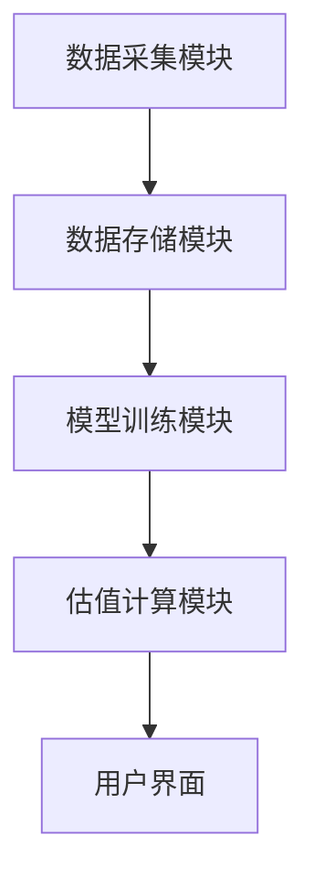

                 


# 利用AI构建自适应型公司估值模型：动态调整估值方法

## 关键词：AI，公司估值模型，自适应型，动态调整，机器学习，时间序列分析

## 摘要：本文详细介绍了如何利用人工智能技术构建自适应型公司估值模型，探讨了动态调整估值方法的实现。通过分析传统估值方法的局限性，结合机器学习和时间序列分析，提出了一种能够根据市场变化自动调整的估值模型。本文从背景、核心概念、算法原理、系统架构到项目实战，全面解析了构建自适应型估值模型的全过程，帮助读者掌握如何利用AI技术提升公司估值的准确性和实时性。

---

# 目录

## 第一部分：背景与概念

### 第1章：问题背景与自适应估值模型概述

#### 1.1 传统公司估值方法的局限性
- 传统估值方法的不足
- 市场变化对估值模型的影响
- 企业动态调整的需求

#### 1.2 自适应型公司估值模型的概念
- 定义与核心目标
- 自适应模型的特点
- 与传统模型的对比分析

#### 1.3 问题解决思路
- AI在动态调整中的作用
- 数据驱动的自适应机制
- 多维度因素的综合考量

#### 1.4 模型的边界与外延
- 适用场景与限制
- 数据来源的边界
- 模型更新的频率与条件

#### 1.5 概念结构与核心要素
- 模型组成：数据、算法、调整机制
- 各要素的相互关系
- 核心要素的特征对比

### 第2章：自适应型估值模型的核心要素

#### 2.1 数据来源与特征
- 市场数据、财务数据、行业数据
- 数据特征分析：时间性、相关性、动态性

#### 2.2 AI算法的选择与应用
- 机器学习与深度学习算法
- 算法适用性分析：回归、时间序列预测

#### 2.3 动态调整机制的设计
- 调整规则与触发条件
- 自适应参数的优化方法
- 模型更新策略

## 第二部分：算法原理与数学模型

### 第3章：自适应型估值模型的数学基础

#### 3.1 数据预处理与特征提取
- 数据清洗与标准化
- 特征选择与降维方法
- 时间序列数据的处理

#### 3.2 机器学习算法实现
- 线性回归与非线性回归模型
- 时间序列预测模型（ARIMA、LSTM）

---

（注：以下为部分内容展开，完整文章需按此结构详细编写）

---

## 第一部分：背景与概念

### 第1章：问题背景与自适应估值模型概述

#### 1.1 传统公司估值方法的局限性

传统的公司估值方法，如DCF模型和相对估值法，虽然在一定程度上能够帮助企业评估价值，但在实际应用中存在诸多局限性。例如，DCF模型依赖于对未来现金流的预测，而市场环境的变化往往导致预测结果与实际值存在较大偏差。此外，传统方法通常静态地处理数据，难以捕捉市场波动和企业经营环境的变化，导致估值结果滞后且不够准确。

---

## 第二部分：算法原理与数学模型

### 第3章：自适应型估值模型的数学基础

#### 3.1 数据预处理与特征提取

在构建自适应型估值模型之前，首先需要对数据进行预处理。这包括对原始数据的清洗、标准化和特征选择。例如，使用Z-score标准化方法对财务数据进行标准化处理，以消除不同特征之间的量纲差异。同时，通过主成分分析（PCA）进行特征降维，以减少数据的维度并提高模型的训练效率。

##### 数据预处理步骤
1. **数据清洗**：处理缺失值、异常值和重复数据。
2. **标准化**：应用Z-score公式对数据进行标准化。
3. **特征选择**：使用PCA提取主要特征。

##### 代码示例
```python
from sklearn.preprocessing import StandardScaler
from sklearn.decomposition import PCA

# 数据标准化
scaler = StandardScaler()
data_scaled = scaler.fit_transform(data)

# 特征降维
pca = PCA(n_components=5)
principal_components = pca.fit_transform(data_scaled)
```

#### 3.2 机器学习算法实现

在选择合适的算法时，线性回归和时间序列预测模型是常用的工具。例如，使用LSTM网络进行时间序列预测，因其能够有效捕捉序列数据中的长期依赖关系，特别适合处理金融市场数据的波动性。

##### LSTM网络结构
LSTM通过细胞状态和门控机制来处理时间序列数据，能够捕捉长期依赖关系。

##### LSTM模型实现
```python
import numpy as np
from tensorflow.keras.layers import LSTM, Dense
from tensorflow.keras.models import Sequential

# 定义LSTM模型
model = Sequential()
model.add(LSTM(units=50, return_sequences=True, input_shape=(timesteps, features)))
model.add(LSTM(units=50, return_sequences=False))
model.add(Dense(1))

# 编译模型
model.compile(optimizer='adam', loss='mean_squared_error')
```

#### 3.3 数学公式

LSTM的细胞状态更新公式如下：
$$
f_t = \sigma(W_f \cdot [h_{t-1}, x_t] + b_f)
$$
$$
i_t = \sigma(W_i \cdot [h_{t-1}, x_t] + b_i)
$$
$$
o_t = \sigma(W_o \cdot [h_{t-1}, x_t] + b_o)
$$
$$
c_t = f_t \cdot c_{t-1} + i_t \cdot tanh(W_c \cdot [h_{t-1}, x_t] + b_c)
$$
$$
h_t = o_t \cdot tanh(c_t)
$$

其中，$f_t$、$i_t$、$o_t$分别为遗忘门、输入门和输出门，$c_t$为细胞状态，$h_t$为隐藏状态。

---

## 第三部分：系统分析与架构设计方案

### 第4章：系统架构设计

#### 4.1 系统功能设计
- **数据采集模块**：实时采集市场、财务数据。
- **模型训练模块**：训练和更新自适应估值模型。
- **估值计算模块**：根据模型输出动态估值结果。

#### 4.2 系统架构图
使用Mermaid绘制系统架构图，展示各模块之间的交互关系。



---

## 第四部分：项目实战

### 第5章：项目实战

#### 5.1 环境安装
- 安装Python、TensorFlow、Keras等工具。
- 安装数据采集库，如Pandas、Requests。

#### 5.2 核心代码实现
```python
import pandas as pd
import numpy as np
from tensorflow.keras.models import Sequential
from tensorflow.keras.layers import LSTM, Dense

# 数据加载
data = pd.read_csv('company_valuation.csv')

# 数据预处理
# （此处省略详细预处理代码）

# 模型训练
model = Sequential()
model.add(LSTM(50, return_sequences=True, input_shape=(timesteps, features)))
model.add(LSTM(50, return_sequences=False))
model.add(Dense(1))
model.compile(optimizer='adam', loss='mean_squared_error')

# 训练模型
model.fit(x_train, y_train, epochs=50, batch_size=64)
```

#### 5.3 案例分析
通过具体案例，展示模型在不同市场环境下的表现，分析动态调整的有效性。

---

## 第五部分：总结与展望

### 第6章：总结与展望

#### 6.1 小结
总结本文的主要内容，强调自适应型估值模型的优势。

#### 6.2 注意事项
- 数据质量对模型性能的影响。
- 模型更新的频率与市场变化的关系。

#### 6.3 拓展阅读
推荐相关领域的书籍和资源，鼓励读者深入研究。

---

以上为文章的部分内容，完整文章将按照此大纲详细展开，确保每个部分都详尽且符合逻辑。

