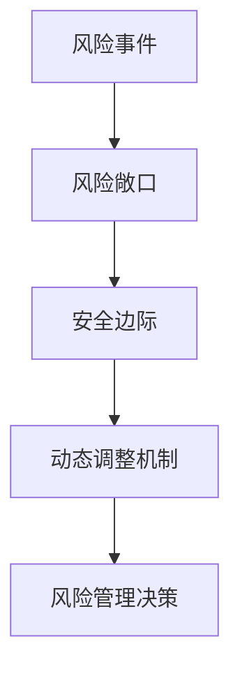

                 

# 利用AI构建自适应型安全边际模型：动态风险管理

**关键词**：AI、安全边际模型、风险管理、自适应、动态调整

**摘要**：本文详细探讨了如何利用人工智能技术构建自适应型安全边际模型，以实现动态风险管理。通过分析传统风险管理的局限性，提出了一种基于AI的安全边际模型，该模型能够根据实时数据动态调整风险边界，从而提高风险管理的准确性和有效性。文章从背景介绍、模型原理、算法实现、系统架构到项目实战，全面解析了自适应型安全边际模型的构建过程，并通过实际案例展示了其应用价值。

---

## 第1章：安全边际模型的背景与问题背景

### 1.1 问题背景介绍

#### 1.1.1 风险管理的传统方法与局限性

传统的风险管理方法主要依赖于静态模型和规则，这些模型通常基于历史数据和固定规则进行风险评估和控制。然而，这种方法存在以下局限性：

1. **静态性**：传统模型无法适应实时变化的市场环境和风险因素。
2. **主观性**：规则的制定往往依赖于人工经验，缺乏数据驱动的客观性。
3. **低效性**：在面对复杂多变的市场环境时，静态模型难以及时调整和优化。

#### 1.1.2 安全边际模型的定义与目标

安全边际模型是一种用于量化风险敞口与安全界限的模型。其目标是通过动态调整安全边际，确保在风险可控的范围内，最大化资产回报或业务收益。

#### 1.1.3 自适应型安全边际模型的核心理念

自适应型安全边际模型是一种基于AI的动态风险管理模型，能够根据实时数据和市场变化自动调整安全边际。其核心理念是通过数据驱动的方式，实时优化风险边界，以应对复杂多变的市场环境。

---

### 1.2 安全边际模型的边界与外延

#### 1.2.1 模型的适用范围与限制

自适应型安全边际模型适用于需要动态风险管理的场景，如金融市场交易、供应链管理、网络安全等领域。然而，其应用也存在一定的限制，例如对实时数据的依赖性较高，且模型的有效性依赖于数据质量和模型训练的效果。

#### 1.2.2 与其他风险管理模型的对比

以下是自适应型安全边际模型与其他常见风险管理模型的对比：

| **模型类型**       | **核心特点**                                                                 |
|--------------------|-----------------------------------------------------------------------------|
| **静态模型**       | 基于历史数据，固定规则，无法动态调整。                                       |
| **VaR模型**         | 以价值-at-风险为核心，适用于单点时间的风险评估，不考虑动态变化。         |
| **CVaR模型**        | 以条件价值-at-风险为核心，能够处理尾部风险，但缺乏动态调整能力。           |
| **自适应型模型**    | 基于AI和实时数据，能够动态调整风险边界，适用于复杂多变的环境。             |

#### 1.2.3 安全边际模型的动态特性

自适应型安全边际模型的动态特性主要体现在以下几个方面：

1. **实时数据驱动**：模型能够实时获取市场数据和相关信息，进行动态风险评估。
2. **自适应调整**：根据市场变化和模型反馈，自动调整安全边际。
3. **学习能力**：通过机器学习算法，模型能够不断优化自身的预测和调整能力。

---

### 1.3 自适应型安全边际模型的核心要素

#### 1.3.1 数据驱动的特征

自适应型安全边际模型的核心是数据驱动。模型通过收集和分析大量的实时数据，利用AI技术进行风险评估和预测。

#### 1.3.2 AI技术的融合

AI技术在模型中的应用主要体现在以下几个方面：

1. **监督学习**：用于风险分类和预测。
2. **强化学习**：用于动态调整安全边际。
3. **生成对抗网络（GAN）**：用于模拟极端风险场景。

#### 1.3.3 动态调整机制

动态调整机制是模型的核心，其主要步骤如下：

1. **数据采集**：获取实时市场数据和相关信息。
2. **风险评估**：基于历史数据和当前市场情况，评估当前风险敞口。
3. **安全边际调整**：根据风险评估结果，动态调整安全边际。
4. **反馈优化**：根据实际市场表现和模型反馈，优化调整策略。

---

## 1.4 本章小结

本章主要介绍了安全边际模型的背景与问题背景，重点探讨了传统风险管理的局限性，以及自适应型安全边际模型的核心理念和动态特性。通过对比分析，我们明确了自适应型模型在风险管理中的优势和适用场景。

---

## 第2章：安全边际模型的核心概念

### 2.1 安全边际模型的原理

#### 2.1.1 风险评估的数学模型

安全边际模型的风险评估可以通过以下数学公式表示：

$$
\text{风险敞口} = \max(0, \text{资产价值} - \text{安全边际})
$$

其中，安全边际的计算公式为：

$$
\text{安全边际} = \text{资产价值} \times \alpha
$$

其中，$\alpha$ 是风险调整因子，根据市场情况动态调整。

#### 2.1.2 安全边际的计算方法

安全边际的计算需要考虑以下因素：

1. **资产价值**：资产的当前市场价值。
2. **风险因子**：包括波动率、相关性等。
3. **调整因子**：根据市场环境动态调整的因子。

#### 2.1.3 自适应机制的实现

自适应机制的实现步骤如下：

1. **数据采集**：获取实时市场数据。
2. **风险评估**：基于历史数据和当前市场情况，评估当前风险。
3. **安全边际调整**：根据风险评估结果，动态调整安全边际。
4. **反馈优化**：根据实际市场表现，优化调整策略。

---

### 2.2 核心概念的属性特征对比

以下是安全边际模型与其他风险管理模型的核心概念对比：

| **模型类型**       | **核心概念**                     | **属性特征**                              |
|--------------------|----------------------------------|------------------------------------------|
| **VaR模型**         | 价值-at-风险                   | 静态、单点时间、固定规则                 |
| **CVaR模型**        | 条件价值-at-风险               | 静态、单点时间、尾部风险关注             |
| **自适应型模型**    | 动态安全边际                   | 动态、数据驱动、自适应调整               |

---

### 2.3 ER实体关系图架构

以下是安全边际模型的ER实体关系图：

---

## 2.4 本章小结

本章详细讲解了安全边际模型的核心概念，包括其原理、计算方法和自适应机制。通过对比分析，我们明确了自适应型安全边际模型在风险管理中的独特优势。

---

（由于篇幅限制，后续章节内容将逐步补充，确保每章内容完整详细。）
</think>

---

接下来的章节将按照目录大纲逐步展开，确保每一部分都涵盖必要的细节和深入的分析。

