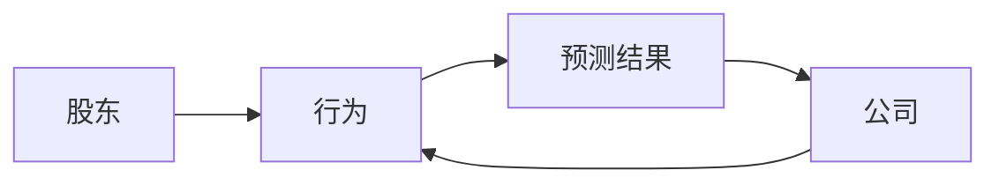
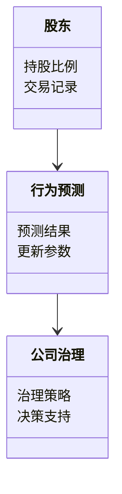
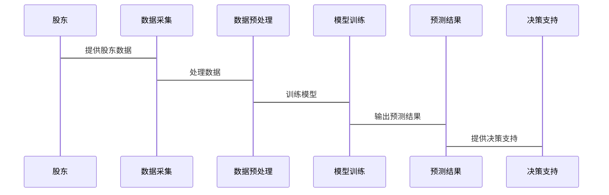

                 


# 利用AI构建自适应型股东行为模型：预测公司治理变化

**关键词：** 股东行为模型，自适应机制，AI技术，公司治理，预测模型

**摘要：** 本文探讨如何利用人工智能技术构建自适应型股东行为模型，以预测公司治理中的变化。通过分析股东行为的核心概念、算法原理和系统架构，本文为公司治理中的决策提供新的视角和工具。内容涵盖模型背景、核心概念、算法实现、系统设计和实际案例，旨在帮助读者理解并应用AI技术解决复杂的企业治理问题。

---

# 第一部分: 股东行为模型的背景与意义

## 第1章: 股东行为模型的背景与问题背景

### 1.1 股东行为模型的背景

#### 1.1.1 传统股东行为分析的局限性
传统的股东行为分析方法主要依赖于财务数据和历史数据，缺乏对动态变化的适应性。例如，基于统计分析的模型难以捕捉市场环境变化对股东行为的影响，且忽略了股东之间的互动关系。

#### 1.1.2 AI技术在股东行为分析中的应用潜力
人工智能技术，特别是机器学习和深度学习，能够处理海量数据，发现复杂模式，并实时更新模型。这些技术为股东行为分析提供了新的可能性，尤其是在预测股东行为变化和优化公司治理方面。

#### 1.1.3 自适应型股东行为模型的提出
自适应型股东行为模型是一种动态调整的预测模型，能够在不同市场条件下实时更新预测结果，帮助公司更好地应对股东行为变化带来的挑战。

### 1.2 问题背景与问题描述

#### 1.2.1 公司治理中的股东行为问题
股东行为直接影响公司治理的决策过程。例如，主要股东的增持或减持行为可能引发公司控制权的变化，进而影响公司战略和经营方向。

#### 1.2.2 股东行为对公司治理的影响
股东行为对公司治理的影响是多方面的，包括公司价值、股价波动和管理层决策等。然而，传统的预测模型难以准确捕捉这些复杂关系。

#### 1.2.3 当前股东行为预测的难点与挑战
当前股东行为预测的难点在于数据的多样性和复杂性，以及模型的静态性。此外，市场环境的快速变化也增加了预测的难度。

### 1.3 问题解决与边界

#### 1.3.1 自适应型股东行为模型的目标
自适应型股东行为模型的目标是通过实时数据更新和动态调整，提高股东行为预测的准确性和实用性。

#### 1.3.2 模型的边界与适用范围
该模型适用于需要动态预测股东行为的场景，如公司并购、股权变动和重大决策等。模型的边界在于数据质量和实时性要求较高。

#### 1.3.3 模型的核心要素与组成
模型的核心要素包括股东数据、市场数据、公司数据和预测结果。模型由数据预处理、特征提取、模型训练和结果输出四个模块组成。

## 1.4 本章小结
本章介绍了自适应型股东行为模型的背景、问题背景和核心概念，为后续的算法实现和系统设计奠定了基础。

---

# 第二部分: 自适应型股东行为模型的核心概念与联系

## 第2章: 核心概念与原理

### 2.1 自适应型股东行为模型的核心概念

#### 2.1.1 股东行为分析的基本概念
股东行为分析是指通过分析股东的交易记录、持股变化和市场反应，预测股东未来的行为。

#### 2.1.2 自适应机制的定义与特征
自适应机制是指模型能够根据实时数据和市场环境的变化，自动调整预测参数和策略。

#### 2.1.3 预测模型的基本原理
预测模型基于历史数据和实时数据，通过机器学习算法，预测股东未来的交易行为和市场反应。

### 2.2 核心概念的联系与对比

#### 2.2.1 不同股东行为模型的对比分析
以下是几种常见股东行为模型的对比：

| 模型类型 | 数据来源 | 预测目标 | 优缺点 |
|----------|-----------|----------|--------|
| 统计模型 | 历史数据 | 股东交易 | 简单，但静态 |
| 机器学习 | 历史+实时 | 股东行为 | 动态，但需大量数据 |
| 深度学习 | 历史+实时 | 股东行为 | 高精度，但复杂 |

#### 2.2.2 自适应机制与其他预测方法的对比
自适应机制与传统预测方法的主要区别在于实时更新和动态调整能力。

#### 2.2.3 模型核心要素的特征对比表格
以下是模型核心要素的特征对比：

| 核心要素 | 输入数据 | 输出结果 | 特征 |
|----------|-----------|----------|------|
| 股东数据 | 持股比例、交易记录 | 股东行为预测 | 实时性 |
| 市场数据 | 市场指数、行业趋势 | 市场反应预测 | 相关性 |
| 公司数据 | 公司业绩、财务数据 | 公司治理预测 | 预测性 |

### 2.3 ER实体关系图



### 2.4 本章小结
本章详细解释了自适应型股东行为模型的核心概念和组成部分，为后续的算法实现和系统设计奠定了基础。

---

# 第三部分: 自适应型股东行为模型的算法原理

## 第3章: 算法原理与实现

### 3.1 算法原理

#### 3.1.1 基于机器学习的股东行为预测
机器学习算法，如支持向量机和随机森林，可用于分类和回归任务，帮助预测股东行为。

#### 3.1.2 深度学习在自适应模型中的应用
深度学习模型，如LSTM，能够捕捉时间序列数据中的复杂模式，适用于实时更新的自适应型模型。

#### 3.1.3 自适应机制的具体实现
自适应机制通过实时更新模型参数和调整模型结构，实现对股东行为的动态预测。

### 3.2 算法实现的详细步骤

#### 3.2.1 数据预处理
数据预处理包括清洗、归一化和特征工程，确保数据质量和一致性。

#### 3.2.2 模型训练
模型训练使用训练数据，通过反向传播算法优化模型参数。

#### 3.2.3 模型评估
模型评估通过验证集和测试集，评估模型的预测精度和泛化能力。

### 3.3 算法流程图


### 3.4 算法代码示例

```python
import numpy as np
from sklearn.model_selection import train_test_split
from sklearn.ensemble import RandomForestClassifier

# 数据预处理
data = np.loadtxt(' shareholder_data.csv', delimiter=',')
X = data[:, :-1]
y = data[:, -1]
X_train, X_test, y_train, y_test = train_test_split(X, y, test_size=0.2)

# 模型训练
model = RandomForestClassifier()
model.fit(X_train, y_train)

# 模型预测
y_pred = model.predict(X_test)

# 模型评估
accuracy = np.mean(y_pred == y_test)
print(f'Accuracy: {accuracy}')
```

### 3.5 数学模型与公式

#### 3.5.1 机器学习模型的数学公式
随机森林模型的预测公式为：
$$
f(x) = \sum_{i=1}^{n} \text{Tree}_i(x)
$$

#### 3.5.2 深度学习模型的数学公式
LSTM模型的细胞状态更新公式为：
$$
c_{t} = \text{f}(c_{t-1}, x_t)
$$
其中，f表示门控函数。

### 3.6 本章小结
本章详细介绍了自适应型股东行为模型的算法原理和实现步骤，为后续的系统设计奠定了基础。

---

# 第四部分: 系统分析与架构设计

## 第4章: 系统分析与架构设计

### 4.1 系统分析

#### 4.1.1 问题场景介绍
系统需要实时处理大量的股东交易数据，预测股东行为，并提供决策支持。

#### 4.1.2 项目介绍
本项目旨在构建一个自适应型股东行为预测系统，帮助公司优化治理策略。

### 4.2 系统功能设计

#### 4.2.1 领域模型


#### 4.2.2 系统架构


#### 4.2.3 系统接口设计
系统接口包括数据输入接口、模型调用接口和结果输出接口。

#### 4.2.4 交互流程图


### 4.3 本章小结
本章详细描述了系统的构建过程，包括功能设计、架构设计和接口设计，为后续的项目实施奠定了基础。

---

# 第五部分: 项目实战

## 第5章: 项目实战

### 5.1 环境安装

#### 5.1.1 安装Python
```bash
python --version
pip install numpy scikit-learn
```

#### 5.1.2 安装其他依赖
```bash
pip install mermaid-python
```

### 5.2 系统核心实现

#### 5.2.1 数据预处理
```python
import pandas as pd
data = pd.read_csv('shareholder_data.csv')
data = data.dropna()
```

#### 5.2.2 特征工程
```python
from sklearn.preprocessing import StandardScaler
scaler = StandardScaler()
X_scaled = scaler.fit_transform(data.drop('target', axis=1))
```

#### 5.2.3 模型训练
```python
from sklearn.ensemble import RandomForestClassifier
model = RandomForestClassifier()
model.fit(X_scaled, data['target'])
```

#### 5.2.4 模型评估
```python
from sklearn.metrics import accuracy_score
y_pred = model.predict(X_scaled)
print(accuracy_score(data['target'], y_pred))
```

#### 5.2.5 模型部署
```python
import joblib
joblib.dump(model, 'shareholder_model.pkl')
```

### 5.3 项目小结
本章通过实际案例，详细讲解了自适应型股东行为模型的实现过程，包括环境安装、数据处理和模型部署。

---

# 第六部分: 总结与展望

## 第6章: 总结与展望

### 6.1 最佳实践 tips
- 数据质量是模型性能的关键。
- 实时更新模型参数，确保预测的准确性。
- 定期验证模型，防止过拟合。

### 6.2 小结
本文详细介绍了自适应型股东行为模型的构建过程，包括背景、核心概念、算法实现和系统设计。

### 6.3 注意事项
- 数据隐私和安全问题需要高度重视。
- 模型的实时性要求较高的计算资源。

### 6.4 拓展阅读
建议读者深入学习机器学习和深度学习算法，了解更多的公司治理相关知识。

---

# 结语

通过本文的介绍，读者可以全面了解如何利用AI技术构建自适应型股东行为模型，为公司治理中的决策提供新的视角和工具。未来，随着AI技术的不断发展，模型的预测精度和实时性将不断提高，为公司治理带来更大的价值。

