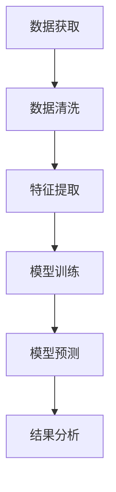
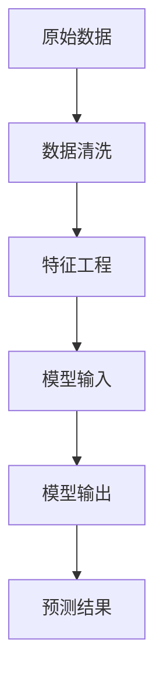
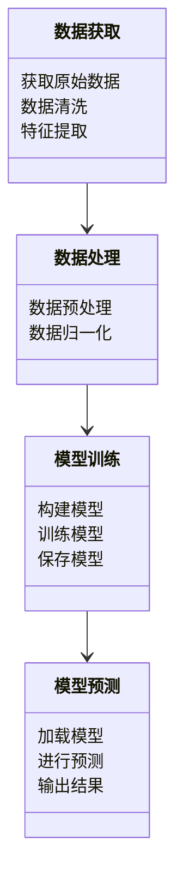
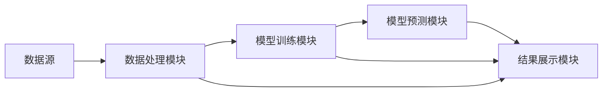
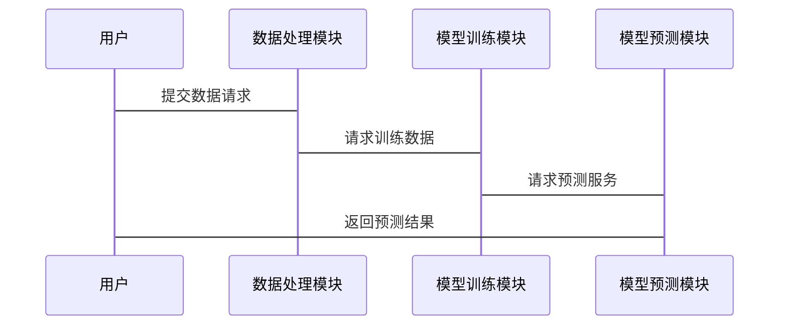

                 


```markdown
# 利用AI进行全球资金流动分析：预测市场走向

## 关键词
全球资金流动分析，人工智能，市场预测，时间序列模型，LSTM，数据挖掘

## 摘要
随着全球金融市场的日益复杂化，利用人工智能技术分析全球资金流动成为预测市场走向的关键手段。本文系统介绍AI在全球资金流动分析中的应用，涵盖从数据处理到模型构建的各个环节，深入探讨时间序列模型（如LSTM）的应用，结合实际案例，提供详细的算法流程和代码实现，帮助读者掌握利用AI进行资金流动预测的核心方法。

---

# 第一部分: 全球资金流动分析的背景与挑战

# 第1章: 全球资金流动分析概述

## 1.1 全球资金流动的背景与重要性
### 1.1.1 全球资金流动的基本概念
- 全球资金流动的定义
- 资金流动的类型（短期资本流动、长期资本流动）
- 资金流动对全球经济的影响

### 1.1.2 资金流动对经济和市场的影响
- 资金流动与汇率波动
- 资金流动与资产价格波动
- 资金流动与经济周期的关系

### 1.1.3 利用AI进行资金流动分析的优势
- 数据处理能力
- 模型复杂度
- 实时分析能力

## 1.2 AI技术在金融领域的应用
### 1.2.1 AI在金融分析中的作用
- 数据挖掘与模式识别
- 预测分析与风险评估
- 自动化交易

### 1.2.2 大数据分析在资金流动中的应用
- 数据来源与处理
- 数据特征提取
- 数据可视化

### 1.2.3 机器学习模型在市场预测中的优势
- 高维数据处理能力
- 非线性关系捕捉
- 动态适应性

## 1.3 资金流动分析的核心问题
### 1.3.1 资金流动的多维度特征
- 时间维度
- 空间维度
- 额度维度

### 1.3.2 市场预测的复杂性
- 数据噪声
- 趋势与周期性
- 不确定性

### 1.3.3 数据获取与处理的挑战
- 数据清洗
- 数据缺失
- 数据异质性

## 1.4 本章小结
- 全球资金流动分析的重要性和复杂性
- AI技术在其中的关键作用
- 后续章节的结构安排

---

# 第二部分: 利用AI进行资金流动分析的核心概念与联系

# 第2章: AI驱动的资金流动分析原理

## 2.1 数据特征与模型选择
### 2.1.1 数据特征的提取方法
- 时间序列特征
- 频率特征
- 额度特征

### 2.1.2 不同模型的适用场景
- 线性回归模型
- 支持向量机（SVM）
- 随机森林（Random Forest）
- LSTM网络

### 2.1.3 模型选择的策略与优化
- 超参数调优
- 模型评估指标（均方误差、平均绝对误差）
- 模型集成方法

## 2.2 算法流程与数据流图
### 2.2.1 算法流程图


### 2.2.2 数据流图


## 2.3 核心概念与联系
### 2.3.1 数据特征与模型性能的关系
- 特征重要性评估
- 特征对预测结果的影响
- 特征工程的重要性

### 2.3.2 模型选择与预测精度的对比
- 不同模型的预测精度对比
- 模型选择的影响因素
- 实验结果分析

### 2.3.3 数据流与算法流程的整合
- 数据流图与算法流程图的结合
- 数据处理与模型训练的协同
- 系统整体流程的优化

## 2.4 本章小结
- 数据特征与模型选择的重要性
- 算法流程的整体设计
- 数据流与算法流程的协同关系

---

# 第三部分: 算法原理与数学模型

# 第3章: 算法原理与数学模型

## 3.1 时间序列预测模型
### 3.1.1 ARIMA模型
- ARIMA模型的基本结构
- 自回归（AR）部分
- 移动平均（MA）部分
- 差分（d）部分
- 模型的数学表达式：
  $$ ARIMA(p, d, q) $$
  $$ (1 - B^p)^d (1 - B) Z_t = \sum_{i=1}^q \theta_i B^i Z_t $$

### 3.1.2 LSTM网络
- LSTM的基本结构
- 长期记忆单元（Cell）
- 门控机制（遗忘门、输入门、输出门）
- LSTM的数学表达式：
  $$ f_t = \sigma(W_f \cdot [h_{t-1}, x_t] + b_f) $$
  $$ i_t = \sigma(W_i \cdot [h_{t-1}, x_t] + b_i) $$
  $$ c_t = f_t \cdot c_{t-1} + i_t \cdot tanh(W_c \cdot [h_{t-1}, x_t] + b_c) $$
  $$ o_t = \sigma(W_o \cdot [h_{t-1}, c_t] + b_o) $$
  $$ h_t = o_t \cdot tanh(c_t) $$

### 3.1.3 Prophet模型
- Prophet模型的基本结构
- 时间序列分解（趋势、周期、噪声）
- 模型的数学表达式：
  $$ y_{t+h} = g(t+h) + \epsilon_{t+h} $$
  $$ g(t) = a + b t + c \sin(d t) + f \cos(g t) $$

## 3.2 算法流程与实现
### 3.2.1 数据预处理
- 数据清洗（缺失值处理、异常值处理）
- 数据归一化（标准化、归一化）
- 时间序列分割（训练集、验证集、测试集）

### 3.2.2 特征提取
- 时间窗口特征（移动平均、移动方差）
- 频率域特征（傅里叶变换）
- 统计特征（均值、方差、自相关系数）

### 3.2.3 模型训练
- 模型参数设置
- 训练过程监控
- 模型保存与加载

## 3.3 数学模型与公式
### 3.3.1 ARIMA模型的实现
- 数据预处理
- 模型参数估计
- 模型诊断与检验

### 3.3.2 LSTM网络的实现
- 神经网络构建
- 模型训练
- 模型预测与评估

### 3.3.3 Prophet模型的实现
- 模型训练
- 模型预测
- 模型解释

## 3.4 本章小结
- 各种时间序列模型的优缺点
- 模型选择的策略
- 模型实现的关键步骤

---

# 第四部分: 系统分析与架构设计方案

# 第4章: 系统分析与架构设计方案

## 4.1 项目背景介绍
### 4.1.1 项目目标
- 实现全球资金流动的实时监测
- 构建市场预测模型
- 提供决策支持工具

### 4.1.2 项目范围
- 数据来源（股票市场、外汇市场、债券市场）
- 数据范围（全球主要金融市场）
- 预测范围（短期、中期、长期预测）

## 4.2 系统功能设计
### 4.2.1 领域模型设计


### 4.2.2 系统架构设计


### 4.2.3 系统交互设计


## 4.3 本章小结
- 系统设计的整体架构
- 各模块的功能划分
- 模块之间的交互关系

---

# 第五部分: 项目实战

# 第5章: 项目实战

## 5.1 环境配置与数据获取
### 5.1.1 环境配置
- 安装Python
- 安装相关库（Pandas、NumPy、TensorFlow、Prophet）
- 配置开发环境（Jupyter Notebook、PyCharm）

### 5.1.2 数据获取
- 数据来源（Yahoo Finance API）
- 数据字段（开盘价、收盘价、最高价、最低价、成交量）
- 数据时间范围（2020-2023年）

## 5.2 系统核心实现源代码
### 5.2.1 数据预处理
```python
import pandas as pd
import numpy as np

# 数据清洗
data = pd.read_csv('global_funding.csv')
data = data.dropna()
data = data[~data['Date'].duplicated()]
data['Date'] = pd.to_datetime(data['Date'])
data = data.set_index('Date')

# 数据归一化
from sklearn.preprocessing import MinMaxScaler
scaler = MinMaxScaler()
scaled_data = scaler.fit_transform(data[['Close']])
```

### 5.2.2 模型训练
```python
from tensorflow.keras.models import Sequential
from tensorflow.keras.layers import LSTM, Dense

model = Sequential()
model.add(LSTM(128, input_shape=(timesteps, 1)))
model.add(Dense(1))
model.compile(loss='mean_squared_error', optimizer='adam')
model.fit(X_train, y_train, epochs=50, batch_size=32)
```

### 5.2.3 模型预测
```python
from prophet import Prophet

model = Prophet()
model.fit(train_data)
future = model.make_future_dataframe(periods=30)
forecast = model.predict(future)
```

## 5.3 实际案例分析
### 5.3.1 数据分析
- 数据可视化（收盘价趋势图）
- 数据特征分析（均值、方差、自相关性）
- 数据分解（趋势、周期、噪声）

### 5.3.2 模型预测
- 使用LSTM进行预测
- 使用Prophet进行预测
- 比较不同模型的预测结果

## 5.4 项目小结
- 项目实现的步骤
- 模型选择的经验
- 系统设计的优化建议

---

# 第六部分: 最佳实践与总结

# 第6章: 最佳实践与总结

## 6.1 最佳实践
### 6.1.1 数据处理的关键点
- 数据清洗的重要性
- 特征工程的优化
- 数据归一化的注意事项

### 6.1.2 模型选择的策略
- 根据数据类型选择模型
- 结合业务需求选择模型
- 多模型对比与优化

### 6.1.3 系统设计的优化
- 模块化设计
- 高可用性设计
- 高扩展性设计

## 6.2 小结
- 全球资金流动分析的重要性和挑战
- AI技术在其中的应用价值
- 未来的发展方向

## 6.3 注意事项
- 数据隐私与安全
- 模型的泛化能力
- 系统的可解释性

## 6.4 拓展阅读
- 推荐书籍与论文
- 其他相关技术资料
- 行业动态与趋势

---

# 结语

通过系统地介绍全球资金流动分析的背景、核心概念、算法原理、系统设计和项目实战，本文为读者提供了一个全面了解和应用AI技术进行资金流动分析的框架。未来，随着AI技术的不断发展，全球资金流动分析将更加精准和高效，为金融市场的预测和决策提供更有力的支持。
```

