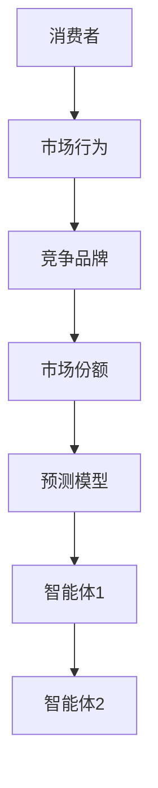
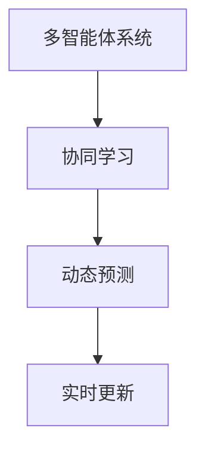
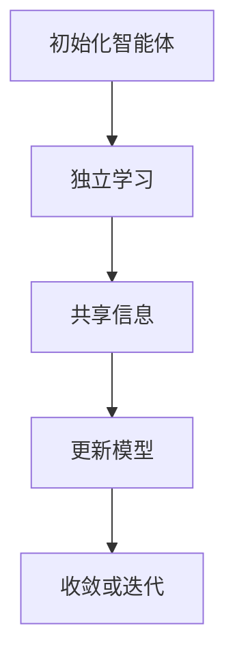
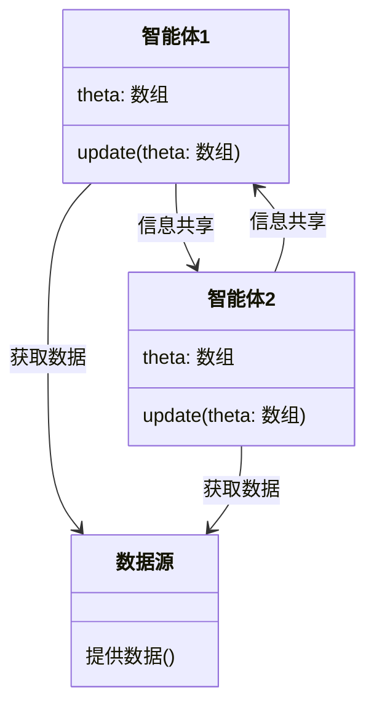
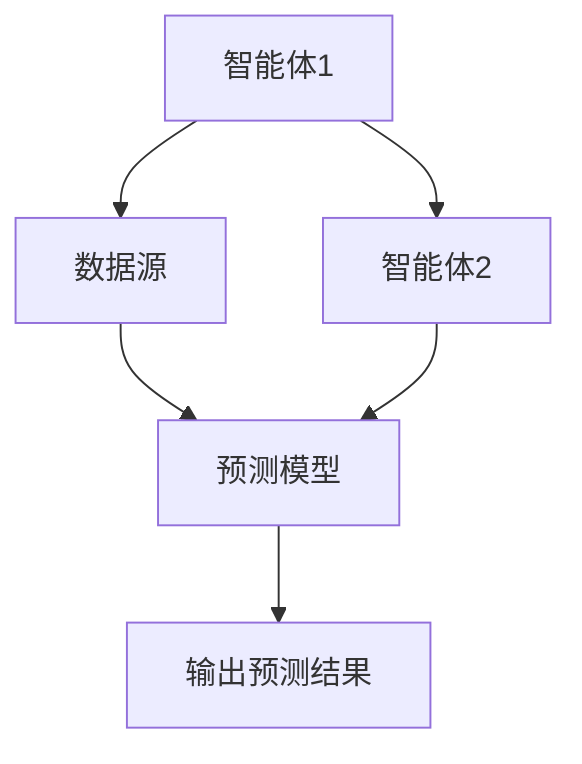
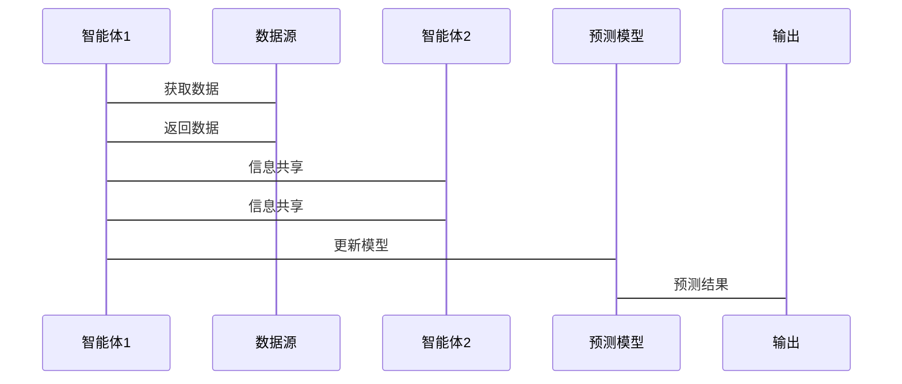

                 


# 利用多智能体AI实现动态市场份额预测

## 关键词：多智能体AI，市场份额预测，动态预测，协同学习，预测模型

## 摘要：  
本文详细探讨了利用多智能体AI技术进行动态市场份额预测的方法。通过分析多智能体系统的协同学习机制和动态预测模型，结合实际应用场景，展示了如何构建高效的市场份额预测系统。文章内容涵盖背景介绍、核心概念、算法原理、系统架构设计、项目实战以及最佳实践，旨在为读者提供从理论到实践的全面指导。

---

# 第一部分: 背景介绍与核心概念

---

## 第1章: 利用多智能体AI实现动态市场份额预测的背景与问题

### 1.1 问题背景

#### 1.1.1 市场份额预测的重要性  
市场份额预测是企业制定战略决策的重要依据。通过预测市场份额，企业可以优化产品定价、调整市场策略、评估竞争对手的动向，从而提高市场竞争力。然而，传统的方法在处理复杂市场动态时往往力不从心。

#### 1.1.2 传统市场份额预测的局限性  
传统的方法通常依赖于单一模型或静态数据，难以捕捉市场的实时变化。例如，线性回归模型在面对非线性变化时表现不佳，且无法处理多智能体之间的协同效应。

#### 1.1.3 多智能体AI的优势与潜力  
多智能体AI通过多个智能体的协同工作，能够更准确地捕捉市场动态。每个智能体专注于不同的数据源或预测维度，通过信息共享和协同学习，显著提高了预测的准确性和鲁棒性。

### 1.2 问题描述

#### 1.2.1 动态市场份额预测的定义  
动态市场份额预测是指在市场环境不断变化的情况下，实时更新和预测市场份额的过程。与静态预测不同，动态预测能够适应市场波动，提供更及时和准确的预测结果。

#### 1.2.2 多智能体AI在预测中的应用场景  
多智能体AI适用于复杂且动态变化的市场环境，例如多个竞争品牌之间的市场份额预测、消费者行为分析以及市场趋势预测。

#### 1.2.3 问题解决的关键点  
关键点包括：多智能体的协同学习机制、动态预测模型的构建、以及如何处理实时数据流。

### 1.3 问题解决方法

#### 1.3.1 多智能体AI的基本原理  
多智能体系统由多个独立但协同工作的智能体组成，每个智能体负责不同的任务或数据源。通过信息共享和协同决策，系统能够实现更复杂的预测任务。

#### 1.3.2 动态预测的核心算法  
动态预测算法需要能够实时更新模型参数，适应市场变化。基于多智能体的动态预测算法能够充分利用多个智能体的信息，提高预测的准确性。

#### 1.3.3 与其他预测方法的对比分析  
与传统单智能体预测方法相比，多智能体AI具有更高的灵活性和适应性，能够处理更复杂的数据和场景。

### 1.4 边界与外延

#### 1.4.1 适用范围与限制  
多智能体AI适用于需要实时预测和协同工作的场景，但在数据不足或系统复杂度过高的情况下，可能会面临性能瓶颈。

#### 1.4.2 与其他AI技术的区分  
多智能体AI强调多个智能体的协同工作，而其他AI技术如单模型预测则依赖于单一算法。

#### 1.4.3 应用领域的扩展性  
除了市场份额预测，多智能体AI还可应用于金融市场的动态预测、供应链管理等多个领域。

### 1.5 概念结构与核心要素

#### 1.5.1 多智能体系统的组成  
多智能体系统包括智能体、通信机制、协同算法和决策机制等组成部分。

#### 1.5.2 动态预测模型的要素  
动态预测模型需要包括数据采集、模型构建、实时更新和预测输出等要素。

#### 1.5.3 核心概念的相互关系  
多智能体系统通过协同学习机制，使各个智能体之间的信息共享和知识更新，从而提高动态预测的准确性。

---

## 第2章: 多智能体AI与动态市场份额预测的核心概念

### 2.1 多智能体系统的定义与特征

#### 2.1.1 多智能体系统的定义  
多智能体系统是由多个智能体组成的分布式系统，每个智能体具有一定的自主性，能够与其他智能体协同工作。

#### 2.1.2 多智能体系统的特征对比表格  
| 特征       | 单智能体系统 | 多智能体系统 |
|------------|--------------|--------------|
| 独立性      | 高           | 较低         |
| 协作性      | 低           | 高           |
| 可扩展性    | 低           | 高           |

#### 2.1.3 实体关系Mermaid图  


### 2.2 动态市场份额预测的原理

#### 2.2.1 动态预测的基本原理  
动态预测基于实时数据流，通过不断更新模型参数，适应市场变化。

#### 2.2.2 多智能体协同学习的机制  
多个智能体协同学习，共享信息，优化预测模型。例如，智能体1负责收集消费者数据，智能体2负责分析竞争品牌的行为。

#### 2.2.3 动态预测的数学模型  
动态预测模型通常采用递归神经网络（RNN）或长短期记忆网络（LSTM）来处理时间序列数据。

### 2.3 核心概念的联系

#### 2.3.1 多智能体与动态预测的协同关系  
多智能体系统通过协同学习，动态预测模型能够实时更新，提高预测的准确性。

#### 2.3.2 概念联系的Mermaid图  


#### 2.3.3 核心概念的相互作用  
多智能体系统的协同学习机制是动态预测模型的核心，实时数据流和模型更新是实现动态预测的关键。

---

## 第3章: 多智能体协同学习算法

### 3.1 算法原理

#### 3.1.1 协同学习的定义  
协同学习是指多个学习器通过共享信息，共同优化模型性能的过程。

#### 3.1.2 算法的基本流程  
1. 初始化多个智能体。  
2. 每个智能体独立学习，更新模型参数。  
3. 智能体之间共享信息，优化模型。  
4. 重复步骤2和3，直到收敛。

#### 3.1.3 算法的数学模型  
协同学习的数学模型如下：  
$$ \theta_i^{new} = \theta_i + \alpha (\theta_j - \theta_i) $$  
其中，$\theta_i$ 表示智能体i的参数，$\alpha$ 是学习率。

### 3.2 算法实现

#### 3.2.1 算法的Mermaid流程图  


#### 3.2.2 Python源代码实现  
```python
import numpy as np

class Agent:
    def __init__(self, theta):
        self.theta = theta

    def update(self, other_theta, alpha=0.1):
        self.theta = self.theta + alpha * (other_theta - self.theta)

# 初始化智能体
agent1 = Agent(np.array([1, 2]))
agent2 = Agent(np.array([3, 4]))

# 协同学习过程
for _ in range(10):
    agent1.update(agent2.theta)
    agent2.update(agent1.theta)

print("Final thetas:", agent1.theta, agent2.theta)
```

#### 3.2.3 代码的功能解读  
上述代码展示了两个智能体的协同学习过程，通过不断更新参数，最终达到一致或接近一致的模型参数。

### 3.3 算法的数学模型

#### 3.3.1 协同学习的数学公式  
$$ \theta_i^{new} = \theta_i + \alpha (\theta_j - \theta_i) $$  

#### 3.3.2 动态预测的数学模型  
动态预测模型通常采用递归神经网络（RNN）或长短期记忆网络（LSTM）来处理时间序列数据。

---

## 第4章: 动态市场份额预测模型

### 4.1 模型的构建

#### 4.1.1 模型的输入与输出  
输入：市场数据（如销售额、消费者行为）；输出：预测的市场份额。

#### 4.1.2 模型的训练过程  
1. 收集市场数据。  
2. 数据预处理（如归一化）。  
3. 训练动态预测模型。  
4. 评估模型性能。

#### 4.1.3 模型的评估方法  
采用均方误差（MSE）或平均绝对误差（MAE）作为评估指标。

### 4.2 模型的优化

#### 4.2.1 参数调整的方法  
通过网格搜索或随机搜索优化模型参数。  

#### 4.2.2 模型的迭代优化  
在训练过程中，逐步调整模型参数，以提高预测准确性。

#### 4.2.3 模型的鲁棒性测试  
通过交叉验证或留出法测试模型的鲁棒性。

### 4.3 模型的数学公式

#### 4.3.1 预测模型的公式  
$$ y_t = \beta_1 x_{t-1} + \beta_2 x_{t-2} + \epsilon $$  
其中，$y_t$ 是预测的市场份额，$x_{t-1}$ 和 $x_{t-2}$ 是前两期的市场数据，$\epsilon$ 是误差项。

#### 4.3.2 动态更新的公式  
$$ \theta_t = \theta_{t-1} + \alpha (y_t - \hat{y}_t) $$  
其中，$\theta_t$ 是当前模型参数，$\alpha$ 是学习率，$y_t$ 是实际值，$\hat{y}_t$ 是预测值。

---

## 第5章: 系统分析与架构设计

### 5.1 问题场景介绍

#### 5.1.1 问题场景的描述  
假设我们有多个竞争品牌，需要实时预测每个品牌的市场份额。

#### 5.1.2 问题场景的分析  
市场环境复杂，数据来源多样，需要高效的协同预测机制。

#### 5.1.3 问题场景的解决方案  
采用多智能体系统，每个智能体负责不同的数据源和预测任务。

### 5.2 系统功能设计

#### 5.2.1 领域模型Mermaid类图  


### 5.3 系统架构设计

#### 5.3.1 系统架构Mermaid图  


#### 5.3.2 系统接口设计  
1. 数据获取接口：智能体从数据源获取数据。  
2. 信息共享接口：智能体之间共享信息。  
3. 预测结果输出接口：模型输出预测结果。

#### 5.3.3 系统交互Mermaid序列图  


---

## 第6章: 项目实战

### 6.1 环境安装

#### 6.1.1 安装Python环境  
安装Python 3.8及以上版本，并安装必要的库（如numpy、pandas、keras等）。

#### 6.1.2 安装其他工具  
安装Jupyter Notebook用于代码开发和测试。

### 6.2 系统核心实现

#### 6.2.1 核心代码实现  
```python
import numpy as np
from keras.models import Sequential
from keras.layers import LSTM, Dense

# 初始化智能体
agent1 = Agent(np.array([1, 2]))
agent2 = Agent(np.array([3, 4]))

# 协同学习过程
for _ in range(10):
    agent1.update(agent2.theta)
    agent2.update(agent1.theta)

# 构建动态预测模型
model = Sequential()
model.add(LSTM(64, input_shape=(timesteps, features)))
model.add(Dense(1))
model.compile(optimizer='adam', loss='mean_squared_error')

# 训练模型
model.fit(x_train, y_train, epochs=10, batch_size=32)
```

#### 6.2.2 代码的功能解读  
上述代码展示了多智能体协同学习和动态预测模型的构建过程。

### 6.3 项目小结

#### 6.3.1 实战经验总结  
通过项目实战，我们掌握了多智能体协同学习和动态预测模型的实现方法。

#### 6.3.2 代码实现的注意事项  
在实际应用中，需要注意数据预处理和模型优化。

#### 6.3.3 项目总结  
多智能体AI在动态市场份额预测中具有显著优势，能够提高预测的准确性和实时性。

---

## 第7章: 最佳实践与小结

### 7.1 小结

#### 7.1.1 核心知识点总结  
多智能体AI、动态预测模型、协同学习机制。

#### 7.1.2 知识点之间的联系  
多智能体系统通过协同学习，动态预测模型能够实时更新，提高预测的准确性。

### 7.2 注意事项

#### 7.2.1 实际应用中的注意事项  
在实际应用中，需要注意数据的质量和系统的可扩展性。

#### 7.2.2 可能遇到的问题  
数据不足、模型收敛慢、系统复杂度过高等问题。

### 7.3 拓展阅读

#### 7.3.1 相关领域的推荐书籍  
推荐《Multi-Agent Systems: Algorithmic, Complexity Theoretic, and Game Theoretic Foundations》。

#### 7.3.2 相关领域的推荐论文  
推荐《A Survey of Multi-Agent Reinforcement Learning》。

---

通过以上内容，我们全面探讨了利用多智能体AI实现动态市场份额预测的方法，从背景介绍到系统设计，再到项目实战，为读者提供了从理论到实践的详细指导。

