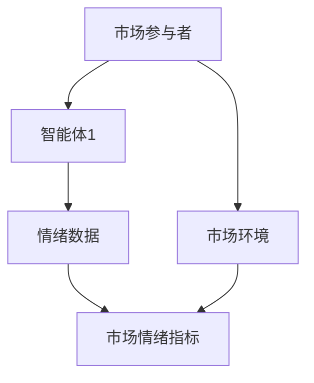
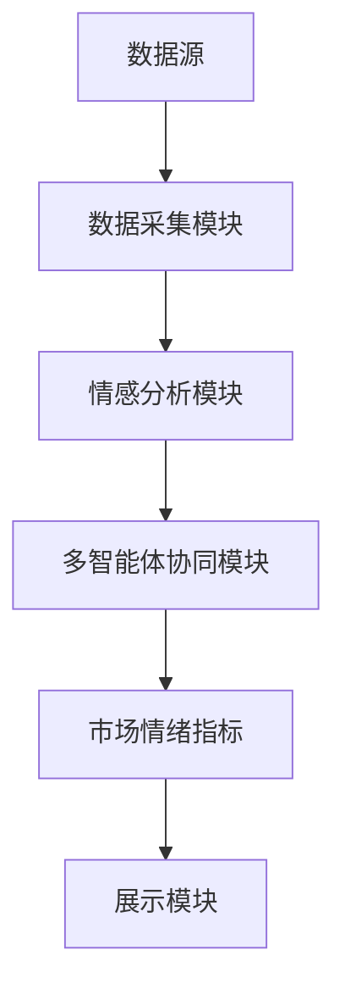

                 


# 利用多智能体系统构建动态市场情绪指标：把握市场脉搏

## 关键词
多智能体系统, 市场情绪指标, 动态市场分析, 分布式计算, 情感计算, 自适应学习

## 摘要
本文深入探讨了利用多智能体系统构建动态市场情绪指标的方法，从理论基础到实际应用，详细分析了多智能体系统在金融市场中的优势与实现路径。通过系统化的架构设计和算法原理的详细阐述，结合实际案例分析，为读者提供了全面的技术指导和实践参考。

---

# 第一部分: 多智能体系统与市场情绪指标概述

## 第1章: 多智能体系统与市场情绪指标的背景介绍

### 1.1 市场情绪指标的核心概念

#### 1.1.1 什么是市场情绪指标
市场情绪指标是反映市场参与者情感状态的量化工具，通常通过分析交易数据、新闻报道、社交媒体评论等信息，评估市场的乐观或悲观情绪。市场情绪指标能够帮助投资者预测市场趋势、优化交易策略。

#### 1.1.2 多智能体系统的基本概念
多智能体系统（Multi-Agent System, MAS）是由多个智能体组成的分布式系统，每个智能体能够独立感知环境、自主决策并与其他智能体协作完成复杂任务。多智能体系统具有分布式计算、自主性、反应性和协作性等特性。

#### 1.1.3 市场情绪指标的构建目标与意义
构建市场情绪指标的目标是捕捉市场参与者的集体情绪，预测市场波动。多智能体系统的引入能够提高市场情绪指标的实时性、准确性和鲁棒性，为投资者提供更可靠的决策支持。

### 1.2 问题背景与问题描述

#### 1.2.1 传统市场情绪分析的局限性
传统市场情绪分析方法通常依赖单一数据源或集中式计算，存在以下问题：
- 数据来源单一，无法全面反映市场情绪。
- 计算过程集中，难以实时更新。
- 情感分析模型缺乏动态调整能力。

#### 1.2.2 动态市场环境中的挑战
市场环境复杂多变，参与者行为具有随机性和非线性特征，传统方法难以捕捉市场的动态变化。此外，市场情绪受多种因素影响，如宏观经济指标、政策变化、突发事件等，增加了情绪分析的难度。

#### 1.2.3 多智能体系统的优势与适用性
多智能体系统通过分布式计算和协作机制，能够实时采集多源数据，动态调整分析模型，适应市场环境的变化。多智能体系统在处理复杂、动态的市场环境方面具有显著优势。

### 1.3 多智能体系统与市场情绪的关联

#### 1.3.1 多智能体系统的核心要素
- **智能体**：能够感知环境、自主决策的实体。
- **协作机制**：智能体之间的通信、协调和协作规则。
- **分布式计算**：任务分解和资源分配机制。

#### 1.3.2 市场情绪指标的动态特性
市场情绪指标具有动态性、实时性和不确定性。市场情绪指标需要根据最新的市场数据动态更新，反映市场的最新变化。

#### 1.3.3 多智能体系统在动态市场中的应用潜力
多智能体系统能够实时采集市场数据，分析参与者行为，动态调整情绪分析模型，为市场情绪指标的构建提供技术支持。

## 第2章: 多智能体系统与市场情绪指标的核心概念与联系

### 2.1 多智能体系统的核心原理

#### 2.1.1 分布式计算与协作机制
多智能体系统通过分布式计算实现任务分解和资源分配。智能体之间通过通信协议进行协作，共同完成复杂任务。

#### 2.1.2 自适应学习与动态调整
多智能体系统能够根据环境变化自适应调整行为策略。通过机器学习算法，智能体可以不断优化自身模型，提高分析准确性。

#### 2.1.3 实体关系与协同规则
多智能体系统中的智能体之间需要定义明确的协同规则。实体关系图展示了智能体之间的协作关系和数据流。

### 2.2 市场情绪指标的构建原理

#### 2.2.1 数据采集与特征提取
市场情绪指标的构建需要采集多源数据，如新闻、社交媒体评论、交易数据等。特征提取过程将这些数据转化为可分析的特征向量。

#### 2.2.2 情感计算与分析模型
情感计算通过自然语言处理技术分析文本数据，评估市场参与者的积极或消极情绪。分析模型结合统计学和机器学习方法，计算市场情绪指标。

#### 2.2.3 指标生成与动态更新
市场情绪指标根据实时数据动态更新，确保指标能够反映最新的市场情绪变化。

### 2.3 多智能体系统与市场情绪指标的实体关系图



---

## 第3章: 多智能体系统构建市场情绪指标的算法原理

### 3.1 多智能体协同算法

#### 3.1.1 分布式计算流程
多智能体系统通过分布式计算实现任务分解。智能体之间通过通信协议交换数据，协同完成复杂任务。

#### 3.1.2 自适应学习机制
自适应学习机制通过机器学习算法优化智能体的行为策略。智能体能够根据环境变化动态调整模型参数。

#### 3.1.3 协作规则与冲突解决
协作规则定义了智能体之间的交互方式。冲突解决机制通过协商或仲裁方式解决智能体之间的冲突。

### 3.2 情感分析算法

#### 3.2.1 数据预处理与特征提取
数据预处理包括文本清洗、分词和情感标注。特征提取过程将文本数据转化为特征向量。

#### 3.2.2 情感分类模型
情感分类模型通过机器学习算法训练情感分类器。常用算法包括支持向量机（SVM）、随机森林和深度学习模型。

#### 3.2.3 动态更新策略
情感分析模型根据新数据动态更新，确保模型能够适应市场环境的变化。

### 3.3 多智能体协同算法的数学模型

$$ \text{协同度} = \sum_{i=1}^{n} w_i x_i $$
其中，\( w_i \) 为权重，\( x_i \) 为各智能体的输入值。

---

## 第4章: 系统分析与架构设计方案

### 4.1 项目背景与目标

#### 4.1.1 项目背景介绍
本项目旨在利用多智能体系统构建动态市场情绪指标，帮助投资者更好地把握市场脉搏。

#### 4.1.2 项目目标与范围
- 构建市场情绪指标的实时更新机制。
- 实现多智能体系统的分布式计算和协作机制。
- 提供用户友好的可视化界面。

### 4.2 系统功能设计

#### 4.2.1 数据采集模块
数据采集模块负责采集市场数据，包括新闻、社交媒体评论、交易数据等。

#### 4.2.2 情感分析模块
情感分析模块通过自然语言处理技术分析文本数据，评估市场情绪。

#### 4.2.3 多智能体协同模块
多智能体协同模块实现智能体之间的协作，动态更新市场情绪指标。

#### 4.2.4 指标生成与展示模块
指标生成与展示模块将市场情绪指标可视化，提供用户友好的界面。

### 4.3 系统架构设计



---

## 第5章: 项目实战

### 5.1 环境安装
项目实战需要以下环境：
- Python 3.8+
- TensorFlow 2.0+
- Natural Language Toolkit (nltk)
- Plotly 或 Matplotlib

### 5.2 系统核心实现源代码

```python
import nltk
from nltk.sentiment import SentimentIntensityAnalyzer

class MarketSentimentAgent:
    def __init__(self, data_source):
        self.data_source = data_source
        self.sia = SentimentIntensityAnalyzer()

    def analyze_sentiment(self, text):
        return self.sia.polarity_scores(text)

    def update_market_mood(self):
        data = self.data_source.get_data()
        mood = {}
        for item in data:
            sentiment = self.analyze_sentiment(item['text'])
            mood[item['id']] = sentiment['compound']
        return mood
```

### 5.3 代码应用解读与分析
上述代码展示了市场情绪分析的实现过程。`MarketSentimentAgent`类封装了情感分析功能，能够从数据源获取数据，分析文本情绪，并更新市场情绪指标。

### 5.4 实际案例分析
以社交媒体数据为例，分析市场情绪指标的构建过程。通过数据采集、情感分析和多智能体协同，生成实时市场情绪指标。

### 5.5 项目小结
本项目通过多智能体系统的协作机制，成功构建了动态市场情绪指标，为投资者提供了实时的市场情绪参考。

---

## 第6章: 总结与最佳实践

### 6.1 小结
本文详细介绍了多智能体系统在构建动态市场情绪指标中的应用，从理论基础到实际应用，为读者提供了全面的技术指导。

### 6.2 最佳实践 tips
- 定期更新模型参数，保持模型的准确性。
- 优化智能体之间的协作规则，提高系统的效率。
- 加强数据安全措施，保护用户隐私。

### 6.3 未来研究方向
未来的研究可以进一步探索多智能体系统的优化算法，提高系统的实时性和准确性。同时，可以研究多智能体系统在其他金融领域的应用潜力。

---

通过本文的系统介绍和实践分析，读者可以深入了解如何利用多智能体系统构建动态市场情绪指标，为金融市场分析提供有力支持。

