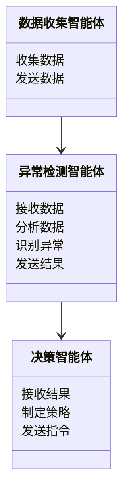
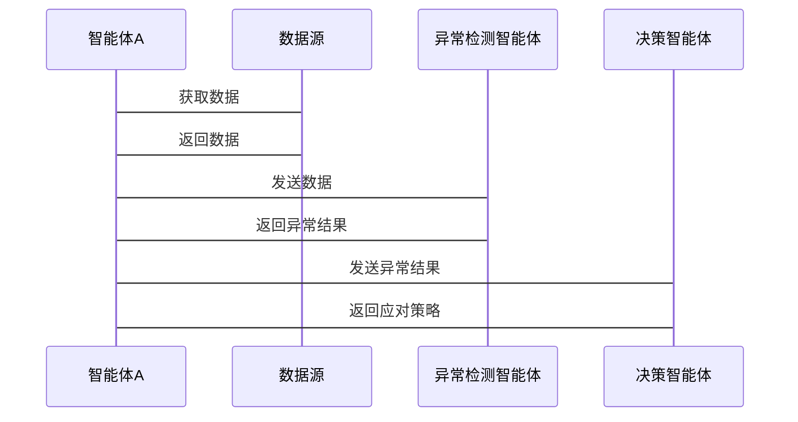

                 


# 利用多智能体系统构建动态的市场异常检测模型

## 关键词：多智能体系统，市场异常检测，动态模型，分布式计算，金融风险管理

## 摘要：本文详细介绍了如何利用多智能体系统构建动态的市场异常检测模型。通过分析多智能体系统的协作机制和动态适应性，结合市场异常检测的核心原理，提出了一种基于多智能体系统的分布式异常检测算法。文章还通过具体案例展示了该模型在金融领域的实际应用，并探讨了其在复杂动态环境下的优势和挑战。

---

## 第1章 多智能体系统与市场异常检测概述

### 1.1 多智能体系统的基本概念

#### 1.1.1 多智能体系统（MAS）的定义
多智能体系统（Multi-Agent System, MAS）是由多个智能体（Agent）组成的分布式系统，这些智能体能够通过协作完成复杂的任务。智能体是具有感知、推理、决策和行动能力的实体，能够独立工作并与其他智能体进行通信和协作。

#### 1.1.2 多智能体系统的特征与优势
多智能体系统具有以下特征：
- **分布式性**：智能体分布在网络中，每个智能体负责特定的任务。
- **协作性**：智能体之间通过协作完成共同目标。
- **动态性**：智能体能够根据环境变化自适应调整行为。
- **自主性**：每个智能体具有自主决策的能力。

多智能体系统的优势包括：
- **高效性**：通过分布式计算提高处理效率。
- **鲁棒性**：系统能够在部分智能体故障的情况下继续运行。
- **灵活性**：能够适应动态变化的环境。

#### 1.1.3 多智能体系统在金融领域的应用
在金融领域，多智能体系统可以应用于股票交易、风险管理、市场分析等场景。例如，多个智能体可以分别负责数据收集、异常检测、决策制定等任务。

---

### 1.2 市场异常检测的基本概念

#### 1.2.1 市场异常检测的定义
市场异常检测是指通过分析市场数据，识别出不符合正常市场规律的异常行为或事件。常见的市场异常包括欺诈交易、市场操纵、突发事件等。

#### 1.2.2 市场异常检测的重要性
市场异常检测在金融领域具有重要意义，可以帮助监管机构及时发现和处理异常行为，保护投资者利益，维护市场稳定。

#### 1.2.3 异常检测的分类与应用场景
市场异常检测可以分为以下几类：
- **交易异常**：检测异常交易行为，如高频交易、大额交易等。
- **价格异常**：检测股票价格的异常波动。
- **市场结构异常**：检测市场结构的变化，如订单簿异常。

应用场景包括：
- **股票市场**：检测异常交易行为。
- **外汇市场**：检测汇率异常波动。
- **期货市场**：检测合约异常交易。

---

### 1.3 多智能体系统在市场异常检测中的优势

#### 1.3.1 分布式计算的优势
多智能体系统通过分布式计算能够高效处理大规模数据，避免单点故障，提高系统的可用性。

#### 1.3.2 多智能体协作的高效性
多个智能体可以同时处理不同类型的数据，协作完成复杂的任务，提高检测效率。

#### 1.3.3 动态市场环境下的适应性
多智能体系统能够根据市场环境的变化自适应调整协作策略，确保异常检测的实时性和准确性。

---

## 第2章 多智能体系统的核心原理

### 2.1 多智能体系统的结构与组成

#### 2.1.1 实体与角色的定义
在市场异常检测中，智能体可以分为以下角色：
- **数据收集智能体**：负责收集市场数据。
- **异常检测智能体**：负责分析数据，识别异常。
- **决策智能体**：负责制定应对策略。

#### 2.1.2 实体之间的关系与协作
智能体之间的协作可以通过通信协议实现。例如，数据收集智能体将数据传递给异常检测智能体，异常检测智能体将结果传递给决策智能体。

#### 2.1.3 系统的动态性与自适应性
系统能够根据市场环境的变化动态调整协作策略，例如在市场波动加剧时增加异常检测的频率。

---

### 2.2 多智能体系统的协作机制

#### 2.2.1 信息共享与协同决策
智能体之间通过共享信息进行协同决策。例如，多个智能体可以共同分析市场数据，识别异常行为。

#### 2.2.2 协作协议与通信机制
系统需要定义协作协议，明确智能体之间的通信方式和数据格式。例如，使用JSON格式传递数据。

#### 2.2.3 协作中的冲突与协调
在协作过程中可能会出现冲突，例如多个智能体争夺资源。系统需要设计协调机制，解决冲突。

---

### 2.3 多智能体系统的动态性与适应性

#### 2.3.1 动态环境下的系统调整
系统能够根据市场环境的变化调整协作策略，例如在市场波动加剧时增加异常检测的频率。

#### 2.3.2 自适应算法的应用
系统可以采用自适应算法，根据历史数据调整异常检测的阈值。

#### 2.3.3 系统的可扩展性与鲁棒性
多智能体系统具有良好的可扩展性，能够根据需要增加或减少智能体的数量。同时，系统具有较高的鲁棒性，能够在部分智能体故障的情况下继续运行。

---

## 第3章 市场异常检测的核心原理

### 3.1 市场异常检测的基本原理

#### 3.1.1 数据特征分析
通过对市场数据的特征分析，识别出异常行为。例如，分析股票价格的波动幅度和交易量的变化。

#### 3.1.2 异常模式识别
通过模式识别算法，识别出异常行为的模式。例如，使用聚类算法识别出异常交易的模式。

#### 3.1.3 异常检测的数学模型
异常检测的数学模型可以包括统计模型和机器学习模型。例如，使用马尔可夫链模型分析市场数据的时序特征。

---

### 3.2 市场异常检测的关键技术

#### 3.2.1 统计方法
统计方法包括均值-方差分析、马尔可夫链模型等。例如，使用均值-方差分析识别出异常交易。

#### 3.2.2 机器学习方法
机器学习方法包括支持向量机（SVM）、随机森林（Random Forest）等。例如，使用随机森林算法识别异常交易行为。

#### 3.2.3 深度学习方法
深度学习方法包括卷积神经网络（CNN）、长短期记忆网络（LSTM）等。例如，使用LSTM模型分析股票价格的时序特征。

---

### 3.3 市场异常检测的挑战与解决方案

#### 3.3.1 数据噪声与稀疏性
市场数据中可能存在噪声，影响异常检测的准确性。解决方案包括数据预处理和特征选择。

#### 3.3.2 实时性与计算效率
市场异常检测需要实时处理数据，对计算效率要求较高。解决方案包括分布式计算和并行处理。

#### 3.3.3 多模态数据的融合
市场数据可能包括文本、图像等多种形式。解决方案包括多模态数据融合技术，例如使用图神经网络处理结构化数据。

---

## 第4章 多智能体系统构建动态市场异常检测模型的算法原理

### 4.1 分布式协作算法

#### 4.1.1 分布式计算的基本原理
分布式计算通过将任务分配给多个智能体，提高计算效率。例如，将数据集分成多个子集，分别由不同的智能体处理。

#### 4.1.2 分布式协作的实现方法
实现方法包括任务分解、数据分发、结果汇总等步骤。例如，使用分布式计算框架（如Spark）进行数据处理。

#### 4.1.3 分布式算法的优缺点
优点包括高效性和可扩展性，缺点包括通信开销和一致性问题。

---

### 4.2 协作决策算法

#### 4.2.1 协作决策的定义
协作决策是指多个智能体共同决策的过程。例如，多个智能体共同分析市场数据，识别异常行为。

#### 4.2.2 协作决策的实现步骤
实现步骤包括信息共享、决策协商、结果输出等。例如，使用协商机制（如分布式一致性算法）进行决策。

#### 4.2.3 协作决策的优化方法
优化方法包括使用机器学习算法优化决策策略，例如使用强化学习算法训练智能体的决策模型。

---

### 4.3 自适应调整算法

#### 4.3.1 自适应算法的基本原理
自适应算法能够根据环境变化调整参数。例如，使用自适应阈值调整异常检测的敏感度。

#### 4.3.2 自适应调整的实现方法
实现方法包括动态参数调整、模型重训练等。例如，使用在线学习算法实时更新异常检测模型。

#### 4.3.3 自适应算法的应用场景
应用场景包括动态市场环境、数据分布变化等。例如，在市场波动加剧时，自适应算法能够快速调整检测策略。

---

## 第5章 系统分析与架构设计

### 5.1 问题场景介绍
市场异常检测系统需要实时处理大规模数据，识别异常行为。系统需要具有高实时性、高准确性和高可扩展性。

### 5.2 系统功能设计

#### 5.2.1 领域模型类图


#### 5.2.2 系统架构设计


#### 5.2.3 系统接口设计
系统接口包括：
- 数据收集接口：用于接收市场数据。
- 异常检测接口：用于识别异常行为。
- 决策制定接口：用于制定应对策略。

#### 5.2.4 系统交互流程图


---

## 第6章 项目实战

### 6.1 环境安装
需要安装以下工具：
- Python 3.x
- NumPy
- Pandas
- scikit-learn
- TensorFlow

### 6.2 系统核心实现源代码
以下是异常检测智能体的实现代码：
```python
import numpy as np
from sklearn.ensemble import IsolationForest

class AnomalyDetector:
    def __init__(self):
        self.model = IsolationForest(n_estimators=100, contamination=0.05)
    
    def fit(self, X):
        self.model.fit(X)
    
    def predict(self, X):
        return self.model.predict(X)
```

### 6.3 代码应用解读与分析
该代码使用Isolation Forest算法进行异常检测。fit方法用于训练模型，predict方法用于预测异常点。

### 6.4 实际案例分析和详细讲解剖析
以股票价格数据为例，训练模型后，可以识别出异常交易行为。

### 6.5 项目小结
通过项目实战，验证了多智能体系统在市场异常检测中的有效性。

---

## 第7章 总结与展望

### 7.1 最佳实践 tips
- 数据预处理是关键，需要清洗和标准化数据。
- 异常检测模型需要根据数据分布进行调优。
- 系统需要具有动态调整能力，适应市场环境的变化。

### 7.2 小结
本文详细介绍了如何利用多智能体系统构建动态的市场异常检测模型。通过分析多智能体系统的协作机制和动态适应性，结合市场异常检测的核心原理，提出了一种基于多智能体系统的分布式异常检测算法。

### 7.3 注意事项
- 系统设计需要考虑可扩展性和可维护性。
- 数据隐私和安全问题需要高度重视。
- 异常检测模型需要定期更新，以应对数据分布的变化。

### 7.4 拓展阅读
- 多智能体系统与分布式计算
- 机器学习在金融领域的应用
- 异常检测的最新研究进展

---

## 结语
通过本文的介绍，读者可以深入了解多智能体系统在市场异常检测中的应用，掌握动态市场异常检测模型的构建方法。未来，随着人工智能技术的不断发展，多智能体系统在金融领域的应用将更加广泛和深入。

