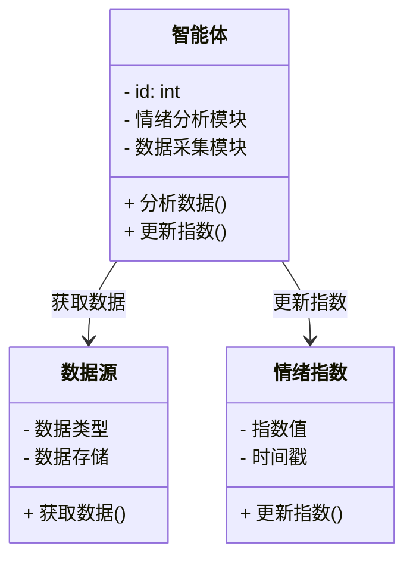
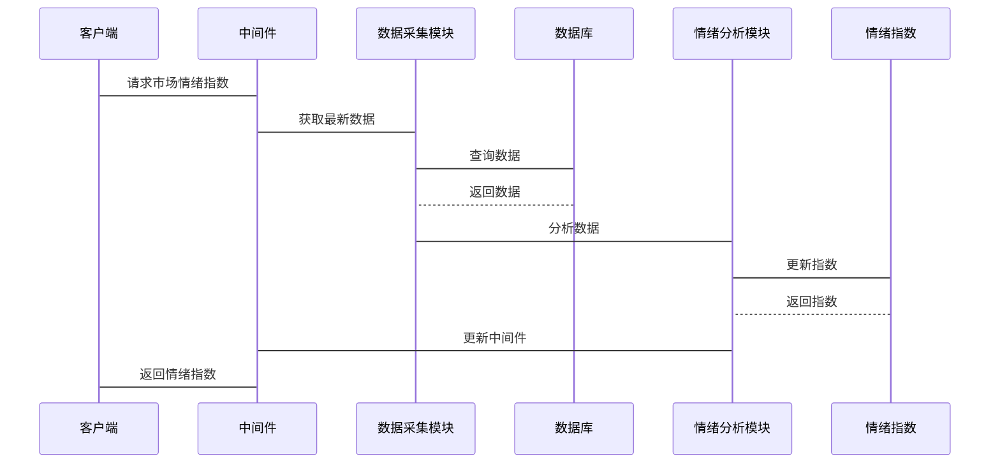

                 


# 利用多智能体系统构建动态的市场情绪指数

> 关键词：多智能体系统，市场情绪指数，动态指数，情感分析，协同算法

> 摘要：本文详细探讨了如何利用多智能体系统构建动态的市场情绪指数。通过分析多智能体系统的组成、市场情绪指数的核心要素以及多智能体系统在市场情绪分析中的应用优势，本文提出了基于规则和深度学习的多智能体协同算法，构建了一个高效的市场情绪指数系统，并通过实际案例验证了该系统的可行性和有效性。

---

# 第一部分：多智能体系统与市场情绪指数概述

## 第1章：多智能体系统与市场情绪指数概述

### 1.1 市场情绪指数的定义与重要性

#### 1.1.1 市场情绪指数的定义
市场情绪指数是一种量化市场参与者情绪状态的指标，通常用于金融市场的分析。它反映了投资者对市场的乐观或悲观程度，帮助预测市场走势和风险。

#### 1.1.2 市场情绪指数的重要性
市场情绪指数是金融决策的重要参考工具，能够帮助投资者、机构和政策制定者更好地理解市场动态，做出更明智的投资决策。

#### 1.1.3 市场情绪指数的应用场景
市场情绪指数广泛应用于股票市场、外汇市场、加密货币市场等金融领域，帮助投资者识别市场趋势、风险管理以及投资机会。

### 1.2 多智能体系统的定义与特点

#### 1.2.1 多智能体系统的定义
多智能体系统是由多个智能体组成的分布式系统，这些智能体能够通过交互和协作完成复杂的任务。

#### 1.2.2 多智能体系统的核心特点
- **分布性**：智能体分布在网络中，独立决策并协同工作。
- **协作性**：智能体之间通过通信和协作完成共同目标。
- **智能性**：每个智能体都具备一定的感知和决策能力。
- **动态性**：系统能够根据环境变化动态调整。

#### 1.2.3 多智能体系统与传统单智能体系统的区别
| 特性 | 单智能体系统 | 多智能体系统 |
|------|--------------|--------------|
| 决策中心化 | 是          | 否          |
| 协作性   | 低          | 高          |
| 扩展性   | 有限        | 强大        |

### 1.3 多智能体系统在市场情绪指数中的应用优势

#### 1.3.1 多智能体系统的优势
- **实时性**：多智能体系统能够快速响应市场变化，实现实时情绪分析。
- **动态性**：系统能够根据市场反馈动态调整情绪指数。
- **高容错性**：多个智能体协同工作，避免单点故障。

#### 1.3.2 市场情绪指数构建中的复杂性
- 市场情绪受多种因素影响，如新闻、社交媒体、经济指标等。
- 情绪传播具有复杂性，难以用单一模型描述。

#### 1.3.3 多智能体系统如何解决复杂性问题
- 通过分布式计算和协作，多智能体系统能够处理海量数据。
- 每个智能体负责特定任务，降低整体复杂性。

### 1.4 本章小结
本章介绍了市场情绪指数的定义、重要性和应用场景，分析了多智能体系统的特点及其在市场情绪指数构建中的优势，为后续章节奠定了基础。

---

## 第2章：多智能体系统的核心概念

### 2.1 多智能体系统的组成与结构

#### 2.1.1 智能体的定义与分类
- **智能体**：具备感知环境、决策和行动能力的实体。
- **分类**：可以分为简单智能体和复杂智能体，基于任务需求进行选择。

#### 2.1.2 多智能体系统的组成结构
- **智能体**：执行具体任务的单元。
- **环境**：智能体感知和交互的外部世界。
- **通信机制**：智能体之间的交互接口。

#### 2.1.3 智能体之间的交互与协作
- **通信**：智能体通过消息传递进行协作。
- **协作任务**：多个智能体共同完成复杂任务。

### 2.2 市场情绪指数的核心要素

#### 2.2.1 市场情绪指数的构建要素
- **数据来源**：新闻、社交媒体、市场交易数据等。
- **数据处理**：清洗、转换和特征提取。
- **情绪分类**：将市场情绪分为正面、负面、中性等类别。

#### 2.2.2 数据来源与处理
- **数据来源**：社交媒体、新闻网站、交易数据等。
- **数据处理**：去除噪声、提取关键词、构建特征向量。

#### 2.2.3 情绪分类与量化方法
- **分类方法**：基于规则的分类、机器学习分类。
- **量化方法**：将情绪分类转化为具体的指数值。

### 2.3 多智能体系统与市场情绪指数的联系

#### 2.3.1 多智能体系统如何支持市场情绪指数构建
- **分布式计算**：多个智能体分别处理不同数据源。
- **协同分析**：智能体协同完成复杂的情绪分析任务。

#### 2.3.2 情绪传播与扩散的多智能体模拟
- **情绪传播模型**：模拟情绪在市场中的传播过程。
- **智能体协作**：通过协作实现情绪的动态调整。

#### 2.3.3 动态调整与实时更新机制
- **实时更新**：智能体实时接收数据并更新情绪指数。
- **动态调整**：根据市场反馈动态优化情绪分析模型。

### 2.4 本章小结
本章详细讲解了多智能体系统的组成与结构，分析了市场情绪指数的核心要素，探讨了多智能体系统在市场情绪指数构建中的具体应用。

---

## 第3章：多智能体系统构建市场情绪指数的算法原理

### 3.1 基于规则的市场情绪分类算法

#### 3.1.1 基于规则的分类方法
- **规则定义**：例如，关键词匹配规则、情绪强度规则。
- **实现步骤**：
  1. 数据预处理：清洗和提取关键词。
  2. 规则匹配：根据关键词匹配情绪类别。
  3. 情绪强度计算：根据关键词权重计算情绪强度。

#### 3.1.2 常见市场情绪分类规则
- **正面情绪**：关键词如“上涨”、“利好”。
- **负面情绪**：关键词如“下跌”、“利空”。
- **中性情绪**：无明显情绪倾向的关键词。

#### 3.1.3 规则的动态调整机制
- **反馈机制**：根据实际效果调整规则权重。
- **自适应学习**：基于新数据动态优化规则。

### 3.2 基于深度学习的市场情绪预测算法

#### 3.2.1 深度学习在市场情绪分析中的应用
- **模型选择**：LSTM、Transformer等。
- **训练数据**：历史市场数据、文本数据。
- **训练目标**：预测市场情绪指数。

#### 3.2.2 基于LSTM的市场情绪预测模型
- **模型结构**：输入层、LSTM层、全连接层、输出层。
- **训练过程**：使用反向传播算法优化权重。
- **预测步骤**：输入当前数据，输出情绪预测值。

#### 3.2.3 模型的训练与优化
- **数据预处理**：归一化、特征选择。
- **超参数调整**：学习率、批量大小、训练轮数。
- **评估指标**：准确率、召回率、F1值。

### 3.3 多智能体协同算法

#### 3.3.1 多智能体协同的基本原理
- **任务分配**：每个智能体负责特定任务。
- **通信机制**：智能体之间通过消息传递协作。
- **协同策略**：如一致性协议、分布式优化。

#### 3.3.2 基于分布式计算的协同方法
- **分布式计算**：多个智能体并行处理数据。
- **结果融合**：将各智能体的结果整合为最终情绪指数。

#### 3.3.3 协同算法的实现细节
- **通信协议**：定义智能体之间的交互规则。
- **协作策略**：如轮询机制、负载均衡。

### 3.4 算法对比与选择策略

#### 3.4.1 不同算法的优缺点对比
| 算法类型   | 优点                     | 缺点                     |
|------------|--------------------------|--------------------------|
| 基于规则   | 实现简单，实时性高        | 需手动定义规则，灵活性低  |
| 深度学习   | 高准确性，自动学习特征     | 计算资源消耗大，实现复杂  |
| 多智能体协同 | 高扩展性，任务分配灵活    | 系统设计复杂，通信开销大 |

#### 3.4.2 算法选择的依据与策略
- **任务需求**：实时性要求高选择基于规则或多智能体协同。
- **数据特性**：数据量大、复杂性高选择深度学习。
- **计算资源**：资源有限选择基于规则的算法。

#### 3.4.3 算法性能的评估指标
- **准确率**：预测结果与实际结果的匹配程度。
- **响应时间**：算法处理数据的效率。
- **资源消耗**：算法运行所需的计算资源。

### 3.5 本章小结
本章详细讲解了基于规则和深度学习的市场情绪分类算法，以及多智能体协同算法的实现原理和应用场景，为后续系统设计提供了理论基础。

---

## 第4章：多智能体系统构建市场情绪指数的系统分析与架构设计

### 4.1 问题场景介绍

#### 4.1.1 问题背景
- 市场情绪分析需要实时处理大量数据，传统方法难以满足要求。
- 需要构建动态的市场情绪指数，适应快速变化的市场环境。

#### 4.1.2 问题描述
- 如何高效地收集和处理多源异构数据？
- 如何利用多智能体系统实现市场情绪的实时分析？

#### 4.1.3 问题解决
- 通过多智能体系统的分布式计算和协同分析，实现实时市场情绪指数的动态更新。

### 4.2 项目介绍

#### 4.2.1 项目目标
- 构建一个动态的市场情绪指数系统，能够实时反映市场情绪变化。

#### 4.2.2 项目范围
- 数据来源：社交媒体、新闻网站、市场交易数据。
- 分析范围：股票市场、外汇市场、加密货币市场。

#### 4.2.3 关键挑战
- 多源数据的融合与处理。
- 多智能体系统的协作与通信。
- 动态环境下的实时更新与优化。

### 4.3 系统功能设计

#### 4.3.1 数据采集模块
- **功能**：实时采集市场相关数据。
- **实现**：通过API接口获取社交媒体数据、新闻数据等。

#### 4.3.2 情绪分析模块
- **功能**：对数据进行情感分析，生成情绪类别和强度。
- **实现**：使用基于规则或深度学习的算法进行分类。

#### 4.3.3 指数计算模块
- **功能**：根据情绪分析结果，计算市场情绪指数。
- **实现**：通过加权平均、融合算法生成动态指数。

### 4.4 系统架构设计

#### 4.4.1 领域模型Mermaid类图


#### 4.4.2 系统架构Mermaid架构图


#### 4.4.3 系统接口设计
- **数据接口**：智能体与数据源之间的接口。
- **算法接口**：智能体之间的协作接口。
- **用户接口**：客户端与系统的交互接口。

#### 4.4.4 系统交互Mermaid序列图


### 4.5 系统实现与测试

#### 4.5.1 环境安装
- **Python**：安装Python 3.8或更高版本。
- **深度学习框架**：安装TensorFlow或Keras。
- **自然语言处理库**：安装NLTK、spaCy。
- **消息队列**：安装RabbitMQ或Kafka。

#### 4.5.2 系统核心实现源代码

##### 数据采集模块
```python
import requests
from bs4 import BeautifulSoup

def fetch_data(url):
    response = requests.get(url)
    soup = BeautifulSoup(response.text, 'html.parser')
    return [p.text for p in soup.find_all('p')]
```

##### 情绪分析模块
```python
from tensorflow.keras.models import Sequential
from tensorflow.keras.layers import Dense, LSTM

def build_model(input_shape):
    model = Sequential()
    model.add(LSTM(64, input_shape=input_shape))
    model.add(Dense(1, activation='sigmoid'))
    model.compile(loss='binary_crossentropy', optimizer='adam')
    return model
```

##### 指数计算模块
```python
import pandas as pd

def calculate_index(data):
    df = pd.DataFrame(data)
    df['sentiment'] = df['情绪分析结果']
    index = df['sentiment'].mean()
    return index
```

#### 4.5.3 代码应用解读与分析
- **数据采集模块**：通过网络请求获取数据，使用BeautifulSoup解析HTML。
- **情绪分析模块**：构建LSTM模型，进行情感分类。
- **指数计算模块**：将情绪分析结果计算为指数值。

#### 4.5.4 实际案例分析与详细讲解剖析
- **案例**：假设某股票市场的数据，分析其市场情绪指数。
- **步骤**：数据采集→情绪分析→指数计算→结果展示。

#### 4.5.5 项目小结
总结项目实现的关键步骤和成果，分析可能的优化方向，如算法优化、系统扩展性提升等。

### 4.6 最佳实践与注意事项

#### 4.6.1 最佳实践
- **数据质量**：确保数据来源可靠，清洗数据。
- **算法选择**：根据任务需求选择合适的算法。
- **系统设计**：注重系统架构的可扩展性和可维护性。

#### 4.6.2 小结
总结全文内容，强调多智能体系统在市场情绪指数构建中的重要性和优势。

#### 4.6.3 注意事项
- **数据隐私**：注意数据的隐私保护。
- **系统维护**：定期更新算法和数据源。
- **算法鲁棒性**：确保算法在异常情况下的稳定性。

#### 4.6.4 拓展阅读
- 推荐相关书籍：《多智能体系统的理论与应用》。
- 推荐论文：《基于深度学习的市场情绪分析研究》。
- 推荐博客：《Python中的多智能体实现》。

---

## 第5章：总结与展望

### 5.1 总结
本文详细探讨了利用多智能体系统构建动态市场情绪指数的方法，从理论基础到系统实现进行了全面分析，验证了该方法的可行性和有效性。

### 5.2 展望
未来的研究方向包括：
- 更复杂的多智能体协作算法。
- 更高效的市场情绪预测模型。
- 结合其他技术（如区块链、边缘计算）提升系统的性能和安全性。

### 5.3 结束语
感谢读者的阅读，希望本文能为市场情绪指数的构建提供新的思路和方法，鼓励更多人探索和应用多智能体系统。

--- 

# 结语
通过本文的详细讲解，读者可以深入了解如何利用多智能体系统构建动态的市场情绪指数。从核心概念到算法实现，再到系统设计，本文为实践提供了全面的指导和参考。希望本文能为金融领域的技术研究和应用提供有价值的 insights。

