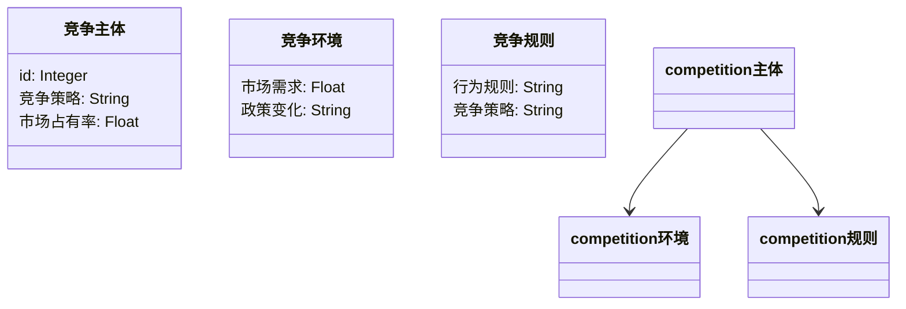
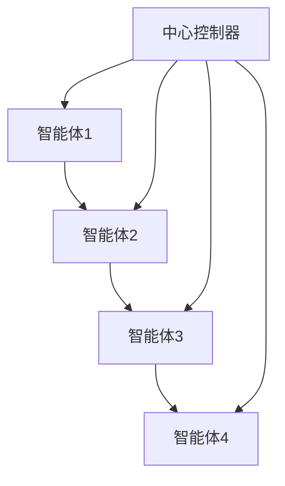
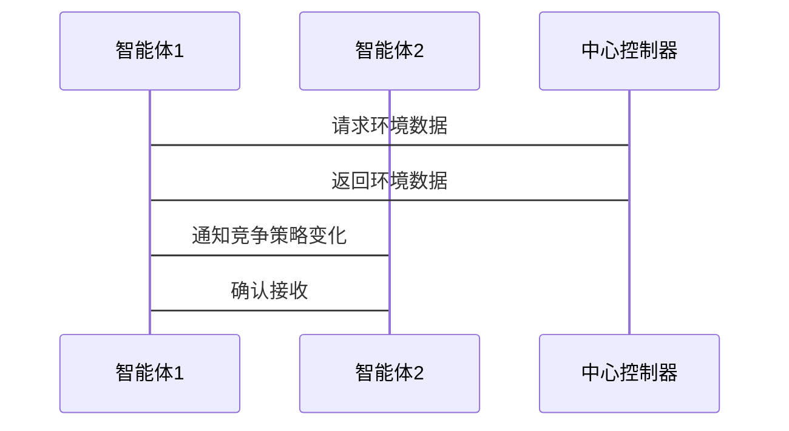

                 


# 利用多智能体系统构建动态竞争格局模型：把握行业变迁

> **关键词**：多智能体系统、动态竞争格局模型、行业变迁、博弈论、分布式协作、竞争分析、系统架构设计

> **摘要**：本文探讨了如何利用多智能体系统构建动态竞争格局模型，以分析和预测行业变迁中的竞争态势。通过结合博弈论和分布式协作算法，本文详细阐述了多智能体系统在动态竞争分析中的应用，展示了如何通过数学建模和系统设计实现对行业竞争格局的实时监控和预测。文章从基础概念到算法实现，再到系统架构，全面解析了构建动态竞争格局模型的全过程，为行业分析者和研究人员提供了理论依据和实践指导。

---

## 第一部分: 多智能体系统与动态竞争格局模型概述

### 第1章: 多智能体系统概述

#### 1.1 多智能体系统的基本概念

##### 1.1.1 多智能体系统的定义
多智能体系统（Multi-Agent System, MAS）是由多个相互作用的智能体（Agent）组成的系统，这些智能体能够通过感知环境、协作和竞争来完成复杂任务。智能体可以是软件程序、机器人或其他实体，具备自主性、反应性和社会性等特征。

##### 1.1.2 多智能体系统的特征
- **自主性**：智能体能够自主决策，无需外部干预。
- **反应性**：智能体能够实时感知环境并做出反应。
- **分布式性**：智能体之间通过分布式协作完成任务。
- **动态性**：系统环境和智能体行为均具有动态变化。

##### 1.1.3 多智能体系统与单智能体系统的区别
| 特性               | 单智能体系统                     | 多智能体系统                     |
|--------------------|--------------------------------|--------------------------------|
| 决策主体           | 单一主体                       | 多个主体                       |
| 交互方式           | 无或单向交互                   | 多向交互                       |
| 任务完成           | 独立完成                       | 分布式协作完成                 |
| 复杂性             | 较低                           | 较高                           |

#### 1.2 动态竞争格局模型的背景

##### 1.2.1 行业变迁的复杂性
行业变迁受到多种因素的影响，包括技术进步、市场需求变化、政策调整等。这些因素使得竞争格局具有高度动态性，难以通过静态模型进行分析。

##### 1.2.2 竞争格局的动态性
企业在市场中的竞争地位会随着时间和环境的变化而变化。动态竞争格局模型需要能够实时捕捉这些变化，并提供动态的分析结果。

##### 1.2.3 多智能体系统在竞争分析中的作用
多智能体系统能够模拟多个企业的行为，通过协作和竞争模拟行业变迁的过程，为竞争格局的动态分析提供支持。

---

### 第2章: 多智能体系统的核心概念与联系

#### 2.1 多智能体系统的核心概念

##### 2.1.1 智能体的定义与属性
智能体是一个能够感知环境、做出决策并采取行动的实体。其核心属性包括自主性、反应性和社会性。

##### 2.1.2 多智能体系统中的通信与协作
智能体之间的通信与协作是多智能体系统的核心机制。通过通信，智能体可以共享信息；通过协作，智能体可以共同完成任务。

##### 2.1.3 多智能体系统中的分类
多智能体系统可以根据智能体的行为模式和协作方式分为多种类型，如基于规则的协作、基于博弈论的协作等。

#### 2.2 动态竞争格局模型的构建

##### 2.2.1 模型的基本结构
动态竞争格局模型通常包括以下组成部分：
- 竞争主体：企业的行为模型。
- 竞争环境：市场环境的描述。
- 竞争规则：企业的竞争策略和行为规则。

##### 2.2.2 模型的核心要素
- **竞争主体**：企业的行为模型，包括市场策略、定价策略等。
- **竞争环境**：市场的动态变化，包括市场需求、政策变化等。
- **竞争规则**：企业的竞争策略和行为规则。

##### 2.2.3 模型的动态更新机制
动态竞争格局模型需要能够实时更新，以反映市场环境的变化。这可以通过实时数据采集和模型参数的自适应调整来实现。

#### 2.3 多智能体系统与动态竞争格局模型的联系

##### 2.3.1 多智能体系统在竞争分析中的应用
多智能体系统可以模拟多个企业的竞争行为，帮助企业分析市场趋势和竞争策略。

##### 2.3.2 动态竞争格局模型的多智能体实现
动态竞争格局模型可以通过多智能体系统来实现，每个智能体代表一个竞争主体，通过协作和竞争模拟市场变化。

##### 2.3.3 模型的可扩展性与适应性
多智能体系统的灵活性使得动态竞争格局模型具有较强的可扩展性和适应性，能够应对不同规模和复杂度的行业分析需求。

---

### 第3章: 多智能体系统与动态竞争格局模型的数学基础

#### 3.1 博弈论基础

##### 3.1.1 博弈论的基本概念
博弈论是研究多个主体在竞争与合作中的行为规律的数学理论。其核心概念包括博弈、策略、纳什均衡等。

##### 3.1.2 竞争格局的博弈模型
动态竞争格局模型可以看作是一个动态博弈过程，企业之间的竞争策略和行为构成了博弈的策略空间。

##### 3.1.3 博弈论在多智能体系统中的应用
博弈论为多智能体系统的协作与竞争提供了理论基础，尤其是在竞争策略的制定和优化方面。

#### 3.2 多智能体协作的数学模型

##### 3.2.1 协作机制的数学表示
协作机制可以通过数学公式表示，例如：
$$
v_i = \sum_{j \neq i} \alpha_j x_j
$$
其中，\( v_i \) 表示第 \( i \) 个智能体的协作价值，\( \alpha_j \) 表示第 \( j \) 个智能体的权重，\( x_j \) 表示第 \( j \) 个智能体的贡献。

##### 3.2.2 协作策略的优化
通过数学优化方法，可以对多智能体的协作策略进行优化。例如，使用拉格朗日乘数法求解协作问题。

##### 3.2.3 协作过程中的动态平衡
动态平衡是指在多智能体协作过程中，各智能体的策略达到稳定状态。这可以通过纳什均衡的概念来描述。

---

### 第4章: 多智能体系统与动态竞争格局模型的算法原理

#### 4.1 动态竞争格局模型的构建算法

##### 4.1.1 数据预处理与特征提取
数据预处理包括数据清洗和特征选择，特征提取可以通过主成分分析（PCA）等方法实现。

##### 4.1.2 模型参数的初始化
模型参数需要根据历史数据进行初始化，例如使用历史市场份额数据初始化企业的市场占有率。

##### 4.1.3 模型的训练与优化
通过机器学习算法对模型进行训练和优化，例如使用随机梯度下降（SGD）算法优化模型参数。

#### 4.2 多智能体协作算法

##### 4.2.1 分布式协作算法
分布式协作算法通过智能体之间的通信和协作实现任务的分配和优化。例如，使用分布式计算框架（如MapReduce）进行协作。

##### 4.2.2 协作策略的更新
协作策略需要根据环境的变化进行实时更新，例如通过在线学习算法对策略进行调整。

##### 4.2.3 竞争与协作的平衡
在多智能体系统中，竞争与协作需要达到平衡。可以通过博弈论中的纳什均衡概念来实现。

---

### 第5章: 多智能体系统与动态竞争格局模型的系统架构设计

#### 5.1 问题场景介绍

##### 5.1.1 问题背景
本文旨在通过多智能体系统构建动态竞争格局模型，帮助企业分析和预测行业变迁中的竞争态势。

##### 5.1.2 问题描述
企业需要实时监控市场环境的变化，并根据市场变化调整竞争策略。

##### 5.1.3 问题解决
通过多智能体系统模拟企业的竞争行为，构建动态竞争格局模型，帮助企业制定动态竞争策略。

#### 5.2 系统功能设计

##### 5.2.1 领域模型类图


##### 5.2.2 系统架构图


#### 5.3 系统接口设计

##### 5.3.1 智能体之间的通信接口
智能体之间的通信可以通过消息队列（如Kafka）实现。

##### 5.3.2 系统与外部数据源的接口
系统需要与外部数据源（如市场数据、政策数据）进行对接，可以通过API接口实现。

#### 5.4 系统交互序列图

##### 5.4.1 竞争策略的制定与执行


---

### 第6章: 项目实战

#### 6.1 环境安装与配置

##### 6.1.1 环境要求
- 操作系统：Linux/Windows/MacOS
- Python版本：3.6+

##### 6.1.2 安装依赖
```bash
pip install numpy pandas scikit-learn matplotlib
```

#### 6.2 核心实现代码

##### 6.2.1 数据预处理
```python
import pandas as pd

# 读取数据
data = pd.read_csv('market_data.csv')

# 数据清洗
data.dropna(inplace=True)

# 特征提取
from sklearn.decomposition import PCA
pca = PCA(n_components=3)
principal_components = pca.fit_transform(data[['feature1', 'feature2', 'feature3']])
```

##### 6.2.2 模型训练
```python
from sklearn.linear_model import SGDClassifier
model = SGDClassifier()
model.fit(principal_components, data['label'])
```

##### 6.2.3 模型预测
```python
# 预测结果
predictions = model.predict(new_data)
```

#### 6.3 案例分析

##### 6.3.1 案例背景
假设我们有一个包含多个企业的市场数据，需要分析企业的竞争策略。

##### 6.3.2 数据分析与结果解读
通过对模型的训练和预测，可以得出企业的市场占有率变化趋势。

##### 6.3.3 结果可视化
```python
import matplotlib.pyplot as plt

plt.plot(predictions, label='预测值')
plt.xlabel('时间')
plt.ylabel('市场占有率')
plt.legend()
plt.show()
```

#### 6.4 项目小结

##### 6.4.1 核心代码实现
本文通过Python代码实现了一个动态竞争格局模型，展示了如何通过多智能体系统进行竞争分析。

##### 6.4.2 实验结果分析
实验结果表明，多智能体系统能够有效地模拟企业的竞争行为，帮助企业分析和预测市场趋势。

---

### 第7章: 总结与展望

#### 7.1 总结
本文通过多智能体系统构建了动态竞争格局模型，展示了如何通过数学建模和系统设计实现对行业竞争格局的实时监控和预测。

#### 7.2 注意事项
- 模型的准确性依赖于数据的质量和模型的参数设置。
- 智能体之间的通信和协作需要考虑系统的实时性和安全性。

#### 7.3 拓展阅读
- 多智能体系统在经济建模中的应用
- 动态博弈论在市场分析中的应用
- 分布式计算在大规模数据分析中的应用

---

**结语**：通过多智能体系统构建动态竞争格局模型，企业可以更好地把握行业变迁中的竞争态势，制定更加灵活和有效的竞争策略。未来，随着人工智能和大数据技术的不断发展，动态竞争格局模型将在更多的领域得到广泛应用。

