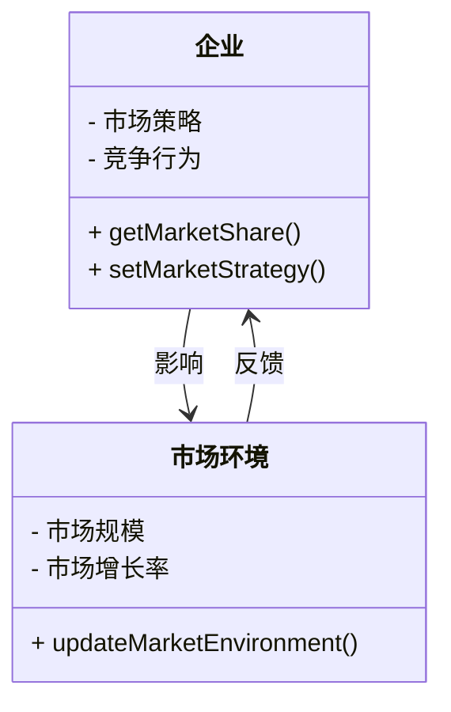

                 


# 利用多智能体系统构建动态行业生命周期模型

> 关键词：多智能体系统，动态行业生命周期，建模，协作机制，复杂系统

> 摘要：本文深入探讨了利用多智能体系统构建动态行业生命周期模型的方法。通过分析多智能体系统的原理、动态行业生命周期的特点以及两者结合的优势，提出了一种基于多智能体系统的建模方法。本文详细介绍了多智能体系统的协作机制、动态模型更新算法、数学模型与公式，并通过实际案例展示了如何在复杂系统中应用这些方法。最后，本文总结了构建动态行业生命周期模型的最佳实践和未来研究方向。

---

# 第一部分：多智能体系统与动态行业生命周期模型基础

## 第1章：多智能体系统与动态行业生命周期模型概述

### 1.1 多智能体系统的基本概念

#### 1.1.1 多智能体系统的定义
多智能体系统（Multi-Agent System, MAS）是由多个智能体（Agent）组成的复杂系统。智能体是具有感知、推理、规划和行动能力的实体，能够独立执行任务并与其他智能体或环境进行交互。

#### 1.1.2 多智能体系统的特点
- **分布式性**：智能体分布在不同的位置，具有独立性。
- **协作性**：智能体通过协作完成共同目标。
- **动态性**：系统环境和智能体状态不断变化。
- **自主性**：智能体能够自主决策和行动。

#### 1.1.3 多智能体系统的分类
- **基于任务的分类**：根据智能体的任务类型进行分类，如监控型、协调型等。
- **基于智能体结构的分类**：分为简单反应式、基于模型的反射式、目标驱动式等。

### 1.2 行业生命周期模型的定义与特点

#### 1.2.1 行业生命周期的定义
行业生命周期是指一个行业从初始阶段到成熟阶段，再到衰退阶段的动态演变过程。它反映了行业内企业数量、市场份额、技术创新等方面的变动。

#### 1.2.2 行业生命周期的阶段划分
- **引入阶段**：行业刚刚出现，企业数量较少，技术创新迅速。
- **成长阶段**：行业快速发展，企业数量增加，竞争加剧。
- **成熟阶段**：行业趋于稳定，技术创新放缓，竞争激烈。
- **衰退阶段**：行业需求下降，企业数量减少，技术创新停滞。

#### 1.2.3 动态行业生命周期的特点
- **动态性**：行业内部和外部环境不断变化。
- **复杂性**：涉及多个利益相关者和复杂的交互关系。
- **不确定性**：行业未来的发展存在不确定性。

### 1.3 多智能体系统在行业生命周期建模中的作用

#### 1.3.1 多智能体系统的优势
- **分布式计算能力**：能够处理大规模复杂问题。
- **协作能力**：智能体之间的协作能够模拟行业内部的复杂关系。
- **适应性**：能够应对动态变化的行业环境。

#### 1.3.2 多智能体系统在动态建模中的应用
- **模拟行业演变**：通过智能体的协作模拟行业生命周期的动态变化。
- **预测行业趋势**：利用多智能体系统预测行业未来的发展趋势。
- **优化行业策略**：通过智能体的协作优化企业的战略决策。

#### 1.3.3 行业生命周期模型的动态性与复杂性
- **动态性**：行业生命周期的阶段变化需要实时跟踪和建模。
- **复杂性**：涉及多个利益相关者和复杂的交互关系，需要多智能体系统进行建模。

### 1.4 本章小结
本章介绍了多智能体系统的基本概念和特点，并详细讨论了行业生命周期模型的定义与特点。通过分析多智能体系统在行业生命周期建模中的作用，为后续章节的深入讨论奠定了基础。

---

## 第2章：多智能体系统的核心概念与原理

### 2.1 多智能体系统的组成要素

#### 2.1.1 智能体的定义与属性
智能体是一种具有感知、推理、规划和行动能力的实体。智能体的属性包括：
- **自主性**：能够自主决策和行动。
- **反应性**：能够感知环境并做出实时反应。
- **协作性**：能够与其他智能体协作完成共同目标。
- **学习能力**：能够通过经验改进自身的性能。

#### 2.1.2 智能体之间的交互关系
智能体之间的交互关系包括：
- **协作关系**：智能体之间通过协作完成共同目标。
- **竞争关系**：智能体之间存在竞争关系，争夺有限资源。
- **中立关系**：智能体之间既不协作也不竞争，仅进行信息交换。

#### 2.1.3 环境与智能体的相互作用
环境是智能体所处的外部世界，包括物理环境和社会环境。智能体通过感知环境获取信息，通过行动改变环境。环境的变化会影响智能体的行为，而智能体的行为也会反过来影响环境。

### 2.2 多智能体系统的协作机制

#### 2.2.1 协作的基本概念
协作是指多个智能体为了完成共同目标而进行的合作。协作机制是智能体之间协作的规则和方法。

#### 2.2.2 常见的协作方法
- **基于任务的协作**：根据任务分解智能体的职责。
- **基于角色的协作**：根据角色分配智能体的职责。
- **基于规则的协作**：通过预定义的规则进行协作。

#### 2.2.3 协作机制的选择与优化
协作机制的选择取决于任务的要求、智能体的数量和环境的复杂性。优化协作机制可以通过改进通信协议、增加智能体的自主性等方式实现。

### 2.3 多智能体系统的通信协议

#### 2.3.1 通信协议的定义
通信协议是智能体之间进行信息交换的规则和格式。通信协议决定了智能体如何发送和接收信息。

#### 2.3.2 常见的通信协议类型
- **基于消息的通信**：智能体通过发送消息进行信息交换。
- **基于订阅的通信**：智能体通过订阅特定主题接收信息。
- **基于服务的通信**：智能体通过调用服务进行信息交换。

#### 2.3.3 通信协议的选择与实现
通信协议的选择取决于系统的实时性、可靠性和可扩展性。实现通信协议需要考虑信息的格式、传输方式和安全性。

### 2.4 本章小结
本章详细介绍了多智能体系统的组成要素、协作机制和通信协议。这些内容为后续章节构建动态行业生命周期模型提供了理论基础。

---

## 第3章：行业生命周期模型的动态性与复杂性分析

### 3.1 行业生命周期的动态特征

#### 3.1.1 生命周期阶段的动态变化
行业生命周期的每个阶段都伴随着动态变化，如引入阶段的技术创新、成长阶段的市场竞争、成熟阶段的市场饱和和衰退阶段的需求下降。

#### 3.1.2 行业环境的动态影响
行业外部环境的变化，如政策、经济、技术和社会环境的变化，会影响行业的生命周期。

#### 3.1.3 行业内部因素的动态变化
行业内部因素的变化，如企业数量、市场份额、技术创新和竞争强度，也会影响行业的生命周期。

### 3.2 行业生命周期模型的复杂性

#### 3.2.1 模型的复杂性来源
- **多利益相关者**：行业涉及多个利益相关者，包括企业、消费者、政府和行业协会。
- **复杂的交互关系**：行业内企业之间的竞争与合作关系复杂。
- **动态变化**：行业生命周期的每个阶段都伴随着动态变化。

#### 3.2.2 复杂性对建模的影响
复杂性使得行业生命周期模型的构建和维护更加困难，需要考虑更多的变量和关系。

#### 3.2.3 简化复杂性的方法
- **模型简化**：通过简化模型的变量和关系，降低模型的复杂性。
- **分层建模**：将模型分为多个层次，分别处理不同层次的问题。
- **模块化设计**：将模型分解为多个模块，分别处理不同的功能。

### 3.3 多智能体系统在复杂模型中的应用

#### 3.3.1 多智能体系统的适应性
多智能体系统能够适应复杂的环境变化，适用于动态行业的建模。

#### 3.3.2 多智能体系统的灵活性
多智能体系统的灵活性使得它能够处理复杂的交互关系和动态变化。

#### 3.3.3 多智能体系统的扩展性
多智能体系统的扩展性使得它能够处理不同规模和复杂度的行业建模问题。

### 3.4 本章小结
本章分析了行业生命周期模型的动态性和复杂性，并探讨了多智能体系统在复杂模型中的应用。这些内容为后续章节构建动态行业生命周期模型奠定了基础。

---

## 第4章：多智能体系统构建动态行业生命周期模型的算法原理

### 4.1 多智能体协作算法

#### 4.1.1 协作算法的基本原理
协作算法是多智能体系统中智能体之间协作的规则和步骤。协作算法的基本原理包括任务分解、角色分配和协作执行。

#### 4.1.2 常见的协作算法实现
- **基于角色的协作算法**：通过角色分配智能体的职责。
- **基于任务的协作算法**：通过任务分解智能体的职责。
- **基于规则的协作算法**：通过预定义的规则进行协作。

#### 4.1.3 协作算法的优缺点比较
- **优点**：协作算法能够提高系统的效率和性能。
- **缺点**：协作算法的复杂性较高，实现起来较为困难。

### 4.2 动态模型更新算法

#### 4.2.1 动态更新的基本概念
动态模型更新算法是指在动态环境下，实时更新模型的参数和状态。

#### 4.2.2 动态更新算法的实现步骤
- **状态监测**：实时监测系统的状态变化。
- **模型调整**：根据状态变化调整模型的参数。
- **模型验证**：验证调整后的模型是否符合实际。

#### 4.2.3 动态更新算法的优化方法
- **增量更新**：只更新变化的部分，减少计算量。
- **并行计算**：利用并行计算提高更新效率。
- **自适应调整**：根据系统的动态变化自适应调整模型。

### 4.3 多智能体系统中的自适应机制

#### 4.3.1 自适应机制的定义
自适应机制是指系统能够根据环境的变化自动调整自身的参数和行为。

#### 4.3.2 自适应机制的实现方法
- **基于反馈的自适应**：根据系统的反馈调整参数。
- **基于预测的自适应**：根据预测的结果调整参数。
- **基于学习的自适应**：通过机器学习算法自动调整参数。

#### 4.3.3 自适应机制的应用案例
- **智能交通系统**：根据交通流量的变化自适应调整信号灯。
- **智能电网系统**：根据电力需求的变化自适应调整发电量。

### 4.4 本章小结
本章详细介绍了多智能体系统构建动态行业生命周期模型的算法原理，包括协作算法、动态模型更新算法和自适应机制。这些算法为后续章节的实现提供了理论基础。

---

## 第5章：多智能体系统构建动态行业生命周期模型的数学模型与公式

### 5.1 多智能体系统的数学模型

#### 5.1.1 多智能体系统的状态表示
多智能体系统的状态可以用向量表示，其中每个元素表示一个智能体的状态。

$$
\text{状态向量} = [s_1, s_2, \dots, s_n]
$$

其中，$s_i$ 表示第 $i$ 个智能体的状态。

#### 5.1.2 多智能体系统的动作表示
多智能体系统的动作可以用向量表示，其中每个元素表示一个智能体的动作。

$$
\text{动作向量} = [a_1, a_2, \dots, a_n]
$$

其中，$a_i$ 表示第 $i$ 个智能体的动作。

#### 5.1.3 多智能体系统的交互表示
多智能体系统的交互可以用矩阵表示，其中每个元素表示两个智能体之间的交互关系。

$$
\text{交互矩阵} = [w_{ij}]
$$

其中，$w_{ij}$ 表示第 $i$ 个智能体和第 $j$ 个智能体之间的交互权重。

### 5.2 行业生命周期模型的数学公式

#### 5.2.1 生命周期阶段的数学表示
行业生命周期的每个阶段可以用数学公式表示，例如引入阶段的市场规模增长可以用指数函数表示。

$$
\text{市场规模} = M_0 \cdot e^{kt}
$$

其中，$M_0$ 是初始市场规模，$k$ 是增长率，$t$ 是时间。

#### 5.2.2 生命周期模型的动态方程
行业生命周期的动态方程可以用微分方程表示，例如市场需求的变化可以用以下方程表示。

$$
\frac{dM}{dt} = aM - bM^2
$$

其中，$a$ 是市场需求的增长率，$b$ 是市场竞争的压力。

#### 5.2.3 生命周期模型的参数化
行业生命周期模型的参数可以通过实验或数据拟合确定。例如，市场规模的参数可以通过历史数据拟合确定。

### 5.3 多智能体协作的数学模型

#### 5.3.1 协作过程的数学描述
多智能体协作的过程可以用博弈论的数学模型描述，例如纳什均衡。

$$
\text{纳什均衡} = (x_1, x_2, \dots, x_n)
$$

其中，$x_i$ 是第 $i$ 个智能体的策略。

#### 5.3.2 协作结果的数学评估
协作结果的评估可以用效用函数表示，例如每个智能体的效用函数为：

$$
u_i = \alpha \cdot \text{收益} - \beta \cdot \text{成本}
$$

其中，$\alpha$ 和 $\beta$ 是权重系数。

#### 5.3.3 多智能体系统中的数学公式
多智能体系统中的数学公式可以用于描述智能体之间的协作关系，例如：

$$
\text{协作效果} = \sum_{i=1}^n u_i
$$

其中，$u_i$ 是第 $i$ 个智能体的效用。

### 5.4 本章小结
本章通过数学模型和公式，详细描述了多智能体系统构建动态行业生命周期模型的方法。这些数学公式为后续章节的实现提供了理论支持。

---

## 第6章：系统分析与架构设计方案

### 6.1 问题场景介绍
假设我们需要构建一个动态行业生命周期模型，模拟一个新兴行业的市场演变过程。这个行业包括多个企业，每个企业都有自己的市场策略和竞争行为。

### 6.2 系统功能设计

#### 6.2.1 领域模型设计
领域模型设计包括企业的市场策略、竞争行为和市场环境。通过Mermaid图展示领域模型。



#### 6.2.2 系统架构设计
系统架构设计采用分层架构，包括智能体层、协作层和环境层。通过Mermaid图展示系统架构。

```mermaid
div class="mermaid"
graph TD
    A[智能体层] --> B[协作层]
    B --> C[环境层]
    A --> D[企业智能体]
    A --> E[消费者智能体]
    C --> F[市场环境]
```

#### 6.2.3 接口设计
系统接口设计包括智能体之间的通信接口和智能体与环境的交互接口。通过Mermaid图展示接口设计。

```mermaid
div class="mermaid"
sequenceDiagram
    智能体层->>协作层: 请求协作
    协作层->>环境层: 获取环境数据
    环境层->>智能体层: 返回环境数据
```

### 6.3 本章小结
本章通过系统分析与架构设计，详细描述了如何利用多智能体系统构建动态行业生命周期模型。系统架构设计为后续章节的实现提供了指导。

---

## 第7章：项目实战

### 7.1 环境安装
需要安装以下工具：
- Python 3.8+
- Python的科学计算库（如NumPy、SciPy）
- Python的可视化库（如Matplotlib、Seaborn）
- Mermaid工具（用于绘制图表）

### 7.2 系统核心实现源代码
以下是一个简单的多智能体系统构建动态行业生命周期模型的Python代码示例：

```python
import numpy as np
import matplotlib.pyplot as plt

class Agent:
    def __init__(self, id, market_share):
        self.id = id
        self.market_share = market_share
        self.strategy = 'expand'

    def update_strategy(self, market_share):
        if market_share > 0.5:
            self.strategy = 'defend'
        else:
            self.strategy = 'expand'

    def update_market_share(self, competitors):
        if self.strategy == 'expand':
            self.market_share += 0.05
        else:
            self.market_share -= 0.02

def main():
    num_agents = 5
    initial_market_share = [0.2, 0.2, 0.2, 0.2, 0.2]
    agents = [Agent(i, initial_market_share[i]) for i in range(num_agents)]
    
    for t in range(100):
        for agent in agents:
            competitors = [a.market_share for a in agents if a.id != agent.id]
            agent.update_strategy(sum(competitors))
            agent.update_market_share(competitors)
    
    market_shares = [agent.market_share for agent in agents]
    plt.plot(range(100), market_shares)
    plt.xlabel('时间')
    plt.ylabel('市场份额')
    plt.show()

if __name__ == "__main__":
    main()
```

### 7.3 案例分析与详细解读
上述代码实现了一个简单的多智能体系统，模拟了5个企业的市场份额变化。每个企业根据市场环境调整自己的市场策略，从而影响市场份额的变化。

### 7.4 项目小结
本章通过项目实战，展示了如何利用多智能体系统构建动态行业生命周期模型。代码实现和案例分析为读者提供了实际操作的经验。

---

## 第8章：总结与展望

### 8.1 总结
本文详细探讨了利用多智能体系统构建动态行业生命周期模型的方法。通过分析多智能体系统的原理、动态行业生命周期的特点以及两者结合的优势，提出了一种基于多智能体系统的建模方法。本文详细介绍了多智能体系统的协作机制、动态模型更新算法、数学模型与公式，并通过实际案例展示了如何在复杂系统中应用这些方法。

### 8.2 最佳实践
- **模块化设计**：将系统分解为多个模块，分别处理不同的功能。
- **自适应机制**：根据系统的动态变化自适应调整模型。
- **可视化工具**：利用可视化工具帮助理解和分析模型。

### 8.3 小结
通过本文的探讨，读者可以全面了解如何利用多智能体系统构建动态行业生命周期模型，并能够在实际应用中灵活运用这些方法。

### 8.4 注意事项
- **数据质量**：确保输入数据的准确性和完整性。
- **模型验证**：定期验证模型的准确性和有效性。
- **系统维护**：定期维护和更新系统，确保系统的稳定性和可靠性。

### 8.5 拓展阅读
- **推荐书籍**：《Multi-Agent Systems: Complexity, Decentralization, and Adaptation》
- **推荐论文**：《A Survey of Agent-Oriented Software Engineering》

---

# 结语

通过本文的探讨，读者可以深入理解如何利用多智能体系统构建动态行业生命周期模型。从理论到实践，本文提供了全面的指导和详细的实现方法。希望本文能够为相关领域的研究和应用提供有价值的参考。

