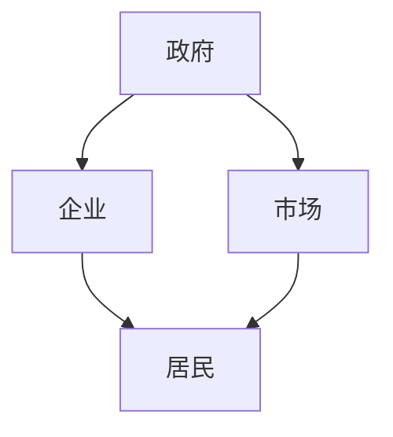
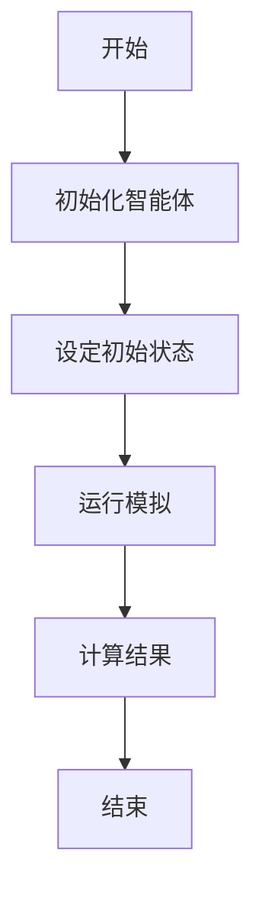
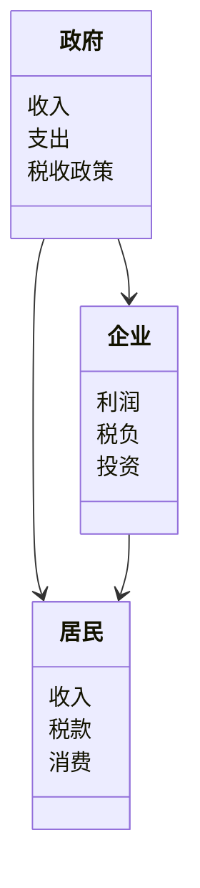
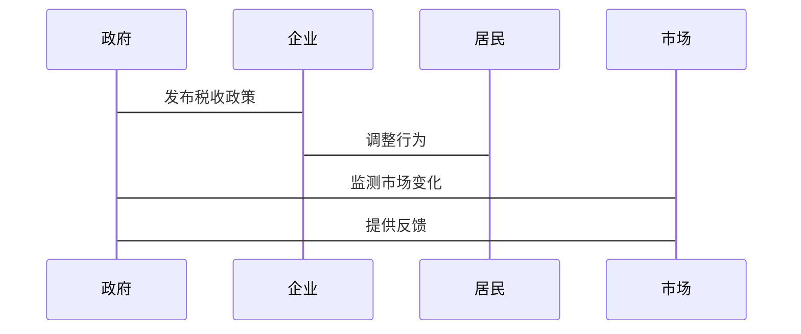

                 


# 利用多智能体系统模拟不同税收政策：评估政策影响

> **关键词**：多智能体系统、税收政策模拟、经济建模、政策评估、人工智能

> **摘要**：本文详细探讨了如何利用多智能体系统模拟不同税收政策及其对经济的影响。通过构建多智能体模型，分析税收政策在不同情景下的效果，为政策制定者提供科学依据。文章从背景介绍、核心概念、算法原理、系统架构到项目实战，全面阐述了多智能体系统在税收政策模拟中的应用，结合实际案例分析，总结经验并提出改进建议。

---

## 第1章 背景介绍

### 1.1 问题背景

#### 1.1.1 税收政策对经济的影响
税收政策是政府调节经济的重要工具，直接影响企业、居民和市场的行为。例如，减税可以刺激消费和投资，而增税可能抑制经济增长。然而，税收政策的效果往往受到多种因素的影响，如经济结构、政策执行力度等，这使得政策效果的预测具有挑战性。

#### 1.1.2 多智能体系统在政策模拟中的应用
多智能体系统（Multi-Agent System, MAS）是一种模拟复杂系统行为的工具，通过模拟多个智能体（Agent）之间的交互，可以更好地理解系统的动态变化。在税收政策模拟中，可以将政府、企业、居民等视为智能体，模拟他们在不同税收政策下的行为变化。

#### 1.1.3 研究的意义与价值
通过多智能体系统模拟税收政策，可以帮助政策制定者更好地预测政策效果，优化政策设计，减少实施中的不确定性。此外，这种模拟方法还可以帮助公众理解税收政策的影响，促进政策的透明化和民主化。

### 1.2 问题描述

#### 1.2.1 税收政策模拟的核心问题
税收政策模拟的核心问题是：如何构建一个能够准确反映税收政策对经济影响的模型，并通过模拟分析得出政策效果。这需要考虑多个智能体之间的交互、政策的实施过程以及系统的动态变化。

#### 1.2.2 多智能体系统的优势
多智能体系统具有以下优势：
- **分布式计算**：通过分布式计算，可以更真实地模拟复杂系统的动态行为。
- **灵活性**：智能体可以根据环境变化动态调整行为，模拟更加灵活。
- **可扩展性**：可以轻松添加或删除智能体，适应不同的政策场景。

#### 1.2.3 研究的边界与外延
研究的边界包括：智能体的定义、智能体之间的交互规则、模拟的时间范围等。研究的外延则包括：扩展到其他政策模拟领域，如财政政策、货币政策等。

### 1.3 核心概念与联系

#### 1.3.1 多智能体系统的基本原理
多智能体系统由多个智能体组成，每个智能体都有自己的目标、决策机制和行为规则。智能体之间通过通信和协作，共同完成任务或达到某种目标。

#### 1.3.2 税收政策模拟的流程
税收政策模拟的流程包括：
1. **政策设计**：定义税收政策的具体内容，如税率、征税对象等。
2. **模拟运行**：运行多智能体系统，模拟税收政策在不同情景下的效果。
3. **结果分析**：分析模拟结果，评估政策的效果，并提出改进建议。

#### 1.3.3 实体关系图（ER图）



---

## 第2章 核心概念与联系

### 2.1 多智能体系统的核心原理

#### 2.1.1 多智能体系统的定义
多智能体系统是由多个智能体组成的分布式系统，每个智能体都有自己的目标、决策机制和行为规则。智能体之间通过通信和协作，共同完成任务或达到某种目标。

#### 2.1.2 多智能体系统的属性特征对比

| 属性 | 特征 |
|------|------|
| 独立性 | 每个智能体独立决策 |
| 交互性 | 智能体之间可以交互 |
| 分布性 | 智能体分布在网络中 |
| 动态性 | 系统状态动态变化 |

### 2.2 税收政策模拟的流程

#### 2.2.1 政策设计
政策设计是税收政策模拟的第一步，需要明确政策的具体内容，如税率、征税对象等。

#### 2.2.2 模拟运行
运行多智能体系统，模拟税收政策在不同情景下的效果。

#### 2.2.3 结果分析
分析模拟结果，评估政策的效果，并提出改进建议。

### 2.3 实体关系图（ER图）


---

## 第3章 算法原理讲解

### 3.1 多智能体模拟的算法原理

#### 3.1.1 基于ABM（Agent-Based Modeling）的框架
ABM是一种基于智能体的建模方法，通过模拟智能体的行为和交互，来观察系统的整体行为。其核心思想是通过局部规则来生成全局行为。

#### 3.1.2 算法流程图



### 3.2 算法实现

#### 3.2.1 Python代码实现

```python
class Agent:
    def __init__(self, id):
        self.id = id
        self.state = 0

def simulate(n_agents):
    agents = [Agent(i) for i in range(n_agents)]
    for agent in agents:
        agent.state += 1
    return agents

# 示例运行
agents = simulate(5)
for agent in agents:
    print(f"Agent {agent.id}: {agent.state}")
```

#### 3.2.2 数学模型与公式

税收政策对GDP的影响可以用以下公式表示：

$$ GDP = f(tax\_rate, income) $$

其中，`tax_rate`是税率，`income`是收入。税收政策的实施会通过影响`tax_rate`来影响GDP。

---

## 第4章 系统分析与架构设计

### 4.1 问题场景介绍

#### 4.1.1 系统目标
通过多智能体系统模拟不同税收政策，评估政策对经济的影响。

#### 4.1.2 项目介绍
本项目旨在构建一个税收政策模拟系统，通过模拟政府、企业、居民等智能体的行为，评估不同税收政策的效果。

### 4.2 系统功能设计

#### 4.2.1 领域模型（Mermaid类图）



#### 4.2.2 系统架构图


#### 4.2.3 接口设计与交互流程



---

## 第5章 项目实战

### 5.1 环境安装

#### 5.1.1 安装Python
安装Python 3.8及以上版本。

#### 5.1.2 安装依赖库
安装必要的Python库，如NumPy、Matplotlib等。

### 5.2 系统核心实现

#### 5.2.1 核心代码实现

```python
import numpy as np
import matplotlib.pyplot as plt

class Agent:
    def __init__(self, id):
        self.id = id
        self.state = np.random.uniform(0, 1)

def simulate(n_agents):
    agents = [Agent(i) for i in range(n_agents)]
    states = [agent.state for agent in agents]
    plt.hist(states, bins=20)
    plt.show()
    return agents

# 示例运行
agents = simulate(100)
```

#### 5.2.2 代码应用解读与分析
上述代码定义了一个简单的多智能体系统，模拟了100个智能体的状态分布。通过直方图可以观察智能体状态的分布情况。

### 5.3 实际案例分析

#### 5.3.1 案例背景
假设我们想要模拟一个减税政策对居民消费的影响。

#### 5.3.2 模拟运行与结果分析
运行模拟，观察居民消费的变化。通过分析结果，评估减税政策的有效性。

---

## 第6章 最佳实践与总结

### 6.1 小结
本文详细探讨了如何利用多智能体系统模拟不同税收政策，并评估其对经济的影响。通过构建多智能体模型，分析税收政策在不同情景下的效果，为政策制定者提供科学依据。

### 6.2 注意事项
- 确保智能体的行为规则合理。
- 模拟结果需要结合实际数据进行验证。
- 多智能体系统的复杂性可能会影响性能。

### 6.3 拓展阅读
推荐阅读以下书籍和论文：
- 《Multi-Agent Systems: Complexity Decomposition and Its Applications》
- 《Agent-Based Modeling and Simulation: A Comprehensive Guide》

---

通过本文的分析和实践，我们可以看到，多智能体系统在税收政策模拟中具有重要的应用价值。未来的研究可以进一步优化模型，提高模拟的准确性和可扩展性。

