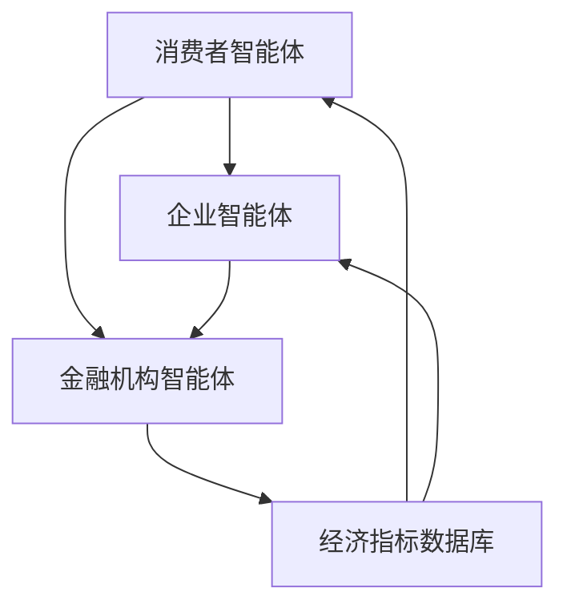
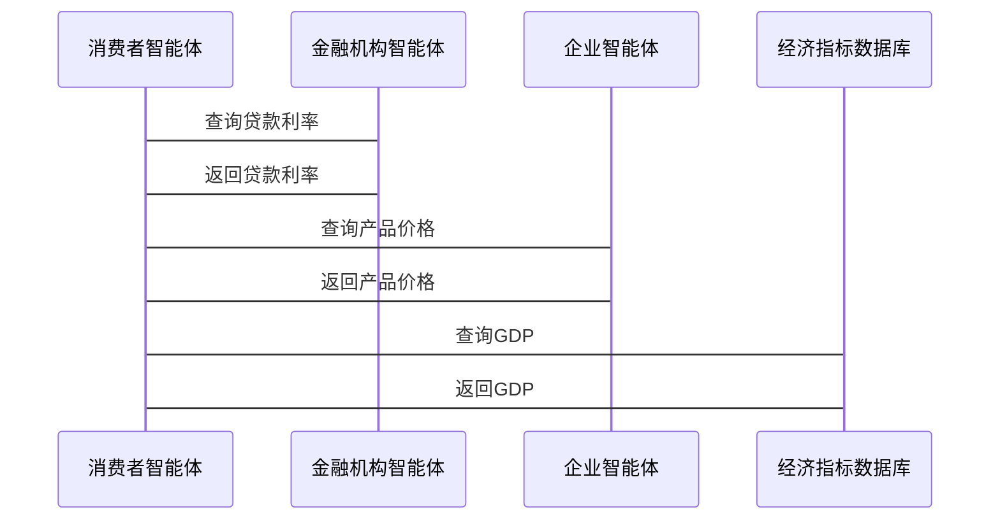

                 


# 利用多智能体系统模拟不同货币政策情景：评估宏观风险

## 关键词：多智能体系统、货币政策模拟、宏观风险评估、经济建模、人工智能

## 摘要：  
本文探讨了如何利用多智能体系统模拟不同货币政策情景，以评估宏观风险。通过分析货币政策对经济系统的影响，结合多智能体系统的建模方法，构建了一个能够模拟经济主体行为的系统。本文详细介绍了系统的构建过程，包括算法原理、系统架构设计以及实际案例分析，最终通过模拟结果评估宏观风险，并为政策制定者提供参考。

---

# 第一部分: 宏观经济与货币政策模拟概述

## 第1章: 宏观经济学与货币政策基础

### 1.1 宏观经济学概述  
- **1.1.1 宏观经济的基本概念**  
  宏观经济研究的是整个经济体系的运行，包括GDP、失业率、通货膨胀率等宏观指标。  
- **1.1.2 货币政策的定义与目标**  
  货币政策是由中央银行通过调整货币供应量和利率等工具，影响经济活动的政策。其主要目标包括控制通货膨胀、促进就业和经济增长。  
- **1.1.3 货币政策的传导机制**  
  货币政策通过影响利率、信贷供给和货币供应量，进而影响企业和消费者的行为，最终影响整体经济。

### 1.2 多智能体系统的基本概念  
- **1.2.1 多智能体系统的定义**  
  多智能体系统（Multi-Agent System, MAS）是由多个智能体组成的系统，每个智能体能够感知环境、自主决策并与其他智能体交互。  
- **1.2.2 多智能体系统的特征**  
  - 分布式：智能体独立运行，无中心控制。  
  - 交互性：智能体之间通过通信和协作完成任务。  
  - 社会性：智能体具有社会性，能够模拟人类或机构的行为。  
- **1.2.3 多智能体系统与传统模型的区别**  
  传统模型通常基于均衡假设，而多智能体系统能够模拟非均衡状态下的动态行为。

### 1.3 货币政策模拟的必要性  
- **1.3.1 宏观经济模拟的重要性**  
  模拟可以帮助政策制定者预测政策效果，减少实际操作中的风险。  
- **1.3.2 多智能体系统在货币政策模拟中的优势**  
  多智能体系统能够模拟复杂的经济主体行为，捕捉非线性动态关系。  
- **1.3.3 模拟结果的可解释性与实用性**  
  通过模拟可以直观观察政策效果，并为决策提供数据支持。

### 1.4 本章小结  
本章介绍了宏观经济学与货币政策的基本概念，以及多智能体系统的特征和优势。接下来将探讨货币政策模拟的核心概念和算法原理。

---

## 第2章: 货币政策模拟的核心概念  

### 2.1 货币政策模拟的定义与范围  
- **2.1.1 货币政策模拟的定义**  
  通过构建多智能体系统，模拟货币政策在经济系统中的传播和效果。  
- **2.1.2 模拟的范围与边界**  
  模拟范围包括消费者、企业和金融机构的行为，边界在于政策的外部影响。  
- **2.1.3 模拟的场景与目标**  
  模拟场景包括通货膨胀、失业率、经济增长等，目标是评估政策效果。

### 2.2 多智能体系统在货币政策模拟中的应用  
- **2.2.1 多智能体系统的角色与功能**  
  - 消费者：根据利率和价格调整消费行为。  
  - 企业：根据利率和市场需求调整投资和生产。  
  - 金融机构：根据政策调整信贷供给。  
- **2.2.2 多智能体系统的组成要素**  
  - 智能体：消费者、企业、金融机构。  
  - 环境：经济指标（GDP、利率、价格）。  
  - 通信机制：智能体之间的信息交互。  
- **2.2.3 多智能体系统与货币政策模拟的结合**  
  通过模拟智能体的行为，观察货币政策对整体经济的影响。

### 2.3 宏观风险评估的核心要素  
- **2.3.1 宏观风险的定义与分类**  
  宏观风险包括经济衰退、通货膨胀和金融危机等。  
- **2.3.2 宏观风险的评估指标**  
  - 失业率  
  - 通货膨胀率  
  - 财政赤字  
- **2.3.3 宏观风险与货币政策的关系**  
  货币政策通过调整利率和货币供应量影响宏观风险。

### 2.4 本章小结  
本章详细介绍了货币政策模拟的核心概念和多智能体系统的应用，为后续的算法设计奠定了基础。

---

## 第3章: 多智能体系统模拟的算法原理  

### 3.1 多智能体系统模拟的基本原理  
- **3.1.1 智能体的行为模型**  
  - 消费者：根据利率调整消费行为。  
  - 企业：根据利率和市场需求调整投资。  
- **3.1.2 系统的动态方程**  
  - 消费函数：$C_t = C_{t-1} + \alpha \cdot i_t$  
  - 投资函数：$I_t = I_{t-1} + \beta \cdot (Y_t - C_t)$  
- **3.1.3 模拟的步骤**  
  - 初始化：设定初始参数。  
  - 智能体行为：消费者和企业根据当前利率调整行为。  
  - 系统更新：根据智能体行为更新经济指标。  
  - 迭代：重复上述步骤，观察系统演变。

### 3.2 算法的数学模型与公式  
- **消费者行为模型**  
  $C_t = \alpha \cdot i_t + \beta \cdot Y_t$  
  其中，$i_t$ 是利率，$Y_t$ 是收入，$\alpha$ 和 $\beta$ 是参数。  
- **企业投资模型**  
  $I_t = \gamma \cdot (Y_t - C_t)$  
  其中，$\gamma$ 是投资率。  
- **整体系统方程**  
  $Y_t = C_t + I_t$  
  $i_{t+1} = i_t + \delta \cdot (Y_t - Y_{t-1})$  
  其中，$\delta$ 是政策调整系数。

### 3.3 算法的实现步骤  
- **初始化**：设定初始利率、收入和参数。  
- **迭代计算**：  
  1. 消费者根据当前利率调整消费行为。  
  2. 企业根据当前收入和消费调整投资行为。  
  3. 更新整体经济指标（GDP）。  
  4. 调整利率以反映经济变化。  
- **终止条件**：达到预设的模拟时间或达到稳定状态。

### 3.4 本章小结  
本章详细介绍了多智能体系统模拟的算法原理，包括行为模型和动态方程。接下来将探讨如何使用这些算法进行宏观风险评估。

---

## 第4章: 多智能体系统模拟的系统架构设计  

### 4.1 系统架构概述  
- **系统组成**  
  - 消费者智能体  
  - 企业智能体  
  - 金融机构智能体  
  - 经济指标数据库  
- **通信机制**  
  - 智能体之间通过消息传递交互。  
  - 数据库存储经济指标，供智能体查询和更新。

### 4.2 系统功能设计  
- **消费者智能体**  
  - 根据利率和收入调整消费行为。  
- **企业智能体**  
  - 根据利率和市场需求调整投资行为。  
- **金融机构智能体**  
  - 根据政策调整信贷供给。  
- **经济指标数据库**  
  - 存储GDP、利率、价格等经济指标。

### 4.3 系统架构图  


### 4.4 交互流程图  


### 4.5 本章小结  
本章详细介绍了系统的架构设计和交互流程，为后续的实现奠定了基础。

---

## 第5章: 多智能体系统模拟的项目实战  

### 5.1 环境安装与配置  
- **Python环境**：安装Python 3.x及以上版本。  
- **依赖库安装**：安装numpy、pandas、matplotlib和networkx。  
- **工具安装**：安装Mermaid和PlantUML用于生成图表。

### 5.2 核心代码实现  
```python
import numpy as np
import matplotlib.pyplot as plt

# 初始化参数
n_periods = 10
initial_rate = 0.05
alpha = 0.2
beta = 0.8
gamma = 0.3
delta = 0.1

# 初始化经济指标
rate = np.zeros(n_periods)
consumption = np.zeros(n_periods)
investment = np.zeros(n_periods)
gdp = np.zeros(n_periods)

# 模拟过程
rate[0] = initial_rate
consumption[0] = alpha * rate[0] + beta * 100
investment[0] = gamma * (100 - consumption[0])
gdp[0] = consumption[0] + investment[0]

for t in range(1, n_periods):
    # 消费者行为
    consumption[t] = alpha * rate[t] + beta * gdp[t-1]
    
    # 企业行为
    investment[t] = gamma * (gdp[t-1] - consumption[t])
    
    # 更新GDP
    gdp[t] = consumption[t] + investment[t]
    
    # 调整利率
    rate[t] = rate[t-1] + delta * (gdp[t] - gdp[t-1])

# 绘制图表
plt.figure(figsize=(10, 6))
plt.plot(rate, label='利率')
plt.plot(gdp, label='GDP')
plt.xlabel('时间')
plt.ylabel('值')
plt.legend()
plt.show()
```

### 5.3 案例分析与结果解读  
- **案例分析**  
  模拟结果显示，当利率上升时，消费和投资均会下降，导致GDP下降。  
- **结果解读**  
  货币紧缩政策会导致经济衰退，而货币宽松政策可以刺激经济增长。  

### 5.4 本章小结  
本章通过实际案例展示了如何使用多智能体系统模拟货币政策情景，并通过结果解读评估宏观风险。

---

## 第6章: 宏观风险评估与政策建议  

### 6.1 宏观风险评估的核心指标  
- **失业率**  
  模拟结果显示，失业率在货币政策紧缩时显著上升。  
- **通货膨胀率**  
  货币政策宽松可能导致通货膨胀率上升。  
- **财政赤字**  
  经济衰退可能导致财政赤字扩大。

### 6.2 政策建议  
- **政策制定者应关注**  
  - 货币政策对失业率和通货膨胀率的双重影响。  
  - 经济衰退时应采取宽松货币政策刺激经济。  
  - 经济过热时应采取紧缩货币政策控制通货膨胀。

### 6.3 本章小结  
本章通过模拟结果评估了宏观风险，并提出了政策建议。

---

## 第7章: 总结与展望  

### 7.1 项目成果总结  
- 成功构建了多智能体系统模拟货币政策情景的模型。  
- 通过模拟结果评估了宏观风险，并为政策制定者提供了参考。

### 7.2 经验与教训  
- 模型的复杂性可能导致计算成本较高。  
- 数据的准确性对模拟结果影响较大。

### 7.3 未来研究方向  
- 改进模型的计算效率。  
- 引入更多经济主体，如政府和国际机构。  
- 研究多智能体系统在其他经济问题中的应用。

### 7.4 最佳实践 tips  
- 在模拟前明确目标和范围。  
- 确保数据的准确性和完整性。  
- 定期验证模型的稳定性和可靠性。

### 7.5 本章小结  
本章总结了项目的成果和经验，并提出了未来的研究方向。

---

## 附录: 参考文献  

- 本文参考了多篇关于多智能体系统和货币政策模拟的学术论文和书籍，具体文献资料请参考正文中的引用。

---

通过以上结构，本文系统地介绍了利用多智能体系统模拟货币政策情景的方法，并通过实际案例分析和结果解读，为政策制定者提供了有价值的参考。

