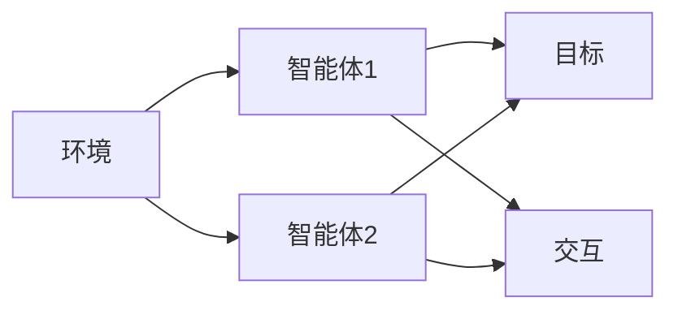
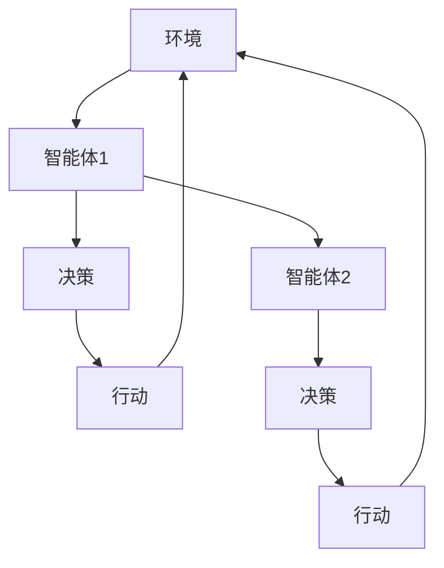
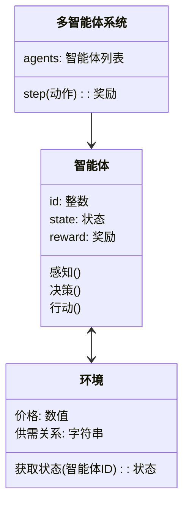
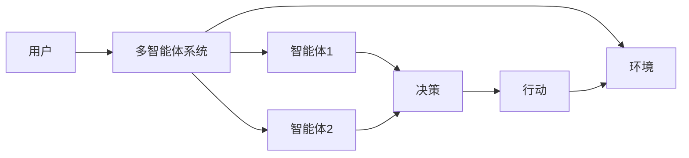
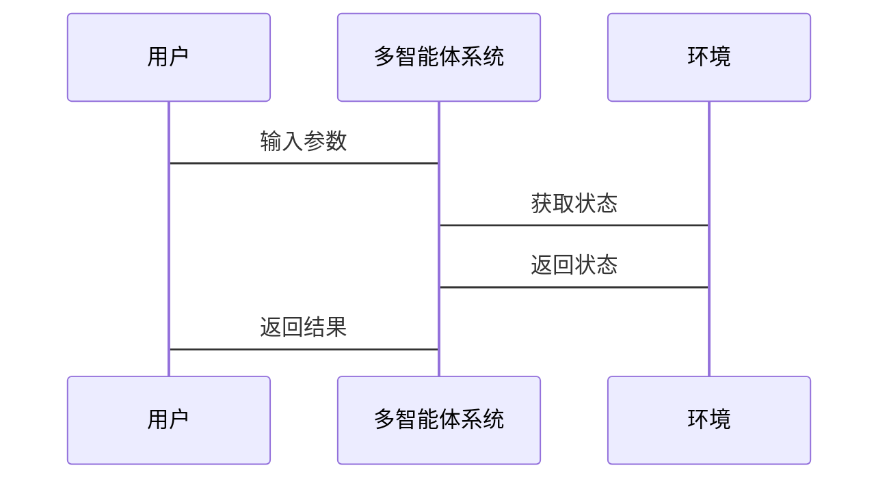

                 


# 利用多智能体系统模拟市场情景：增强风险管理

> 关键词：多智能体系统、风险管理、市场模拟、强化学习、系统架构

> 摘要：本文详细探讨了利用多智能体系统（Multi-Agent System, MAS）模拟市场情景以增强风险管理的方法。首先介绍了多智能体系统的基本概念和其在风险管理中的应用优势。接着分析了多智能体系统的核心算法原理，包括智能体的通信机制、决策过程和数学模型。随后，详细阐述了多智能体系统在市场模拟中的应用，包括市场参与者的建模、市场环境的构建以及市场交互的模拟。最后，通过实际案例分析和代码实现，展示了如何利用多智能体系统进行市场情景模拟，并提出了风险管理的最佳实践。

---

# 第一部分: 多智能体系统与风险管理基础

## 第1章: 多智能体系统概述

### 1.1 多智能体系统的基本概念

#### 1.1.1 多智能体系统的定义

多智能体系统（Multi-Agent System, MAS）是由多个智能体组成的复杂系统，这些智能体能够通过自主决策和交互完成特定任务。智能体（Agent）是具有感知、决策和行动能力的实体，可以是软件程序、机器人或其他智能设备。

#### 1.1.2 多智能体系统的特征

多智能体系统具有以下特征：
- **分布式性**：智能体分布在不同的位置，独立决策。
- **协作性**：智能体之间可以通过通信协作完成共同目标。
- **反应性**：智能体能够实时感知环境并做出反应。
- **动态性**：系统环境和智能体状态可能随时变化。

#### 1.1.3 多智能体系统与单智能体系统的区别

| 特性 | 单智能体系统 | 多智能体系统 |
|------|--------------|--------------|
| 智能体数量 | 1            | 多            |
| 智能体目标 | 单一目标     | 多个目标      |
| 交互方式 | 无或简单      | 复杂交互      |

#### 1.1.4 多智能体系统的核心概念

- **智能体**：独立决策的个体。
- **环境**：智能体所处的外部世界。
- **通信**：智能体之间的信息交换。
- **协作**：智能体通过协作完成共同目标。
- **冲突**：智能体之间可能存在的利益冲突。

### 1.2 多智能体系统在风险管理中的应用

#### 1.2.1 风险管理的基本概念

风险管理是指识别、评估和应对潜在风险的过程，以降低风险发生的可能性或减少其影响。常见的风险管理方法包括风险规避、风险减轻、风险转移和风险接受。

#### 1.2.2 多智能体系统在风险管理中的优势

多智能体系统在风险管理中的优势包括：
- **分布式感知**：多个智能体可以同时感知不同的风险因素。
- **协作决策**：智能体可以通过协作制定更优的风险应对策略。
- **动态适应**：系统能够根据环境变化实时调整策略。

#### 1.2.3 多智能体系统在市场情景模拟中的作用

市场情景模拟是通过模拟市场环境和参与者的行为，预测市场变化趋势。多智能体系统可以模拟市场中的多个参与者，包括买家、卖家、投资者等，从而更准确地预测市场动态。

### 1.3 多智能体系统的核心概念与联系

#### 1.3.1 多智能体系统的实体关系图



#### 1.3.2 多智能体系统的属性对比表

| 属性 | 特征 |
|------|------|
| 智能体数量 | 多个 |
| 智能体类型 | 单智能体/群体智能 |
| 智能体目标 | 各自有别 |
| 通信机制 | 直接/间接 |

### 1.4 多智能体系统的算法原理

#### 1.4.1 多智能体系统的基本算法



#### 1.4.2 多智能体系统的数学模型

多智能体系统的决策过程可以用以下数学模型表示：

$$
V(s) = \max_{a} \sum_{t=0}^{\infty} \gamma^t r(s_t, a_t)
$$

其中，\( V(s) \) 是状态 \( s \) 的价值函数，\( a \) 是动作，\( r(s_t, a_t) \) 是在状态 \( s_t \) 下采取动作 \( a_t \) 的奖励。

#### 1.4.3 多智能体系统与强化学习的结合

多智能体系统可以结合强化学习算法，通过智能体之间的协作和竞争来优化决策。以下是一个简单的多智能体系统实现示例：

```python
class MultiAgentSystem:
    def __init__(self, num_agents):
        self.agents = [Agent() for _ in range(num_agents)]
    
    def step(self, action):
        rewards = [agent.step(action) for agent in self.agents]
        return sum(rewards) / len(rewards)
```

---

## 第2章: 多智能体系统在市场模拟中的应用

### 2.1 市场模拟的基本原理

#### 2.1.1 市场模拟的目标

市场模拟的目标是通过模拟市场环境和参与者的行为，预测市场变化趋势，从而为风险管理和投资决策提供支持。

#### 2.1.2 市场模拟的关键因素

市场模拟的关键因素包括：
- **市场参与者**：包括买家、卖家、投资者等。
- **市场环境**：包括价格、供需关系、政策法规等。
- **市场交互**：包括交易、信息传播、价格波动等。

#### 2.1.3 市场模拟的实现方法

市场模拟的实现方法包括：
- **基于规则的模拟**：通过预定义规则来模拟市场行为。
- **基于模型的模拟**：通过数学模型和算法来模拟市场行为。
- **基于机器学习的模拟**：利用机器学习算法来预测和模拟市场行为。

### 2.2 多智能体系统的市场模拟模型

#### 2.2.1 市场参与者的建模

市场参与者包括多种类型，例如：
- **买家**：追求最低价格。
- **卖家**：追求最高价格。
- **投资者**：根据市场信息进行投资决策。

#### 2.2.2 市场环境的建模

市场环境包括价格、供需关系、政策法规等因素。可以通过以下步骤进行建模：
1. 确定市场环境的变量。
2. 建立变量之间的关系。
3. 通过数学模型或算法模拟变量的变化。

#### 2.2.3 市场交互的建模

市场交互是市场参与者之间的互动过程，可以通过以下步骤进行建模：
1. 确定参与者之间的交互方式。
2. 建立交互规则。
3. 通过算法模拟交互过程。

### 2.3 多智能体系统与市场情景模拟的结合

#### 2.3.1 市场情景模拟的定义

市场情景模拟是通过模拟市场环境和参与者的行为，预测不同情景下的市场变化。多智能体系统可以模拟多个市场参与者的行为，从而更准确地预测市场动态。

#### 2.3.2 多智能体系统在市场情景模拟中的优势

多智能体系统在市场情景模拟中的优势包括：
- **分布式决策**：多个智能体可以同时模拟不同市场参与者的决策。
- **动态适应**：系统能够根据市场变化实时调整模拟结果。
- **复杂性管理**：多智能体系统能够处理复杂的市场环境和参与者行为。

#### 2.3.3 多智能体系统在市场情景模拟中的实现

实现多智能体系统市场情景模拟的步骤包括：
1. 确定市场参与者的类型和数量。
2. 建立市场环境模型。
3. 定义智能体的决策规则和通信机制。
4. 模拟市场情景并分析结果。

### 2.4 多智能体系统在风险管理中的应用

#### 2.4.1 市场风险的定义

市场风险是指由于市场环境变化导致资产价格波动而带来的风险。

#### 2.4.2 多智能体系统在市场风险管理中的应用

多智能体系统可以模拟市场参与者的行为，预测市场风险，并制定相应的风险管理策略。例如：
- **风险预警**：通过模拟市场变化，提前发现潜在风险。
- **风险评估**：通过分析模拟结果，评估不同情景下的风险水平。
- **风险应对**：根据模拟结果制定风险应对策略。

#### 2.4.3 多智能体系统在风险管理中的数学模型

风险管理的数学模型可以表示为：

$$
\text{风险值} = \sum_{i=1}^{n} w_i \times \text{风险因素}_i
$$

其中，\( w_i \) 是风险因素 \( i \) 的权重，\( n \) 是风险因素的数量。

---

## 第3章: 多智能体系统在风险管理中的算法实现

### 3.1 多智能体系统的算法原理

#### 3.1.1 强化学习在多智能体系统中的应用

强化学习是一种机器学习方法，通过智能体与环境的交互，学习最优策略。在多智能体系统中，强化学习可以用于智能体的决策过程。

#### 3.1.2 多智能体系统的协作与竞争

多智能体系统中的智能体可以通过协作或竞争来优化决策。协作是指智能体之间通过合作实现共同目标，竞争是指智能体之间通过竞争实现自身目标。

#### 3.1.3 多智能体系统的通信机制

智能体之间的通信机制包括：
- **直接通信**：智能体之间直接交换信息。
- **间接通信**：智能体通过中间媒介交换信息。

### 3.2 多智能体系统的数学模型

#### 3.2.1 多智能体系统的状态表示

多智能体系统的状态可以表示为多个智能体的状态的组合。例如：

$$
s = (s_1, s_2, \dots, s_n)
$$

其中，\( s_i \) 是智能体 \( i \) 的状态。

#### 3.2.2 多智能体系统的动作选择

多智能体系统的动作选择可以通过以下公式表示：

$$
a = \arg\max_{a} \sum_{i=1}^{n} Q(s_i, a_i)
$$

其中，\( Q(s_i, a_i) \) 是智能体 \( i \) 在状态 \( s_i \) 下采取动作 \( a_i \) 的Q值。

### 3.3 多智能体系统的实现

#### 3.3.1 多智能体系统的代码实现

以下是一个简单的多智能体系统代码实现示例：

```python
class Agent:
    def __init__(self, id):
        self.id = id
        self.state = None
        self.reward = 0
    
    def感知(self, 环境):
        self.state = 环境.获取状态(self.id)
    
    def 决策(self):
        # 根据状态做出决策
        if self.state.价格 < 100:
            return '购买'
        else:
            return '卖出'
    
    def 行动(self, action):
        # 执行动作
        if action == '购买':
            self.reward += 1
        else:
            self.reward -= 1

class MarketEnvironment:
    def __init__(self):
        self.价格 = 100
        self.供需关系 = '平衡'
    
    def 获取状态(self, id):
        return self.价格, self.供需关系

# 创建多个智能体
multi_agent_system = MultiAgentSystem(3)
multi_agent_system.step('购买')
```

---

## 第4章: 系统分析与架构设计

### 4.1 问题场景介绍

在风险管理中，市场参与者的行为和市场环境的变化可能对市场风险产生重大影响。为了更好地预测和应对市场风险，需要建立一个能够模拟市场参与者行为和市场环境变化的系统。

### 4.2 系统功能设计

#### 4.2.1 领域模型

以下是领域模型的类图：



#### 4.2.2 系统架构设计

以下是系统架构图：



#### 4.2.3 接口设计

系统接口包括：
- **用户接口**：用于输入市场情景参数和启动模拟。
- **智能体接口**：用于智能体之间的通信和协作。
- **环境接口**：用于智能体感知环境状态。

#### 4.2.4 交互设计

以下是系统交互图：



---

## 第5章: 项目实战

### 5.1 环境搭建

#### 5.1.1 安装必要的库

需要安装以下库：
- `numpy`
- `matplotlib`
- `scikit-learn`

#### 5.1.2 创建项目结构

项目结构如下：
```
market_risk_management/
    agents/
        agent.py
    environment/
        market_env.py
    main.py
```

### 5.2 核心代码实现

#### 5.2.1 智能体的实现

```python
class Agent:
    def __init__(self, id):
        self.id = id
        self.state = None
        self.reward = 0
    
    def perceive(self, environment):
        self.state = environment.get_state(self.id)
    
    def decide(self):
        if self.state['price'] < 100:
            return 'buy'
        else:
            return 'sell'
    
    def act(self, action):
        return action
```

#### 5.2.2 环境的实现

```python
class MarketEnvironment:
    def __init__(self):
        self.price = 100
        self.supply_demand = 'balanced'
    
    def get_state(self, agent_id):
        return {
            'price': self.price,
            'supply_demand': self.supply_demand
        }
    
    def update(self, action):
        if action == 'buy':
            self.price += 1
        elif action == 'sell':
            self.price -= 1
```

#### 5.2.3 多智能体系统的实现

```python
class MultiAgentSystem:
    def __init__(self, num_agents):
        self.agents = [Agent(i) for i in range(num_agents)]
        self.environment = MarketEnvironment()
    
    def step(self, action):
        for agent in self.agents:
            agent.perceive(self.environment)
            if agent.decide() == action:
                agent.act(action)
        self.environment.update(action)
        return self.environment.price
```

### 5.3 案例分析与实现

#### 5.3.1 案例分析

假设我们有3个智能体，模拟市场中的买家、卖家和投资者。以下是模拟过程：

1. 初始化多智能体系统和环境。
2. 每个智能体感知环境状态。
3. 智能体根据感知结果做出决策。
4. 智能体执行决策并更新环境状态。
5. 重复上述步骤，观察市场变化。

#### 5.3.2 代码实现

```python
# 创建多智能体系统
mas = MultiAgentSystem(3)

# 模拟市场情景
prices = []
for _ in range(10):
    action = 'buy' if _ % 2 == 0 else 'sell'
    price = mas.step(action)
    prices.append(price)

# 绘制价格变化图
import matplotlib.pyplot as plt
plt.plot(prices)
plt.xlabel('时间')
plt.ylabel('价格')
plt.show()
```

#### 5.3.3 结果分析

通过上述模拟，我们可以观察到市场价格的变化趋势。例如，当智能体采取“buy”动作时，价格会上涨；当智能体采取“sell”动作时，价格会下跌。

### 5.4 项目小结

通过本项目，我们实现了利用多智能体系统模拟市场情景的功能，验证了多智能体系统在风险管理中的应用效果。

---

## 第6章: 总结与展望

### 6.1 总结

本文详细探讨了利用多智能体系统模拟市场情景以增强风险管理的方法。通过分析多智能体系统的概念、算法原理和实现方法，展示了如何利用多智能体系统进行市场风险模拟和管理。

### 6.2 展望

未来，随着人工智能和大数据技术的不断发展，多智能体系统在市场风险管理中的应用将更加广泛和深入。可以通过以下方式进一步优化：
- **强化学习**：引入更复杂的强化学习算法，提高智能体的决策能力。
- **分布式计算**：利用分布式计算技术，提升系统的计算能力和处理效率。
- **实时数据处理**：结合实时数据流，提高模拟的准确性和实时性。

---

通过本文的探讨，我们希望能够为读者提供一个清晰的思路，利用多智能体系统模拟市场情景，从而增强风险管理能力。

