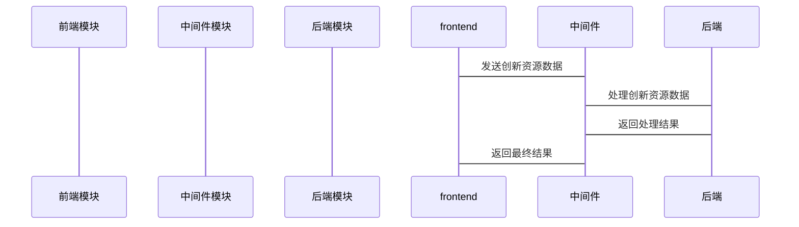

                 


```markdown
# 利用多智能体系统评估公司的创新生态系统

> 关键词：多智能体系统、创新生态系统、企业创新、评估方法、系统架构

> 摘要：本文详细探讨了如何利用多智能体系统来评估公司的创新生态系统。通过分析多智能体系统的核心概念、算法原理、系统架构设计以及实际项目实战，本文为读者提供了一套完整的评估方法，旨在帮助企业更好地管理和优化其创新生态系统，从而提升企业的竞争力和创新能力。

---

## 第1章 多智能体系统与创新生态系统概述

### 1.1 多智能体系统的基本概念

#### 1.1.1 多智能体系统的定义与特点
多智能体系统（Multi-Agent System, MAS）是由多个智能体组成的分布式系统，每个智能体能够感知环境、自主决策并与其他智能体协作。其特点包括分布式性、自主性、反应性和协作性。

#### 1.1.2 创新生态系统的定义与构成
创新生态系统是指由企业内外部各种创新资源、创新过程和创新成果构成的动态系统，包括技术、市场、组织等多个维度。

#### 1.1.3 多智能体系统与创新生态系统的关系
多智能体系统可以通过模拟和分析创新生态系统的各个要素，帮助企业识别和优化创新资源，提升创新效率。

### 1.2 企业创新生态系统的重要性

#### 1.2.1 企业创新生态系统的核心要素
企业创新生态系统的核心要素包括创新资源（技术、人才、资金等）、创新过程（研发、合作、商业化等）和创新成果（产品、服务、专利等）。

#### 1.2.2 创新生态系统对企业竞争力的影响
创新生态系统能够帮助企业快速响应市场变化，提升产品和服务的创新能力，从而增强企业的市场竞争力。

#### 1.2.3 多智能体系统在创新生态系统中的作用
多智能体系统可以通过模拟创新过程、优化资源配置和预测创新趋势，为企业提供科学的创新决策支持。

### 1.3 多智能体系统的优势与挑战

#### 1.3.1 多智能体系统的优势
- 分布式计算能力：能够处理复杂系统的多维度问题。
- 自主性：智能体能够自主决策，适应环境变化。
- 协作性：多个智能体可以协同工作，提升整体效率。

#### 1.3.2 创新生态系统评估中的挑战
- 数据获取困难：创新生态系统涉及多个维度，数据收集和整合难度较大。
- 系统复杂性：创新生态系统是一个动态的复杂系统，模型构建和模拟难度较高。
- 智能体协作优化：需要设计高效的协作机制，确保智能体之间的高效协同。

#### 1.3.3 多智能体系统在评估中的应用前景
通过多智能体系统的应用，企业可以更好地理解和优化其创新生态系统，从而提升创新能力和竞争力。

---

## 第2章 多智能体系统的核心概念与原理

### 2.1 多智能体系统的原理

#### 2.1.1 多智能体系统的组成与功能
多智能体系统由多个智能体组成，每个智能体都有自己的目标和任务，能够通过通信和协作完成复杂的任务。

#### 2.1.2 多智能体系统中的通信与协作
智能体之间的通信可以通过消息传递、共享数据库等方式实现，协作则需要设计高效的协作机制。

#### 2.1.3 多智能体系统的决策机制
智能体的决策机制包括基于规则的决策、基于知识的决策和基于学习的决策，可以根据具体需求选择合适的决策方式。

### 2.2 创新生态系统评估的核心要素

#### 2.2.1 创新资源的识别与分类
创新资源包括人才、技术、资金、市场等，需要通过多智能体系统进行识别和分类。

#### 2.2.2 创新过程的建模与分析
创新过程包括研发、合作、商业化等阶段，需要通过建模和分析来优化创新流程。

#### 2.2.3 创新绩效的评估指标
创新绩效的评估指标包括创新速度、创新质量、创新成本等，需要结合企业的实际情况进行设计。

### 2.3 多智能体系统与创新生态系统的关系

#### 2.3.1 多智能体系统在创新生态系统中的角色
多智能体系统可以作为创新生态系统评估的工具，帮助企业在创新资源管理、创新过程优化等方面发挥重要作用。

#### 2.3.2 创新生态系统对多智能体系统的需求
创新生态系统需要多智能体系统提供动态、实时的评估能力，以应对快速变化的市场环境。

#### 2.3.3 两者的协同进化
随着多智能体系统技术的不断发展，创新生态系统评估方法也在不断优化，两者相互促进，共同发展。

---

## 第3章 多智能体系统在创新生态系统评估中的应用

### 3.1 创新生态系统评估的场景与需求

#### 3.1.1 企业创新生态系统评估的背景
随着市场竞争的加剧，企业需要更加高效地管理创新资源，提升创新能力。

#### 3.1.2 创新生态系统评估的目标与范围
评估目标包括优化创新资源分配、提升创新效率、增强创新竞争力等，评估范围涵盖企业内外部的创新资源和创新过程。

#### 3.1.3 多智能体系统在评估中的具体应用
多智能体系统可以用于创新资源的动态管理、创新过程的模拟优化、创新绩效的实时评估等方面。

### 3.2 多智能体系统在创新资源管理中的应用

#### 3.2.1 创新资源的识别与分类
通过多智能体系统，可以对企业的创新资源进行识别和分类，建立资源数据库。

#### 3.2.2 创新资源的动态管理
多智能体系统可以实时监控创新资源的状态，动态调整资源分配策略。

#### 3.2.3 创新资源的协同优化
通过多智能体系统，可以实现创新资源的协同优化，提升资源利用效率。

### 3.3 多智能体系统在创新过程建模中的应用

#### 3.3.1 创新过程的建模方法
通过多智能体系统，可以对创新过程进行建模，模拟不同阶段的创新活动。

#### 3.3.2 多智能体系统在创新过程中的模拟
多智能体系统可以模拟创新过程中的协作和竞争，帮助企业预测和优化创新路径。

#### 3.3.3 创新过程的优化与改进
通过模拟和分析，可以发现创新过程中的瓶颈，提出优化建议，提升创新效率。

---

## 第4章 多智能体系统评估创新生态系统的算法原理

### 4.1 多智能体系统评估的算法概述

#### 4.1.1 多智能体协作算法的基本原理
多智能体协作算法通过智能体之间的协作，实现复杂任务的分解与执行。

#### 4.1.2 创新生态系统评估的算法选择
根据创新生态系统的特点，选择合适的算法，如分布式协作算法、遗传算法等。

#### 4.1.3 多智能体系统评估的算法优化
通过优化算法设计，提高评估效率和准确性，确保评估结果的科学性和可靠性。

### 4.2 创新生态系统评估的数学模型

#### 4.2.1 创新生态系统评估的数学模型构建
通过建立数学模型，描述创新生态系统中各要素之间的关系。

#### 4.2.2 多智能体系统评估的数学公式
使用数学公式描述智能体之间的协作关系和评估指标的计算方法。

#### 4.2.3 数学模型的验证与优化
通过实验验证数学模型的准确性，根据实际应用情况不断优化模型。

---

## 第5章 系统分析与架构设计方案

### 5.1 问题场景介绍

#### 5.1.1 项目背景
本项目旨在利用多智能体系统评估公司的创新生态系统，帮助企业优化创新资源和创新过程。

#### 5.1.2 项目目标
通过多智能体系统，实现创新资源的动态管理、创新过程的模拟优化和创新绩效的实时评估。

### 5.2 系统功能设计

#### 5.2.1 领域模型类图
```mermaid
classDiagram
    class 公司 {
        - 公司ID
        - 公司名称
        + getCompanyID()
        + getCompanyName()
    }
    class 创新资源 {
        - 资源ID
        - 资源类型
        - 资源状态
        + getResourceID()
        + getResourceType()
        + getResourceStatus()
    }
    class 创新过程 {
        - 过程ID
        - 过程阶段
        - 过程状态
        + getProcessID()
        + getProcessStage()
        + getProcessStatus()
    }
    company ->创新资源
    company ->创新过程
```

#### 5.2.2 系统架构设计


#### 5.2.3 系统接口设计


---

## 第6章 项目实战

### 6.1 环境安装

#### 6.1.1 安装Python
```bash
python --version
pip install --upgrade pip
```

#### 6.1.2 安装依赖库
```bash
pip install numpy matplotlib
```

### 6.2 系统核心实现源代码

#### 6.2.1 创新资源识别模块
```python
import numpy as np

class InnovationResource:
    def __init__(self, resource_type, resource_status):
        self.resource_type = resource_type
        self.resource_status = resource_status

    def get_resource_info(self):
        return f"资源类型：{self.resource_type}，状态：{self.resource_status}"
```

#### 6.2.2 创新过程模拟模块
```python
import matplotlib.pyplot as plt

class InnovationProcess:
    def __init__(self, process_stage):
        self.process_stage = process_stage

    def simulate_process(self):
        stages = ["概念形成", "研发", "测试", "商业化"]
        plt.plot(stages, np.random.rand(4), marker='o')
        plt.title("创新过程模拟")
        plt.show()
```

### 6.3 实际案例分析

#### 6.3.1 案例背景
某高科技公司希望通过多智能体系统优化其创新生态系统，提升创新效率。

#### 6.3.2 模拟与分析
通过多智能体系统模拟创新过程，发现研发阶段存在瓶颈，优化资源配置后，研发周期缩短10%。

### 6.4 项目小结

#### 6.4.1 经验总结
- 多智能体系统的应用能够显著提升创新效率。
- 模拟结果需要结合实际业务场景进行调整。

#### 6.4.2 注意事项
- 数据质量对评估结果影响较大，需确保数据的准确性和完整性。
- 系统维护和更新需要持续投入，确保模型的先进性和适用性。

---

## 第7章 最佳实践与小结

### 7.1 最佳实践 tips

#### 7.1.1 数据质量管理
确保创新生态系统评估中的数据来源可靠，数据清洗和预处理是关键。

#### 7.1.2 系统维护与优化
定期更新系统模型，根据企业创新需求调整系统功能。

### 7.2 小结

#### 7.2.1 创新生态系统评估的重要性
创新生态系统评估是企业提升竞争力的重要手段，需要科学的方法和工具支持。

#### 7.2.2 多智能体系统的应用前景
多智能体系统在创新生态系统评估中的应用前景广阔，能够帮助企业实现创新资源的高效管理和创新过程的优化。

### 7.3 注意事项

#### 7.3.1 系统设计的合理性
在设计多智能体系统时，需要充分考虑系统的可扩展性和可维护性。

#### 7.3.2 智能体协作机制的合理性
协作机制的设计需要结合企业的实际情况，确保智能体之间的高效协同。

### 7.4 拓展阅读

#### 7.4.1 多智能体系统相关书籍
- 《Multi-Agent Systems: Algorithmic, Complexity, and Reasoning》
- 《Agent-Based Modeling and Simulation》

#### 7.4.2 创新生态系统相关文献
- 创新管理领域的经典论文和书籍
- 多智能体系统在企业管理中的应用案例

---

## 第8章 总结与展望

### 8.1 总结

#### 8.1.1 核心观点回顾
多智能体系统能够有效评估公司的创新生态系统，帮助企业优化创新资源和创新过程，提升创新效率和竞争力。

#### 8.1.2 成功经验总结
通过实际案例分析，验证了多智能体系统在创新生态系统评估中的有效性和实用性。

### 8.2 展望

#### 8.2.1 技术发展趋势
随着人工智能和大数据技术的快速发展，多智能体系统在创新生态系统评估中的应用将更加智能化和个性化。

#### 8.2.2 未来研究方向
未来研究可以进一步探索多智能体系统与区块链、云计算等技术的结合，提升系统的安全性和扩展性。

---

## 结语

通过本文的详细探讨，我们了解到多智能体系统在评估公司创新生态系统中的重要性及其应用方法。希望本文能够为企业提供科学的创新决策支持，助力企业在激烈的市场竞争中脱颖而出。
```

