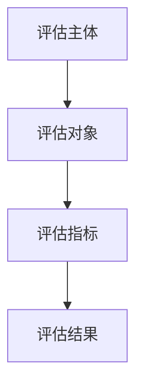
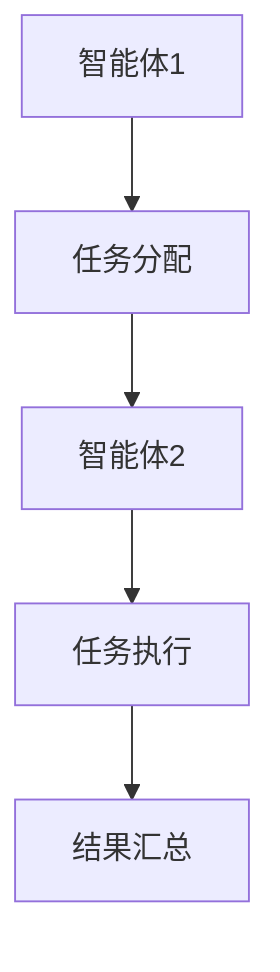
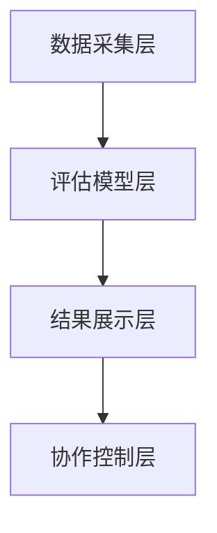

                 


# 利用多智能体系统评估公司的数字化转型进程

> **关键词**：多智能体系统，数字化转型，评估方法，协作算法，系统架构

> **摘要**：随着数字化转型的深入推进，企业需要一种高效、智能的评估方法来监测和优化其转型进程。本文介绍了一种基于多智能体系统的评估方法，详细阐述了其核心原理、算法实现、系统架构以及实际应用案例。通过分析多智能体系统的协作机制和数学模型，本文展示了如何利用这一技术来提升数字化转型的评估效率和准确性。

---

# 第一部分: 数字化转型与多智能体系统概述

## 第1章: 数字化转型的背景与挑战

### 1.1 数字化转型的定义与背景

数字化转型是指企业利用数字技术（如人工智能、大数据、云计算等）来改变其业务模式、流程、文化以及决策方式，以适应快速变化的商业环境。这一过程涉及技术、管理、组织文化的多方面变革。

#### 1.1.1 数字化转型的定义
- 数字化转型不仅仅是技术的升级，更是一种战略性的业务变革。
- 它旨在通过数字化技术提升企业的效率、创新能力和竞争力。

#### 1.1.2 数字化转型的背景与趋势
- **技术驱动**：人工智能、大数据、物联网等技术的快速发展为数字化转型提供了技术支撑。
- **市场竞争**：企业必须加快数字化转型，否则可能在市场竞争中被淘汰。
- **客户需求**：客户对个性化、智能化服务的需求日益增长，推动企业加速数字化进程。

#### 1.1.3 数字化转型对企业的影响
- **效率提升**：自动化流程减少了人工干预，提高了运营效率。
- **创新驱动**：数字化转型为企业创造新的业务模式和收入来源。
- **竞争优势**：通过数字化转型，企业能够更好地应对市场变化，获得竞争优势。

### 1.2 多智能体系统的定义与特点

多智能体系统（Multi-Agent System, MAS）是由多个智能体（Agent）组成的分布式系统，每个智能体能够独立感知环境、自主决策并协作完成任务。

#### 1.2.1 多智能体系统的定义
- **智能体**：具有感知、推理、决策和行动能力的实体。
- **协作**：多个智能体通过通信和协调共同完成复杂任务。
- **分布式**：智能体分布在不同的节点，通过网络进行通信和协作。

#### 1.2.2 多智能体系统的核心特点
1. **自主性**：智能体能够自主决策，无需外部干预。
2. **反应性**：智能体能够实时感知环境并做出反应。
3. **协作性**：多个智能体通过通信和协调共同完成任务。
4. **分布式**：系统由多个智能体组成，分布在不同的物理或逻辑位置。

#### 1.2.3 多智能体系统与传统评估方法的区别
传统评估方法通常依赖于人工分析和静态指标，而多智能体系统能够实时感知、动态调整和自主协作，具有更高的灵活性和适应性。

### 1.3 多智能体系统在数字化转型中的应用

#### 1.3.1 数字化转型评估的核心问题
- **复杂性**：数字化转型涉及多个部门和业务流程，评估需要综合考虑多个维度。
- **动态性**：市场环境和客户需求不断变化，评估方法需要动态调整。
- **协作性**：不同部门和系统需要协同工作，评估需要考虑多方利益和目标。

#### 1.3.2 多智能体系统在评估中的优势
- **实时性**：多智能体系统能够实时监控和分析数据，提供及时反馈。
- **协作性**：智能体之间能够协作完成复杂的评估任务。
- **适应性**：系统能够根据环境变化自动调整评估策略。

#### 1.3.3 多智能体系统与数字化转型的结合
通过多智能体系统的协作能力，企业可以实时监控数字化转型的各个阶段，动态调整策略，确保转型顺利进行。

---

## 第2章: 数字化转型评估的核心概念与联系

### 2.1 多智能体系统的核心原理

多智能体系统的协作机制是其核心，通过智能体之间的通信和协调完成复杂任务。

#### 2.1.1 多智能体系统的协作机制
- **任务分配**：智能体根据自身能力和环境信息分配任务。
- **通信协议**：智能体之间通过特定协议交换信息。
- **协调机制**：智能体通过协商和调整确保任务顺利完成。

#### 2.1.2 多智能体系统的通信协议
- **消息传递**：智能体通过消息传递信息。
- **中间件**：使用中间件（如JMS、RabbitMQ）实现智能体之间的通信。
- **协议标准**：遵循特定的通信协议标准，如HTTP、WebSocket。

#### 2.1.3 多智能体系统的任务分配与协调
- **任务分配策略**：基于智能体的能力和当前负载分配任务。
- **协调机制**：通过协商和调整确保任务分配的公平性和效率。

### 2.2 数字化转型评估的数学模型与公式

#### 2.2.1 数字化转型评估的指标体系
数字化转型评估需要考虑多个维度的指标，如技术成熟度、业务流程优化度、客户满意度等。

#### 2.2.2 多智能体系统评估的数学模型
评估模型通常包括多个参数，通过加权求和的方式计算综合评分。

$$
\text{综合评分} = \sum_{i=1}^{n} w_i \cdot s_i
$$

其中，$w_i$ 是指标 $i$ 的权重，$s_i$ 是指标 $i$ 的评分。

#### 2.2.3 数学公式的详细推导
评估模型的构建需要考虑各个指标的权重和评分标准，通过数学方法优化模型，确保评估结果的准确性和公平性。

### 2.3 实体关系图与流程图

#### 2.3.1 多智能体系统评估的实体关系图


#### 2.3.2 多智能体系统协作流程图


---

## 第3章: 多智能体系统协作算法原理

### 3.1 多智能体协作算法概述

多智能体协作算法是实现智能体协作的核心技术，包括基于规则的协作和基于学习的协作。

#### 3.1.1 基于规则的协作算法
- **规则定义**：预先定义智能体的行为规则。
- **优点**：简单易懂，实现成本低。
- **缺点**：灵活性差，难以应对复杂环境。

#### 3.1.2 基于学习的协作算法
- **机器学习**：通过学习历史数据优化协作策略。
- **优点**：适应性强，能够应对复杂环境。
- **缺点**：实现复杂，需要大量数据和计算资源。

#### 3.1.3 基于博弈论的协作算法
- **博弈论模型**：通过博弈论模型优化协作策略。
- **优点**：能够实现多方利益的平衡。
- **缺点**：实现复杂，需要复杂的数学模型。

### 3.2 多智能体协作算法的数学模型

基于学习的协作算法通常使用强化学习模型，通过定义奖励函数优化智能体的行为。

$$
R = \sum_{t=1}^{T} r_t
$$

其中，$R$ 是总奖励，$r_t$ 是时间 $t$ 的奖励。

---

## 第4章: 系统分析与架构设计

### 4.1 问题场景介绍

数字化转型评估需要实时监控多个业务指标，动态调整评估策略。

### 4.2 系统功能设计

系统功能包括数据采集、评估模型、结果展示和协作控制。

#### 4.2.1 数据采集模块
- **数据源**：从企业系统中采集数字化转型相关的数据。
- **数据预处理**：清洗和转换数据，确保数据质量。

#### 4.2.2 评估模型模块
- **模型构建**：基于数学模型构建评估模型。
- **权重分配**：根据指标的重要性分配权重。

#### 4.2.3 结果展示模块
- **可视化**：将评估结果以图表形式展示。
- **反馈机制**：提供反馈接口，供用户调整评估参数。

#### 4.2.4 协作控制模块
- **任务分配**：智能体根据任务需求分配协作任务。
- **通信管理**：管理智能体之间的通信和协作。

### 4.3 系统架构设计

系统架构包括数据采集层、评估模型层、结果展示层和协作控制层。

#### 4.3.1 系统架构图


---

## 第5章: 项目实战

### 5.1 环境安装

需要安装Python、NumPy、Matplotlib和相关库。

### 5.2 核心代码实现

以下是Python实现的多智能体协作算法代码示例：

```python
import numpy as np

def multi_agent_collaboration():
    # 初始化参数
    n_agents = 5
    weights = np.random.rand(n_agents)
    tasks = np.random.rand(10)
    
    # 任务分配
    for i in range(n_agents):
        agent_weight = weights[i]
        assigned_tasks = tasks[agent_weight > np.mean(weights)]
        print(f"Agent {i+1} assigned tasks: {assigned_tasks}")
    
    # 任务执行
    results = np.zeros(len(tasks))
    for i in range(len(tasks)):
        results[i] = tasks[i] * np.max(weights)
    
    return results

# 执行算法
results = multi_agent_collaboration()
print("Final results:", results)
```

### 5.3 实际案例分析

通过一个具体案例分析，展示如何利用多智能体系统进行数字化转型评估，包括数据采集、模型构建和结果分析。

---

## 第6章: 最佳实践与小结

### 6.1 小结

多智能体系统在数字化转型评估中的应用具有显著优势，能够提高评估的效率和准确性。

### 6.2 注意事项

- **数据质量**：确保数据的准确性和完整性。
- **模型优化**：根据实际需求不断优化评估模型。
- **系统维护**：定期维护和更新系统，确保其正常运行。

### 6.3 拓展阅读

推荐阅读相关领域的书籍和论文，深入学习多智能体系统和数字化转型的知识。

---

通过以上思考过程，我们可以系统地撰写一篇关于《利用多智能体系统评估公司的数字化转型进程》的技术博客文章，确保内容全面、结构清晰，并且符合用户的要求。

