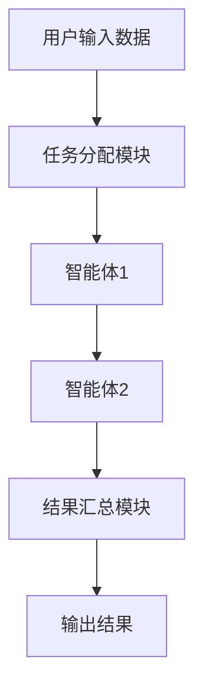

                 


# 利用多智能体系统评估公司的无形资产价值

> **关键词**：多智能体系统、无形资产评估、资产价值、系统架构、算法实现、项目实战

> **摘要**：本文探讨了利用多智能体系统评估公司无形资产的方法。通过分析多智能体系统的核心原理，构建评估模型，并详细讲解算法实现和系统架构设计。结合实际案例，展示了多智能体系统在无形资产评估中的应用效果，并提出了优化建议和未来发展方向。

---

## 第一部分：多智能体系统与无形资产评估背景介绍

### 第1章：多智能体系统概述

#### 1.1 多智能体系统的定义与特点
多智能体系统（Multi-Agent System, MAS）是由多个智能体组成的系统，这些智能体能够自主决策、协作完成任务。其特点包括分布性、自治性、反应性和协作性。与传统单智能体系统相比，MAS能够处理复杂环境下的任务分配和协调。

#### 1.2 无形资产的定义与分类
无形资产是指公司拥有的非实物资产，如专利、商标、品牌、客户关系等。它们难以用传统财务方法准确评估，但对公司的价值贡献不容忽视。

### 第2章：无形资产的定义与分类

#### 2.1 无形资产的定义
无形资产是企业长期积累的资源，具有长期性和不可见性。其价值往往体现在企业的竞争力和市场地位上。

#### 2.2 无形资产的主要分类
无形资产可以分为四类：
1. **技术类**：专利、技术诀窍。
2. **法律类**：商标、版权。
3. **关系类**：客户关系、供应商关系。
4. **品牌类**：品牌价值、商誉。

#### 2.3 无形资产评估的挑战与意义
评估无形资产的挑战包括数据获取难、评估标准不统一等。其意义在于准确反映企业价值，为投资决策提供支持。

---

## 第二部分：多智能体系统评估无形资产的核心概念与联系

### 第3章：多智能体系统评估无形资产的原理

#### 3.1 多智能体系统在无形资产评估中的作用
MAS通过多个智能体协作，分别评估不同类型的无形资产，最后汇总结果，提供综合评估。

#### 3.2 多智能体系统评估无形资产的核心要素
包括智能体、任务分配、协作机制、评估指标等。

#### 3.3 多智能体系统与无形资产评估的联系
MAS提供了一种分布式的评估方法，能够处理复杂性和不确定性。

### 第4章：多智能体系统评估无形资产的模型构建

#### 4.1 评估模型的基本结构
模型由多个智能体组成，每个智能体负责评估特定资产类别。

#### 4.2 多智能体系统在模型中的角色
各智能体负责数据收集、分析和评估，最后汇总结果。

#### 4.3 模型构建的步骤与方法
1. 确定评估指标。
2. 设计智能体功能。
3. 定义智能体间交互规则。

---

## 第三部分：多智能体系统评估无形资产的算法原理

### 第5章：评估模型的数学模型与公式

#### 5.1 评估模型的基本假设
假设各智能体评估结果独立，且评估指标权重已知。

#### 5.2 评估模型的数学表达
综合评估值为各智能体评估值的加权平均：
$$ V = \sum_{i=1}^{n} w_i \cdot v_i $$
其中，$w_i$为权重，$v_i$为智能体i的评估值。

#### 5.3 具体评估公式的推导与解释
例如，专利评估公式：
$$ V_{\text{patent}} = w_1 \cdot Q + w_2 \cdot R $$
其中，Q为技术先进性，R为市场应用前景。

### 第6章：评估算法的实现与优化

#### 6.1 算法的基本流程
1. 初始化智能体。
2. 分配任务。
3. 智能体独立评估。
4. 汇总结果。

#### 6.2 算法的优化策略
采用分布式计算和并行处理，提高评估效率。

#### 6.3 算法实现的代码示例
```python
class Agent:
    def __init__(self, id):
        self.id = id
        self.result = 0

def evaluate_agents(agents):
    for agent in agents:
        # 智能体评估逻辑
        agent.result = calculate_score(agent)
        
    return agents

def calculate_score(agent):
    # 示例评估函数
    return agent.id * 0.5 + 10
```

---

## 第四部分：系统分析与架构设计

### 第7章：项目背景与目标

#### 7.1 项目背景介绍
随着企业无形资产的重要性增加，准确评估其价值成为企业决策的关键。

#### 7.2 项目目标与范围
开发一个多智能体系统，实现对公司无形资产的综合评估。

#### 7.3 项目实施的意义
提高评估的准确性和效率，为企业决策提供支持。

### 第8章：系统功能设计

#### 8.1 系统功能模块划分
1. **数据输入**：接收评估数据。
2. **任务分配**：分配评估任务给各智能体。
3. **评估计算**：智能体进行评估。
4. **结果汇总**：整合各智能体结果。

#### 8.2 功能模块的交互流程
数据输入 -> 任务分配 -> 评估计算 -> 结果汇总。

#### 8.3 系统功能的实现方式
采用模块化设计，各模块独立开发后集成。

### 第9章：系统架构设计

#### 9.1 系统架构的总体设计
采用分层架构：数据层、业务逻辑层和表现层。

#### 9.2 系统架构的详细设计
使用微服务架构，各智能体独立运行。

#### 9.3 系统架构的优缺点分析
优点：可扩展性强；缺点：需要复杂的协调机制。

### 第10章：系统接口与交互设计

#### 10.1 系统接口的设计规范
使用RESTful API，支持JSON格式数据交互。

#### 10.2 系统交互的流程图
使用mermaid绘制交互流程图：



#### 10.3 系统接口的实现方式
使用Python的Flask框架搭建API接口。

---

## 第五部分：项目实战

### 第11章：环境配置

#### 11.1 开发环境安装
安装Python、Flask框架、相关库。

#### 11.2 项目依赖管理
使用pip管理依赖，创建`requirements.txt`文件。

### 第12章：核心代码实现

#### 12.1 核心代码实现
```python
from flask import Flask, request, jsonify
import json

app = Flask(__name__)

@app.route('/evaluate', methods=['POST'])
def evaluate():
    data = json.loads(request.data)
    agents = [Agent(i) for i in range(data['num_agents'])]
    evaluate_agents(agents)
    results = [agent.result for agent in agents]
    return jsonify(results)

if __name__ == '__main__':
    app.run(debug=True)
```

#### 12.2 代码解读与分析
展示如何接收数据、分配任务和返回结果。

### 第13章：案例分析

#### 13.1 案例背景介绍
以某科技公司为例，评估其专利和技术诀窍的价值。

#### 13.2 数据准备与处理
收集专利数量、技术先进性等数据。

#### 13.3 评估结果与分析
通过系统评估，得出综合价值，分析结果的意义。

### 第14章：项目总结

#### 14.1 项目总结
说明项目的完成情况和取得的成果。

#### 14.2 成功经验
总结系统设计和实现的成功经验。

#### 14.3 改进建议
提出未来优化的方向，如提高评估模型的精度。

---

## 第六部分：总结与展望

### 第15章：总结

#### 15.1 核心内容回顾
总结多智能体系统评估无形资产的核心方法和实现步骤。

#### 15.2 多智能体系统的优势
提高评估效率和准确性，适应复杂环境。

### 第16章：展望

#### 16.1 未来发展方向
探索更先进的算法和架构，如基于深度学习的智能体。

#### 16.2 技术进步与应用
随着AI技术的发展，MAS在无形资产评估中的应用将更加广泛。

---

## 结束语

通过本文的详细讲解，读者可以全面了解多智能体系统在无形资产评估中的应用，并能够实际操作相关技术。未来，随着技术的进步，MAS将在更多领域发挥重要作用。

---

## 关键词

- 多智能体系统
- 无形资产评估
- 资产价值
- 系统架构
- 算法实现
- 项目实战

