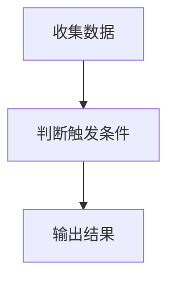
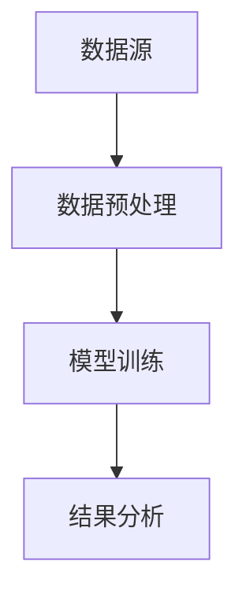

                 


# 利用多智能体系统识别潜在的破产重组机会

## 关键词：多智能体系统，破产重组，人工智能，算法原理，系统架构

## 摘要：本文探讨了利用多智能体系统（MAS）识别潜在的破产重组机会的方法，分析了MAS在破产重组识别中的优势，详细讲解了基于规则和基于学习的算法原理，并通过Mermaid图和Python代码示例展示了系统架构和实现过程。

---

# 第一部分: 多智能体系统与破产重组识别基础

## 第1章: 背景介绍

### 1.1 问题背景与描述
#### 1.1.1 破产重组的定义与重要性
企业破产重组是指企业因无法偿还债务而进行的债务调整和资产重新配置。及时识别潜在的破产重组机会，可以帮助债权人、投资者等利益相关者做出更明智的决策。

#### 1.1.2 多智能体系统在金融领域的应用潜力
多智能体系统（MAS）通过模拟多个智能体之间的交互，能够捕捉复杂的市场动态，为金融决策提供支持。

#### 1.1.3 传统破产重组识别方法的局限性
传统方法依赖财务指标，但忽视了市场环境和利益相关者的互动，可能导致判断失误。

### 1.2 多智能体系统的优势与独特性
#### 1.2.1 多智能体系统的核心优势
- **分布式智能**：多个智能体协同工作，提高系统的整体智能性。
- **动态适应性**：智能体能够实时响应环境变化，增强系统的适应性。

#### 1.2.2 研究问题的边界与外延
研究仅限于企业破产前的早期识别，不涉及重组后的管理优化。

#### 1.2.3 核心概念结构与要素组成
破产重组识别涉及企业财务状况、市场环境和利益相关者的互动。

### 1.3 本章小结
本章介绍了破产重组识别的重要性，分析了MAS的优势，并明确了研究的边界。

---

## 第2章: 多智能体系统与破产重组识别的核心概念

### 2.1 多智能体系统的定义与特点
#### 2.1.1 多智能体系统的定义
MAS由多个智能体组成，能够自主决策并协同工作。

#### 2.1.2 多智能体系统的特征
- **自主性**：智能体独立决策。
- **反应性**：能感知环境并实时调整。

#### 2.1.3 多智能体系统与传统系统的主要区别
MAS更灵活，适应性强，但复杂性更高。

### 2.2 破产重组识别的关键要素
#### 2.2.1 企业财务状况分析
包括财务比率和现金流分析。

#### 2.2.2 市场环境与企业行为
考虑行业趋势和竞争状况。

#### 2.2.3 利益相关者互动
分析债权人、股东等的互动对破产的影响。

### 2.3 多智能体系统与破产重组识别的关联
#### 2.3.1 系统架构与功能模块
- 数据收集模块：获取企业财务数据。
- 智能体交互模块：模拟各利益相关者的决策。

#### 2.3.2 数据流与信息交互
数据从企业流向分析模块，智能体根据数据做出决策。

#### 2.3.3 实体关系图（ER图）与 Mermaid 流程图
```mermaid
erd
    entity 企业 {
        key 财务指标
        attribute 现金流
    }
    entity 利益相关者 {
        key 互动数据
        attribute 决策
    }
    entity 市场环境 {
        key 趋势
        attribute 竞争状况
    }
```

### 2.4 本章小结
本章详细介绍了MAS的核心概念，并通过ER图展示了系统架构。

---

## 第3章: 多智能体系统识别破产重组机会的算法原理

### 3.1 算法原理概述
#### 3.1.1 基于规则的多智能体算法
- **规则定义**：设定破产迹象的触发条件。
- **流程**：
  1. 收集企业财务数据。
  2. 智能体根据规则判断是否触发破产迹象。



#### 3.1.2 基于学习的多智能体算法
- **学习机制**：使用机器学习模型，如随机森林，进行预测。

### 3.2 算法实现与数学模型
#### 3.2.1 基于规则的算法实现
```python
def check bankruptcy(finance_data):
    if finance_data['现金流'] < 0 and finance_data['负债率'] > 80:
        return True
    else:
        return False
```

#### 3.2.2 基于学习的算法实现
```python
import pandas as pd
from sklearn.ensemble import RandomForestClassifier

# 训练模型
model = RandomForestClassifier()
model.fit(X_train, y_train)

# 预测
prediction = model.predict(X_test)
```

#### 3.2.3 数学模型与公式
- 破产概率模型：
  $$ P(bankruptcy) = \beta_0 + \beta_1 X_1 + \beta_2 X_2 + \epsilon $$
  其中，$X_1$ 和 $X_2$ 是财务指标，$\beta$ 是系数。

### 3.3 本章小结
本章介绍了两种算法，并提供了实现代码和数学模型。

---

## 第4章: 系统分析与架构设计方案

### 4.1 系统分析
#### 4.1.1 问题场景介绍
企业面临财务危机，需要及时识别重组机会。

#### 4.1.2 系统功能需求
- 数据采集：收集企业财务数据。
- 模型训练：训练破产预测模型。
- 结果分析：输出预测结果。

### 4.2 系统架构设计
#### 4.2.1 系统架构图


#### 4.2.2 功能模块设计
- 数据预处理模块：清洗和转换数据。
- 模型训练模块：训练破产预测模型。
- 结果分析模块：生成报告和可视化。

### 4.3 系统接口设计
- API接口：供其他系统调用。

### 4.4 本章小结
本章详细描述了系统的架构设计和功能模块。

---

## 第5章: 项目实战

### 5.1 环境安装
- 安装Python和相关库（如pandas、scikit-learn）。

### 5.2 系统核心实现
```python
import pandas as pd
from sklearn.ensemble import RandomForestClassifier

# 加载数据
data = pd.read_csv('bankruptcy_data.csv')

# 划分数据集
X = data.drop('bankruptcy', axis=1)
y = data['bankruptcy']

# 训练模型
model = RandomForestClassifier()
model.fit(X, y)

# 预测
predictions = model.predict(X)
```

### 5.3 代码解读与分析
- 数据预处理：处理缺失值和标准化。
- 模型训练：使用随机森林进行分类。
- 结果分析：评估模型性能。

### 5.4 实际案例分析
以某公司为例，分析其财务数据，预测破产可能性。

### 5.5 本章小结
本章通过实际案例展示了系统的实现过程。

---

## 第6章: 总结与展望

### 6.1 核心观点总结
MAS在破产重组识别中具有显著优势，能提供更准确的预测。

### 6.2 本书的创新点与局限性
- 创新点：首次将MAS应用于破产重组识别。
- 局限性：数据质量和模型解释性需进一步研究。

### 6.3 未来研究方向
- 探索更先进的学习算法。
- 提高系统的实时性和互动性。

### 6.4 最佳实践 Tips
- 数据质量是关键。
- 模型解释性需考虑。

### 6.5 本章小结
总结全书内容，展望未来研究方向。

---

## 附录

### 附录A: 术语表
列出书中使用的专业术语及其定义。

### 附录B: 参考文献
列出参考文献和相关资料。

---

# 结语
本文系统地探讨了利用多智能体系统识别潜在的破产重组机会的方法，通过理论分析和实践案例，展示了MAS在金融领域的应用潜力。希望本文能为相关研究和实践提供有价值的参考。

---

