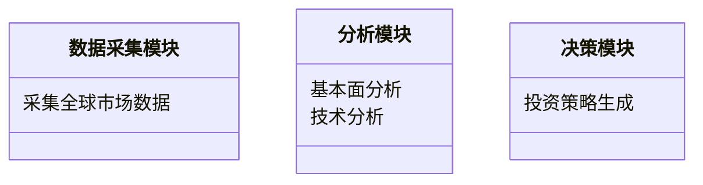
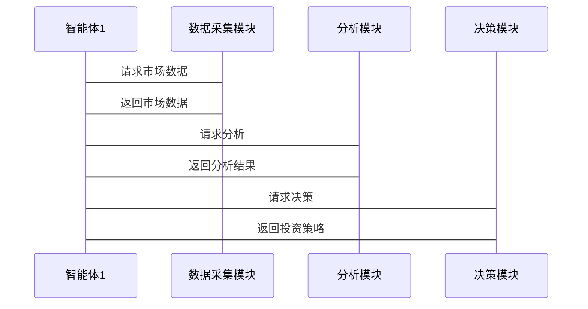

                 


# 利用多智能体系统进行全球价值投资机会筛选

## 关键词：
多智能体系统、全球价值投资、机会筛选、算法原理、系统架构、项目实战

## 摘要：
本文将详细探讨如何利用多智能体系统进行全球价值投资机会的筛选。从多智能体系统的定义和特点出发，分析其在金融领域的应用潜力，结合全球价值投资的基本原理，详细阐述多智能体系统的算法原理、数学模型和系统架构设计。通过实际案例展示多智能体系统在价值投资中的优势，并提供项目实现与优化的策略。

---

# 第1章: 多智能体系统的基本概念

## 1.1 多智能体系统的定义与特点

### 1.1.1 多智能体系统的定义
多智能体系统（Multi-Agent System, MAS）是由多个相互作用的智能体组成的系统，这些智能体能够通过环境感知、信息处理和决策制定来实现特定目标。

### 1.1.2 多智能体系统的五大核心特点
| 特点 | 描述 |
|------|------|
| 分布性 | 每个智能体独立运行，任务分解 |
| 协作性 | 智能体之间协同完成复杂任务 |
| 反应性 | 能够实时感知环境变化并做出反应 |
| 自主性 | 智能体具备自主决策能力 |
| 多样性 | 智能体功能和目标多样化 |

### 1.1.3 多智能体系统与传统单智能体系统的区别
| 属性 | 多智能体系统 | 单智能体系统 |
|------|------|------|
| 决策中心 | 分布式决策 | 中央决策 |
| 信息处理 | 去中心化信息共享 | 中心化信息处理 |
| 灵活性 | 高 | 低 |

## 1.2 多智能体系统在金融领域的应用潜力

### 1.2.1 金融领域的复杂性与多智能体系统的契合点
- 金融市场涉及多方利益相关者，适合多智能体系统的分布式决策。
- 多智能体系统能够处理海量数据，适应金融市场高频变化。

### 1.2.2 多智能体系统在投资决策中的优势
- 提高决策效率：通过分布式计算和并行处理，加快投资决策速度。
- 增强决策准确性：多个智能体协同分析，降低单一决策的偏差。

### 1.2.3 全球价值投资机会筛选中的应用场景
- 全球市场监控：实时跟踪全球市场动态，发现投资机会。
- 风险分散：通过多智能体系统的协同，降低投资组合风险。

---

# 第2章: 全球价值投资的基本原理

## 2.1 全球价值投资的定义与特点

### 2.1.1 价值投资的核心理念
价值投资强调以低于内在价值的价格购买优质资产，长期持有的投资策略。

### 2.1.2 全球化视角下的价值投资策略
- 全球市场分析：考虑不同国家和地区的经济状况、政策环境。
- 行业比较：寻找具有竞争优势的行业和企业。

### 2.1.3 价值投资与多智能体系统的结合点
- 数据采集：多智能体系统实时采集全球市场数据。
- 分析处理：多个智能体协同分析，识别低估资产。

## 2.2 价值投资中的关键分析维度

### 2.2.1 公司基本面分析
- 财务指标：收入、利润、资产负债率等。
- 行业地位：市场占有率、竞争优势。

### 2.2.2 行业分析与宏观经济因素
- 宏观经济指标：GDP增长率、利率、通货膨胀率。
- 行业趋势：技术进步、政策变化。

### 2.2.3 市场情绪与投资者行为分析
- 市场情绪指标：波动率、投资者信心指数。
- 行为分析：投资者交易模式识别。

---

# 第3章: 多智能体系统在价值投资中的优势

## 3.1 多智能体系统的协同效应

### 3.1.1 不同智能体的分工与协作
- 数据采集智能体：实时采集全球市场数据。
- 分析智能体：进行基本面和技术分析。
- 决策智能体：基于分析结果制定投资策略。

### 3.1.2 多智能体系统在信息处理中的优势
- 并行处理：多个智能体同时处理不同数据源。
- 信息共享：智能体间共享信息，提高整体分析能力。

### 3.1.3 协同决策的效率与准确性提升
- 分布式决策：避免单点决策风险。
- 集智决策：多个智能体协同，降低决策偏差。

## 3.2 多智能体系统在风险控制中的应用

### 3.2.1 风险评估的多维度分析
- 市场风险：波动率、相关性分析。
- 信用风险：企业信用评级、违约概率。

### 3.2.2 多智能体系统的风险预警机制
- 实时监控：智能体实时监测市场风险。
- 预警触发：当风险指标超过阈值时，触发预警。

### 3.2.3 风险分散与投资组合优化
- 投资组合优化：通过智能体协同，优化资产配置。
- 风险分散：通过多智能体分析，分散投资风险。

---

# 第4章: 多智能体系统的算法原理

## 4.1 多智能体系统的算法选择

### 4.1.1 强化学习算法
- Q-learning：通过奖励机制优化决策。
- Deep Q-Network（DQN）：深度强化学习，适用于复杂环境。

### 4.1.2 协同过滤算法
- 基于用户的协同过滤：寻找相似投资者的行为模式。
- 基于项目的协同过滤：分析相似金融产品的表现。

### 4.1.3 分布式计算与并行处理
- MapReduce：分布式数据处理框架。
- Apache Spark：内存计算框架，提升处理速度。

## 4.2 多智能体系统中的通信机制

### 4.2.1 智能体间的通信协议
- 基于消息队列的通信：Kafka、RabbitMQ。
- RESTful API：智能体间通过API交互。

### 4.2.2 信息同步与一致性维护
- 分布式一致性算法：Raft、Paxos。
- 消息确认机制：确保信息传递可靠。

### 4.2.3 通信效率的优化策略
- 分片处理：将数据分片处理，减少通信开销。
- 压缩技术：数据压缩减少传输数据量。

---

# 第5章: 多智能体系统的数学模型与公式

## 5.1 多智能体系统的数学建模

### 5.1.1 状态空间的定义与表示
$$ 状态空间 S = \{s_1, s_2, ..., s_n\} $$
其中，$s_i$ 表示智能体的状态。

### 5.1.2 动作空间的构建与优化
$$ 动作空间 A = \{a_1, a_2, ..., a_m\} $$
其中，$a_j$ 表示智能体可执行的动作。

### 5.1.3 奖励函数的设计与实现
$$ 奖励函数 R(s, a) = r_1 \times f_1 + r_2 \times f_2 + ... + r_k \times f_k $$
其中，$r_i$ 是奖励权重，$f_i$ 是评估指标。

## 5.2 典型算法的数学推导

### 5.2.1 强化学习的马尔可夫决策过程（MDP）
$$ MDP = (S, A, P, R, \gamma) $$
其中，$S$ 是状态空间，$A$ 是动作空间，$P$ 是转移概率矩阵，$R$ 是奖励函数，$\gamma$ 是折扣因子。

### 5.2.2 协同过滤的矩阵分解模型
$$ 矩阵分解模型：X = U \times V^T $$
其中，$U$ 和 $V$ 分别是用户和项目的特征矩阵。

### 5.2.3 分布式计算中的并行算法
$$ 并行计算公式：\sum_{i=1}^{n} f(i) = \sum_{i=1}^{k} f(i) \text{（其中k为分片数）} $$

---

# 第6章: 多智能体系统的实现与优化

## 6.1 系统架构设计

### 6.1.1 分层架构设计


### 6.1.2 模块化设计原则


### 6.1.3 可扩展性与可维护性优化
- 模块化设计：每个模块独立开发，便于维护。
- 插件机制：支持新增智能体模块。

## 6.2 系统性能优化策略

### 6.2.1 并行计算与分布式处理
$$ 并行处理公式：T_{total} = \frac{T_1 + T_2 + ... + T_n}{n} $$
其中，$T_i$ 是每个智能体的处理时间。

### 6.2.2 网络通信的延迟优化
- 分片处理：减少数据传输量。
- 本地计算：尽可能在本地处理数据，减少网络依赖。

### 6.2.3 通信效率的优化策略
- 使用高效通信协议：如HTTP/2。
- 压缩数据：减少数据传输量。

---

# 第7章: 项目实战

## 7.1 项目背景与目标
- 项目目标：利用多智能体系统筛选全球价值投资机会。
- 项目背景：全球金融市场复杂多变，需要高效的投资决策工具。

## 7.2 项目实现步骤

### 7.2.1 环境配置
- 安装Python：`python --version`
- 安装依赖库：`pip install numpy pandas requests`

### 7.2.2 数据采集模块实现
```python
import requests

def get_market_data(symbol):
    url = f"https://api.example.com/{symbol}"
    response = requests.get(url)
    return response.json()
```

### 7.2.3 分析模块实现
```python
import numpy as np

def fundamental_analysis(data):
    # 计算市盈率
    pe = data['price'] / data['eps']
    return pe
```

### 7.2.4 决策模块实现
```python
def investment_strategy(pe, market_trend):
    if pe < 15 and market_trend == 'up':
        return 'buy'
    else:
        return 'hold'
```

### 7.2.5 系统交互流程


## 7.3 实际案例分析
- 数据来源：全球主要股票市场数据。
- 分析结果：某公司市盈率低于行业平均水平，且市场趋势向好。
- 决策结果：投资策略为“买入”。

---

# 第8章: 最佳实践与总结

## 8.1 最佳实践 tips
- 数据质量：确保数据来源可靠，处理准确。
- 系统维护：定期更新算法，适应市场变化。
- 团队协作：多智能体系统需要跨学科团队合作。

## 8.2 小结
多智能体系统通过协同合作，显著提升了全球价值投资机会筛选的效率和准确性。其分布式计算和并行处理能力，使其在复杂金融市场中具备独特优势。

## 8.3 注意事项
- 系统安全：防止数据泄露和网络攻击。
- 模型更新：定期更新智能体模型，适应市场变化。
- 风险控制：建立有效的风险预警机制。

## 8.4 拓展阅读
- 推荐书籍：《分布式系统：概念与设计》
- 推荐论文：《Multi-Agent Systems in Financial Markets》

---

# 结语
通过本篇文章，我们详细探讨了如何利用多智能体系统进行全球价值投资机会的筛选。从理论到实践，从算法到系统设计，全面展示了多智能体系统在金融领域的强大应用潜力。希望本文能为读者提供有价值的参考和启发。

