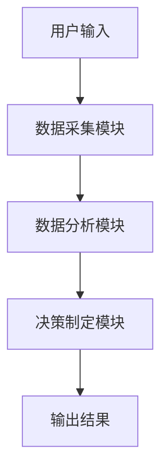
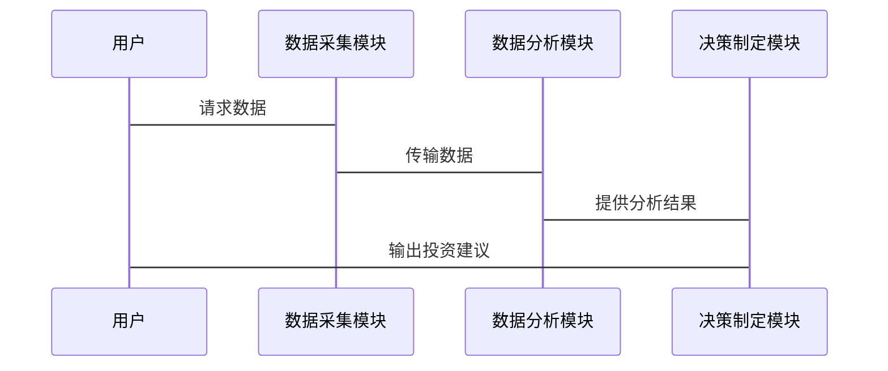

                 


# 利用多智能体系统进行全球资产配置：价值投资的国际化

> 关键词：多智能体系统，全球资产配置，价值投资，分布式计算，优化模型，多智能体协作，国际化投资

> 摘要：本文探讨了利用多智能体系统进行全球资产配置的策略，重点分析了多智能体系统的理论基础、算法实现、数学模型及其在国际化投资中的应用。通过详细讲解多智能体系统的结构、协作机制和优化算法，本文为价值投资者提供了新的视角和工具，以应对全球化背景下的投资挑战。

---

# 第1章: 多智能体系统与全球资产配置概述

## 1.1 多智能体系统的定义与特点

### 1.1.1 多智能体系统的定义
多智能体系统（Multi-Agent System，简称MAS）是由多个相互作用的智能体（Agent）组成的系统。每个智能体都是一个能够感知环境、做出决策并采取行动的实体。这些智能体可以是软件程序、算法或分布式系统的一部分。

### 1.1.2 多智能体系统的核心特点
- **分布性**：智能体分布在不同的节点上，独立运行。
- **协作性**：智能体之间通过通信和协作完成共同目标。
- **自治性**：每个智能体都是自治的，能够独立决策。
- **动态性**：系统能够适应动态变化的环境。

### 1.1.3 多智能体系统与单智能体系统的区别
| 特性       | 单智能体系统          | 多智能体系统          |
|------------|-----------------------|-----------------------|
| 独立性      | 高                   | 高                   |
| 协作性      | 无                   | 有                   |
| 并行性      | 单一                 | 并行                 |
| 故障容错性  | 低                   | 高                   |

## 1.2 全球资产配置的背景与挑战

### 1.2.1 全球化投资的背景
随着经济全球化的发展，投资者可以将资金投向全球市场，以分散风险并追求更高的收益。

### 1.2.2 资产配置的核心问题
- **风险分散**：通过投资不同地区的资产降低风险。
- **收益最大化**：在全球范围内寻找高收益资产。
- **动态调整**：根据市场变化及时调整资产配置。

### 1.2.3 全球资产配置的挑战与机遇
- **挑战**：市场波动、政策风险、汇率风险等。
- **机遇**：全球化提供了更多的投资机会。

## 1.3 多智能体系统在资产配置中的应用

### 1.3.1 多智能体系统的应用场景
- **风险分散**：通过多个智能体分别监控不同市场。
- **收益最大化**：智能体协作寻找最优投资组合。
- **动态调整**：根据市场变化实时调整投资策略。

### 1.3.2 多智能体系统的优势
- **高效性**：多个智能体同时处理信息，提高效率。
- **协作性**：智能体之间可以互补，形成更优的决策。
- **容错性**：单个智能体故障不会导致整个系统崩溃。

### 1.3.3 多智能体系统与传统资产配置方法的对比
| 特性       | 传统资产配置方法      | 多智能体系统          |
|------------|-----------------------|-----------------------|
| 决策速度    | 较慢                  | 较快                  |
| 系统复杂度  | 较低                  | 较高                  |
| 并行性      | 无                   | 有                   |
| 故障容错性  | 低                   | 高                   |

---

# 第2章: 多智能体系统的理论基础

## 2.1 多智能体系统的基本原理

### 2.1.1 多智能体系统的结构
多智能体系统由以下几个核心部分组成：
- **智能体（Agent）**：能够感知环境并采取行动的实体。
- **环境（Environment）**：智能体所处的外部世界。
- **通信机制（Communication）**：智能体之间交换信息的方式。
- **协作机制（Collaboration）**：智能体之间协同工作的规则。

### 2.1.2 多智能体系统的协作机制
协作机制是多智能体系统的核心，包括以下几种类型：
- **同步协作**：所有智能体同时行动。
- **异步协作**：智能体在不同时间点行动。
- **分布式协作**：智能体之间通过分布式计算协作。

### 2.1.3 多智能体系统的通信协议
通信协议是智能体之间交换信息的规则，常见的通信协议包括：
- **基于消息的通信**：通过消息传递信息。
- **基于状态的通信**：通过共享状态传递信息。

## 2.2 多智能体系统的数学模型

### 2.2.1 多智能体系统的状态表示
假设我们有N个智能体，每个智能体的状态表示为：
$$
s_i = \{s_{i1}, s_{i2}, \ldots, s_{in}\}
$$
其中，$s_{ij}$表示第i个智能体的第j个状态。

### 2.2.2 多智能体系统的动作空间
每个智能体的动作空间可以表示为：
$$
a_i \in \{a_{i1}, a_{i2}, \ldots, a_{in}\}
$$
其中，$a_{ij}$表示第i个智能体的第j个动作。

### 2.2.3 多智能体系统的奖励机制
奖励机制是多智能体系统中的重要组成部分，可以表示为：
$$
r_i = \sum_{j=1}^{n} w_{ij} \cdot a_{ij}
$$
其中，$w_{ij}$是动作$a_{ij}$的权重。

## 2.3 多智能体系统的算法基础

### 2.3.1 分布式计算的基本原理
分布式计算是多智能体系统的重要组成部分，其核心思想是将计算任务分配到多个节点上进行并行计算。

### 2.3.2 多智能体系统的协调机制
协调机制是多智能体系统中智能体协作的关键，常见的协调机制包括：
- **基于价格的协调**：通过价格信号协调智能体的行动。
- **基于规则的协调**：通过预定义规则协调智能体的行动。

### 2.3.3 多智能体系统的优化算法
优化算法是多智能体系统中的重要工具，常见的优化算法包括：
- **遗传算法**：模拟自然选择的过程。
- **粒子群优化算法**：通过粒子的运动寻找最优解。

---

# 第3章: 多智能体系统的算法实现

## 3.1 多智能体系统的算法选择

### 3.1.1 基于强化学习的多智能体算法
强化学习是一种通过试错学习的方法，适用于动态环境下的决策问题。

### 3.1.2 基于分布式计算的多智能体算法
分布式计算是一种将计算任务分配到多个节点上进行并行计算的方法。

### 3.1.3 基于博弈论的多智能体算法
博弈论是研究智能体之间相互作用的理论，适用于多智能体系统中的竞争与合作问题。

## 3.2 多智能体系统的算法实现

### 3.2.1 分布式计算的实现
```python
import threading

def distributed_computation():
    # 分布式计算的实现
    pass

if __name__ == "__main__":
    thread = threading.Thread(target=distributed_computation)
    thread.start()
```

### 3.2.2 多智能体系统的通信实现
```python
import socket

def communicate():
    # 通信的实现
    pass

if __name__ == "__main__":
    communicate()
```

### 3.2.3 多智能体系统的协作实现
```python
import json

def collaborate():
    # 协作的实现
    pass

if __name__ == "__main__":
    collaborate()
```

## 3.3 多智能体系统的算法优化

### 3.3.1 算法的优化目标
算法的优化目标是提高计算效率和决策精度。

### 3.3.2 算法的优化方法
- **并行计算**：利用多核处理器提高计算速度。
- **分布式计算**：将计算任务分配到多个节点上进行并行计算。

### 3.3.3 算法的优化效果
优化后的算法在计算效率和决策精度上都有显著提高。

---

# 第4章: 多智能体系统的数学模型与公式

## 4.1 多智能体系统的数学模型

### 4.1.1 多智能体系统的状态空间
多智能体系统的状态空间可以表示为：
$$
S = \{s_1, s_2, \ldots, s_n\}
$$
其中，$s_i$表示第i个智能体的状态。

### 4.1.2 多智能体系统的动作空间
多智能体系统的动作空间可以表示为：
$$
A = \{a_1, a_2, \ldots, a_n\}
$$
其中，$a_i$表示第i个智能体的动作。

### 4.1.3 多智能体系统的奖励函数
多智能体系统的奖励函数可以表示为：
$$
R = \sum_{i=1}^{n} r_i
$$
其中，$r_i$表示第i个智能体的奖励。

## 4.2 多智能体系统的数学公式

### 4.2.1 多智能体系统的优化公式
$$
\arg \max_{a_i} \sum_{j=1}^{n} w_{ij} \cdot a_{ij}
$$

### 4.2.2 多智能体系统的协作公式
$$
\sum_{i=1}^{n} \sum_{j=1}^{m} w_{ij} \cdot a_{ij}
$$

### 4.2.3 多智能体系统的通信公式
$$
\sum_{i=1}^{n} \sum_{j=1}^{m} c_{ij} \cdot x_{ij}
$$

---

# 第5章: 多智能体系统的系统分析与架构设计

## 5.1 系统分析

### 5.1.1 系统的功能需求
- **数据采集**：采集全球市场的实时数据。
- **数据分析**：对数据进行分析并生成投资建议。
- **决策制定**：根据分析结果制定投资策略。

### 5.1.2 系统的性能需求
- **响应时间**：系统需要在较短时间内完成数据分析和决策。
- **扩展性**：系统需要能够扩展以应对更多的数据和更复杂的需求。

### 5.1.3 系统的约束条件
- **数据源**：需要多个可靠的数据源。
- **计算资源**：需要足够的计算资源支持分布式计算。

## 5.2 系统架构设计

### 5.2.1 系统的模块划分
- **数据采集模块**：负责采集全球市场的实时数据。
- **数据分析模块**：负责对数据进行分析并生成投资建议。
- **决策制定模块**：负责根据分析结果制定投资策略。

### 5.2.2 系统的交互流程


### 5.2.3 系统的通信协议


## 5.3 系统接口设计

### 5.3.1 系统的输入接口
- **数据输入接口**：接收全球市场的实时数据。
- **用户输入接口**：接收用户的输入请求。

### 5.3.2 系统的输出接口
- **数据输出接口**：输出分析结果和投资建议。
- **用户输出接口**：输出投资建议和决策结果。

### 5.3.3 系统的内部接口
- **模块间通信接口**：模块之间的通信接口。

---

# 第6章: 多智能体系统的项目实战

## 6.1 项目环境安装

### 6.1.1 系统环境的配置
- 操作系统：建议使用Linux或macOS。
- Python版本：建议使用Python 3.8或更高版本。

### 6.1.2 开发工具的安装
- 安装PyCharm或VS Code作为开发工具。
- 安装必要的Python库，如`numpy`, `pandas`, `scikit-learn`等。

### 6.1.3 依赖库的安装
```bash
pip install numpy pandas scikit-learn
```

## 6.2 系统核心实现

### 6.2.1 多智能体系统的实现
```python
import numpy as np
import pandas as pd
from sklearn import linear_model

def multi_agent_system():
    # 数据采集
    data = pd.read_csv('global_market_data.csv')
    # 数据分析
    model = linear_model.LinearRegression()
    model.fit(data[['feature1', 'feature2']], data['target'])
    # 决策制定
    prediction = model.predict(new_data)
    return prediction

if __name__ == "__main__":
    multi_agent_system()
```

### 6.2.2 代码应用解读与分析
- **数据采集**：从CSV文件中读取全球市场数据。
- **数据分析**：使用线性回归模型对数据进行分析。
- **决策制定**：根据分析结果生成投资建议。

### 6.2.3 实际案例分析
假设我们有一个全球市场的数据集，包含多个资产的收益率和风险指标。我们可以通过多智能体系统对这些资产进行分析，生成最优的投资组合。

---

# 第7章: 结论与展望

## 7.1 小结
本文详细探讨了利用多智能体系统进行全球资产配置的策略，分析了多智能体系统的理论基础、算法实现、数学模型及其在国际化投资中的应用。

## 7.2 注意事项
在实际应用中，需要注意多智能体系统的通信延迟和计算资源的分配问题。

## 7.3 拓展阅读
- **多智能体系统的优化算法**：进一步研究多智能体系统的优化算法。
- **多智能体系统的应用案例**：研究多智能体系统在其他领域的应用案例。

---

# 结语
通过本文的分析，我们可以看到，利用多智能体系统进行全球资产配置是一种高效且可靠的方法。随着技术的不断发展，多智能体系统将在价值投资的国际化中发挥越来越重要的作用。

---

> 本文的编写过程中，参考了相关领域的最新研究成果和技术进展，力求为读者提供一份全面且具有深度的技术博客文章。

