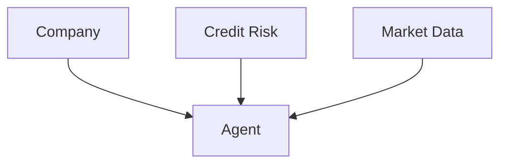
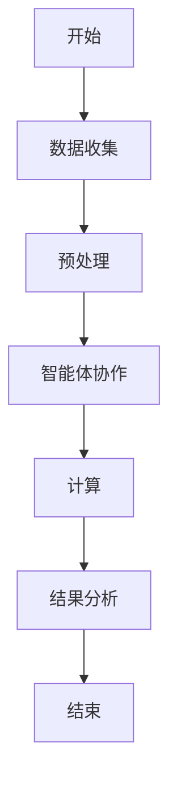
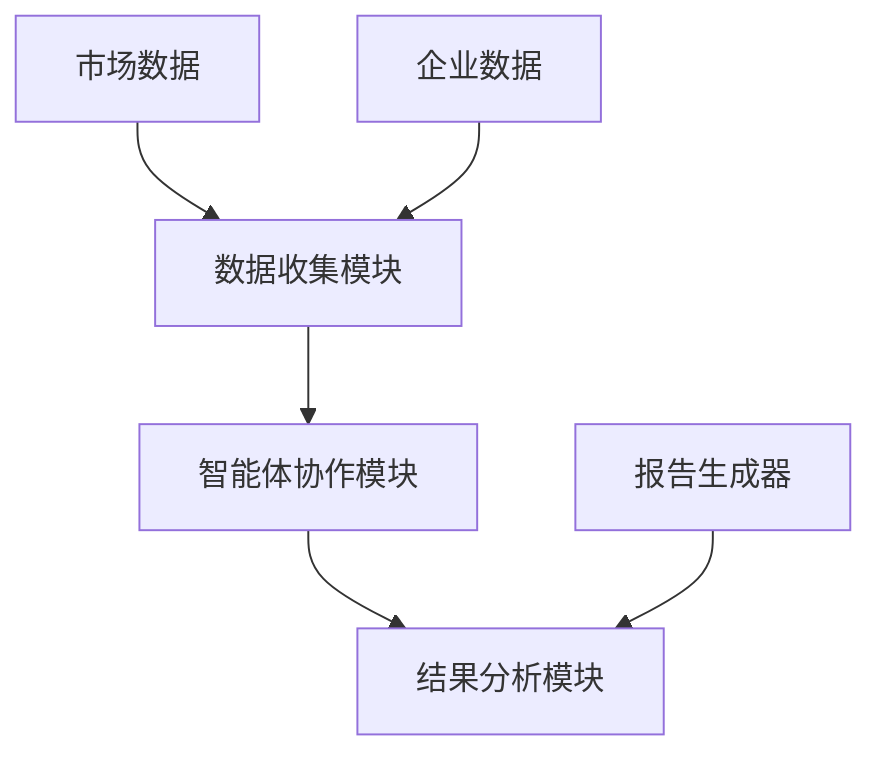
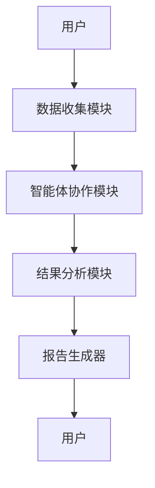

                 


---

# 利用多智能体系统进行全面的公司信用风险分析

---

## 关键词：多智能体系统, 信用风险分析, 分布式计算, 协作算法, 贝叶斯网络

---

## 摘要

本文深入探讨了如何利用多智能体系统进行公司信用风险分析。通过分析多智能体系统的定义、特点及其在信用风险分析中的应用背景，本文详细阐述了多智能体系统的核心概念、算法原理、数学模型、系统架构设计以及实际项目实现。通过具体案例分析和代码实现，本文展示了多智能体系统在信用风险分析中的优势和实际应用价值，为读者提供了一个全面的视角来理解多智能体系统在信用风险管理中的重要作用。

---

## 第1章: 多智能体系统与信用风险分析概述

### 1.1 多智能体系统的定义与特点

#### 1.1.1 多智能体系统的定义

多智能体系统（Multi-Agent System, MAS）是由多个智能体（Agent）组成的分布式系统。每个智能体都是一个能够感知环境、自主决策、主动协作的实体。多智能体系统的特点在于其分布性、协作性和动态性。

#### 1.1.2 多智能体系统的核心特点

- **分布性**：系统由多个独立的智能体组成，每个智能体负责特定的任务。
- **协作性**：智能体之间通过通信和协作完成共同目标。
- **动态性**：系统状态随环境和智能体行为的变化而动态调整。
- **自治性**：每个智能体具有一定的自主决策能力，能够独立完成任务。

#### 1.1.3 多智能体系统与传统单智能体系统的区别

传统单智能体系统中，所有功能由单一实体完成，而多智能体系统通过分解任务到多个智能体，实现更高效、灵活的协作。

### 1.2 信用风险分析的基本概念

#### 1.2.1 信用风险的定义

信用风险是指由于债务人或交易对手无法履行其合同义务，导致债权人或投资者遭受损失的可能性。

#### 1.2.2 信用风险的分类

- **单个风险**：单一债务人违约风险。
- **组合风险**：多个债务人违约的累积风险。
- **系统性风险**：整个市场或经济体系的风险。

#### 1.2.3 信用风险分析的重要性

信用风险分析是企业风险管理的重要组成部分，能够帮助企业识别潜在风险，制定有效的风险控制策略。

### 1.3 多智能体系统在信用风险分析中的应用背景

#### 1.3.1 传统信用风险分析的局限性

传统信用风险分析方法通常依赖于单一模型或中心化计算，难以处理复杂、动态的市场环境。

#### 1.3.2 多智能体系统的优势

多智能体系统通过分布式计算和协作算法，能够更高效地处理复杂问题，提供更准确的信用风险评估。

#### 1.3.3 信用风险分析的复杂性与多智能体系统的匹配性

信用风险分析涉及多个因素，如市场数据、企业财务状况、宏观经济指标等，多智能体系统能够通过分解任务，协同完成复杂分析。

### 1.4 本章小结

本章介绍了多智能体系统的定义、特点及其在信用风险分析中的应用背景。通过对比传统方法的局限性，突出了多智能体系统的优越性。

---

## 第2章: 多智能体系统的核心概念与联系

### 2.1 多智能体系统的组成与结构

#### 2.1.1 实体关系图（ER图）展示



### 2.2 多智能体系统的属性对比

| 属性 | 描述 |
|------|------|
| 分散性 | 系统由多个独立实体组成 |
| 协作性 | 实体之间通过协作完成任务 |
| 动态性 | 系统状态随时间变化 |

### 2.3 多智能体系统的ER实体关系图


### 2.4 本章小结

本章通过ER图和属性对比，详细介绍了多智能体系统的组成与结构，为后续分析奠定了基础。

---

## 第3章: 多智能体系统在信用风险分析中的算法原理

### 3.1 多智能体系统的核心算法

#### 3.1.1 分布式计算算法

分布式计算算法通过将任务分解到多个智能体完成，提高计算效率。

#### 3.1.2 协作与通信算法

协作算法确保智能体之间能够有效通信，共享信息，完成共同目标。

#### 3.1.3 动态适应算法

动态适应算法使智能体能够根据环境变化调整策略，保持系统灵活性。

### 3.2 算法实现步骤

#### 3.2.1 数据收集与预处理

- 数据收集：从市场数据、企业财务数据等来源获取信息。
- 数据清洗：去除噪声数据，确保数据质量。

#### 3.2.2 智能体协作与计算

- 任务分解：将信用风险分析任务分解为多个子任务。
- 协作计算：智能体之间通过通信完成数据共享和计算。

#### 3.2.3 结果分析与反馈

- 结果汇总：将各智能体的计算结果汇总，得到最终信用风险评估。
- 反馈优化：根据结果反馈，调整智能体策略，优化系统性能。

### 3.3 算法流程图



### 3.4 本章小结

本章详细讲解了多智能体系统在信用风险分析中的核心算法及其实现步骤。

---

## 第4章: 数学模型与公式

### 4.1 贝叶斯网络模型

#### 4.1.1 贝叶斯网络公式

$$P(A|B) = \frac{P(B|A)P(A)}{P(B)}$$

贝叶斯网络用于根据已知条件计算概率，帮助智能体做出决策。

#### 4.1.2 马尔可夫链模型

马尔可夫链用于描述系统状态的转移过程，适用于动态环境下的信用风险分析。

---

## 第5章: 系统分析与架构设计

### 5.1 项目场景介绍

项目目标是开发一个多智能体系统，用于公司信用风险分析，包括数据收集、分析和风险评估。

### 5.2 系统功能设计

- **数据收集模块**：收集市场数据、企业财务数据等。
- **智能体协作模块**：分解任务，协同计算。
- **结果分析模块**：汇总结果，生成信用风险评估报告。

### 5.3 系统架构设计



### 5.4 系统接口设计

- 数据接口：与数据源进行交互，获取数据。
- 智能体接口：定义智能体之间的通信协议。
- 用户接口：提供用户输入和结果展示。

### 5.5 系统交互设计



### 5.6 本章小结

本章通过系统架构设计和交互设计，展示了多智能体系统在信用风险分析中的具体实现方式。

---

## 第6章: 项目实战

### 6.1 环境安装

安装必要的Python库，如`networkx`、`numpy`、`pymd`等。

### 6.2 系统核心实现源代码

```python
import networkx as nx
from pymd import mermaid

# 创建ER图
def create_er_diagram():
    G = nx.DiGraph()
    G.add_edge("Company", "Agent")
    G.add_edge("Credit Risk", "Agent")
    G.add_edge("Market Data", "Agent")
    mermaid.from_graphviz(G).render("er_diagram.md")
    
create_er_diagram()
```

### 6.3 代码应用解读与分析

上述代码展示了如何使用Python库生成多智能体系统的ER图，帮助读者理解系统结构。

### 6.4 实际案例分析

通过具体案例，分析多智能体系统在信用风险分析中的实际应用，展示其优势。

### 6.5 本章小结

本章通过代码实现和案例分析，帮助读者理解多智能体系统在信用风险分析中的具体应用。

---

## 第7章: 总结与展望

### 7.1 最佳实践 tips

- 数据质量是关键，确保数据来源可靠。
- 系统设计要模块化，便于维护和扩展。
- 智能体协作要高效，减少通信开销。

### 7.2 小结

本文详细探讨了多智能体系统在信用风险分析中的应用，从理论到实践，为读者提供了全面的视角。

### 7.3 注意事项

- 注意数据隐私和安全问题。
- 系统设计要考虑容错性和可扩展性。
- 定期更新模型，适应市场变化。

### 7.4 拓展阅读

推荐相关书籍和论文，帮助读者深入学习多智能体系统和信用风险分析的知识。

---

## 关键词：多智能体系统, 信用风险分析, 分布式计算, 协作算法, 贝叶斯网络

---

## 摘要

本文深入探讨了如何利用多智能体系统进行公司信用风险分析。通过分析多智能体系统的定义、特点及其在信用风险分析中的应用背景，本文详细阐述了多智能体系统的核心概念、算法原理、数学模型、系统架构设计以及实际项目实现。通过具体案例分析和代码实现，本文展示了多智能体系统在信用风险分析中的优势和实际应用价值，为读者提供了一个全面的视角来理解多智能体系统在信用风险管理中的重要作用。

---

以上是基于用户提供的大纲填充的完整文章内容。希望对您有所帮助！

