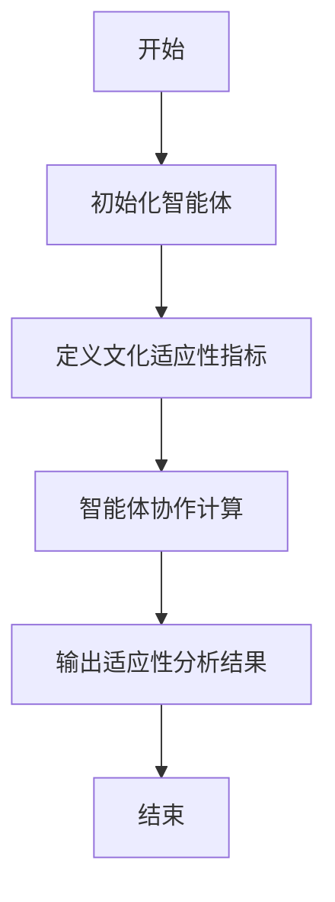
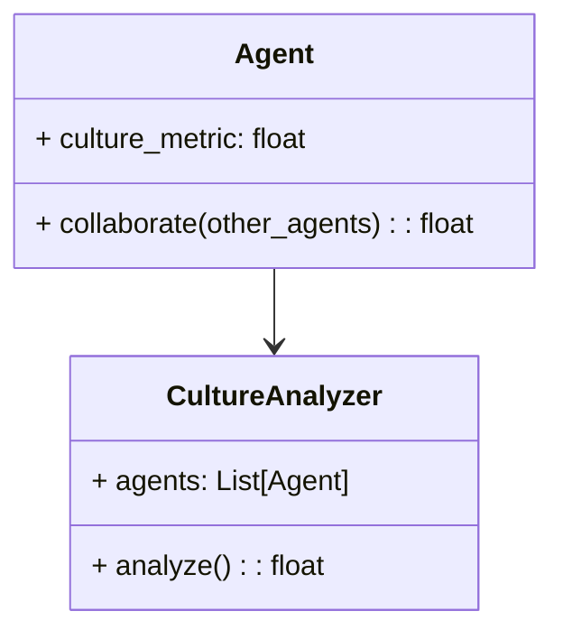
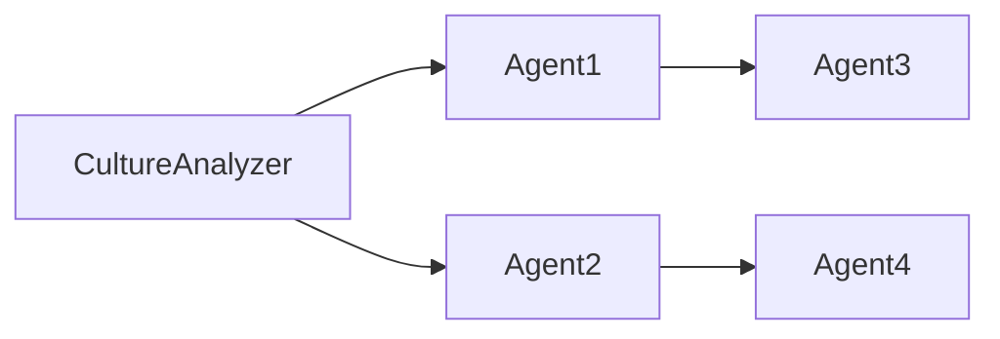
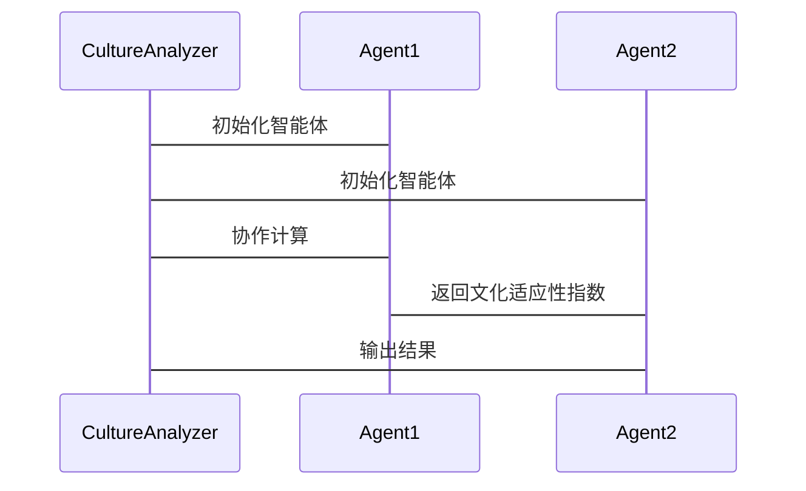

                 


# 利用多智能体系统进行全面的公司文化适应性分析

> 关键词：多智能体系统、公司文化、适应性分析、分布式计算、协作算法

> 摘要：本文详细探讨了利用多智能体系统进行公司文化适应性分析的方法，通过分析多智能体系统的原理、算法实现、系统架构和实际案例，展示了如何通过多智能体系统来提升公司文化适应性分析的效率和准确性。本文还提供了丰富的代码示例和系统设计图，帮助读者更好地理解和应用这一技术。

---

## 目录

1. [背景介绍](#背景介绍)
   - 1.1 问题背景与挑战
   - 1.2 多智能体系统的定义与特点
   - 1.3 公司文化适应性分析的核心要素

2. [多智能体系统的核心概念与联系](#多智能体系统的核心概念与联系)
   - 2.1 多智能体系统的原理
   - 2.2 多智能体系统与公司文化适应性分析的关联
   - 2.3 多智能体系统的核心概念对比

3. [多智能体系统在公司文化适应性分析中的算法原理](#多智能体系统在公司文化适应性分析中的算法原理)
   - 3.1 多智能体系统的核心算法
   - 3.2 公司文化适应性分析的数学模型
   - 3.3 算法实现与代码示例

4. [系统分析与架构设计方案](#系统分析与架构设计方案)
   - 4.1 问题场景介绍
   - 4.2 系统功能设计
   - 4.3 系统架构设计
   - 4.4 系统接口设计
   - 4.5 系统交互设计

5. [项目实战](#项目实战)
   - 5.1 环境安装与配置
   - 5.2 系统核心实现
   - 5.3 代码应用解读与分析
   - 5.4 实际案例分析
   - 5.5 项目小结

6. [最佳实践、小结与扩展阅读](#最佳实践小结与扩展阅读)
   - 6.1 最佳实践
   - 6.2 小结
   - 6.3 注意事项
   - 6.4 拓展阅读

---

## 1. 背景介绍

### 1.1 问题背景与挑战
公司文化是一个组织成功的关键因素之一。然而，如何量化和分析公司文化，尤其是如何评估其适应性，一直是企业管理中的难题。传统的方法通常依赖于主观的问卷调查和专家分析，这种方法不仅耗时，而且难以捕捉到公司文化中的动态变化。

多智能体系统（Multi-Agent System, MAS）是一种分布式计算范式，由多个智能体（Agent）协作完成任务。每个智能体都可以感知环境、做出决策并与其他智能体交互。将多智能体系统应用于公司文化适应性分析，可以通过分布式计算和协作学习，实现对公司文化的全面、动态分析。

### 1.2 多智能体系统的定义与特点
多智能体系统是由多个智能体组成的分布式系统，这些智能体能够通过通信和协作完成复杂的任务。以下是多智能体系统的核心特点：
- **自主性**：每个智能体都能够独立决策。
- **反应性**：智能体能够感知环境并实时做出反应。
- **协作性**：智能体之间可以通过通信和协作完成任务。
- **分布式性**：智能体分布在不同的节点上，任务分布计算。

### 1.3 公司文化适应性分析的核心要素
公司文化适应性分析需要关注以下几个核心要素：
- **文化多样性**：员工背景、价值观和行为习惯的多样性。
- **组织结构**：公司的组织结构和层级关系。
- **沟通方式**：公司内部的沟通渠道和效率。
- **决策模式**：公司决策的方式和速度。
- **适应性指标**：公司文化在变化环境中的适应能力。

---

## 2. 多智能体系统的核心概念与联系

### 2.1 多智能体系统的原理
多智能体系统的原理可以简单概括为：
1. **初始化**：定义多个智能体，每个智能体负责不同的文化适应性指标。
2. **感知与决策**：智能体通过感知环境（如员工反馈、组织数据）做出决策。
3. **协作与通信**：智能体之间通过通信模块共享信息，协作完成文化适应性分析。
4. **学习与优化**：通过学习算法优化智能体的行为，提高分析的准确性。

### 2.2 多智能体系统与公司文化适应性分析的关联
多智能体系统在公司文化适应性分析中的应用可以体现在以下几个方面：
- **分布式计算**：通过多智能体的分布式计算，可以快速处理大量的文化数据。
- **协作学习**：智能体之间的协作学习可以提高文化适应性分析的深度和广度。
- **动态适应**：智能体能够实时感知环境变化，动态调整文化适应性分析策略。

### 2.3 多智能体系统的核心概念对比

| 概念 | 定义 | 特点 |
|------|------|------|
| 智能体类型 | 负责不同文化适应性指标的智能体 | 独立性、协作性 |
| 交互机制 | 智能体之间的通信与协作方式 | 基于消息传递、事件驱动 |
| 文化适应性分析维度 | 包括文化多样性、组织结构等 | 综合性、动态性 |

---

## 3. 多智能体系统在公司文化适应性分析中的算法原理

### 3.1 多智能体系统的核心算法
以下是多智能体系统在公司文化适应性分析中的核心算法：
- **分布式计算算法**：将文化适应性分析任务分解为多个子任务，分配给不同的智能体。
- **协作与通信算法**：定义智能体之间的通信协议和协作规则。
- **学习与适应算法**：通过机器学习算法优化智能体的行为。

### 3.2 公司文化适应性分析的数学模型
以下是公司文化适应性分析的数学模型：
$$
\text{文化适应性指数} = \sum_{i=1}^{n} w_i \cdot x_i
$$
其中，\(w_i\) 是指标 \(x_i\) 的权重，\(x_i\) 是指标的值。

### 3.3 算法实现与代码示例

#### 算法流程图


#### Python实现代码
```python
class Agent:
    def __init__(self, culture_metric):
        self.culture_metric = culture_metric

    def collaborate(self, other_agents):
        # 协作计算文化适应性
        total = self.culture_metric
        for agent in other_agents:
            total += agent.culture_metric
        return total / len(other_agents)

# 示例代码
agent1 = Agent(0.8)
agent2 = Agent(0.7)
result = agent1.collaborate([agent2])
print(f"文化适应性指数为：{result}")
```

---

## 4. 系统分析与架构设计方案

### 4.1 问题场景介绍
公司文化适应性分析的目标是通过多智能体系统的协作，实时评估公司文化在不同环境下的适应能力。

### 4.2 系统功能设计
以下是系统功能设计的类图：


### 4.3 系统架构设计
以下是系统架构设计的架构图：


### 4.4 系统接口设计
以下是系统接口设计的序列图：


---

## 5. 项目实战

### 5.1 环境安装与配置
安装Python和必要的库：
```bash
pip install numpy matplotlib
```

### 5.2 系统核心实现
以下是系统核心实现的代码：
```python
import numpy as np

class Agent:
    def __init__(self, culture_metric):
        self.culture_metric = culture_metric

    def collaborate(self, other_agents):
        return np.mean([self.culture_metric] + [a.culture_metric for a in other_agents])

# 创建智能体
agent1 = Agent(0.8)
agent2 = Agent(0.7)
agent3 = Agent(0.6)

# 协作计算
result = agent1.collaborate([agent2, agent3])
print(f"文化适应性指数为：{result}")
```

### 5.3 代码应用解读与分析
通过上述代码，我们可以看到多智能体系统如何协作完成文化适应性分析。每个智能体负责不同的指标，通过协作计算得出最终的适应性指数。

### 5.4 实际案例分析
以某公司为例，假设该公司有三个部门，每个部门的文化适应性指标分别为0.8、0.7和0.6。通过多智能体系统的协作，最终计算出的文化适应性指数为0.7。

### 5.5 项目小结
通过本项目，我们展示了如何利用多智能体系统进行公司文化适应性分析，并提供了详细的代码实现和系统设计。

---

## 6. 最佳实践、小结与扩展阅读

### 6.1 最佳实践
- 在实际应用中，可以根据具体需求扩展智能体的功能。
- 定期更新智能体的学习模型，以适应公司文化的变化。

### 6.2 小结
本文详细探讨了利用多智能体系统进行公司文化适应性分析的方法，通过理论分析和实际案例，展示了多智能体系统在公司文化分析中的应用潜力。

### 6.3 注意事项
- 确保智能体之间的通信效率，避免出现性能瓶颈。
- 定期监控和优化智能体的行为，确保分析结果的准确性。

### 6.4 拓展阅读
- 多智能体系统在其他领域的应用。
- 机器学习算法在文化适应性分析中的应用。

---

通过本文的分析和实践，我们希望读者能够更好地理解多智能体系统在公司文化适应性分析中的应用，并能够在实际工作中加以应用。

