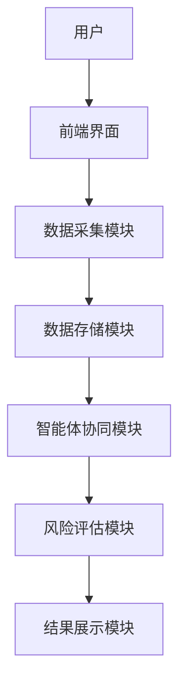
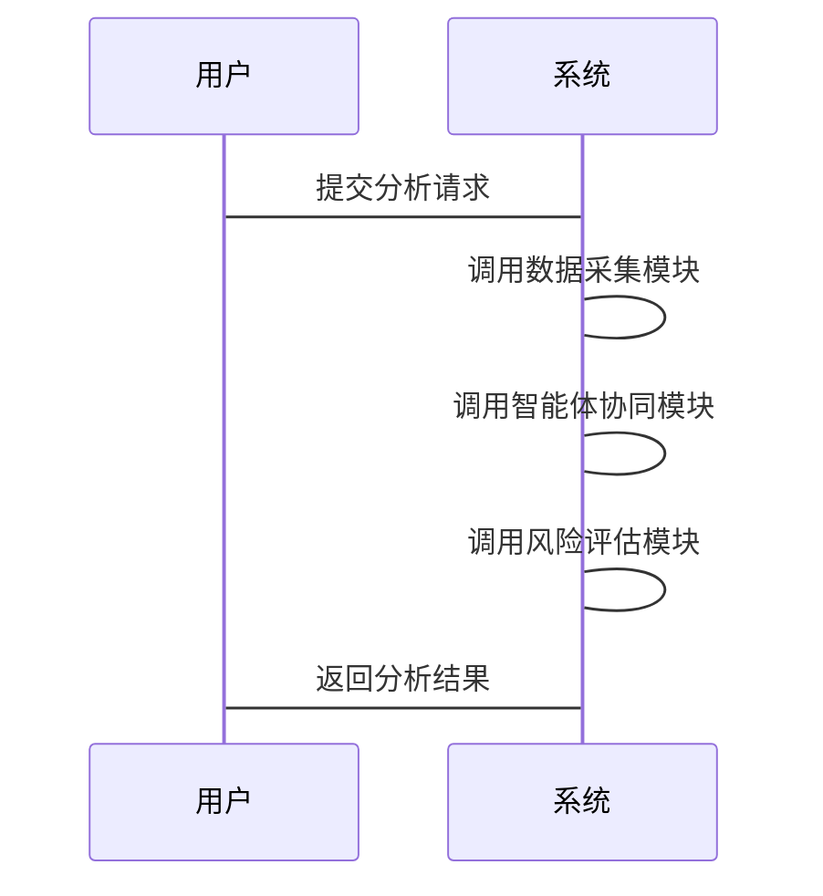

                 


# 利用多智能体系统进行全面的地缘政治风险分析

---

## 关键词：多智能体系统，地缘政治风险分析，分布式计算，协同决策，地缘政治建模，风险评估

---

## 摘要： 

本文探讨了利用多智能体系统（MAS）进行全面的地缘政治风险分析的方法。通过分析多智能体系统的核心原理及其在地缘政治领域的应用，本文提出了一种基于MAS的框架，用于评估和预测地缘政治风险。文章详细介绍了MAS的基本概念、算法原理、系统设计与实现，并通过具体案例展示了MAS在地缘政治风险分析中的实际应用。文章最后总结了研究发现，并展望了未来的研究方向。

---

## 第一部分：背景介绍

### 第1章：地缘政治风险分析的背景

#### 1.1 地缘政治风险分析的重要性

地缘政治风险分析是理解和预测全球政治经济格局的重要工具。随着全球化进程的加速，地缘政治风险（如战争、贸易争端、资源争夺等）对企业、政府和社会组织的影响日益显著。传统的地缘政治分析方法依赖于专家的经验和主观判断，存在效率低、覆盖范围有限等问题。

#### 1.2 问题背景

地缘政治风险分析需要考虑的因素众多，包括经济、军事、文化、外交等多个维度。传统的分析方法往往依赖于单一专家或团队的主观判断，难以全面捕捉复杂多变的地缘政治局势。此外，地缘政治风险的动态变化要求分析方法具有高度的实时性和适应性。

#### 1.3 多智能体系统（MAS）的基本概念

多智能体系统是一种分布式人工智能系统，由多个具有自主性、反应性和协作性的智能体组成。MAS能够通过智能体之间的协同工作，实现复杂问题的分布式计算和决策。

#### 1.4 使用MAS进行地缘政治风险分析的优势

MAS具有以下优势：
1. **分布式计算**：MAS能够将复杂的地缘政治问题分解为多个子问题，由不同的智能体分别处理。
2. **协同决策**：MAS中的智能体可以协同工作，结合多种信息源进行综合分析。
3. **动态适应性**：MAS能够实时响应地缘政治局势的变化，快速调整分析策略。

#### 1.5 边界与外延

地缘政治风险分析的范围包括但不限于国际关系、经济制裁、军事冲突、资源分配等。MAS的应用可以覆盖从局部地区到全球范围的地缘政治分析。

#### 1.6 概念结构与核心要素

地缘政治风险分析的MAS框架包括以下核心要素：
- **智能体**：负责数据收集、分析和决策的主体。
- **任务分配**：智能体之间的任务分配机制。
- **协同机制**：智能体之间的信息共享与协同决策方式。
- **动态适应**：系统对地缘政治变化的实时响应能力。

---

## 第二部分：核心概念与联系

### 第2章：多智能体系统的原理与地缘政治分析

#### 2.1 多智能体系统的原理

多智能体系统由多个智能体组成，每个智能体具有以下特征：
- **自主性**：智能体能够自主决策。
- **反应性**：智能体能够根据环境变化调整行为。
- **协作性**：智能体之间可以协同工作。

#### 2.2 智能体的定义与分类

智能体可以分为以下几类：
1. **简单反射型智能体**：基于当前输入做出反应。
2. **基于模型的反射型智能体**：利用内部模型进行决策。
3. **目标驱动型智能体**：根据目标驱动行为。

#### 2.3 多智能体系统在地缘政治分析中的应用

多智能体系统可以应用于以下地缘政治分析场景：
1. **经济风险评估**：分析贸易政策变化对经济的影响。
2. **军事冲突预测**：预测潜在冲突的爆发点。
3. **外交关系分析**：评估外交政策对国际关系的影响。

#### 2.4 多智能体系统与传统分析方法的对比

| 对比维度       | 多智能体系统（MAS）       | 传统分析方法             |
|----------------|--------------------------|--------------------------|
| 分析效率       | 高，分布式计算           | 低，依赖人工分析           |
| 处理复杂性     | 高，能够处理多维度因素   | 低，受限于分析人员的经验   |
| 动态适应性     | 强，能够实时调整分析策略 | 弱，分析结果更新较慢       |

#### 2.5 智能体之间的关系与协同机制

智能体之间的关系可以通过以下方式进行协同：
1. **信息共享**：智能体之间共享数据和信息。
2. **任务分配**：系统根据智能体的能力分配任务。
3. **协同决策**：智能体共同制定决策方案。

---

## 第三部分：算法原理讲解

### 第3章：多智能体系统的算法原理

#### 3.1 分布式计算与协同决策算法

##### 3.1.1 分布式计算的基本原理

分布式计算是MAS的核心技术之一。通过将计算任务分配给多个智能体，系统可以并行处理大规模数据。以下是分布式计算的实现步骤：

1. **任务分解**：将整体任务分解为多个子任务。
2. **任务分配**：将子任务分配给不同的智能体。
3. **并行计算**：各智能体独立完成分配的任务。
4. **结果汇总**：将各智能体的计算结果汇总，形成最终的分析结果。

##### 3.1.2 协同决策算法

协同决策算法是MAS中智能体之间协作的核心算法。以下是协同决策的流程：

1. **信息收集**：智能体收集相关数据。
2. **信息共享**：智能体之间共享数据。
3. **决策制定**：基于共享信息，智能体共同制定决策。
4. **反馈机制**：根据反馈调整决策策略。

##### 3.1.3 用Python实现的分布式计算示例

以下是一个简单的分布式计算示例：

```python
import concurrent.futures

def compute_task(task_id):
    return f"Task {task_id} completed"

with concurrent.futures.ThreadPoolExecutor() as executor:
    tasks = range(1, 5)
    futures = [executor.submit(compute_task, task_id) for task_id in tasks]
    for future in concurrent.futures.as_completed(futures):
        print(future.result())
```

##### 3.1.4 协同决策算法的数学模型

协同决策算法可以用以下数学模型表示：

$$
\text{决策} = \argmax_{i} \sum_{j=1}^{n} w_j \cdot x_j
$$

其中，$w_j$ 是权重，$x_j$ 是输入特征。

---

## 第四部分：系统分析与架构设计

### 第4章：地缘政治风险分析系统的架构设计

#### 4.1 系统功能设计

系统功能设计包括以下几个方面：
1. **数据采集模块**：采集地缘政治相关的数据。
2. **智能体协同模块**：实现智能体之间的协同决策。
3. **风险评估模块**：评估地缘政治风险。
4. **结果展示模块**：展示分析结果。

#### 4.2 系统架构设计

以下是系统架构设计的mermaid图：



#### 4.3 系统接口设计

系统接口设计包括以下内容：
1. **数据接口**：与数据源对接，获取地缘政治数据。
2. **智能体接口**：智能体之间的通信接口。
3. **用户接口**：用户与系统的交互界面。

#### 4.4 系统交互设计

以下是系统交互的mermaid序列图：



---

## 第五部分：项目实战

### 第5章：构建基于MAS的地缘政治风险分析系统

#### 5.1 环境安装

安装所需的Python库：
```bash
pip install concurrent.futures
pip install matplotlib
pip install pandas
```

#### 5.2 核心代码实现

以下是核心代码示例：

```python
import concurrent.futures
import pandas as pd
import matplotlib.pyplot as plt

def collect_data(country):
    # 数据采集逻辑
    return {"country": country, "risk": 0.8}

def analyze_risk(data):
    # 风险分析逻辑
    return data["country"], data["risk"]

if __name__ == "__main__":
    countries = ["USA", "China", "Russia", "EU"]
    futures = []
    with concurrent.futures.ThreadPoolExecutor() as executor:
        for country in countries:
            futures.append(executor.submit(collect_data, country))
    results = [f.result() for f in concurrent.futures.wait(futures)]
    df = pd.DataFrame(results)
    df.plot(kind='bar', x='country', y='risk')
    plt.show()
```

#### 5.3 案例分析

以中美贸易冲突为例，分析系统的实现过程：
1. **数据采集**：采集中美贸易数据。
2. **风险评估**：评估贸易冲突对企业的影响。
3. **结果展示**：生成风险评估报告。

---

## 第六部分：总结与展望

### 第6章：总结与展望

#### 6.1 研究总结

本文探讨了多智能体系统在地缘政治风险分析中的应用，提出了基于MAS的分析框架，并通过具体案例展示了系统的实现过程。

#### 6.2 研究的局限性

本文的研究存在以下局限性：
1. 数据来源的局限性：依赖公开数据，可能无法捕捉到内部信息。
2. 智能体协同的复杂性：智能体之间的协同机制需要进一步优化。

#### 6.3 未来研究方向

未来的研究可以关注以下方向：
1. **智能体学习能力的提升**：引入机器学习算法，提高智能体的自适应能力。
2. **多智能体系统的可扩展性**：研究MAS在更大规模地缘政治分析中的应用。
3. **数据隐私保护**：研究如何在MAS中保护数据隐私。

---

## 参考文献

1. 智能体与多智能体系统（书籍推荐）
2. 地缘政治分析的经典文献
3. 相关学术论文

---

## 结语

多智能体系统为地缘政治风险分析提供了全新的思路和方法。通过MAS的应用，可以显著提高地缘政治分析的效率和准确性。未来，随着人工智能技术的不断发展，MAS在地缘政治分析中的应用将更加广泛和深入。

