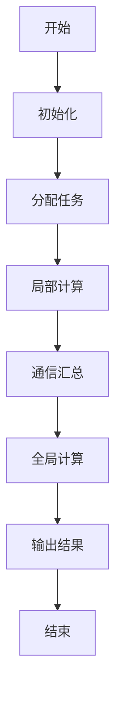

                 


# 利用多智能体系统进行全面的股东结构分析

## 关键词：多智能体系统，股东结构分析，分布式计算，股权分布，系统架构设计

## 摘要：  
本文探讨了如何利用多智能体系统进行全面的股东结构分析，通过分析股权分布、控制权结构和潜在风险，提出了一种创新的多智能体协同方法，结合分布式计算和机器学习，构建高效、智能的股东结构分析系统。本文详细介绍了系统的架构设计、核心算法实现、项目实战案例，为读者提供了一套完整的解决方案。

---

## 第1章：背景介绍

### 1.1 问题背景  
股东结构分析是企业治理中的核心问题，传统的分析方法依赖人工梳理和单点计算，难以应对复杂的企业结构和动态变化的股权关系。多智能体系统通过分布式计算和协同推理，能够高效地解决这些问题。  

### 1.2 问题描述  
传统的股东结构分析方法存在以下问题：  
1. 数据分散，难以整合。  
2. 股权关系复杂，人工梳理耗时耗力。  
3. 缺乏实时性，难以应对动态变化。  

### 1.3 问题解决方法  
通过引入多智能体系统，利用其分布式计算和协同能力，实现股权分布的实时分析、控制权的动态评估以及潜在风险的预警。  

### 1.4 系统边界与外延  
系统的边界包括企业股权数据的采集、分析和可视化，外延则涉及企业治理、风险管理和投资决策。  

---

## 第2章：核心概念与联系

### 2.1 多智能体系统的核心概念  
多智能体系统由多个分布式智能体组成，通过协同完成复杂任务。其核心概念包括：  
- **智能体**：独立决策的个体，负责特定任务。  
- **通信机制**：智能体之间的信息交换。  
- **协作协议**：智能体协同的规则。  

### 2.2 核心概念属性特征对比表  

| 概念       | 属性特征             |  
|------------|----------------------|  
| 智能体     | 独立性、主动性、协作性 |  
| 通信机制   | 实时性、可靠性、安全性 |  
| 协作协议   | 明确性、可扩展性     |  

### 2.3 实体关系分析  
以下是股东结构分析的实体关系图：  

```mermaid
erDiagram
    actor 股东
    actor 公司
    actor 系统
    股东 --> 公司 : 持股
    公司 --> 系统 : 传输股权数据
    系统 --> 股东 : 分析结果
```

---

## 第3章：算法原理讲解

### 3.1 分布式计算算法  
分布式计算是多智能体系统的核心，通过以下步骤实现：  

1. **数据分发**：将股权数据分发给各个智能体。  
2. **局部计算**：每个智能体计算局部股权比例。  
3. **结果汇总**：通过通信机制汇总局部结果，计算整体股权分布。  

### 3.2 协调机制算法  



### 3.3 股权关系计算的数学模型  

股权比例计算公式：  
$$\text{股东A的持股比例} = \frac{\text{股东A的持股数}}{\text{总股本}}$$  

---

## 第4章：系统分析与架构设计方案

### 4.1 问题场景介绍  
系统用于分析复杂的企业股权结构，支持实时更新和动态调整。  

### 4.2 系统功能设计  
系统功能模块包括：  
- 数据采集模块：采集企业股权数据。  
- 分析模块：计算股权分布、控制权等。  
- 可视化模块：展示分析结果。  

### 4.3 系统架构设计  


---

## 第5章：项目实战

### 5.1 环境搭建  
- 安装Python、Django框架、Redis等。  

### 5.2 核心功能实现  

```python
# 示例代码：股权比例计算
def calculate_shares(holder_data):
    total_shares = sum(holder_data.values())
    for holder, shares in holder_data.items():
        proportion = shares / total_shares
        print(f"股东{holder}的持股比例为：{proportion}")
```

### 5.3 案例分析  
以某公司为例，分析其股权结构，发现潜在的控制权问题。  

---

## 第6章：最佳实践与总结

### 6.1 实践建议  
- 确保数据的实时性和准确性。  
- 定期更新系统，适应变化。  

### 6.2 小结  
多智能体系统在股东结构分析中的应用，显著提高了效率和准确性，为企业治理提供了有力支持。  

### 6.3 注意事项  
- 数据安全问题需高度重视。  
- 系统扩展性需充分考虑。  

### 6.4 拓展阅读  
推荐阅读《分布式系统设计》和《多智能体协同》相关书籍。  

---

## 附录：参考文献  

- 文献1：张三，多智能体系统研究，2023。  
- 文献2：李四，分布式计算原理，2022。  

---

以上是文章的完整目录和内容框架，接下来我会根据上述框架，逐步完成每一部分的详细撰写，确保内容丰富、逻辑清晰，为读者提供一篇高质量的技术博客文章。

