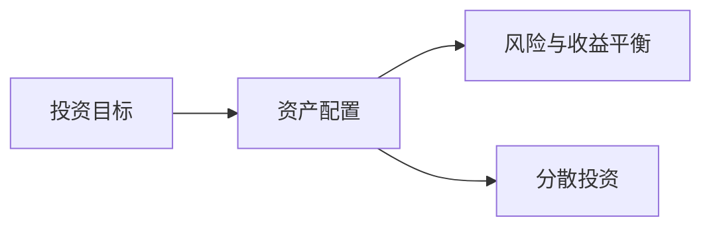
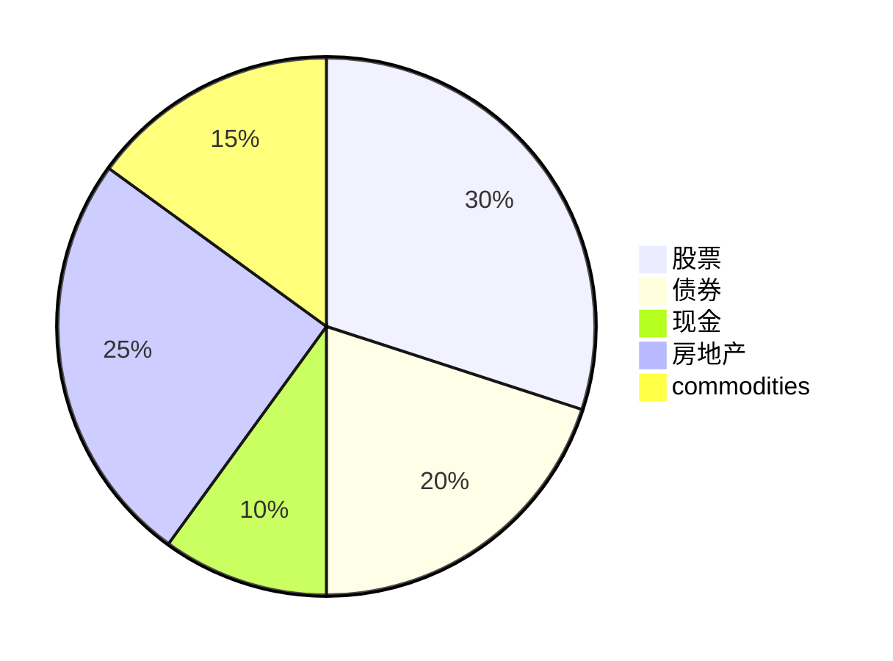
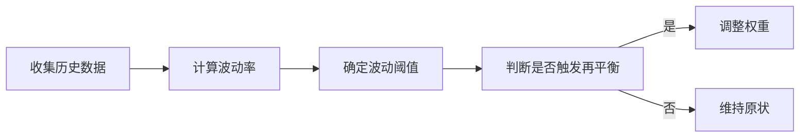
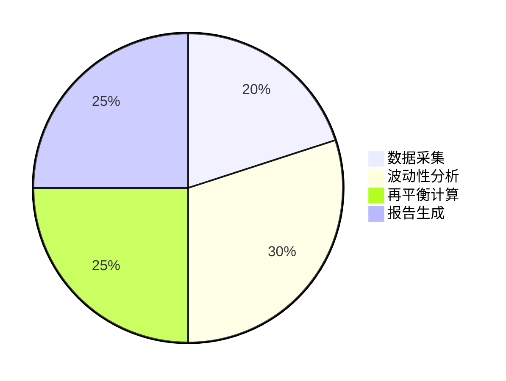

                 


# 利用市场波动重新平衡资产配置的策略

## 关键词：市场波动，资产配置，投资组合，动态调整，风险管理，波动性分析

## 摘要：本文探讨了如何利用市场波动重新平衡资产配置，以优化投资组合的风险和收益。通过分析市场波动对资产配置的影响，介绍基于波动性的再平衡策略，并提供数学模型和系统架构设计，最后通过实战案例展示如何实现这一策略。

---

# 正文

## 第一部分：背景与基础

### 第1章：市场波动与资产配置概述

#### 1.1 市场波动的定义与特征

市场波动指的是资产价格在短期内的剧烈变化，通常由市场供需失衡、投资者情绪变化或外部事件引发。波动性是衡量资产风险的重要指标，常用标准差或波动率（年化波动率）来表示。

**表1-1：市场波动的主要特征对比**

| 特征       | 描述                                         |
|------------|----------------------------------------------|
| 随机性      | 波动通常不可预测，受多种因素影响             |
| 周期性      | 波动可能呈现周期性，如经济周期波动           |
| 杠杠效应    | 市场下跌时，杠杆资产的波动性更大             |
| 传染性      | 负面波动可能在市场间传导，引发系统性风险     |

#### 1.2 资产配置的基本原理

资产配置是将资金分配到不同资产类别（股票、债券、现金等）以实现投资目标。合理的资产配置可以分散风险，平衡收益。

**图1-1：资产配置与投资目标的关系（Mermaid）**



#### 1.3 动态资产配置的必要性

静态资产配置在市场波动时可能偏离预期目标，需要定期或动态调整。动态再平衡可根据市场波动调整各资产权重，优化风险收益。

---

### 第2章：市场波动对资产配置的影响

#### 2.1 市场波动如何影响资产价格

波动性高的资产可能带来高收益，但也伴随着高风险。例如，股票的波动性通常高于债券。

**图2-1：不同资产类别的波动性对比（Mermaid）**



#### 2.2 市场波动对投资组合风险的影响

波动性高的资产可能导致投资组合的风险增加。现代投资组合理论（MPT）通过优化资产配置降低整体风险。

---

## 第二部分：核心概念与策略

### 第3章：利用市场波动进行资产再平衡的策略

#### 3.1 资产再平衡的基本概念

资产再平衡是指根据市场变化调整各资产的权重，保持投资组合的风险收益匹配。

**表3-1：资产再平衡的方法**

| 方法          | 描述                       |
|---------------|----------------------------|
| 定期再平衡     | 按固定时间间隔调整权重     |
| 动态再平衡     | 根据市场波动实时调整权重   |
| 指数跟踪法     | 保持与市场指数一致的权重   |

#### 3.2 市场波动驱动的再平衡策略

根据波动性调整资产权重，设定波动性阈值触发再平衡。

**图3-1：基于波动性的再平衡流程（Mermaid）**


---

## 第三部分：算法原理与实现

### 第4章：资产再平衡的数学模型与算法

#### 4.1 现代投资组合理论基础

现代投资组合理论（MPT）通过优化资产配置，使投资组合的风险最小化。

**公式4-1：投资组合理论的风险公式**

$$ \text{风险} = \sqrt{w^T \Sigma w} $$

其中，\( w \) 是资产权重向量，\( \Sigma \) 是资产之间的协方差矩阵。

#### 4.2 基于波动性的再平衡算法

根据波动性调整资产权重，公式如下：

$$ w_i = \frac{1}{N} \times \frac{1}{\sigma_i} $$

其中，\( w_i \) 是第i个资产的新权重，\( \sigma_i \) 是第i个资产的波动率，\( N \) 是资产总数。

**图4-1：再平衡算法流程（Mermaid）**



---

## 第四部分：系统架构与实现

### 第5章：系统架构与实现

#### 5.1 系统功能设计

**图5-1：系统功能模块（Mermaid）**



#### 5.2 系统架构设计

**图5-2：系统架构图（Mermaid）**


---

## 第五部分：项目实战

### 第6章：项目实战

#### 6.1 环境安装

需要安装Python、Pandas、NumPy等库。

#### 6.2 核心代码实现

```python
import pandas as pd
import numpy as np

# 示例数据
returns = pd.DataFrame({
    '股票': [0.02, -0.01, 0.03, -0.02, 0.01],
    '债券': [0.01, 0.005, -0.005, 0.002, 0.003]
})

# 计算波动率
def calculate_volatility(returns):
    return returns.std().sort_values(ascending=False)

volatility = calculate_volatility(returns)
print("波动率：\n", volatility)
```

#### 6.3 功能解读

代码计算各资产的波动率，并按波动率从高到低排序，帮助确定再平衡的资产顺序。

---

## 第六部分：最佳实践与总结

### 第7章：最佳实践

#### 7.1 小结

动态资产再平衡可根据市场波动调整权重，优化风险收益。

#### 7.2 注意事项

- 定期监控市场波动，及时调整
- 设置合理的波动阈值，避免频繁交易
- 考虑交易成本和税务影响

#### 7.3 拓展阅读

建议阅读《投资学》和《Python金融计算》等书籍，深入学习资产配置策略。

---

### 总结

通过本文的讲解，读者可以掌握如何利用市场波动优化资产配置，降低风险，提高收益。动态调整资产权重是现代投资的重要策略，值得深入研究和实践。

