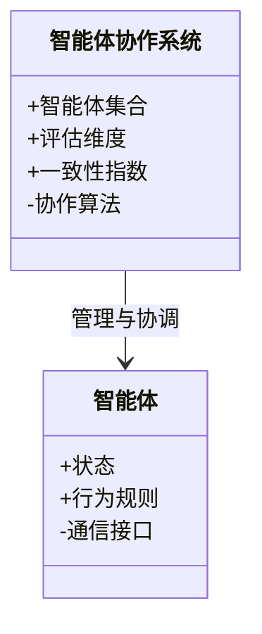
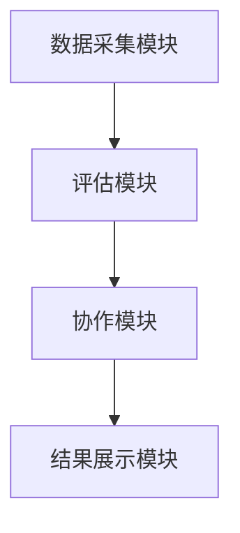

                 


# 利用智能体协作进行全面的公司文化一致性评估

## 关键词：智能体协作，公司文化，一致性评估，分布式算法，系统架构

## 摘要：本文详细探讨了利用智能体协作技术进行全面的公司文化一致性评估的方法。通过分析智能体协作的核心原理，构建数学模型与算法，设计系统架构，并结合实际案例，展示了如何实现文化一致性评估的自动化与智能化。本文还提供了代码实现与系统设计的详细步骤，为读者提供了从理论到实践的完整指南。

---

# 第1章 公司文化一致性评估概述

## 1.1 公司文化一致性评估的定义与背景

### 1.1.1 公司文化的定义与重要性
公司文化是企业在长期经营过程中形成的价值观、行为规范和工作方式的集合。它影响着员工的行为、决策以及企业的整体表现。一个一致的文化能够增强团队凝聚力、提升工作效率，并为企业创造长期的竞争优势。

### 1.1.2 文化一致性评估的必要性
在企业快速发展的过程中，文化一致性的重要性愈发凸显。然而，随着企业规模的扩大和组织结构的复杂化，文化一致性可能受到多种因素的影响，例如部门间的沟通不畅、员工价值观的差异等。通过智能体协作技术，可以实时监测和评估文化一致性，帮助企业及时发现和解决问题。

### 1.1.3 智能体协作在文化评估中的作用
智能体协作是一种分布式计算范式，通过多个智能体的协同工作，能够高效地完成复杂的任务。在文化一致性评估中，智能体协作可以用于数据采集、分析和决策，提供实时反馈和改进建议。

## 1.2 智能体协作的基本概念

### 1.2.1 智能体的定义与特征
智能体是一种能够感知环境、自主决策并采取行动的实体。它可以是一个软件程序、一个算法，甚至是一个物理设备。智能体的核心特征包括自主性、反应性、目标导向性和协作性。

### 1.2.2 多智能体协作的原理
多智能体协作是指多个智能体通过通信和协调，共同完成一个复杂任务的过程。协作的核心在于智能体之间的信息共享和任务分配。通过合理的协作机制，可以最大化各智能体的能力，实现整体目标的最优。

### 1.2.3 智能体协作的优势与挑战
智能体协作的优势在于其分布式计算能力和高容错性。通过多个智能体的协同工作，可以避免单点故障，提高系统的可靠性和灵活性。然而，智能体协作也面临一些挑战，例如通信开销、协调复杂性和安全问题。

## 1.3 本章小结
本章介绍了公司文化一致性评估的定义与背景，并重点阐述了智能体协作的基本概念与原理。通过智能体协作技术，可以实现文化一致性评估的自动化与智能化。

---

# 第2章 智能体协作的原理与模型

## 2.1 多智能体协作的理论基础

### 2.1.1 多智能体系统（MAS）的概念
多智能体系统（Multi-Agent System, MAS）是由多个智能体组成的分布式系统。智能体之间通过通信和协作，共同完成复杂任务。MAS的核心在于智能体的自主性和协作性。

### 2.1.2 多智能体协作的基本原理
多智能体协作的基本原理包括任务分解、智能体角色分配、信息共享与协调。通过将任务分解为多个子任务，并分配给不同的智能体，可以提高系统的效率和灵活性。

### 2.1.3 智能体协作的分类与特点
智能体协作可以分为基于规则的协作和基于学习的协作。基于规则的协作依赖于预定义的规则和逻辑，而基于学习的协作则通过机器学习算法动态调整协作策略。

## 2.2 智能体协作的核心模型

### 2.2.1 分布式评估模型
分布式评估模型是一种基于智能体协作的文化一致性评估模型。通过多个智能体的协作，可以实时监测和评估文化一致性。

### 2.2.2 智能体协作的通信机制
智能体之间的通信机制是协作的核心。通过定义明确的通信协议，智能体可以高效地共享信息和协调行动。

### 2.2.3 智能体协作的决策过程
智能体的决策过程包括信息收集、信息处理和决策执行。通过智能体之间的协作，可以实现复杂决策任务的分解与优化。

## 2.3 本章小结
本章详细介绍了智能体协作的理论基础与核心模型，为后续的文化一致性评估提供了理论支持。

---

# 第3章 公司文化一致性评估的数学模型与算法

## 3.1 文化一致性评估的数学模型

### 3.1.1 文化一致性指数的定义
文化一致性指数是衡量公司文化一致性的指标。通过量化评估，可以为企业提供清晰的文化一致性评估结果。

$$ C = \sum_{i=1}^{n} w_i \cdot c_i $$
其中，$C$ 表示文化一致性指数，$w_i$ 表示第 $i$ 个评估维度的权重，$c_i$ 表示第 $i$ 个维度的文化一致性评分。

### 3.1.2 文化一致性指数的计算公式
通过权重和评分的结合，可以计算出文化一致性指数。权重反映了各个评估维度的重要程度，评分则反映了每个维度的实际情况。

### 3.1.3 文化一致性指数的范围
文化一致性指数的范围通常在 0 到 1 之间。指数越接近 1，表明文化一致性越高；指数越接近 0，则表明文化一致性越低。

## 3.2 智能体协作算法

### 3.2.1 分布式评估算法
分布式评估算法是一种基于智能体协作的评估方法。通过多个智能体的协作，可以实现文化一致性评估的分布式计算。

### 3.2.2 基于智能体的协作算法
基于智能体的协作算法通过定义智能体的行为规则和通信机制，实现文化一致性评估的自动化与智能化。

### 3.2.3 算法的收敛性分析
算法的收敛性是评估其性能的重要指标。通过分析算法的收敛性，可以确保文化一致性评估的准确性和效率。

## 3.3 本章小结
本章详细介绍了文化一致性评估的数学模型与智能体协作算法，为后续的系统设计与实现提供了理论基础。

---

# 第4章 系统分析与架构设计

## 4.1 系统分析

### 4.1.1 项目背景与目标
本项目旨在通过智能体协作技术，实现公司文化一致性评估的自动化与智能化。项目的目标包括实时监测文化一致性、提供改进建议以及提升企业的文化管理能力。

### 4.1.2 项目范围
项目范围包括文化一致性评估模型的设计、智能体协作算法的实现以及系统的集成与测试。

### 4.1.3 项目需求
项目需求包括文化一致性评估的实时性、准确性以及系统的可扩展性。

## 4.2 系统功能设计

### 4.2.1 功能模块划分
系统功能模块包括数据采集模块、评估模块、协作模块以及结果展示模块。

### 4.2.2 领域模型设计
领域模型设计使用 Mermaid 类图表示系统的各个模块及其关系。



## 4.3 系统架构设计

### 4.3.1 模块化设计
系统架构采用模块化设计，包括数据采集模块、评估模块、协作模块以及结果展示模块。

### 4.3.2 系统架构图
系统架构图使用 Mermaid 绘制，展示了各模块之间的关系。



## 4.4 通信机制设计

### 4.4.1 智能体之间的通信协议
智能体之间的通信协议包括数据格式、通信频率以及错误处理机制。

### 4.4.2 通信接口设计
通信接口设计包括数据接收、数据处理以及数据发送三个步骤。

## 4.5 本章小结
本章详细介绍了系统的分析与架构设计，为后续的系统实现提供了明确的方向。

---

# 第5章 项目实战与代码实现

## 5.1 环境安装

### 5.1.1 系统环境
系统环境包括操作系统、编程语言以及相关库的安装。

### 5.1.2 工具安装
工具安装包括智能体协作框架、数据采集工具以及结果展示工具的安装。

## 5.2 核心代码实现

### 5.2.1 智能体协作算法的实现
以下是基于智能体协作的文化一致性评估算法的 Python 实现代码：

```python
class Agent:
    def __init__(self, id):
        self.id = id
        self.state = None
        self.behavior_rules = {}

    def receive_message(self, message):
        # 处理接收到的消息
        pass

    def send_message(self, message):
        # 发送消息
        pass

class CollaborationSystem:
    def __init__(self, agents):
        self.agents = agents
        self.dimensions = []
        self.consistency_index = 0

    def initialize_agents(self):
        # 初始化智能体
        pass

    def assess_consistency(self):
        # 文化一致性评估
        pass
```

### 5.2.2 文化一致性评估的实现
以下是文化一致性指数计算的 Python 实现代码：

```python
def calculate_consistency_index(dimensions, weights):
    # 计算文化一致性指数
    consistency_index = 0
    for i in range(len(dimensions)):
        consistency_index += weights[i] * dimensions[i]
    return consistency_index
```

## 5.3 实际案例分析

### 5.3.1 案例背景
案例背景介绍了一家企业的文化一致性评估需求。

### 5.3.2 数据采集与处理
数据采集与处理包括员工问卷调查、部门评估以及历史数据的整理。

### 5.3.3 算法实现与结果展示
算法实现与结果展示展示了如何通过智能体协作算法，实现文化一致性评估，并生成可视化报告。

## 5.4 本章小结
本章通过实际案例分析，详细介绍了智能体协作技术在文化一致性评估中的应用。

---

# 第6章 最佳实践与注意事项

## 6.1 最佳实践 tips

### 6.1.1 智能体协作的优化策略
智能体协作的优化策略包括任务分解的合理性、通信机制的高效性以及算法的可扩展性。

### 6.1.2 系统的可维护性
系统的可维护性包括代码的可读性、模块的独立性以及文档的完整性。

### 6.1.3 安全性与隐私保护
安全性与隐私保护是智能体协作系统设计中的重要考虑因素，包括数据加密、访问控制以及隐私保护机制。

## 6.2 小结
本章总结了智能体协作技术在文化一致性评估中的应用经验，提供了最佳实践 tips 和注意事项。

## 6.3 注意事项

### 6.3.1 系统的稳定性
系统的稳定性是智能体协作系统设计中的重要考虑因素，包括容错机制、故障恢复以及性能优化。

### 6.3.2 算法的可解释性
算法的可解释性是智能体协作系统应用中的重要要求，尤其是在文化一致性评估中，需要确保评估结果的透明性和可解释性。

## 6.4 拓展阅读
拓展阅读推荐了一些与智能体协作和文化一致性评估相关的书籍和论文，供读者进一步学习。

---

# 第7章 总结与展望

## 7.1 本章总结
本章总结了全文的主要内容，强调了智能体协作技术在文化一致性评估中的重要性和应用前景。

## 7.2 未来展望
未来展望提出了智能体协作技术的进一步发展方向，包括算法优化、系统扩展以及应用领域的拓展。

---

# 附录

## 附录A: 代码实现细节
详细描述了智能体协作算法的实现细节，包括类的定义、方法的实现以及代码的注释。

## 附录B: 系统架构图
提供了系统架构图的详细说明，包括各模块的功能和接口设计。

## 附录C: 实验数据与结果
展示了实验数据与评估结果，包括文化一致性指数的计算过程和结果分析。

---

# 参考文献

（此处列出相关的书籍、论文和其他参考资料）

---

通过以上目录和内容，您可以逐步完成全文的撰写，确保每个部分都详尽且符合逻辑。

