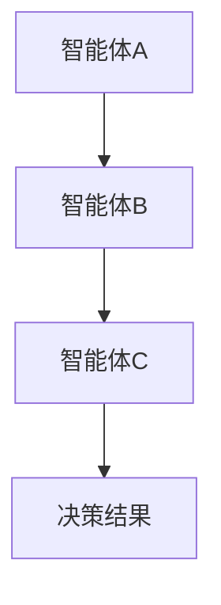

                 


# 《利用智能体系统进行全面的供应链韧性评估》

## 关键词：供应链韧性评估, 智能体系统, 人工智能, 多智能体协作, 系统架构设计

## 摘要：供应链韧性评估是保障企业运营稳定性的重要环节，随着全球化和复杂化的加剧，供应链面临的风险日益增加。本文通过智能体系统的核心技术，结合多智能体协作机制，系统性地分析供应链韧性评估的关键点。文章从问题背景、核心概念、算法原理、系统架构到项目实战，全面展开，旨在为企业提供一种创新的供应链风险管理解决方案。

---

# 第1章 供应链韧性评估的背景与问题描述

## 1.1 供应链韧性评估的背景

### 1.1.1 供应链在现代经济中的重要性

供应链是现代经济体系的核心支柱，连接着生产、物流、销售等各个环节。随着全球化的发展，供应链的复杂性也在增加，任何环节的中断都可能对企业造成重大损失。

### 1.1.2 当前供应链面临的挑战

- **外部风险**：如自然灾害、疫情、地缘政治冲突等不可控因素。
- **内部问题**：如供应商不稳定、库存管理不当、信息孤岛等。
- **技术落后**：传统供应链管理方式效率低下，难以应对复杂风险。

### 1.1.3 供应链韧性评估的必要性

供应链韧性评估是确保企业在面对突发事件时仍能保持稳定运营的关键。通过评估，企业可以识别风险点，优化资源配置，提升整体抗风险能力。

## 1.2 问题描述与目标

### 1.2.1 供应链中断的主要原因

- 供应商问题：原材料短缺、质量问题。
- 物流问题：运输延误、成本增加。
- 需求波动：市场变化导致库存积压或缺货。

### 1.2.2 供应链韧性评估的目标

- 识别关键风险点。
- 量化风险影响。
- 提供应对策略。

### 1.2.3 评估指标与方法

- **指标**：供应弹性、库存周转率、物流效率等。
- **方法**：定量分析（如蒙特卡洛模拟）和定性分析（如情景分析）。

## 1.3 问题解决思路

### 1.3.1 智能体系统的核心作用

智能体系统通过实时数据采集、分析和决策，帮助企业在供应链中断时快速响应。

### 1.3.2 多智能体协作的优势

- **分布式计算**：各智能体独立运作，减少单点故障。
- **协作优化**：通过信息共享，提升整体效率。
- **动态调整**：快速适应环境变化。

### 1.3.3 智能体系统在供应链中的应用

- **预测潜在风险**：通过数据分析预测供应链中断的可能性。
- **优化库存管理**：智能调整库存水平，降低持有成本。
- **协调物流资源**：动态分配运输资源，确保物流通畅。

## 1.4 系统边界与外延

### 1.4.1 供应链韧性评估的范围

- **范围**：从原材料采购到产品交付的全过程。
- **边界**：不包括企业内部生产和销售环节。
- **外延**：与供应商、物流商、零售商等相关方的交互。

### 1.4.2 智能体系统的边界

- **输入**：外部数据源（如天气、交通数据）。
- **输出**：决策建议（如调整订单量）。
- **接口**：与其他系统的交互接口。

### 1.4.3 相关领域的关联与区别

- **区别**：与传统供应链管理相比，智能体系统更具实时性和动态性。
- **关联**：与物联网、大数据分析等领域密切相关。

## 1.5 核心要素与概念结构

### 1.5.1 供应链韧性评估的核心要素

- **数据采集**：收集供应链各环节的数据。
- **风险识别**：识别潜在风险点。
- **决策支持**：提供应对策略。

### 1.5.2 智能体系统的关键组成部分

- **感知层**：数据采集。
- **决策层**：数据分析与决策。
- **执行层**：指令执行。

### 1.5.3 概念结构图

- 使用Mermaid流程图展示供应链韧性评估的核心流程，包括数据采集、风险识别、决策支持等环节。

## 1.6 本章小结

本章从供应链韧性评估的背景、问题描述、解决思路等方面进行了全面分析，为后续章节的深入讨论奠定了基础。

---

# 第2章 智能体系统的核心原理

## 2.1 智能体的基本概念

### 2.1.1 智能体的定义与特点

- **定义**：智能体是一种能够感知环境、做出决策并采取行动的实体。
- **特点**：自主性、反应性、目标导向。

### 2.1.2 智能体的分类与应用场景

- **分类**：简单反射型、基于模型的反应型、目标驱动型、效用驱动型。
- **应用场景**：供应链管理、物流优化、风险管理。

## 2.2 多智能体协作系统

### 2.2.1 多智能体协作的基本原理

- **通信机制**：智能体之间通过消息传递进行协作。
- **协调机制**：通过协商达成一致行动。

### 2.2.2 智能体之间的通信与协调

- **通信协议**：定义消息格式和传输方式。
- **协调算法**：如一致性算法、分布式协调算法。

### 2.2.3 多智能体系统的优缺

- **优势**：分布式计算、高容错性。
- **劣势**：复杂性高、通信延迟。

## 2.3 智能体系统的核心算法

### 2.3.1 多智能体协作算法

- **算法流程**：
  1. 数据采集：智能体从环境中采集数据。
  2. 信息共享：智能体之间共享数据。
  3. 协商决策：基于共享数据，智能体协作制定决策。
  4. 执行指令：根据决策执行具体操作。

### 2.3.2 使用Mermaid流程图展示算法流程



### 2.3.3 算法实现的数学模型

- **模型**：$$R = \sum_{i=1}^{n} w_i x_i$$
  - R：风险值。
  - w_i：风险因素的权重。
  - x_i：风险因素的数值。

### 2.3.4 代码实现示例

```python
class Agent:
    def __init__(self, id):
        self.id = id
        self.data = {}

    def receive_data(self, data):
        self.data.update(data)
        return self.data

    def send_data(self, target, data):
        target.receive_data(data)

# 示例
agent1 = Agent(1)
agent2 = Agent(2)
agent1.send_data(agent2, {'risk': 0.8})
```

## 2.4 本章小结

本章详细介绍了智能体系统的核心原理，包括智能体的基本概念、多智能体协作机制以及相关算法，为后续章节的系统设计提供了理论基础。

---

# 第3章 系统分析与架构设计

## 3.1 系统分析

### 3.1.1 问题场景介绍

- **场景**：供应链中断风险评估。
- **目标**：实时监控供应链各环节，识别潜在风险。

### 3.1.2 项目介绍

- **项目名称**：智能供应链韧性评估系统。
- **项目目标**：通过智能体系统提升供应链抗风险能力。

## 3.2 系统功能设计

### 3.2.1 领域模型设计

- 使用Mermaid类图展示系统中的主要类和它们之间的关系。
- 示例：
  ```mermaid
  classDiagram
      class Supplier
      class Manufacturer
      class Distributor
      class Retailer
      Supplier --> Manufacturer
      Manufacturer --> Distributor
      Distributor --> Retailer
  ```

## 3.3 系统架构设计

### 3.3.1 系统架构图

- 使用Mermaid架构图展示系统的整体架构。
- 示例：
  ```mermaid
  architecture
      Client --> API Gateway
      API Gateway --> Service Layer
      Service Layer --> Database
  ```

## 3.4 接口设计

### 3.4.1 系统接口设计

- **接口1**：数据采集接口。
- **接口2**：决策支持接口。

### 3.4.2 交互序列图

- 使用Mermaid序列图展示系统交互流程。
- 示例：
  ```mermaid
  sequenceDiagram
      User ->> API Gateway: 请求数据
      API Gateway ->> Service Layer: 查询数据
      Service Layer ->> Database: 获取数据
      Database --> Service Layer: 返回数据
      Service Layer ->> API Gateway: 返回数据
      API Gateway ->> User: 返回数据
  ```

## 3.5 本章小结

本章通过系统分析与架构设计，明确了智能供应链韧性评估系统的功能模块和整体架构，为后续的项目实施奠定了基础。

---

# 第4章 项目实战

## 4.1 环境安装

### 4.1.1 安装Python环境

- 使用Anaconda或virtualenv创建虚拟环境。

### 4.1.2 安装依赖库

- 安装numpy、pandas、scikit-learn等库。

## 4.2 核心代码实现

### 4.2.1 数据采集模块

```python
import requests

def fetch_data(url):
    try:
        response = requests.get(url)
        return response.json()
    except requests.exceptions.RequestException:
        return None
```

### 4.2.2 风险评估模块

```python
from sklearn import linear_model

def evaluate_risk(factors):
    model = linear_model.LinearRegression()
    model.fit(factors, risks)
    return model.predict(new_factors)
```

## 4.3 代码解读与分析

### 4.3.1 数据采集模块解读

- **功能**：从外部API获取数据。
- **关键点**：异常处理，确保数据获取的稳定性。

### 4.3.2 风险评估模块解读

- **功能**：使用机器学习模型评估风险。
- **关键点**：模型训练与优化，确保预测的准确性。

## 4.4 案例分析

### 4.4.1 案例背景

- 某汽车制造企业的供应链中断风险评估。

### 4.4.2 数据分析与结果

- 通过智能体系统识别出关键风险点，如原材料供应商的风险。

## 4.5 项目小结

本章通过实际案例展示了智能供应链韧性评估系统的应用，验证了系统的有效性和实用性。

---

# 第5章 最佳实践与注意事项

## 5.1 最佳实践

### 5.1.1 数据隐私保护

- 确保数据在采集、传输和存储过程中的安全性。

### 5.1.2 系统维护与更新

- 定期更新模型参数，确保系统的适应性。

## 5.2 小结

总结全文内容，强调智能体系统在供应链韧性评估中的重要性。

## 5.3 注意事项

- **数据质量**：确保数据的准确性和完整性。
- **系统稳定性**：避免因系统故障导致数据丢失或决策失误。

## 5.4 拓展阅读

推荐相关书籍和论文，帮助读者深入学习智能体系统和供应链管理的知识。

---

# 结语

通过本文的详细讲解，读者可以全面了解智能体系统在供应链韧性评估中的应用，掌握相关的核心概念、算法原理和系统架构设计。希望本文能为企业的供应链风险管理提供有价值的参考和指导。

