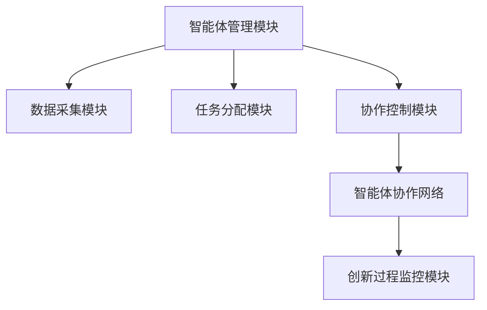

                 


# 利用智能体系统进行全面的公司创新效率评估

> **关键词**：智能体系统，创新效率评估，企业创新，多智能体协作，强化学习，系统架构设计

> **摘要**：本文详细探讨了如何利用智能体系统进行全面的公司创新效率评估。首先介绍了创新效率评估的背景与挑战，然后深入分析了智能体系统的核心概念与算法原理。接着，通过系统架构设计展示了如何将智能体系统应用于实际的企业创新评估中。最后，通过项目实战和最佳实践，提供了具体的实现方法和应用案例。

---

## 第1章: 创新效率评估的背景与挑战

### 1.1 创新效率评估的背景

#### 1.1.1 创新在企业中的重要性

在当今快速变化的商业环境中，创新是企业生存和发展的关键。企业的创新能力直接决定了其市场竞争力和长期发展潜力。然而，如何量化创新效率，如何优化创新过程，一直是企业管理者和研究人员关注的焦点。

#### 1.1.2 当前企业创新面临的挑战

尽管创新的重要性不言而喻，但在实际操作中，企业创新效率的评估仍然面临诸多挑战。例如，创新过程的高度不确定性、创新资源的分散性、创新成果的多样性等，都使得传统的评估方法难以准确反映创新效率。

#### 1.1.3 智能体系统在创新评估中的作用

智能体系统作为一种新兴的技术手段，具备分布式计算、自主协作和学习优化等特点，能够有效应对企业创新效率评估中的复杂问题。通过构建多智能体系统，可以实现对创新过程的实时监控和动态优化，从而提高评估的准确性和实时性。

---

### 1.2 创新效率评估的核心问题

#### 1.2.1 创新效率的定义与度量

创新效率通常指的是在一定时间内，企业通过创新活动所产生的价值与投入资源的比值。然而，由于创新过程的复杂性，传统的度量方法往往难以准确捕捉创新的关键环节。

#### 1.2.2 传统评估方法的局限性

传统的创新效率评估方法通常依赖于事后统计和主观判断，存在以下问题：
- 数据采集困难：创新过程涉及多个部门和环节，数据分散且难以整合。
- 评估周期长：传统评估方法通常需要等到创新成果显现后才能进行，难以实现实时反馈。
- 结果缺乏动态性：传统评估方法难以捕捉创新过程中的动态变化，无法为管理者提供及时的决策支持。

#### 1.2.3 智能体系统的优势与潜力

智能体系统通过实时数据采集、分布式计算和自主协作，能够克服传统评估方法的局限性。例如，智能体系统可以实时监控创新过程中的关键指标，动态调整评估策略，并提供个性化的优化建议。

---

## 第2章: 智能体系统的核心概念与联系

### 2.1 智能体系统的定义与特点

#### 2.1.1 智能体的定义

智能体（Agent）是指在计算环境中能够感知环境、自主决策并执行任务的实体。智能体可以是软件程序、机器人或其他具备智能特性的设备。

#### 2.1.2 多智能体系统的协作机制

在多智能体系统中，多个智能体通过协作完成复杂任务。协作机制包括通信协议、任务分配、冲突解决等关键环节。

#### 2.1.3 智能体与传统评估系统的对比

与传统评估系统相比，智能体系统具有以下优势：
- 高度自主性：智能体能够自主决策，无需人工干预。
- 分布式计算：智能体系统能够利用分布式计算资源，提高计算效率。
- 实时性：智能体系统能够实时感知环境变化，快速响应。

---

### 2.2 智能体系统与创新效率评估的关系

#### 2.2.1 创新效率评估的多维度需求

创新效率评估需要考虑创新过程的多个维度，包括创意生成、创新实施、创新成果等。每个维度都需要不同的评估指标和方法。

#### 2.2.2 智能体系统如何满足这些需求

智能体系统可以通过以下方式满足创新效率评估的多维度需求：
- **创意生成阶段**：智能体可以辅助创意生成，通过算法优化创意的质量和数量。
- **创新实施阶段**：智能体可以监控创新过程，动态调整资源分配，确保创新项目顺利推进。
- **创新成果阶段**：智能体可以评估创新成果的价值，提供数据支持和决策建议。

#### 2.2.3 智能体系统在创新评估中的具体应用

智能体系统在创新评估中的具体应用包括：
- **创意筛选**：通过智能体系统对创意进行初步筛选，降低人工筛选的成本。
- **风险评估**：智能体系统可以评估创新项目的潜在风险，帮助企业在创新过程中规避风险。
- **动态优化**：智能体系统可以根据实时数据动态优化创新策略，提高创新效率。

---

## 第3章: 智能体系统的核心算法原理

### 3.1 多智能体协作算法

#### 3.1.1 多智能体协作的基本原理

多智能体协作是指多个智能体通过通信和协作完成共同任务的过程。协作机制包括任务分配、信息共享、冲突解决等。

#### 3.1.2 基于强化学习的协作机制

强化学习是一种通过试错方式优化决策的算法。在多智能体协作中，强化学习可以通过不断试验和学习，找到最优的协作策略。

#### 3.1.3 分布式计算与智能体协作

分布式计算是多智能体协作的重要组成部分。通过分布式计算，智能体可以利用计算资源，提高协作效率。

---

### 3.2 创新效率评估的数学模型

#### 3.2.1 创新效率的数学表达式

创新效率可以表示为创新成果与创新投入的比值。数学表达式为：

$$ \text{创新效率} = \frac{\text{创新成果}}{\text{创新投入}} $$

其中，创新成果可以是经济收益、市场占有率等指标，创新投入包括人力、物力、财力等资源。

#### 3.2.2 基于智能体的评估模型

基于智能体的评估模型通常包括以下几个部分：
- **感知层**：智能体通过传感器或数据源获取环境信息。
- **决策层**：智能体根据感知信息做出决策。
- **执行层**：智能体根据决策执行任务。

#### 3.2.3 模型的优化与改进

为了提高评估模型的准确性和实时性，可以通过以下方式优化模型：
- **参数调整**：通过调整模型参数，优化评估结果。
- **算法改进**：引入新的算法，提高模型的计算效率和准确性。
- **数据优化**：通过数据清洗和预处理，提高数据质量。

---

## 第4章: 智能体系统在创新效率评估中的应用

### 4.1 创新过程的智能体建模

#### 4.1.1 创意生成阶段的智能体设计

在创意生成阶段，智能体可以通过数据分析和算法优化，辅助创意生成。例如，智能体可以通过分析市场趋势和消费者需求，生成具有市场潜力的创意。

#### 4.1.2 创新实施阶段的智能体协作

在创新实施阶段，智能体可以通过协作完成任务。例如，智能体可以分工协作，分别负责资源分配、风险评估、进度监控等任务。

#### 4.1.3 创新成果评估的智能体应用

在创新成果评估阶段，智能体可以通过数据挖掘和机器学习，评估创新成果的价值。例如，智能体可以通过分析销售数据和市场反馈，评估创新项目的经济价值。

---

### 4.2 智能体系统在企业创新中的具体案例

#### 4.2.1 某科技公司的创新效率提升案例

某科技公司通过引入智能体系统，显著提升了创新效率。例如，智能体系统通过实时监控创新过程，动态调整资源分配，缩短了创新周期，提高了创新成功率。

#### 4.2.2 智能体系统在创新项目管理中的应用

在创新项目管理中，智能体系统可以用于项目进度监控、风险评估、资源优化等。例如，智能体系统可以通过分析项目数据，预测项目进度，提前发现潜在风险。

#### 4.2.3 案例分析与经验总结

通过案例分析可以看出，智能体系统在创新效率评估中的应用具有显著的优势。例如，智能体系统能够通过实时数据监控，动态优化创新策略，提高创新效率。

---

## 第5章: 智能体系统与创新效率评估的系统架构设计

### 5.1 系统架构概述

#### 5.1.1 系统整体架构图

以下是系统整体架构图：



#### 5.1.2 智能体组件的设计与实现

智能体组件的设计与实现需要考虑以下几个方面：
- **智能体通信协议**：定义智能体之间的通信方式。
- **智能体协作机制**：设计智能体协作的具体流程。
- **智能体学习算法**：选择合适的算法优化智能体决策。

#### 5.1.3 系统的可扩展性与灵活性

系统的可扩展性与灵活性是智能体系统设计的重要考虑因素。例如，系统需要支持智能体数量的动态变化，适应不同的创新评估需求。

---

### 5.2 系统功能模块设计

#### 5.2.1 数据采集与处理模块

数据采集与处理模块负责从企业创新过程中采集数据，并进行预处理。例如，智能体可以通过传感器采集创新过程中的实时数据，如资源使用情况、项目进度等。

#### 5.2.2 智能体协作模块

智能体协作模块负责协调多个智能体的协作。例如，智能体可以通过通信协议交换信息，完成任务分配和协作控制。

#### 5.2.3 创新效率评估模块

创新效率评估模块负责根据智能体协作的结果，评估创新效率。例如，智能体可以通过分析创新过程数据，计算创新效率指标。

---

## 第6章: 项目实战与系统实现

### 6.1 环境安装与配置

为了运行智能体系统，需要安装以下环境：
- **Python**：用于编写智能体程序。
- **TensorFlow** 或 **PyTorch**：用于实现机器学习算法。
- **Mermaid**：用于绘制系统架构图。

### 6.2 系统核心实现源代码

以下是系统核心实现的源代码示例：

```python
class Agent:
    def __init__(self, id):
        self.id = id
        self.state = None
        self.goal = None

    def perceive(self, environment):
        self.state = environment.get_state()

    def decide(self):
        if self.state is None:
            return
        # 假设通过强化学习算法进行决策
        action = self.policy(self.state)
        return action

    def execute(self, action):
        pass

def environment_get_state(environment):
    return environment.state
```

### 6.3 代码应用解读与分析

上述代码定义了一个智能体类 `Agent`，包含感知、决策和执行三个主要功能。`perceive` 方法用于感知环境状态，`decide` 方法用于根据当前状态做出决策，`execute` 方法用于执行决策动作。环境状态可以通过 `environment_get_state` 方法获取。

---

## 第7章: 最佳实践与总结

### 7.1 小结

通过本文的详细讲解，我们可以看到，智能体系统在公司创新效率评估中的应用具有重要的意义。智能体系统能够通过实时数据监控、动态优化和自主协作，显著提高创新效率。

### 7.2 注意事项

在实际应用中，需要注意以下几点：
- **数据隐私**：智能体系统需要处理大量企业数据，必须确保数据安全和隐私保护。
- **系统稳定性**：智能体系统的稳定性直接影响创新评估的准确性，需要进行充分的测试和优化。
- **人机协作**：智能体系统不能完全替代人类的决策，需要与人类专家进行有效的协作。

### 7.3 拓展阅读

对于感兴趣的技术细节，可以参考以下资源：
- 《Multi-Agent Systems: Algorithm and Applications》
- 《Reinforcement Learning: Theory and Practice》
- 《Software Architecture: Patterns and Practices》

---

通过本文的详细讲解，我们希望能够为读者提供一个全面的视角，帮助他们在实际应用中更好地利用智能体系统进行公司创新效率评估。

