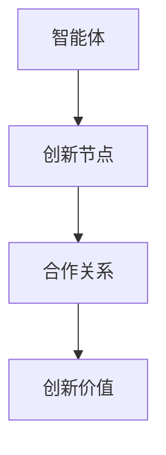
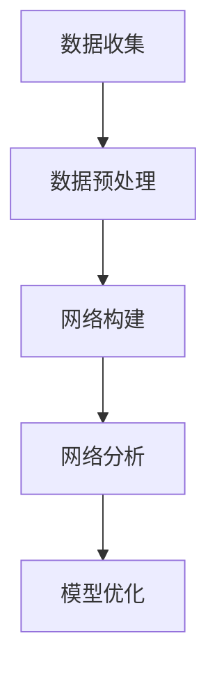
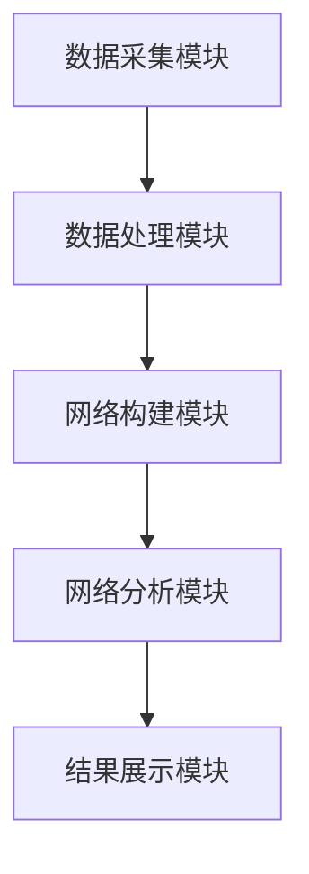
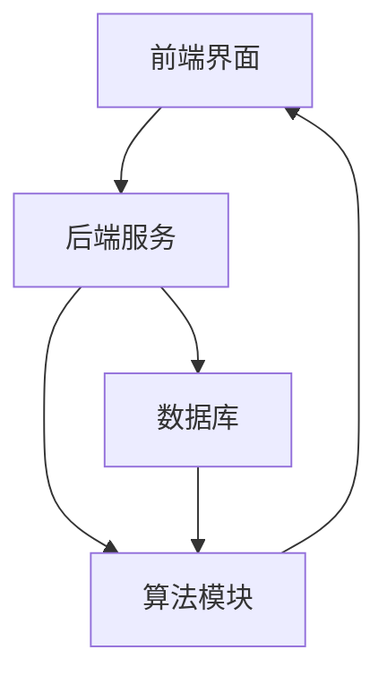
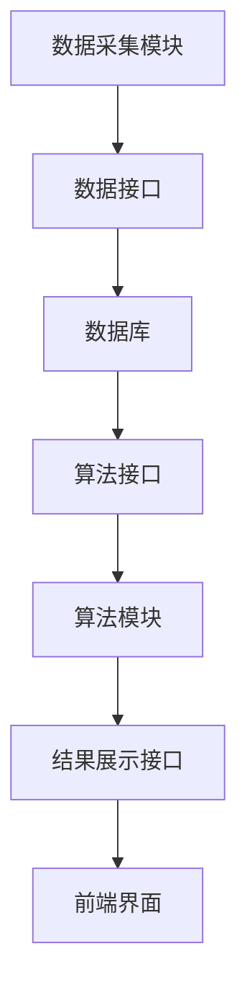

                 


# 利用智能体网络分析公司的创新合作网络价值

> 关键词：智能体网络，创新合作网络，网络价值分析，图论算法，系统架构，项目实战

> 摘要：本文探讨如何利用智能体网络分析公司的创新合作网络价值，通过图论算法和系统架构设计，结合实际案例，详细讲解智能体网络分析的核心概念、算法原理、系统设计和项目实战。通过本文，读者将能够理解如何通过智能体网络分析来评估公司内部和外部的合作网络价值，进而优化公司的创新合作策略。

---

# 第一部分: 智能体网络与创新合作网络价值概述

## 第1章: 智能体网络与创新合作网络价值概述

### 1.1 智能体网络的基本概念

#### 1.1.1 智能体网络的定义
智能体网络是一种基于智能体（Agent）的网络结构，智能体是指能够感知环境、自主决策并与其他智能体或系统进行交互的实体。智能体网络通过智能体之间的交互和协作，形成一个动态的、自适应的网络系统。

#### 1.1.2 智能体网络的核心属性
智能体网络具有以下核心属性：
- **自主性**：智能体能够自主决策和行动。
- **反应性**：智能体能够实时感知环境并做出反应。
- **协作性**：智能体之间可以通过通信和协作完成复杂任务。
- **动态性**：智能体网络的结构和功能可以动态变化。

#### 1.1.3 智能体网络与传统网络的区别
传统网络（如TCP/IP网络）主要关注数据的传输和路由，而智能体网络不仅关注数据传输，还强调智能体之间的交互和协作。智能体网络更加注重系统的智能性和动态性。

### 1.2 创新合作网络的定义与价值

#### 1.2.1 创新合作网络的定义
创新合作网络是指在创新过程中，多个个体、团队或组织之间通过合作形成的一种网络结构。这种网络通过合作节点之间的互动，实现创新资源的共享和创新价值的创造。

#### 1.2.2 创新合作网络的核心要素
创新合作网络的核心要素包括：
- **创新节点**：代表创新资源（如知识、技术、资金等）的载体。
- **合作关系**：节点之间的合作关系。
- **创新价值**：合作产生的创新成果或价值。

#### 1.2.3 创新合作网络的价值与意义
创新合作网络的价值体现在以下几个方面：
- **资源优化配置**：通过合作网络，可以实现创新资源的优化配置。
- **知识共享**：合作网络促进知识的共享和传播。
- **创新效率提升**：合作网络能够提高创新过程的效率。
- **风险分担**：合作网络可以分担创新过程中的风险。

### 1.3 问题背景与研究意义

#### 1.3.1 问题背景
随着全球化和知识经济的发展，创新合作网络的重要性日益凸显。然而，传统的创新管理方法往往忽略了合作网络的动态性和复杂性，导致创新资源浪费和合作效率低下。

#### 1.3.2 问题描述
如何通过智能体网络分析方法，对公司的创新合作网络进行建模、分析和优化，以提升创新合作网络的价值？

#### 1.3.3 问题解决的必要性
通过智能体网络分析，可以更好地理解创新合作网络的结构和动态，从而优化合作策略，提升创新效率和价值。

#### 1.3.4 研究的边界与外延
本研究的边界是公司内部和外部的创新合作网络，不包括公司内部的组织结构和管理流程。外延则包括创新合作网络的分析方法和优化策略。

### 1.4 本章小结
本章介绍了智能体网络和创新合作网络的基本概念，探讨了创新合作网络的价值与意义，并提出了通过智能体网络分析方法解决创新合作网络价值的问题。

---

## 第2章: 智能体网络的核心概念与联系

### 2.1 智能体网络的核心概念

#### 2.1.1 智能体的定义与特征
智能体（Agent）是指能够感知环境、自主决策并与其他智能体或系统进行交互的实体。智能体具有以下特征：
- **自主性**：智能体能够自主决策。
- **反应性**：智能体能够实时感知环境并做出反应。
- **协作性**：智能体能够与其他智能体协作完成任务。
- **学习能力**：智能体能够通过学习提高自身的智能水平。

#### 2.1.2 智能体网络的结构与层次
智能体网络的结构可以分为以下层次：
- **节点层**：智能体网络的基本组成单元。
- **关系层**：节点之间的关系和交互。
- **功能层**：智能体网络的功能实现。
- **应用层**：智能体网络的应用场景。

### 2.2 创新合作网络的实体关系

#### 2.2.1 实体关系图
创新合作网络的实体关系可以通过以下Mermaid图表示：


#### 2.2.2 智能体网络与创新合作网络的关系
智能体网络与创新合作网络的关系可以表示为：
- 智能体网络是创新合作网络的实现基础。
- 创新合作网络是智能体网络的应用场景。

### 2.3 核心概念的属性特征对比

#### 2.3.1 智能体与创新节点的属性对比
| 属性 | 智能体 | 创新节点 |
|------|--------|----------|
| 定义 | 独立的智能实体 | 创新资源的载体 |
| 特征 | 自主性、反应性、协作性 | 知识、技术、资金等 |
| 作用 | 执行任务、与其他智能体交互 | 实现创新资源的共享和合作 |

#### 2.3.2 合作关系与创新价值的特征对比
| 属性 | 合作关系 | 创新价值 |
|------|----------|----------|
| 定义 | 节点之间的互动关系 | 合作产生的创新成果 |
| 特征 | 协作性、动态性 | 创新性、共享性 |
| 作用 | 实现创新资源的整合 | 提高创新效率和价值 |

### 2.4 本章小结
本章通过对比智能体网络和创新合作网络的核心概念，探讨了两者之间的关系和属性特征。

---

## 第3章: 智能体网络分析的算法原理

### 3.1 智能体网络分析的基本原理

#### 3.1.1 图论基础
图论是智能体网络分析的基础。图论中的图（Graph）由节点（Vertex）和边（Edge）组成，用于表示智能体网络的结构。

#### 3.1.2 智能体网络的表示方法
智能体网络可以通过以下方式表示：
- **邻接矩阵**：表示节点之间的关系。
- **邻接列表**：表示每个节点的邻居节点。
- **边权重**：表示节点之间关系的强度。

#### 3.1.3 网络分析的基本步骤
网络分析的基本步骤包括：
1. 数据收集：收集智能体网络的数据。
2. 数据预处理：清洗数据，提取特征。
3. 网络构建：根据数据构建智能体网络模型。
4. 网络分析：对网络进行分析，提取有价值的信息。
5. 模型优化：优化网络模型，提高分析的准确性。

### 3.2 智能体网络分析的算法原理

#### 3.2.1 基于图论的算法
基于图论的算法包括：
- **度数分析**：计算节点的度数，分析节点的重要性。
- **中心性分析**：计算节点的中心性，分析节点的影响力。
- **社区检测**：检测网络中的社区结构。

#### 3.2.2 基于相似度的算法
基于相似度的算法包括：
- **余弦相似度**：计算节点之间的相似度。
- **Jaccard相似度**：计算节点之间的相似度。

#### 3.2.3 算法流程图
智能体网络分析的算法流程图可以用以下Mermaid图表示：


### 3.3 智能体网络分析的数学模型

#### 3.3.1 节点相似度计算公式
节点相似度计算公式：
$$ sim(i, j) = \frac{|N(i) \cap N(j)|}{|N(i)| + |N(j)| - |N(i) \cap N(j)|} $$
其中，$N(i)$ 表示节点 $i$ 的邻居节点集合。

#### 3.3.2 网络分析的数学模型
网络分析的数学模型可以表示为：
$$ A = \sum_{i=1}^{n} \sum_{j=1}^{n} a_{ij} \cdot x_{ij} $$
其中，$a_{ij}$ 表示节点 $i$ 和节点 $j$ 之间的边权重，$x_{ij}$ 表示边是否存在。

### 3.4 本章小结
本章详细介绍了智能体网络分析的算法原理，包括基于图论的算法和基于相似度的算法，并给出了算法的流程图和数学模型。

---

## 第4章: 智能体网络分析的系统架构设计

### 4.1 系统功能设计

#### 4.1.1 功能模块划分
系统功能模块包括：
- **数据采集模块**：采集智能体网络的数据。
- **数据处理模块**：清洗和预处理数据。
- **网络构建模块**：构建智能体网络模型。
- **网络分析模块**：对网络进行分析，提取有价值的信息。
- **结果展示模块**：展示分析结果。

#### 4.1.2 功能模块的交互流程
功能模块的交互流程可以用以下Mermaid图表示：


### 4.2 系统架构设计

#### 4.2.1 系统架构的组成
系统架构包括：
- **前端界面**：用户交互界面。
- **后端服务**：处理用户请求和数据。
- **数据库**：存储智能体网络的数据。
- **算法模块**：实现智能体网络分析的算法。

#### 4.2.2 系统架构图
系统架构图可以用以下Mermaid图表示：


### 4.3 系统接口设计

#### 4.3.1 接口设计
系统接口设计包括：
- **数据接口**：数据采集模块与数据库之间的接口。
- **算法接口**：网络分析模块与算法模块之间的接口。
- **展示接口**：结果展示模块与前端界面之间的接口。

#### 4.3.2 接口交互流程
接口交互流程可以用以下Mermaid图表示：


### 4.4 本章小结
本章详细介绍了智能体网络分析系统的架构设计，包括功能模块划分、系统架构组成和接口设计。

---

## 第5章: 智能体网络分析的项目实战

### 5.1 项目背景与目标

#### 5.1.1 项目背景
某公司希望通过对内部创新合作网络的分析，优化公司的创新合作策略。

#### 5.1.2 项目目标
项目目标包括：
1. 构建公司的创新合作网络模型。
2. 分析网络的结构和动态。
3. 提出优化创新合作网络的建议。

### 5.2 项目实施步骤

#### 5.2.1 数据收集
数据收集包括：
- **内部数据**：公司内部员工的协作数据。
- **外部数据**：合作伙伴的协作数据。

#### 5.2.2 数据预处理
数据预处理包括：
- 数据清洗：去除无效数据。
- 数据转换：将数据转换为网络分析所需的格式。

#### 5.2.3 网络构建
网络构建包括：
- 构建邻接矩阵或邻接列表。
- 设置边权重。

#### 5.2.4 网络分析
网络分析包括：
- 度数分析：计算节点的度数。
- 中心性分析：计算节点的中心性。
- 社区检测：检测网络中的社区结构。

#### 5.2.5 结果展示
结果展示包括：
- 展示网络的结构。
- 展示节点的度数和中心性。
- 展示社区结构。

### 5.3 项目实战代码示例

#### 5.3.1 网络构建代码
```python
import networkx as nx

G = nx.Graph()
G.add_nodes_from(["A", "B", "C", "D", "E"])
G.add_edges_from([("A", "B"), ("B", "C"), ("C", "D"), ("D", "E"), ("A", "C")])
```

#### 5.3.2 网络分析代码
```python
import networkx as nx
from matplotlib import pyplot as plt

G = nx.Graph()
G.add_nodes_from(["A", "B", "C", "D", "E"])
G.add_edges_from([("A", "B"), ("B", "C"), ("C", "D"), ("D", "E"), ("A", "C")])

nx.draw(G, with_labels=True)
plt.show()
```

### 5.4 项目小结
本章通过一个实际案例，详细讲解了智能体网络分析的项目实施步骤，并给出了网络构建和分析的代码示例。

---

## 第6章: 智能体网络分析的最佳实践

### 6.1 小结

#### 6.1.1 核心概念回顾
智能体网络分析的核心概念包括智能体网络、创新合作网络、网络分析算法等。

#### 6.1.2 算法原理回顾
智能体网络分析的算法包括基于图论的算法和基于相似度的算法。

### 6.2 注意事项

#### 6.2.1 数据质量
数据质量是智能体网络分析的关键，必须确保数据的准确性和完整性。

#### 6.2.2 算法选择
在选择算法时，需要根据具体问题和数据特点进行选择。

#### 6.2.3 结果解释
在解释分析结果时，需要结合实际业务背景进行分析。

### 6.3 未来展望

#### 6.3.1 研究方向
未来的研究方向包括：
- **动态网络分析**：研究智能体网络的动态变化。
- **多智能体协作**：研究多智能体协作的优化方法。
- **智能体网络与人工智能的结合**：研究智能体网络与人工智能的结合。

#### 6.3.2 技术趋势
未来的技术趋势包括：
- **智能化**：智能体网络的智能化。
- **实时化**：智能体网络的实时分析。
- **可视化**：智能体网络的可视化。

### 6.4 本章小结
本章总结了智能体网络分析的核心概念和算法原理，并提出了未来的研究方向和技术趋势。

---

## 第7章: 结论与展望

### 7.1 结论
智能体网络分析是一种有效的创新合作网络价值分析方法。通过智能体网络分析，可以更好地理解创新合作网络的结构和动态，从而优化公司的创新合作策略。

### 7.2 展望
未来的研究方向包括动态网络分析、多智能体协作和智能体网络与人工智能的结合。随着技术的发展，智能体网络分析将在更多领域得到应用。

### 7.3 本章小结
本章总结了智能体网络分析的应用价值，并展望了未来的研究方向。

---

## 参考文献
（此处列出相关文献和参考资料）

---

## 附录

### 附录A: 智能体网络分析的数学公式

### 附录B: 智能体网络分析的代码示例

---

通过本文的详细讲解，读者可以全面了解智能体网络分析的核心概念、算法原理、系统架构和项目实战，并能够将其应用到实际的创新合作网络价值分析中。

