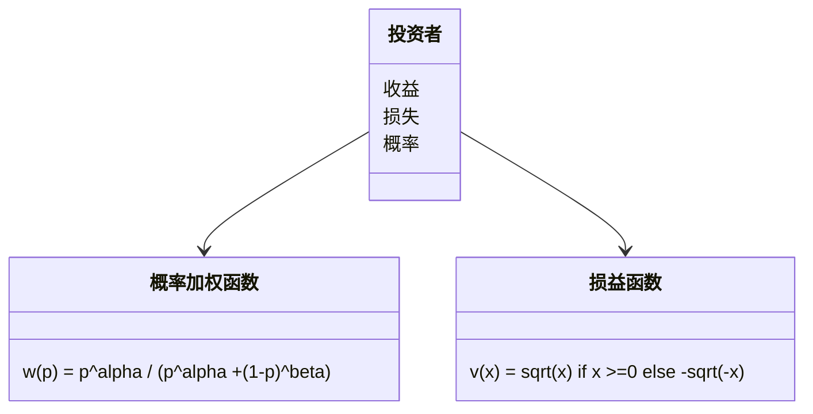
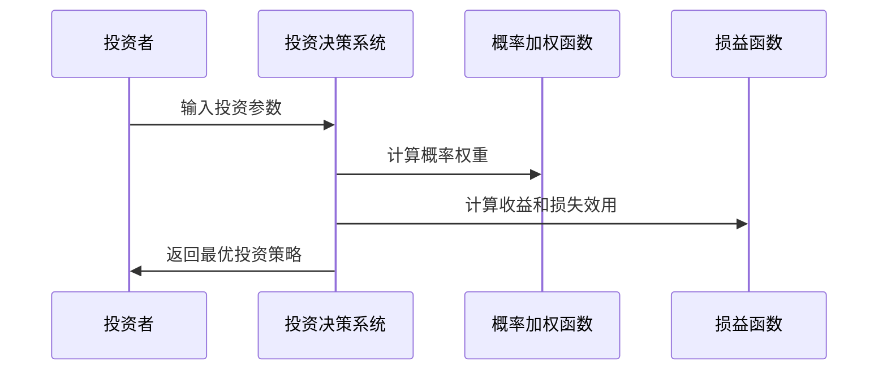

                 


# 前景理论：损失厌恶如何影响投资决策

> 关键词：前景理论，损失厌恶，投资决策，决策理论，风险管理

> 摘要：前景理论是一种基于心理学的决策理论，它揭示了损失厌恶如何影响投资决策。本文通过分析前景理论的核心概念、数学模型、算法原理，以及在投资决策中的系统设计和实际案例，探讨了损失厌恶对投资者行为的具体影响，并提出了在实际投资中应用前景理论的最佳实践建议。

---

# 第1章：前景理论的背景与核心概念

## 1.1 传统经济学与决策理论的局限性

### 1.1.1 传统经济学的假设与缺陷

传统经济学假设投资者是理性的，追求效用的最大化，且对风险有明确的偏好。然而，现实中投资者的行为往往偏离这一假设。例如，投资者在面对相同收益和损失时，表现出的风险偏好不同，这种现象无法用传统经济学解释。

### 1.1.2 决策理论的演进与挑战

决策理论从期望效用理论（EUT）发展而来，但EUT在解释实际行为时存在诸多不足。例如，它无法解释投资者在面对小概率事件时的过度反应，以及在收益和损失之间的非对称风险偏好。

### 1.1.3 前景理论的提出背景

前景理论（Prospect Theory）由Kahneman和Tversky在1979年提出，旨在解决期望效用理论无法解释的问题。它通过引入损失厌恶、概率加权等概念，更贴近现实中的投资者行为。

## 1.2 损失厌恶的定义与特征

### 1.2.1 损失厌恶的定义

损失厌恶是指投资者对损失的敏感程度远高于收益。即，面对同等金额的收益和损失，投资者更倾向于避免损失，而非追求收益。

### 1.2.2 损失厌恶的核心特征

- **损失权重**：损失带来的效用损失比收益带来的效用收益更大。
- **参考点依赖性**：投资者的决策受到参考点的影响，通常以当前财富为基准点。
- **非线性概率加权**：前景理论引入了概率加权函数，将小概率事件的权重放大，大概率事件的权重缩小。

### 1.2.3 损失厌恶与风险偏好的关系

损失厌恶与风险偏好密切相关。由于投资者更厌恶损失，他们在投资决策中倾向于选择风险较低的选项，即使这意味着可能错过高收益的机会。

---

# 第2章：前景理论的核心概念与模型

## 2.1 前景理论的基本框架

### 2.1.1 前景理论的决策过程

1. **编辑阶段**：投资者将决策问题转化为易于处理的形式，包括归并、排除和调整概率。
2. **评估阶段**：根据概率加权函数和损益函数，计算每个选项的期望效用。
3. **选择阶段**：根据计算的期望效用选择最优选项。

### 2.1.2 前景理论的数学模型

前景理论的数学表达如下：

$$ U = \sum_{i=1}^n p_i v_i $$

其中：
- \( p_i \) 是结果 \( i \) 的概率。
- \( v_i = \begin{cases} 
  p_i \times (\text{收益或损失}) \\
  \end{cases} \)

### 2.1.3 前景理论的核心假设

- **损失厌恶**：损失带来的效用损失大于收益带来的效用收益。
- **概率加权**：投资者对小概率事件赋予更高的权重。

## 2.2 损失厌恶对投资决策的影响

### 2.2.1 损失厌恶的双重效应

- **风险厌恶**：由于对损失的厌恶，投资者倾向于选择风险较低的投资。
- **风险寻求**：在某些情况下，投资者可能因对损失的厌恶而过度追求高风险投资，以避免更大的潜在损失。

### 2.2.2 损失厌恶与风险厌恶的对比

| 概念       | 损失厌恶               | 风险厌恶               |
|------------|------------------------|------------------------|
| 定义       | 更厌恶损失             | 更厌恶风险             |
| 表现       | 避免小损失，追求小收益 | 避免高风险，追求低风险 |

### 2.2.3 损失厌恶对投资行为的具体影响

- **过度交易**：投资者因频繁评估损失而进行过多交易，增加交易成本。
- **保守投资**：倾向于选择低风险资产，如债券，而非高风险资产如股票。

---

# 第3章：前景理论与投资决策的结合

## 3.1 投资决策中的损失厌恶表现

### 3.1.1 投资者的行为偏差

- **避免损失**：投资者倾向于卖出亏损的股票，避免进一步损失。
- **参考点依赖**：投资者对当前财富的偏离更敏感，导致投资决策的非理性。

### 3.1.2 损失厌恶对投资组合的影响

- **资产配置**：增加防御性资产（如现金、债券），减少高风险资产。
- **风险分散**：通过多样化投资降低单一资产的损失风险。

### 3.1.3 损失厌恶与市场波动的关系

- **市场波动加剧**：投资者的损失厌恶导致频繁交易，进一步加剧市场波动。
- **市场情绪影响**：损失厌恶在市场下跌时更为显著，放大市场的负面情绪。

## 3.2 前景理论在投资策略中的应用

### 3.2.1 基于前景理论的投资策略框架

1. **设定参考点**：以当前财富为基准，评估投资结果。
2. **评估损益**：计算每种投资的收益和损失。
3. **概率加权**：根据概率加权函数调整损益的权重。
4. **选择最优投资**：根据加权后的期望效用选择最优策略。

### 3.2.2 损失厌恶对资产配置的影响

- **防御性资产比例增加**：如债券、黄金等。
- **股票选择**：倾向于选择高分红、低波动的股票。

### 3.2.3 前景理论在风险管理中的应用

- **风险预警机制**：识别潜在的损失，提前采取风险管理措施。
- **压力测试**：评估极端损失情况下的投资组合表现。

---

# 第4章：前景理论的数学模型与算法原理

## 4.1 概率加权函数

### 4.1.1 概率加权函数的定义

概率加权函数将实际概率转换为感知概率，放大小概率事件的影响。

$$ w(p) = \frac{p^\alpha}{(p^\alpha + (1-p)^\beta)} $$

其中，\( \alpha \) 和 \( \beta \) 是参数，控制概率的加权程度。

### 4.1.2 概率加权函数的数学表达

- 当 \( p \) 很小时，\( w(p) \) 迅速增大，表示投资者对小概率损失的高度关注。
- 当 \( p \) 接近1时，\( w(p) \) 接近1，表示对大概率事件的正常加权。

### 4.1.3 概率加权函数的应用

- 在前景理论中，概率加权函数用于计算每个结果的权重。
- 在投资决策中，用于调整不同概率事件的权重，以反映投资者的损失厌恶。

## 4.2 前景理论的效用函数

### 4.2.1 前景理论的效用函数结构

效用函数由概率加权函数和损益函数组成：

$$ U = \sum_{i=1}^n w(p_i) \times v_i $$

其中，\( v_i = \max(\text{收益}, 0) \) 或 \( v_i = -\min(\text{损失}, 0) \)。

### 4.2.2 损失与收益的不对称性

- 收益的效用函数呈凹函数形状。
- 损失的效用函数呈凸函数形状。

### 4.2.3 效用函数的数学推导

- 对于收益 \( x \)，效用函数为：
  $$ u(x) = \sqrt{x} $$
- 对于损失 \( x \)，效用函数为：
  $$ u(-x) = -\sqrt{x} $$

---

# 第5章：基于前景理论的决策算法

## 5.1 损失厌恶的决策权重函数

### 5.1.1 决策权重函数的定义

决策权重函数用于将实际概率转换为感知概率，反映投资者对概率的主观判断。

### 5.1.2 决策权重函数的数学模型

$$ w(p) = p^\alpha $$

其中，\( \alpha \) 是损失厌恶参数，\( \alpha > 1 \) 表示损失厌恶，\( \alpha < 1 \) 表示风险偏好。

### 5.1.3 决策权重函数的应用

- 在投资决策中，用于调整不同概率事件的权重，反映投资者的损失厌恶。

## 5.2 前景理论在投资决策中的算法实现

### 5.2.1 投资决策的算法流程

1. 确定投资目标和参考点。
2. 评估每种投资的收益和损失。
3. 计算每种结果的概率。
4. 应用概率加权函数和损益函数，计算期望效用。
5. 根据期望效用选择最优投资策略。

### 5.2.2 算法实现的步骤

1. 收集投资选项的收益、损失和概率。
2. 应用概率加权函数和损益函数，计算每种选项的期望效用。
3. 比较期望效用，选择效用最大的选项。

### 5.2.3 算法实现的代码示例

```python
def prospect_theory_utility(x, p, alpha=0.5, beta=0.5):
    # x 是收益或损失
    # p 是概率
    # alpha 和 beta 是参数
    if x >= 0:
        v = (x)**0.5
    else:
        v = -(abs(x))**0.5
    w = p**alpha / (p**alpha + (1-p)**beta)
    return w * v

# 示例：计算一个收益为100，概率为0.1的情况
utility = prospect_theory_utility(100, 0.1)
print("期望效用为：", utility)
```

---

# 第6章：投资决策支持系统的架构设计

## 6.1 系统功能设计

### 6.1.1 系统功能模块

- 用户界面：输入投资参数，选择投资策略。
- 数据处理：计算收益、损失和概率。
- 模型计算：应用前景理论模型，计算期望效用。
- 结果展示：显示最优投资策略和相关分析。

### 6.1.2 系统功能设计的领域模型



### 6.1.3 系统功能设计的交互流程



## 6.2 系统架构设计

### 6.2.1 系统架构的模块划分

- 用户界面模块：展示投资参数和结果。
- 数据处理模块：计算收益、损失和概率。
- 模型计算模块：应用前景理论模型，计算期望效用。
- 结果展示模块：显示最优投资策略和相关分析。

### 6.2.2 系统架构设计的mermaid图

```mermaid
containerdiagram
    container 用户界面模块 {
        component 输入输出
    }
    container 数据处理模块 {
        component 数据计算
    }
    container 模型计算模块 {
        component 前景理论模型
    }
    container 结果展示模块 {
        component 结果分析
    }
```

---

# 第7章：总结与展望

## 7.1 总结

前景理论通过揭示损失厌恶对投资决策的影响，帮助投资者更好地理解自身的决策行为。本文详细介绍了前景理论的核心概念、数学模型、算法原理，以及在投资决策中的系统设计和实际应用。

## 7.2 应用中的挑战

- **模型复杂性**：前景理论涉及多个参数，模型复杂，难以直接应用于实际投资。
- **动态市场环境**：市场环境不断变化，需要动态调整模型参数。

## 7.3 最佳实践

- **设定合理的参考点**：避免参考点依赖带来的决策偏差。
- **动态调整模型参数**：根据市场环境变化，及时调整概率加权函数的参数。

## 7.4 拓展阅读

- Kahneman, D., & Tversky, A. (1979). Prospect theory: An analysis of decision under risk.

---

通过以上结构，您可以逐步展开每部分内容，撰写一篇完整且有深度的技术博客文章。希望这篇结构能为您提供清晰的思路和框架。

