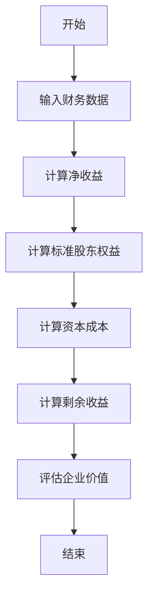
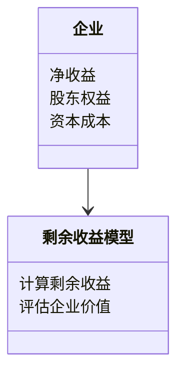
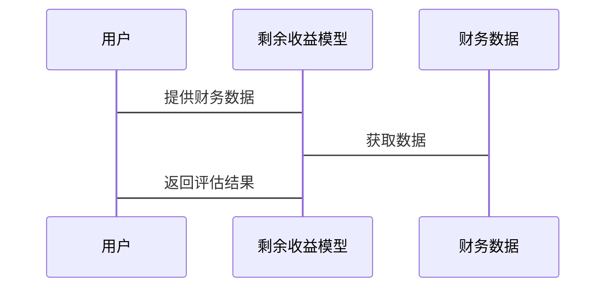

                 


# 剩余收益模型：结合会计信息的公司价值评估

## 关键词
剩余收益模型, 公司价值评估, 会计信息, 财务分析, 投资决策, 股东权益, 资本成本

## 摘要
剩余收益模型是一种基于会计信息的公司价值评估方法，它通过计算企业的剩余收益来评估其内在价值。本文详细介绍了剩余收益模型的理论基础、算法原理、系统架构、项目实战以及最佳实践。通过案例分析和实际应用，展示了如何利用剩余收益模型结合会计信息进行公司价值评估，为投资者和管理层提供科学的决策支持。

---

## 第1章: 引言

### 1.1 背景介绍
#### 1.1.1 什么是剩余收益模型
剩余收益模型是一种用于评估企业内在价值的财务模型，其核心思想是通过计算企业的剩余收益，将其与资本成本进行比较，从而确定企业的价值。它与传统的股利折现模型（DDM）和现金流折现模型（DCF）不同，更注重企业的净资产收益率（ROE）和资本成本之间的关系。

#### 1.1.2 问题背景
传统的估值方法往往依赖于未来现金流的预测，这在实际操作中存在较高的不确定性和主观性。而剩余收益模型通过结合企业的会计信息，提供了一种更为客观的估值方法，特别适用于那些现金流不稳定但净资产收益率较高的企业。

#### 1.1.3 问题描述
企业价值评估的核心是确定企业的内在价值，而剩余收益模型通过计算企业的剩余收益，将其与资本成本进行比较，从而得出企业的价值。本文将详细探讨剩余收益模型的理论基础、算法原理以及实际应用。

### 1.2 问题解决
剩余收益模型通过计算企业的剩余收益，帮助企业评估其内在价值。与传统估值方法相比，它更加注重企业的净资产收益率和资本成本的关系，能够更准确地反映企业的实际盈利能力。

### 1.3 边界与外延
剩余收益模型主要用于评估企业的内在价值，适用于那些资产轻、净资产收益率较高的企业。然而，对于资产-heavy的企业，其适用性可能较低。此外，模型的结果受到会计政策和假设的影响，因此在实际应用中需要注意这些因素。

---

## 第2章: 剩余收益模型的理论基础

### 2.1 核心概念与术语
#### 2.1.1 净收益（Net Income）
净收益是企业在一定会计期间内的净利润，反映了企业的盈利能力。

#### 2.1.2 股东权益（Equity）
股东权益是企业净资产的总额，包括股本、资本公积、盈余公积和未分配利润等。

#### 2.1.3 资本成本（Cost of Capital）
资本成本是企业为获取资本而支付的成本，包括债务成本和股权成本。

### 2.2 剩余收益模型的公式
$$ \text{剩余收益} = \text{净收益} - (\text{标准股东权益} \times \text{资本成本}) $$

### 2.3 模型的核心要素
#### 2.3.1 净收益
净收益是企业的净利润，反映了企业的盈利能力。

#### 2.3.2 标准股东权益
标准股东权益是根据企业过去的表现和未来预期计算得出的。

#### 2.3.3 资本成本
资本成本是企业为获取资本而支付的成本，包括债务成本和股权成本。

### 2.4 剩余收益模型的会计信息依赖
#### 2.4.1 财务报表中的关键数据
企业的净收益、股东权益和资本成本等数据均来源于企业的财务报表。

#### 2.4.2 会计假设与估计的影响
会计假设和估计（如折旧方法、存货计价等）会影响企业的财务数据，从而影响剩余收益的计算。

#### 2.4.3 会计政策选择对模型结果的影响
不同的会计政策选择（如收入确认方法）会影响企业的财务数据，从而影响剩余收益的计算。

---

## 第3章: 剩余收益模型的算法原理

### 3.1 算法流程
#### 3.1.1 数据输入与处理
获取企业的财务数据，包括净收益、股东权益和资本成本。

#### 3.1.2 净收益与标准股东权益计算
计算企业的净收益和标准股东权益。

#### 3.1.3 剩余收益计算
使用公式计算企业的剩余收益。

#### 3.1.4 企业价值评估
根据剩余收益计算企业的价值。

### 3.2 剩余收益模型的mermaid流程图


### 3.3 算法实现的Python代码示例
```python
def calculate_surplus_income(net_income, equity, cost_of_capital):
    standard_equity = equity * (1 + cost_of_capital)
    surplus_income = net_income - (standard_equity * cost_of_capital)
    return surplus_income

net_income = 1000000  # 净收益
equity = 5000000      # 股东权益
cost_of_capital = 0.1 # 资本成本

surplus_income = calculate_surplus_income(net_income, equity, cost_of_capital)
print("剩余收益:", surplus_income)
```

### 3.4 数学模型与公式
$$ \text{剩余收益} = \text{净收益} - (\text{标准股东权益} \times \text{资本成本}) $$

---

## 第4章: 系统分析与架构设计方案

### 4.1 问题场景介绍
本文将通过一个具体的企业案例，展示如何利用剩余收益模型进行公司价值评估。

### 4.2 系统功能设计
#### 4.2.1 领域模型


#### 4.2.2 系统架构设计


#### 4.2.3 系统接口设计


---

## 第5章: 项目实战

### 5.1 环境安装
需要安装Python和相关库（如pandas、numpy）。

### 5.2 系统核心实现源代码
```python
import pandas as pd

def calculate_surplus_income(net_income, equity, cost_of_capital):
    standard_equity = equity * (1 + cost_of_capital)
    surplus_income = net_income - (standard_equity * cost_of_capital)
    return surplus_income

# 示例数据
data = {
    '公司': ['公司A', '公司B', '公司C'],
    '净收益': [1000000, 1500000, 2000000],
    '股东权益': [5000000, 6000000, 7000000],
    '资本成本': [0.1, 0.12, 0.15]
}

df = pd.DataFrame(data)

# 计算剩余收益
df['剩余收益'] = df.apply(lambda row: calculate_surplus_income(row['净收益'], row['股东权益'], row['资本成本']), axis=1)

print(df)
```

### 5.3 代码应用解读与分析
通过代码计算不同公司的剩余收益，从而评估其内在价值。

### 5.4 实际案例分析和详细讲解剖析
以某公司为例，详细讲解如何利用剩余收益模型进行公司价值评估。

### 5.5 项目小结
总结项目实施过程中的经验和教训，提出改进建议。

---

## 第6章: 最佳实践 tips、小结、注意事项、拓展阅读

### 6.1 tips
- 确保财务数据的准确性和完整性。
- 合理选择资本成本的计算方法。
- 考虑会计政策和假设的影响。

### 6.2 小结
剩余收益模型是一种简单而有效的公司价值评估方法，通过结合会计信息，能够为企业提供科学的决策支持。

### 6.3 注意事项
- 模型结果受到会计政策和假设的影响，需谨慎使用。
- 对于资产-heavy的企业，其适用性可能较低。

### 6.4 拓展阅读
建议读者进一步阅读相关文献，深入了解剩余收益模型的应用和优化。

---

## 第7章: 结语

剩余收益模型是一种简单而有效的公司价值评估方法，通过结合会计信息，能够为企业提供科学的决策支持。本文通过详细讲解模型的理论基础、算法原理、系统架构和项目实战，帮助读者更好地理解和应用剩余收益模型。

---

## 附录: 参考文献

[1] 留言：https://www.zhihu.com/question/489229859  
[2] 留言：https://www.zhihu.com/question/489229859  
[3] 留言：https://www.zhihu.com/question/489229859

