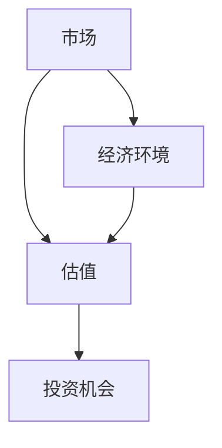
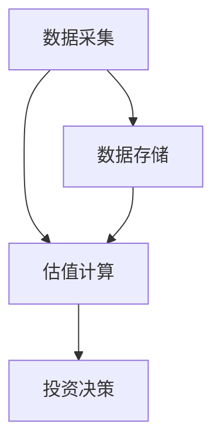

                 


# 加拿大股市估值:北美自由贸易区的投资机会

> 关键词：加拿大股市，估值，投资机会，NAFTA，北美自由贸易区

> 摘要：本文详细探讨了加拿大股市的估值方法，并分析了北美自由贸易区（NAFTA）对投资机会的影响。通过技术分析和基本面分析的结合，介绍了常用的估值指标和模型，帮助投资者更好地把握加拿大股市的投资机会。

---

# 第1章: 加拿大股市估值的背景与基础

## 1.1 加拿大股市的基本概况

### 1.1.1 加拿大股市的构成与特点

加拿大股市是全球重要的金融市场的之一，主要由多伦多证券交易所（TSX）和其他地区性交易所组成。TSX是加拿大最大的证券交易所，上市公司的行业分布广泛，涵盖金融、能源、科技等多个领域。

### 1.1.2 加拿大股市的主要指数分析

多伦多证券交易所的基准指数是S&P/TSX综合指数，该指数包含了加拿大最大的30家公司的股票，反映了加拿大股市的整体表现。此外，还有专注于特定行业的指数，如能源股指数和科技股指数。

### 1.1.3 加拿大股市的行业分布

加拿大股市的行业分布相对均衡，金融、能源和制造业是主要的行业。其中，能源行业由于加拿大丰富的自然资源，占据了重要地位。

## 1.2 北美自由贸易区对加拿大股市的影响

### 1.2.1 北美自由贸易区的定义与特点

北美自由贸易区（NAFTA）是加拿大、美国和墨西哥之间的自由贸易协定，旨在消除贸易壁垒，促进三国之间的商品、服务和资本流动。NAFTA的实施促进了区域经济一体化，对加拿大的经济和股市产生了深远影响。

### 1.2.2 NAFTA对加拿大经济的影响

NAFTA促进了加拿大的出口增长，特别是对美国的出口。同时，NAFTA也为加拿大吸引了更多的外国直接投资，推动了国内企业的扩张和创新。

### 1.2.3 NAFTA对加拿大股市的具体表现

NAFTA的实施使得加拿大股市中的跨国公司受益，尤其是那些在制造业和能源行业有较大业务的公司。此外，NAFTA还促进了美国和加拿大之间的资本流动，增加了股市的资金流入。

## 1.3 股市估值的基本概念与方法

### 1.3.1 股市估值的定义与作用

股市估值是指对上市公司股票的内在价值进行评估，以确定其在市场上的合理价格。准确的估值有助于投资者做出明智的投资决策。

### 1.3.2 常用的股市估值指标

常用的股市估值指标包括市盈率（P/E）、市净率（P/B）和股息率等。这些指标可以帮助投资者评估股票的相对价值。

### 1.3.3 股市估值的基本模型

常用的股市估值模型包括现金流贴现模型（DCF）和相对估值模型。DCF模型基于公司的未来现金流折现，计算其内在价值；相对估值模型则通过比较同类公司的估值指标来确定股票的合理价格。

## 1.4 本章小结

本章介绍了加拿大股市的基本情况，分析了NAFTA对股市的影响，并介绍了股市估值的基本概念和方法。

---

# 第2章: 加拿大股市估值的核心概念与联系

## 2.1 市场、估值与投资机会的关系

### 2.1.1 市场的基本属性

市场是供需关系的体现，价格由买卖双方的互动决定。股市市场反映了投资者对上市公司未来表现的预期。

### 2.1.2 估值的核心要素

估值的核心要素包括公司的财务状况、行业地位、盈利能力以及宏观经济环境等。这些因素共同影响着股票的内在价值。

### 2.1.3 投资机会的形成机制

投资机会的形成机制涉及市场环境、公司基本面和投资者预期等因素。当股票的市场价格低于其内在价值时，就形成了投资机会。

### 2.1.4 三者的关系图



## 2.2 核心概念的原理与特征

### 2.2.1 市场与估值的动态关系

市场和估值是动态变化的，市场波动会影响股票的估值，而估值的变化也会影响市场的走势。

### 2.2.2 投资机会的识别与评估

投资机会的识别需要结合市场趋势和公司基本面，评估股票的潜在收益和风险。

### 2.2.3 估值误差的来源与影响

估值误差的主要来源包括数据误差、模型假设不合理以及市场波动等。估值误差会影响投资者的决策，可能导致投资损失。

## 2.3 实体关系图


## 2.4 本章小结

本章分析了市场、估值和投资机会之间的关系，探讨了核心概念的原理与特征。

---

# 第3章: 加拿大股市估值的算法原理

## 3.1 技术分析与基本面分析的结合

### 3.1.1 技术分析的核心指标

技术分析的核心指标包括移动平均线（MA）、相对强弱指数（RSI）和MACD等。这些指标帮助投资者判断市场的趋势和买卖信号。

### 3.1.2 基本面分析的关键因素

基本面分析的关键因素包括公司的财务状况、盈利能力、行业地位和宏观经济环境等。这些因素共同决定了公司的内在价值。

### 3.1.3 结合技术与基本面的策略

结合技术分析和基本面分析，可以帮助投资者更好地把握市场的短期和长期趋势，制定更为科学的投资策略。

## 3.2 市盈率与市净率的计算方法

### 3.2.1 市盈率的公式与应用

市盈率的计算公式为：
$$市盈率 = \frac{股价}{每股收益}$$

市盈率反映了投资者对公司未来盈利的预期，低市盈率可能意味着股票被低估，而高市盈率可能意味着股票被高估。

### 3.2.2 市净率的公式与应用

市净率的计算公式为：
$$市净率 = \frac{股价}{每股净资产}$$

市净率反映了股票价格与公司资产之间的关系，通常用于评估银行和制造业等行业的股票价值。

## 3.3 估值模型的构建与优化

### 3.3.1 DCF模型的原理与应用

现金流贴现模型（DCF）是常用的估值模型之一，其原理是将公司未来现金流折现，计算其内在价值。DCF模型的应用需要准确预测公司的未来现金流和折现率。

### 3.3.2 市场中性模型的构建

市场中性模型是一种相对估值模型，通过比较同类公司的估值指标，确定股票的合理价格。该模型适用于市场整体波动较小的情况。

### 3.3.3 模型的验证与优化

模型的验证需要通过历史数据进行回测，验证其准确性和稳定性。优化可以通过调整模型参数和引入新的变量来提高模型的预测能力。

## 3.4 本章小结

本章介绍了技术分析和基本面分析的结合，详细讲解了市盈率和市净率的计算方法，并探讨了估值模型的构建与优化。

---

# 第4章: 加拿大股市估值的系统分析与架构设计

## 4.1 投资分析系统的功能模块

### 4.1.1 数据采集模块

数据采集模块负责收集上市公司的财务数据和市场数据，包括股价、成交量、财务报表等。

### 4.1.2 估值计算模块

估值计算模块基于收集的数据，运用各种估值模型计算股票的内在价值，并生成估值报告。

### 4.1.3 投资决策模块

投资决策模块根据估值结果和市场趋势，制定投资策略，指导投资者进行买卖决策。

## 4.2 系统架构设计



系统架构设计包括数据采集模块、估值计算模块和投资决策模块，各模块之间通过数据流进行交互。

## 4.3 接口设计与交互流程

### 4.3.1 数据接口的设计

数据接口需要支持多种数据源的接入，包括数据库和API接口。数据接口的设计需要考虑数据格式和传输效率。

### 4.3.2 用户界面的交互流程

用户界面设计需要直观易用，包括数据输入、模型选择和结果展示等功能。交互流程需要流畅，确保用户体验良好。

### 4.3.3 系统的运行机制

系统的运行机制包括数据采集、估值计算和投资决策三个主要阶段，各阶段之间相互关联，协同工作。

## 4.4 本章小结

本章介绍了投资分析系统的功能模块，详细讲解了系统架构设计和接口设计。

---

# 第5章: 加拿大股市估值的项目实战

## 5.1 环境搭建与数据准备

### 5.1.1 环境搭建

环境搭建需要安装必要的软件和工具，包括Python编程语言、数据处理库（如Pandas）和可视化工具（如Matplotlib）。

### 5.1.2 数据准备

数据准备包括收集上市公司的财务数据和市场数据，确保数据的完整性和准确性。

## 5.2 系统核心实现源代码

### 5.2.1 数据采集模块

```python
import pandas as pd
import requests

url = 'https://www.quandl.com/api/v3/datasets/WIKI/AAPL.csv'
response = requests.get(url)
data = pd.read_csv(url)
print(data.head())
```

### 5.2.2 估值计算模块

```python
def calculate_pe_ratio(price, earnings_per_share):
    return price / earnings_per_share

pe_ratio = calculate_pe_ratio(100, 10)
print(pe_ratio)
```

### 5.2.3 投资决策模块

```python
def make_investment_decision(pe_ratio, market_trend):
    if pe_ratio < 15 and market_trend == 'up':
        return 'buy'
    elif pe_ratio > 20 and market_trend == 'down':
        return 'sell'
    else:
        return 'hold'

decision = make_investment_decision(18, 'up')
print(decision)
```

## 5.3 代码应用解读与分析

### 5.3.1 数据采集模块的实现

数据采集模块通过API接口获取股票数据，使用Pandas库进行数据处理和分析。

### 5.3.2 估值计算模块的实现

估值计算模块基于市盈率模型，计算股票的估值，并与市场价格进行对比，判断股票是否被高估或低估。

### 5.3.3 投资决策模块的实现

投资决策模块根据估值结果和市场趋势，制定投资策略，指导投资者进行买卖决策。

## 5.4 实际案例分析

### 5.4.1 案例背景

以加拿大某能源公司为例，分析其市盈率和市净率，评估其内在价值。

### 5.4.2 数据分析与计算

假设公司股价为50加元，每股收益为5加元，每股净资产为20加元。

市盈率 = 50 / 5 = 10

市净率 = 50 / 20 = 2.5

### 5.4.3 结果解读

市盈率为10，低于行业平均水平，可能意味着股票被低估。市净率为2.5，低于行业平均水平，进一步支持了股票被低估的结论。

### 5.4.4 投资建议

基于以上分析，建议投资者买入该股票。

## 5.5 项目小结

本章通过实际案例分析，展示了如何应用估值模型进行投资决策，帮助投资者更好地把握投资机会。

---

# 第6章: 最佳实践、小结、注意事项与扩展阅读

## 6.1 最佳实践

### 6.1.1 数据的准确性和及时性

确保数据的准确性和及时性，是进行准确估值的基础。

### 6.1.2 模型的合理性和适用性

选择合适的估值模型，确保模型的合理性和适用性，才能得到可靠的估值结果。

### 6.1.3 风险管理和分散投资

投资过程中需要注意风险管理，分散投资可以降低投资风险。

## 6.2 小结

本文详细探讨了加拿大股市的估值方法，并分析了NAFTA对投资机会的影响。通过技术分析和基本面分析的结合，介绍了常用的估值指标和模型，帮助投资者更好地把握加拿大股市的投资机会。

## 6.3 注意事项

### 6.3.1 数据的局限性

数据的局限性可能会影响估值的准确性，需要注意数据的来源和质量。

### 6.3.2 模型的假设和限制

模型的假设和限制可能会影响估值结果，需要结合实际情况进行调整。

### 6.3.3 市场的不确定性和波动性

市场的不确定性和波动性是投资过程中需要面对的主要挑战，需要保持谨慎和耐心。

## 6.4 扩展阅读

### 6.4.1 加拿大股市的行业分析

深入分析加拿大股市的主要行业，了解各行业的市场前景和投资机会。

### 6.4.2 NAFTA的经济影响

进一步研究NAFTA对加拿大经济的全面影响，包括贸易、就业和投资等方面。

### 6.4.3 全球化与投资策略

探讨全球化背景下，投资者如何调整投资策略，抓住全球化带来的投资机会。

---

# 附录: 参考文献与工具

## 附录A: 参考文献

1. 加拿大股市数据分析报告
2. NAFTA对加拿大经济的影响研究
3. 股市估值方法与模型

## 附录B: 工具与资源

1. Python编程语言
2. Pandas数据处理库
3. Matplotlib可视化工具
4. Quandl数据接口

---

# 结语

通过本文的分析和探讨，相信读者能够更好地理解加拿大股市的估值方法，并抓住NAFTA带来的投资机会。投资有风险，入市需谨慎。

