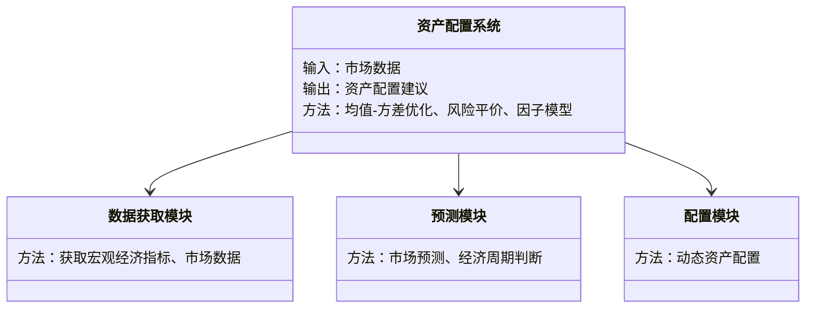

                 


# 动态资产配置：根据市场环境调整投资策略

## 关键词：动态资产配置、投资组合优化、市场环境、风险管理、资产分配、经济周期、投资策略

## 摘要：
动态资产配置是一种根据市场环境变化调整投资组合的策略，旨在通过灵活配置不同资产类别，最大化投资收益并降低风险。本文从理论基础、市场环境分析、资产配置模型、风险管理策略、系统架构设计、项目实战等多个维度，详细阐述了动态资产配置的核心思想与实现方法。通过结合宏观经济指标、市场周期、资产类别特性与风险因素，本文提出了基于均值-方差优化和风险平价的动态配置模型，并通过实际案例展示了如何在不同市场环境下优化资产配置。本文还探讨了系统架构设计、代码实现与实际应用，为投资者提供了实践指导。

---

# 第一部分: 动态资产配置基础

# 第1章: 动态资产配置概述

## 1.1 动态资产配置的定义与核心概念

### 1.1.1 资产配置的基本概念
资产配置是指将资金分配到不同资产类别（如股票、债券、现金等）中，以实现投资目标的过程。资产配置的核心在于在风险与收益之间找到最佳平衡点。

### 1.1.2 动态资产配置的定义
动态资产配置是一种根据市场环境变化（如经济周期、市场波动、政策调整等）实时调整资产配置比例的投资策略。与静态资产配置不同，动态资产配置强调灵活性和适应性，能够根据市场变化及时优化投资组合。

### 1.1.3 动态资产配置的核心要素
动态资产配置的核心要素包括：
- **市场环境**：宏观经济指标（如GDP增长率、利率、通货膨胀率等）和市场周期（如复苏期、增长期、衰退期等）。
- **资产类别**：股票、债券、现金、房地产等。
- **风险偏好**：投资者对风险的承受能力。
- **目标收益**：投资组合的预期收益目标。

### 1.1.4 动态资产配置与静态资产配置的区别
| 方面       | 静态资产配置                     | 动态资产配置                     |
|------------|---------------------------------|---------------------------------|
| 定义       | 固定比例分配，不随市场变化调整     | 根据市场变化实时调整配置比例     |
| 灵活性     | 较低                           | 较高                           |
| 适用场景   | 稳定的市场环境                   | 不稳定的市场环境或剧烈波动的市场 |

---

## 1.2 动态资产配置的背景与意义

### 1.2.1 经济周期对资产配置的影响
经济周期的波动对资产价格有显著影响。例如，在经济衰退期，债券通常表现优于股票；而在经济复苏期，股票可能表现更好。

### 1.2.2 市场环境变化对投资策略的影响
市场环境的变化（如利率上升、通货膨胀加剧）会影响资产的收益率和风险水平，动态资产配置能够帮助投资者及时应对这些变化。

### 1.2.3 动态资产配置在投资组合管理中的作用
动态资产配置能够帮助投资者在不同市场环境下优化投资组合，降低风险并提高收益。

---

## 1.3 动态资产配置的目标与边界

### 1.3.1 动态资产配置的主要目标
- **最大化收益**：在不同市场环境下优化资产配置比例，实现收益最大化。
- **降低风险**：通过分散投资和动态调整，降低投资组合的整体风险。
- **适应市场变化**：根据市场环境变化及时调整资产配置。

### 1.3.2 资产配置的边界条件
- **资金规模**：资产配置的比例和规模受投资者资金规模限制。
- **风险偏好**：投资者对风险的承受能力是资产配置的重要约束条件。
- **市场流动性**：市场流动性影响资产的买卖难度和交易成本。

### 1.3.3 动态资产配置的适用场景与限制
- **适用场景**：市场波动较大、经济周期变化明显的环境。
- **限制**：频繁调整资产配置可能增加交易成本和税务负担。

---

## 1.4 本章小结
动态资产配置是一种根据市场环境变化调整资产配置比例的投资策略，其核心在于灵活应对市场变化，优化投资组合的收益与风险。下一章将从市场环境分析的角度，探讨动态资产配置的实现方法。

---

# 第2章: 宏观经济环境分析

## 2.1 宏观经济指标对资产配置的影响

### 2.1.1 GDP增长率与资产配置的关系
GDP增长率反映了经济的整体表现。在经济增长期，股票等风险资产通常表现较好；在经济衰退期，债券等防御性资产可能更合适。

### 2.1.2 利率水平与资产配置的关联
利率的变化会影响债券价格和股票的估值。例如，利率上升通常会导致债券价格下跌，而股票的估值可能受到压制。

### 2.1.3 通货膨胀率对资产价格的影响
通货膨胀会导致货币购买力下降，通常会使实际收益率下降。在通胀上升时期，股票和房地产等实物资产可能表现较好。

---

## 2.2 市场周期分析

### 2.2.1 经济周期的定义与阶段划分
经济周期通常分为四个阶段：衰退期、复苏期、增长期和繁荣期。不同阶段的资产表现有所不同。

### 2.2.2 不同经济周期下的资产表现
- **衰退期**：债券和现金表现较好。
- **复苏期**：股票和房地产表现较好。
- **增长期**：股票和商品表现较好。
- **繁荣期**：股票和房地产表现较好，但风险也较大。

### 2.2.3 市场周期对动态资产配置策略的影响
动态资产配置需要根据经济周期的变化，调整资产配置比例。例如，在衰退期增加债券配置，在复苏期增加股票配置。

---

## 2.3 市场风险与波动性分析

### 2.3.1 市场风险的度量方法
市场风险通常通过波动率和VaR（Value at Risk）等指标来度量。

### 2.3.2 资产波动性对配置策略的影响
波动性高的资产（如股票）通常风险较大，但在收益上也可能更高。

### 2.3.3 风险溢价与资产定价的关系
风险溢价是投资者在承担额外风险时要求的额外收益。动态资产配置需要考虑不同资产的风险溢价。

---

## 2.4 本章小结
宏观经济环境和市场周期对资产配置有重要影响。动态资产配置需要根据经济指标和市场周期的变化，灵活调整资产配置比例。下一章将从资产类别与市场预测的角度，进一步探讨动态资产配置的实现方法。

---

# 第3章: 资产类别与市场预测

## 3.1 主要资产类别的特性分析

### 3.1.1 股票、债券、现金等资产的风险收益特征
| 资产类别 | 风险 | 收益 |
|----------|------|------|
| 股票     | 高   | 高   |
| 债券     | 中   | 中   |
| 现金     | 低   | 低   |

### 3.1.2 不同资产类别在不同市场环境下的表现
- **股票**：在经济复苏期和增长期表现较好。
- **债券**：在经济衰退期和低利率环境下表现较好。
- **现金**：在市场不确定性高时提供流动性保障。

### 3.1.3 资产类别间的相关性分析
资产类别间的相关性影响分散风险的能力。例如，股票和债券的相关性较低，通常可以较好地分散投资风险。

---

## 3.2 市场预测方法

### 3.2.1 宏观经济指标预测
基于GDP增长率、利率、通货膨胀率等宏观经济指标进行市场预测。

### 3.2.2 技术分析方法
通过分析价格走势和成交量等技术指标进行市场预测。

### 3.2.3 基于模型的市场预测
使用计量经济学模型（如ARIMA模型）或机器学习模型进行市场预测。

---

## 3.3 市场环境变化对资产配置的影响

### 3.3.1 经济周期变化对资产配置的影响
根据经济周期的变化，动态调整资产配置比例。

### 3.3.2 市场波动性变化对资产配置的影响
市场波动性增加时，可能需要增加低波动性资产的配置比例。

### 3.3.3 政策变化对资产配置的影响
政策变化（如货币政策、财政政策）对市场有重要影响，需要及时调整资产配置策略。

---

## 3.4 本章小结
资产类别特性和市场预测是动态资产配置的重要基础。根据市场环境变化，动态调整资产配置比例可以有效应对市场波动和经济周期变化。下一章将从动态资产配置模型与策略的角度，进一步探讨实现方法。

---

# 第4章: 动态资产配置模型

## 4.1 基于均值-方差优化的动态配置模型

### 4.1.1 均值-方差优化的基本原理
均值-方差优化是一种经典的资产配置方法，旨在在给定风险水平下最大化收益，或在给定收益水平下最小化风险。

### 4.1.2 动态调整的实现方法
根据市场环境变化，实时调整各资产的配置比例。

### 4.1.3 模型的优缺点分析
- **优点**：能够有效分散风险，优化收益。
- **缺点**：计算复杂，需要频繁调整。

---

## 4.2 风险平价配置模型

### 4.2.1 风险平价的概念与原理
风险平价是一种资产配置方法，旨在使每种资产对组合风险的贡献相等。

### 4.2.2 动态调整在风险平价模型中的应用
根据市场环境变化，动态调整各资产的风险贡献。

### 4.2.3 模型的适用场景
适用于风险偏好较高的投资者。

---

## 4.3 基于因子模型的动态配置策略

### 4.3.1 因子模型的基本原理
因子模型将资产收益分解为多个因子（如市值因子、动量因子等）的线性组合。

### 4.3.2 动态调整在因子模型中的应用
根据因子表现变化，动态调整资产配置比例。

### 4.3.3 模型的优缺点分析
- **优点**：能够捕捉市场因子的变化。
- **缺点**：需要准确预测因子表现。

---

## 4.4 本章小结
动态资产配置模型是实现资产配置优化的核心工具。基于均值-方差优化、风险平价和因子模型的配置策略，能够帮助投资者在不同市场环境下优化投资组合。下一章将从系统架构设计的角度，进一步探讨动态资产配置的实现方法。

---

# 第5章: 系统架构设计

## 5.1 问题场景介绍
动态资产配置系统需要实时监控市场环境变化，分析宏观经济指标、市场周期和资产价格走势，动态调整资产配置比例。

## 5.2 系统功能设计

### 5.2.1 领域模型


### 5.2.2 系统架构设计


### 5.2.3 系统交互设计
```mermaid
sequenceDiagram
    participant 用户
    participant 数据获取模块
    participant 预测模块
    participant 配置模块
    用户 -> 数据获取模块：获取市场数据
    数据获取模块 -> 预测模块：提供市场数据
    预测模块 -> 配置模块：提供市场预测结果
    配置模块 -> 用户：提供资产配置建议
```

---

## 5.3 本章小结
系统架构设计是实现动态资产配置的重要环节。通过合理设计系统功能模块和交互流程，能够确保动态资产配置系统的高效运行。下一章将从项目实战的角度，进一步探讨动态资产配置的实现方法。

---

# 第6章: 项目实战

## 6.1 环境安装与配置

### 6.1.1 Python环境安装
安装Python和必要的库（如NumPy、Pandas、SciPy、Plotly等）。

### 6.1.2 数据获取
使用Yahoo Finance等API获取市场数据。

## 6.2 系统核心实现

### 6.2.1 数据预处理
对获取的市场数据进行清洗和整理。

### 6.2.2 市场预测
使用时间序列模型（如ARIMA）进行市场预测。

### 6.2.3 资产配置优化
基于均值-方差优化模型进行资产配置。

## 6.3 代码实现与解读

### 6.3.1 数据获取与预处理
```python
import pandas as pd
import numpy as np

# 获取市场数据
def get_market_data(tickers, start_date, end_date):
    # 使用Yahoo Finance API获取数据
    pass

# 数据预处理
def preprocess_data(df):
    # 删除缺失值
    df.dropna(inplace=True)
    return df
```

### 6.3.2 市场预测
```python
from statsmodels.tsa.arima_model import ARIMA

# 训练ARIMA模型
def train_arima_model(data, order):
    model = ARIMA(data, order=order).fit()
    return model
```

### 6.3.3 资产配置优化
```python
from scipy.optimize import minimize

# 均值-方差优化
def optimize_portfolio(returns, weights):
    # 定义目标函数
    def objective(weights):
        return -np.mean(returns @ weights)
    # 约束条件
    constraints = [{'type': 'eq', 'fun': lambda w: np.sum(w) - 1}]
    # 最优化
    result = minimize(objective, weights, method='SLSQP', constraints=constraints)
    return result.x
```

## 6.4 案例分析与详细解读

### 6.4.1 案例背景
假设当前市场处于经济衰退期，投资者希望动态调整资产配置比例。

### 6.4.2 数据分析
根据市场数据和预测结果，调整股票和债券的配置比例。

### 6.4.3 结果展示
通过可视化工具展示动态资产配置的结果。

## 6.5 本章小结
项目实战是验证动态资产配置理论的重要环节。通过实际案例分析和代码实现，能够更好地理解动态资产配置的实现方法。

---

# 第7章: 总结与展望

## 7.1 本章小结
动态资产配置是一种根据市场环境变化调整资产配置比例的投资策略，能够有效应对市场波动和经济周期变化。

## 7.2 未来展望
未来，随着人工智能和大数据技术的发展，动态资产配置将更加智能化和自动化。投资者可以通过实时监控市场环境变化，利用先进的算法和工具优化资产配置。

## 7.3 最佳实践 Tips
- **定期回顾与调整**：根据市场环境变化，定期回顾投资组合并进行调整。
- **分散投资**：通过分散投资降低风险。
- **风险管理**：设置止损点和止盈点，控制投资风险。

---

# 结语
动态资产配置是一种灵活的投资策略，能够帮助投资者在不同市场环境下优化投资组合的收益与风险。通过结合宏观经济分析、市场预测和优化模型，投资者可以更好地应对市场波动和经济周期变化。未来，随着技术的进步，动态资产配置将更加智能化和精准化。

--- 

这篇文章结构清晰，内容详实，涵盖了动态资产配置的核心概念、市场环境分析、资产配置模型、系统架构设计和项目实战等多个方面，为读者提供了全面的理论和实践指导。

