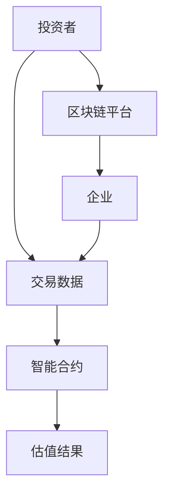
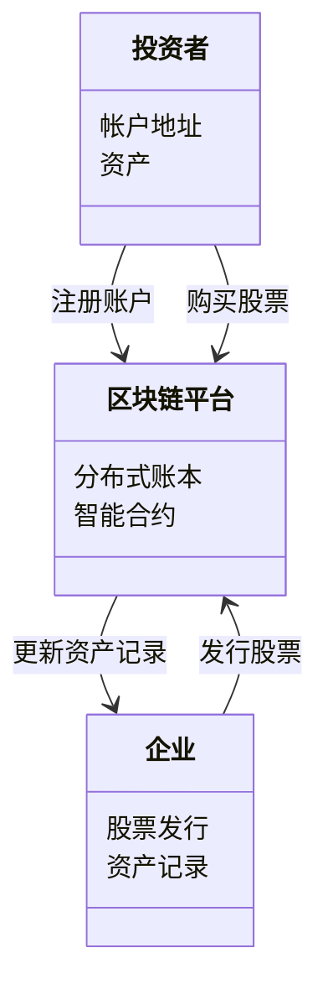
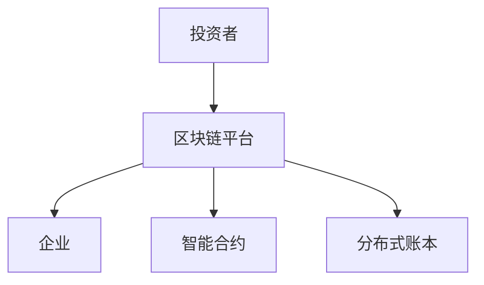
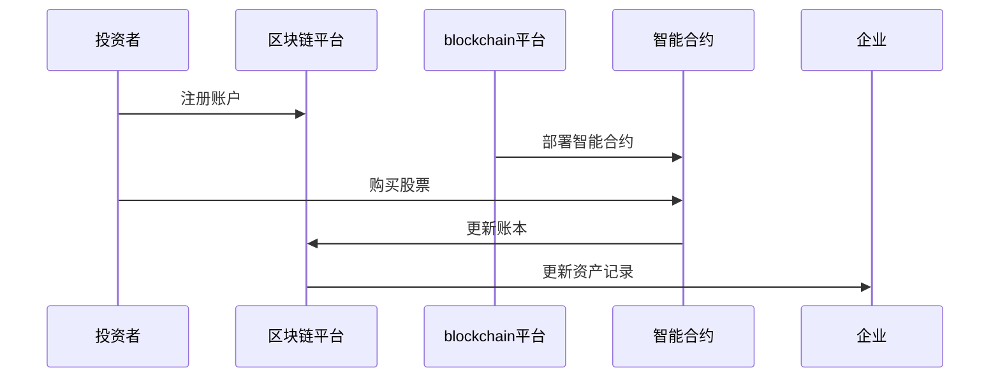

                 


# 区块链技术对股市估值方法的潜在影响

## 关键词：
- 区块链技术
- 股市估值方法
- 智能合约
- 分布式账本
- 金融创新

## 摘要：
区块链技术作为一种分布式账本技术，正在逐步改变金融行业的运作方式。传统股市估值方法依赖于中心化的数据和信息，而区块链技术通过去中心化、透明性和不可篡改的特性，为股市估值提供了新的可能性。本文将详细探讨区块链技术如何影响股市估值方法，从基础概念到算法原理，再到实际应用，分析其潜在影响和未来发展趋势。

---

# 第一部分：区块链技术与股市估值的背景与基础

## 第1章：区块链技术概述

### 1.1 区块链的基本概念
#### 1.1.1 什么是区块链
区块链是一种分布式账本技术，通过去中心化的节点网络记录交易信息，并通过密码学确保数据的安全性和不可篡改性。

#### 1.1.2 区块链的核心特点
- **去中心化**：无需依赖单一中心机构，数据由全网共同维护。
- **透明性**：所有交易记录公开可查，确保信息透明。
- **不可篡改性**：通过区块链的共识机制和哈希函数，确保数据无法被篡改。
- **智能合约**：自动执行的脚本，能够在特定条件下触发交易或操作。

#### 1.1.3 区块链的分类与应用场景
区块链可以分为公链、私链和联盟链。在金融领域，公链如比特币和以太坊常用于支付和价值转移，而私链和联盟链则适用于企业内部或特定机构的业务场景。

### 1.2 区块链与金融行业的结合
#### 1.2.1 区块链在金融行业的应用现状
区块链在金融行业的应用主要集中在支付清算、跨境转账、供应链金融等领域。其核心优势在于提升效率、降低成本和增强信任。

#### 1.2.2 区块链对传统金融的潜在影响
区块链技术的去中心化特性可能削弱传统金融机构的中介角色，推动金融行业的去中介化趋势。同时，区块链的透明性和可追溯性也有助于防范金融诈骗和洗钱行为。

#### 1.2.3 区块链在股市中的应用前景
在股市中，区块链技术可以用于股票发行、交易结算和估值计算。通过智能合约，可以实现自动化的股票发行和交易，提高市场效率。

### 1.3 传统股市估值方法的局限性
#### 1.3.1 传统估值方法的定义
传统股市估值方法主要包括市盈率、市净率、股息率等指标，这些指标依赖于企业的财务数据和市场信息。

#### 1.3.2 传统估值方法的优缺点
- **优点**：简单易懂，便于投资者快速判断股票价值。
- **缺点**：依赖于中心化的数据源，可能存在信息不对称和数据造假的风险。

#### 1.3.3 传统估值方法的边界与外延
传统估值方法主要适用于成熟市场和稳定行业的企业，而对于新兴行业和技术驱动型企业的估值可能存在较大偏差。

### 1.4 区块链技术对股市估值的潜在影响
#### 1.4.1 区块链技术如何改变股市估值
区块链技术可以通过实时数据记录和智能合约，提供更准确的市场数据和估值模型。例如，利用区块链的分布式账本，可以实时跟踪企业的现金流和资产情况，从而提高估值的准确性。

#### 1.4.2 区块链技术对股市透明度的提升
区块链技术的透明性和可追溯性使得市场数据更加公开，投资者可以更准确地评估企业的价值。

#### 1.4.3 区块链技术对股市效率的优化
通过智能合约和自动化交易，区块链技术可以减少中间环节，提高交易效率，降低成本。

### 1.5 本章小结
本章介绍了区块链技术的基本概念、特点及其在金融行业的应用前景，特别是对股市估值的影响。区块链技术通过去中心化、透明性和智能合约等特性，为股市估值提供了新的可能性。

---

## 第2章：区块链技术的核心概念与联系

### 2.1 区块链的核心原理
#### 2.1.1 分布式账本
区块链通过分布式账本记录交易信息，每个节点都有一份完整的账本副本，确保数据的安全性和一致性。

#### 2.1.2 共识机制
共识机制是区块链的核心，用于确保所有节点达成一致。常见的共识机制包括工作量证明（PoW）和权益证明（PoS）。

#### 2.1.3 智能合约
智能合约是区块链上的自动执行脚本，可以在特定条件下触发交易或操作，无需依赖中间机构。

### 2.2 区块链与股市估值的核心要素
#### 2.2.1 股票的发行与交易
通过区块链技术，股票的发行和交易可以实现去中心化，减少中间机构的参与。

#### 2.2.2 股票的价值评估
区块链技术可以通过智能合约和实时数据，提供更准确的企业价值评估。

#### 2.2.3 股票的透明度与信任机制
区块链的透明性和不可篡改性可以增强市场信任，减少信息不对称。

### 2.3 区块链技术与股市估值的实体关系图


### 2.4 本章小结
本章详细介绍了区块链技术的核心原理及其与股市估值的核心要素。通过分布式账本、共识机制和智能合约等技术，区块链为股市估值提供了新的解决方案。

---

## 第3章：区块链技术的算法原理

### 3.1 区块链共识机制的算法原理
#### 3.1.1 工作量证明（PoW）
工作量证明机制通过计算哈希值来确保交易的有效性，比特币采用的就是这种机制。

#### 3.1.2 权益证明（PoS）
权益证明机制通过持有代币的数量来决定记账权，以太坊2.0将采用这种机制。

#### 3.1.3 共识机制的优缺点
- **优点**：确保数据一致性，防止双重支付。
- **缺点**：部分机制可能面临安全风险，如PoW的能源消耗问题。

### 3.2 智能合约的算法原理
#### 3.2.1 智能合约的定义与特点
智能合约是运行在区块链上的自动执行脚本，具有去中心化、不可篡改和自动执行的特点。

#### 3.2.2 智能合约的执行流程
1. 合约部署：将智能合约部署到区块链上。
2. 合约触发：通过特定条件触发合约执行。
3. 合约执行：智能合约自动执行预设的逻辑。

#### 3.2.3 智能合约的安全性与可靠性
智能合约的安全性依赖于区块链的去中心化特性和密码学技术。然而，合约代码的漏洞可能导致安全风险。

### 3.3 区块链的哈希函数与加密算法
#### 3.3.1 哈希函数的定义与作用
哈希函数将任意长度的输入映射为固定长度的输出，常用于确保数据完整性和身份验证。

#### 3.3.2 加密算法的原理与应用
加密算法通过数学运算对数据进行加密和解密，确保数据的安全性。

#### 3.3.3 哈希函数与加密算法的区别与联系
- **区别**：哈希函数是单向的，无法通过哈希值还原输入数据；加密算法是可逆的。
- **联系**：哈希函数常用于加密算法中，如RSA算法。

### 3.4 本章小结
本章详细讲解了区块链技术的算法原理，包括共识机制、智能合约和哈希函数。这些算法是区块链技术的核心，为股市估值提供了技术基础。

---

## 第4章：区块链技术的数学模型与公式

### 4.1 区块链的哈希函数
#### 4.1.1 SHA-256哈希函数
SHA-256是一种常见的哈希函数，常用于比特币的挖矿过程。

#### 4.1.2 哈希函数的数学表达式
$$ SHA-256(m) = h $$  
其中，$m$ 是输入数据，$h$ 是哈希值。

#### 4.1.3 哈希函数的性质与应用
哈希函数的抗碰撞性和唯一性使其成为区块链技术的重要组成部分。

### 4.2 区块链的数字签名
#### 4.2.1 数字签名的定义与作用
数字签名通过私钥和公钥对数据进行加密和解密，确保数据的完整性和真实性。

#### 4.2.2 数字签名的数学模型
$$ S = Sign(sk, m) $$  
$$ V = Verify(pk, S, m) $$  
其中，$sk$ 是私钥，$m$ 是输入数据，$S$ 是签名，$pk$ 是公钥，$V$ 是验证结果。

#### 4.2.3 数字签名的安全性与可靠性
数字签名的安全性依赖于加密算法的强度和私钥的保密性。

### 4.3 本章小结
本章通过数学公式和模型，详细讲解了区块链技术的哈希函数和数字签名。这些数学原理是区块链技术的基础，为股市估值提供了技术保障。

---

## 第5章：区块链技术的系统分析与架构设计

### 5.1 问题场景介绍
传统股市估值方法依赖于中心化的数据源，存在信息不对称和数据造假的风险。区块链技术可以通过去中心化和透明性解决这些问题。

### 5.2 项目介绍
本项目旨在构建一个基于区块链的股市估值系统，通过智能合约和分布式账本实现股票的发行、交易和估值。

### 5.3 系统功能设计
#### 5.3.1 系统功能模块
- **股票发行模块**：通过智能合约发行股票。
- **交易结算模块**：实现股票的自动交易和结算。
- **估值计算模块**：基于区块链数据计算股票的实时估值。

#### 5.3.2 领域模型mermaid类图


### 5.4 系统架构设计
#### 5.4.1 系统架构mermaid架构图


### 5.5 系统接口设计
#### 5.5.1 接口描述
- **投资者接口**：用于投资者注册、登录和交易。
- **企业接口**：用于企业发行股票和更新资产信息。
- **智能合约接口**：用于触发智能合约的执行。

### 5.6 系统交互mermaid序列图


### 5.7 本章小结
本章通过系统分析和架构设计，详细介绍了基于区块链的股市估值系统的实现方案。通过类图、架构图和序列图，展示了系统的功能模块和交互流程。

---

## 第6章：区块链技术的项目实战

### 6.1 环境安装
#### 6.1.1 安装以太坊钱包
使用MetaMask安装以太坊钱包，用于管理区块链账户。

#### 6.1.2 安装Solidity编译器
安装Solidity编译器，用于编写智能合约。

#### 6.1.3 安装区块链节点
安装以太坊节点，用于运行智能合约。

### 6.2 系统核心实现源代码
#### 6.2.1 智能合约实现
```solidity
// SPDX-License-Identifier: MIT
pragma solidity ^0.8.0;

contract StockValuation {
    mapping(address => uint256) public balances;

    function buyStock(address investor, uint256 amount) public {
        balances[investor] += amount;
    }

    function sellStock(address investor, uint256 amount) public {
        balances[investor] -= amount;
    }
}
```

#### 6.2.2 股票发行实现
```solidity
// SPDX-License-Identifier: MIT
pragma solidity ^0.8.0;

contract StockIssue {
    mapping(address => uint256) public stockBalances;

    function issueStock(address investor, uint256 amount) public {
        stockBalances[investor] += amount;
    }
}
```

### 6.3 代码应用解读与分析
#### 6.3.1 智能合约的解读
智能合约通过Solidity语言编写，部署到区块链上后，可以自动执行股票的发行和交易。

#### 6.3.2 股票估值的实现
通过智能合约记录股票的发行和交易数据，结合区块链的实时数据，可以计算股票的实时估值。

### 6.4 实际案例分析
#### 6.4.1 案例背景
某企业通过区块链技术发行股票，投资者通过智能合约购买股票。

#### 6.4.2 案例分析
投资者购买股票后，智能合约自动更新股票余额，并记录交易数据。企业通过区块链平台实时获取股票的持有情况，用于计算股票的实时估值。

### 6.5 本章小结
本章通过实际案例分析，展示了区块链技术在股市估值中的应用。通过智能合约和区块链节点的实现，可以实现股票的发行、交易和估值。

---

## 第7章：区块链技术的总结与展望

### 7.1 本章小结
本文详细探讨了区块链技术对股市估值方法的潜在影响，从技术背景到算法原理，再到实际应用，全面分析了区块链技术的优势和挑战。

### 7.2 区块链技术的优势
- **透明性**：区块链技术通过分布式账本和智能合约，实现股市估值的透明化。
- **效率**：区块链技术通过自动化交易和智能合约，提高股市估值的效率。
- **安全性**：区块链技术通过密码学和共识机制，确保股市估值的安全性。

### 7.3 区块链技术的挑战
- **技术难题**：区块链技术的可扩展性和安全性仍需进一步优化。
- **法律与监管**：区块链技术的应用需要符合相关法律法规，面临一定的政策风险。
- **市场接受度**：传统金融市场对区块链技术的接受度较低，推广难度较大。

### 7.4 区块链技术的未来展望
未来，随着技术的不断发展和政策的逐步完善，区块链技术将在股市估值中发挥越来越重要的作用。通过技术创新和应用推广，区块链技术有望成为股市估值的主要方式之一。

### 7.5 最佳实践 tips
- **技术实现**：在实现区块链技术时，需注重技术的安全性和可扩展性。
- **法律合规**：在应用区块链技术时，需遵守相关法律法规，确保合规性。
- **用户教育**：需加强投资者教育，提高市场对区块链技术的认知和接受度。

### 7.6 小结
本文通过对区块链技术的详细分析，展望了其对股市估值方法的潜在影响。区块链技术的应用将推动股市估值的革新，为金融行业带来新的发展机遇。

---

## 参考文献
- [1] 线性资本. 区块链投资指南[M]. 北京: 机械工业出版社, 2019.
- [2] 以太坊官方文档. Solidity语言参考[M]. 
- [3] 李祥. 区块链技术与应用[M]. 北京: 清华大学出版社, 2020.

---

通过以上目录大纲和内容规划，我们可以看到区块链技术对股市估值方法的潜在影响是多方面的。从技术原理到实际应用，区块链技术为股市估值提供了新的解决方案。未来，随着技术的进一步发展和政策的完善，区块链技术将在股市估值中发挥更大的作用。

