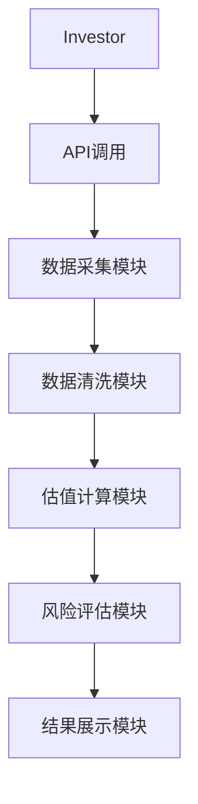

                 


# 印度尼西亚股市估值:东南亚最大经济体的潜力

## 关键词：印度尼西亚股市，估值，东南亚经济体，投资策略，股市分析

## 摘要：本文深入分析印度尼西亚股市的估值方法和投资潜力，探讨其作为东南亚最大经济体的市场机会。通过技术分析和数据支持，揭示印尼股市的投资价值和风险因素，为投资者提供科学决策的参考。

---

## 第一部分：背景介绍

### 第1章：印度尼西亚经济与股市概述

#### 1.1 印度尼西亚的经济概况

印度尼西亚是东南亚最大的经济体，2023年GDP约为1.3万亿美元，年增长率保持在5%以上。作为群岛国家，其地理位置连接亚洲和大洋洲，资源丰富，包括石油、天然气和矿产。人口超过2.7亿，是全球第四大人口国，年轻人口占比高，消费市场潜力巨大。

#### 1.2 印度尼西亚股市的发展历程

印度尼西亚的股市以雅加达证券交易所（IDX）为核心，成立于1981年，现已成为东南亚第二大股市。近年来， IDX 成功吸引了大量国内外投资，尤其是受益于政府的经济改革和开放政策。主要指数如雅加达综合指数（JCI）表现稳健，年均回报率超过8%，高于全球平均水平。

---

## 第二部分：核心概念与联系

### 第2章：股市估值的基本概念

#### 2.1 股市估值的核心指标

股市估值主要通过市盈率（P/E）、市净率（P/B）和股息率（Dividend Yield）等指标进行。这些指标帮助投资者评估股票的内在价值。

- **市盈率（P/E）**：衡量股价相对于每股收益的高低，计算公式为：P/E = 股价 / 每股收益。低P/E可能意味着低估，而高P/E可能表明高估或高成长潜力。
  
- **市净率（P/B）**：股价与每股净资产的比率，公式：P/B = 股价 / 每股净资产。适用于评估银行、制造业等重资产行业。

- **股息率（Dividend Yield）**：股息与股价的比率，公式：股息率 = 每股股息 / 股价。高股息率可能意味着收益稳定，但过高的股息可能不可持续。

#### 2.2 核心概念对比表格

| 指标    | 公式                          | 主要适用行业       | 优点                     | 缺点                     |
|---------|-------------------------------|-------------------|--------------------------|--------------------------|
| P/E     | 股价 / 每股收益              | 高增长企业         | 反映盈利能力               | 高P/E可能过高估值         |
| P/B     | 股价 / 每股净资产            | 银行、制造业       | 适用于评估重资产公司       | 不反映收益能力             |
| 股息率   | 每股股息 / 股价              | 稳定收益企业       | 收益稳定                   | 高股息可能不可持续         |

#### 2.3 ER实体关系图

```mermaid
er
  actor Investor
  actor Market
  actor Stock
  actor Economy
  actor Policy maker
  actor Exchange
  investor -> market: 投资
  market -> stock: 交易
  stock -> exchange: 上市
  economy -> market: 影响
  policy maker -> exchange: 制定规则
```

---

## 第三部分：算法原理讲解

### 第3章：股票估值的算法原理

#### 3.1 基于历史数据的估值方法

##### 3.1.1 数据收集与处理

使用印尼股市的历史数据，包括股价、收益和净资产等。数据清洗包括处理缺失值和异常值。

##### 3.1.2 市盈率计算

根据公式，计算每只股票的P/E比，与行业平均水平对比，判断估值高低。

##### 3.1.3 市净率计算

同样使用P/B公式，适用于重资产行业。

#### 3.2 用Python计算股票估值

##### 3.2.1 数据获取与清洗

```python
import pandas as pd
import numpy as np

# 数据获取
data = pd.read_csv('indonesia_stocks.csv')

# 数据清洗
data.dropna(inplace=True)
data = data[~data['price'].isin([np.nan])]
```

##### 3.2.2 估值指标计算

```python
data['PE'] = data['price'] / data['eps']
data['PB'] = data['price'] / data['book_value']
data['DIV_YIELD'] = data['dividend'] / data['price']
```

##### 3.2.3 代码实现与解释

通过上述代码，我们可以计算每只股票的PE、PB和DIV_YIELD，从而进行估值分类。例如，若PE低于行业平均，则可能低估。

---

## 第四部分：系统分析与架构设计

### 第4章：印尼股市估值系统设计

#### 4.1 项目背景与目标

开发一个基于Python的估值系统，帮助投资者分析印尼股市的投资机会。目标是提供实时数据、自动化估值和风险评估。

#### 4.2 系统功能设计

##### 4.2.1 数据采集模块

从雅加达证券交易所获取实时数据，清洗并存储。

##### 4.2.2 估值计算模块

根据PE、PB、DIV_YIELD等指标进行估值。

##### 4.2.3 风险评估模块

分析宏观经济指标和行业风险，评估投资风险。

#### 4.3 系统架构设计



---

## 第五部分：项目实战

### 第5章：印尼股市估值实战

#### 5.1 环境安装与配置

安装Python、Pandas、Matplotlib等库，配置数据源。

#### 5.2 核心代码实现

##### 5.2.1 数据清洗与处理

```python
import pandas as pd
import matplotlib.pyplot as plt

data = pd.read_csv('indonesia_stocks.csv')
data.dropna(inplace=True)
```

##### 5.2.2 估值指标计算

```python
data['PE'] = data['price'] / data['eps']
data['PB'] = data['price'] / data['book_value']
data['DIV_YIELD'] = data['dividend'] / data['price']
```

##### 5.2.3 结果可视化

绘制PE和PB的散点图，分析分布情况。

#### 5.3 案例分析与解读

以某行业为例，分析其股票表现，评估是否低估或高估。

---

## 第六部分：最佳实践与总结

### 第6章：投资策略与风险控制

#### 6.1 投资策略

- **长期投资**：选择PE合理、行业前景好的股票。
- **分散投资**：避免单一行业风险。
- **关注股息率**：稳定收益。

#### 6.2 风险提示

- **宏观经济风险**：利率变动和政策影响。
- **市场波动风险**：新兴市场波动较大。

#### 6.3 小结

印尼股市具备增长潜力，但需谨慎评估，制定合理的投资策略。通过技术分析和数据支持，投资者可以做出更明智的决策。

---

**结语**：本文详细探讨了印尼股市的估值方法和投资潜力，为投资者提供了科学的分析框架和策略建议。通过系统的分析和实战案例，读者可以更好地把握市场机会，做出明智的投资决策。

