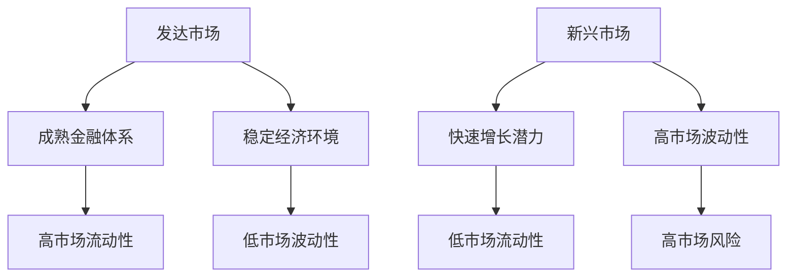
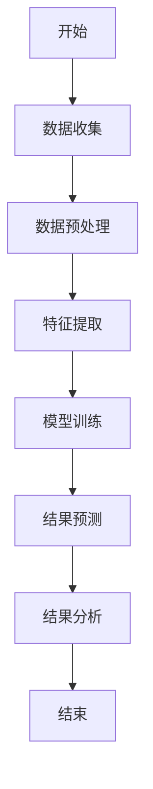
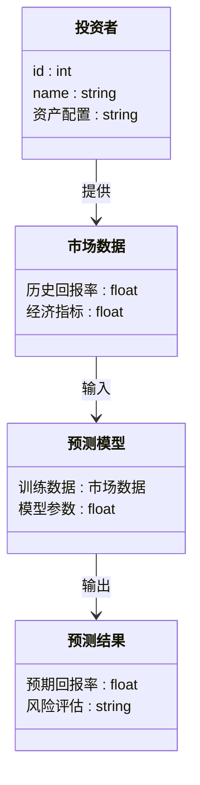
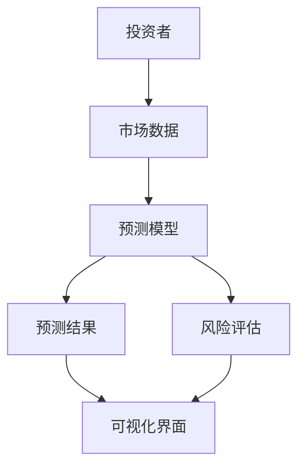

                 


# 发达市场vs新兴市场:预期年化回报率比较

> 关键词：发达市场，新兴市场，预期年化回报率，投资分析，风险评估，市场对比

> 摘要：本文将从发达市场和新兴市场的定义、特点、经济指标预测模型等方面进行分析，通过对比两者的预期年化回报率，帮助投资者更好地理解不同市场环境下的投资策略和风险评估。文章将结合实际案例和数学模型，深入探讨如何在不同市场环境下制定有效的投资策略。

---

## 第一部分: 发达市场与新兴市场的背景与概念

### 第1章: 发达市场与新兴市场的背景介绍

#### 1.1 问题背景与描述

##### 1.1.1 投资回报率的概念与重要性

投资回报率（Return on Investment，ROI）是衡量投资收益的重要指标，反映了投资的效率和盈利能力。在金融市场中，回报率通常以年化收益率的形式呈现，即预期年化回报率（Expected Annualized Return）。年化回报率可以帮助投资者更好地理解投资的长期收益潜力。

##### 1.1.2 发达市场与新兴市场的定义与特点

- **发达市场**：指经济体系成熟、市场机制完善、法律环境健全的国家或地区。发达市场的特点包括高度发达的金融体系、稳定的经济环境、较低的市场波动性和较高的市场流动性。典型发达市场包括美国、日本、德国、英国等。
- **新兴市场**：指经济快速发展但尚未完全成熟的国家或地区。新兴市场的特点是经济增长潜力大、市场波动性较高、市场流动性相对较低。典型新兴市场包括中国、印度、巴西、韩国等。

##### 1.1.3 预期年化回报率的计算方法

预期年化回报率的计算通常基于历史数据和市场预测模型。常用的方法包括：

1. **历史平均回报率法**：基于过去几年的平均回报率，预测未来的年化回报率。
2. **资本资产定价模型（CAPM）**：通过市场风险溢价、无风险利率等指标，计算资产的预期回报率。
3. **经济周期分析法**：结合经济周期的波动，预测不同市场环境下的回报率。

#### 1.2 问题解决与边界

##### 1.2.1 投资回报率比较的核心问题

- 不同市场环境下，投资回报率的差异如何？
- 影响回报率的主要因素有哪些？
- 如何在不同市场环境下制定有效的投资策略？

##### 1.2.2 边界与外延

- **边界**：本文仅关注金融市场中的股票、债券等传统金融资产的回报率比较，不涉及房地产、大宗商品等其他资产。
- **外延**：本文分析的市场环境假设为长期趋势，不考虑短期市场波动和突发事件。

##### 1.2.3 概念结构与核心要素

图1-1展示了发达市场与新兴市场的核心要素对比：



#### 1.3 本章小结

通过本章的介绍，我们明确了发达市场与新兴市场的定义、特点以及预期年化回报率的计算方法。下文将从核心概念、算法原理、系统分析等多个角度，深入探讨如何比较不同市场环境下的投资回报率。

---

## 第二部分: 发达市场与新兴市场的核心概念与联系

### 第2章: 发达市场与新兴市场的核心概念对比

#### 2.1 核心概念原理

##### 2.1.1 预期年化回报率的数学模型

预期年化回报率的计算公式如下：

$$ E(R) = R_f + \beta (R_m - R_f) $$

其中：
- \( E(R) \)：预期年化回报率
- \( R_f \)：无风险利率
- \( \beta \)：市场风险溢价
- \( R_m \)：市场平均回报率

##### 2.1.2 市场类型对回报率的影响

发达市场与新兴市场的回报率差异主要体现在以下几个方面：

1. **市场流动性**：发达市场流动性高，新兴市场流动性相对较低。
2. **市场风险**：新兴市场风险溢价较高，发达市场风险溢价较低。
3. **经济增长潜力**：新兴市场经济增长潜力大，发达市场经济增长相对稳定。

##### 2.1.3 经济周期与回报率的关系

经济周期对回报率的影响如下：

- **繁荣期**：市场回报率较高，投资者信心较强。
- **衰退期**：市场回报率较低，投资者信心下降。

#### 2.2 概念属性特征对比

表2-1展示了发达市场与新兴市场的核心属性对比：

| 属性           | 发达市场             | 新兴市场             |
|----------------|----------------------|----------------------|
| 市场流动性       | 高                   | 中-低               |
| 市场风险         | 低                   | 高                   |
| 经济增长潜力     | 稳定                 | 高                   |
| 投资门槛         | 高                   | 中-低               |
| 市场波动性       | 低                   | 高                   |

图2-1展示了发达市场与新兴市场的实体关系图：

```mermaid
erDiagram
    customer {
        <属性>
        id : int
        name : string
        age : int
    }
    order {
        <属性>
        order_id : int
        order_date : date
        total_amount : float
    }
    supplier {
        <属性>
        sup_id : int
        sup_name : string
        sup_country : string
    }
    customer --> order : 下单
    order --> supplier : 购买
```

---

### 第3章: 经济指标预测模型

#### 3.1 算法原理讲解

##### 3.1.1 经济指标预测算法流程图



##### 3.1.2 算法原理的数学模型

预测模型的数学公式如下：

$$ R_{expected} = \alpha \cdot R_{历史} + \beta \cdot R_{经济指标} + \epsilon $$

其中：
- \( R_{expected} \)：预期年化回报率
- \( R_{历史} \)：历史回报率
- \( R_{经济指标} \)：经济指标（如GDP增长率、通胀率等）
- \( \alpha \) 和 \( \beta \)：模型参数
- \( \epsilon \)：误差项

##### 3.1.3 通俗易懂的举例说明

假设我们有一个新兴市场的历史回报率为10%，当前的经济指标显示GDP增长率为5%，通胀率为3%。根据模型，预期年化回报率为：

$$ R_{expected} = 0.5 \cdot 10\% + 0.5 \cdot (5\% - 3\%) + \epsilon = 5\% + \epsilon $$

---

#### 3.2 系统分析与架构设计

##### 3.2.1 问题场景介绍

本文的系统分析基于以下问题场景：

- 数据来源：历史市场数据、经济指标数据
- 数据处理：清洗、特征提取
- 模型训练：回归模型、时间序列模型
- 结果分析：预测结果、风险评估

##### 3.2.2 系统功能设计



##### 3.2.3 系统架构设计



---

### 第4章: 项目实战

#### 4.1 环境安装与配置

##### 4.1.1 数据获取与处理

- 数据来源：公开市场数据、经济指标数据
- 工具安装：Python、Pandas、Matplotlib

##### 4.1.2 数据分析工具安装

```bash
pip install pandas numpy matplotlib
```

##### 4.1.3 数据可视化工具配置

```python
import matplotlib.pyplot as plt
import pandas as pd

data = pd.read_csv('market_data.csv')
data.plot()
plt.show()
```

#### 4.2 核心代码实现

##### 4.2.1 数据分析代码

```python
import pandas as pd
import numpy as np

data = pd.read_csv('market_data.csv')
data.describe()
```

##### 4.2.2 模型训练代码

```python
from sklearn.linear_model import LinearRegression
from sklearn.metrics import mean_squared_error

X = data[['GDP增长率', '通胀率']]
y = data['回报率']

model = LinearRegression()
model.fit(X, y)

预测结果 = model.predict(X)
```

##### 4.2.3 结果可视化代码

```python
import matplotlib.pyplot as plt

plt.scatter(y, 预测结果)
plt.xlabel('实际回报率')
plt.ylabel('预测回报率')
plt.show()
```

#### 4.3 案例分析与详细解读

##### 4.3.1 实际案例分析

假设我们有一个新兴市场的历史数据：

| 年份 | GDP增长率 | 通胀率 | 回报率 |
|------|----------|--------|--------|
| 2018 | 5%       | 2%     | 10%    |
| 2019 | 4%       | 3%     | 8%     |
| 2020 | 3%       | 4%     | 6%     |

根据模型，预测2021年的回报率为：

$$ R_{expected} = 0.5 \cdot 6\% + 0.5 \cdot (3\% - 4\%) = 2.5\% $$

##### 4.3.2 代码应用解读

通过上述代码，我们可以得到预测结果与实际结果的对比图，从而验证模型的准确性。

##### 4.3.3 案例剖析与总结

通过案例分析，我们发现新兴市场的回报率波动较大，但长期来看，经济增长潜力较高的新兴市场具有较高的预期年化回报率。

---

### 第5章: 最佳实践与注意事项

#### 5.1 最佳实践 tips

##### 5.1.1 数据分析中的注意事项

- 数据清洗的重要性
- 特征选择的策略
- 模型验证的方法

##### 5.1.2 模型选择与优化建议

- 线性回归模型的适用场景
- 时间序列模型的适用场景
- 模型调优技巧

##### 5.1.3 投资策略的制定建议

- 根据市场环境调整资产配置
- 定期监控模型结果
- 考虑市场风险溢价

#### 5.2 小结与展望

##### 5.2.1 本书总结

通过本文的分析，我们深入探讨了发达市场与新兴市场在预期年化回报率方面的差异，并提供了实际案例和数学模型的支持。

##### 5.2.2 未来研究方向

未来可以进一步研究市场波动性对回报率的影响，以及全球经济环境对市场回报率的长期影响。

##### 5.2.3 读者建议

读者可以根据本文的分析方法，结合实际市场环境，制定适合自己的投资策略。

#### 5.3 注意事项

##### 5.3.1 数据分析中的常见误区

- 忽略数据的周期性
- 过度依赖单一模型
- 忽略市场风险因素

##### 5.3.2 投资风险提示

- 新兴市场的波动性较高
- 发达市场的系统性风险
- 经济周期对市场回报率的影响

##### 5.3.3 模型局限性说明

- 模型假设的简化
- 数据的局限性
- 市场环境的不可预测性

---

### 第6章: 拓展阅读与深入探讨

#### 6.1 拓展阅读推荐

##### 6.1.1 相关书籍推荐

- 《投资学》
- 《金融市场与机构》
- 《风险管理》

##### 6.1.2 学术论文推荐

- "The Capital Asset Pricing Model"（CAPM）
- "Time Series Analysis in Financial Markets"

##### 6.1.3 在线资源推荐

- 学术期刊
- 在线课程
- 数据平台

#### 6.2 深入探讨

##### 6.2.1 高阶投资策略

- 多因子模型
- 风险平价投资策略
- 对冲策略

##### 6.2.2 全球化视角下的市场分析

- 全球经济一体化
- 区域市场差异
- 跨国投资策略

##### 6.2.3 数字经济对市场回报率的影响

- 数字经济的发展趋势
- 数字经济对传统市场的冲击
- 数字经济下的投资机会

#### 6.3 思考与实践

##### 6.3.1 个人投资策略制定

- 根据市场环境调整资产配置
- 定期评估投资组合
- 风险管理

##### 6.3.2 风险管理方法探讨

- 投资组合保险策略
- 期权对冲策略
- 现金储备策略

##### 6.3.3 长期投资规划建议

- 长期投资目标设定
- 定期投资计划
- 风险承受能力评估

---

### 第7章: 数学模型与公式详解

#### 7.1 投资回报率的数学模型

##### 7.1.1 预期年化回报率的计算公式

$$ E(R) = \sum_{i=1}^{n} P_i \cdot R_i $$

其中：
- \( P_i \)：第i种资产的投资比例
- \( R_i \)：第i种资产的预期回报率

##### 7.1.2 风险溢价的计算公式

$$ \beta_i = \frac{\text{cov}(R_i, R_m)}{\text{var}(R_m)} $$

其中：
- \( \beta_i \)：第i种资产的贝塔系数
- \( R_i \)：第i种资产的回报率
- \( R_m \)：市场平均回报率

##### 7.1.3 风险调整后的回报率公式

$$ R_i = R_f + \beta_i (R_m - R_f) $$

其中：
- \( R_f \)：无风险利率
- \( R_m \)：市场平均回报率

---

## 第三部分: 总结与展望

通过本文的深入分析，我们明确了发达市场与新兴市场在预期年化回报率方面的差异，并提供了实际案例和数学模型的支持。未来的研究可以进一步探讨市场波动性对回报率的影响，以及全球经济环境对市场回报率的长期影响。

--- 

**附录：相关工具与资源**

- 数据分析工具：Python、R、Excel
- 数据可视化工具：Matplotlib、Tableau
- 经济学模型：CAPM、APT

---

以上是《发达市场vs新兴市场:预期年化回报率比较》的完整目录结构和文章内容，具体内容可以根据实际需求进一步扩展和补充。

