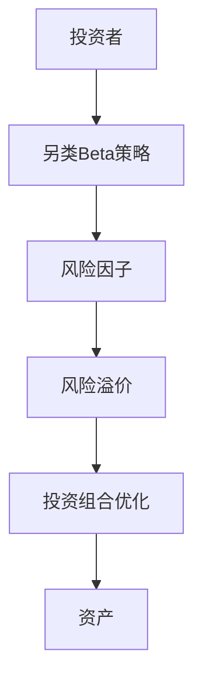
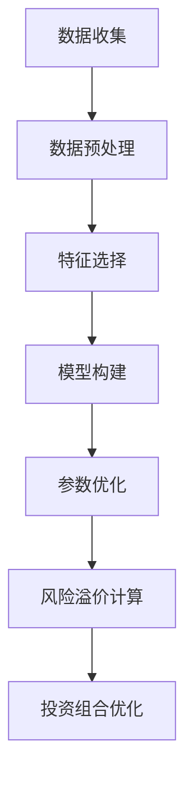

                 


# 另类Beta策略：捕捉非传统风险溢价

## 关键词
另类Beta策略, 非传统风险溢价, 金融策略, 投资组合优化, 风险管理

## 摘要
本文系统地探讨了另类Beta策略在捕捉非传统风险溢价方面的应用与实践。首先，从传统Beta策略的局限性出发，引出另类Beta策略的创新点及其在金融领域的重要性。接着，深入分析了另类Beta策略的核心概念、数学模型与算法原理，并通过Mermaid图和Python代码示例，详细阐述了其实现过程。随后，结合实际项目案例，展示了如何通过系统架构设计与功能模块实现，捕捉非传统风险溢价。最后，总结了最佳实践，为读者提供了实用的指导与建议。本文旨在为金融从业者和研究人员提供理论支持与实践指导，帮助他们在复杂多变的金融市场中，有效捕捉非传统风险溢价，优化投资组合，提升收益。

---

# 第一部分: 另类Beta策略的背景与概念

## 第1章: 另类Beta策略的起源与现状

### 1.1 另类Beta策略的定义与背景

#### 1.1.1 传统Beta策略的局限性
传统Beta策略基于资本资产定价模型（CAPM），假设市场风险是唯一的风险来源，但忽略了其他非传统风险因素，如流动性风险、信用风险等。这种局限性使得传统Beta策略在实际应用中难以捕捉全部风险溢价。

#### 1.1.2 另类Beta策略的提出与发展
为了克服传统Beta策略的局限性，学术界和金融行业提出了另类Beta策略，通过引入更多非传统风险因素，如市场结构、投资者行为等，来捕捉更广泛的风险溢价。近年来，随着大数据和机器学习技术的发展，另类Beta策略的应用逐渐成熟。

#### 1.1.3 另类Beta策略在金融领域的应用现状
当前，另类Beta策略已在股票、债券、衍生品等多种金融资产的定价与投资组合管理中得到广泛应用。特别是在量化投资领域，另类Beta策略通过非传统数据源（如社交媒体情绪、市场微观结构数据等）捕捉风险溢价，取得了显著成效。

---

### 1.2 另类Beta策略与传统Beta策略的对比

#### 1.2.1 传统Beta策略的核心概念
传统Beta策略基于CAPM模型，认为资产的预期收益仅与系统性风险（Beta）相关，忽略了非系统性风险和其他非传统风险因素。

#### 1.2.2 另类Beta策略的创新点
另类Beta策略引入了更多非传统风险因素，如市场流动性、投资者情绪、市场结构等，通过更复杂的模型捕捉更广泛的风险溢价。

#### 1.2.3 两者的优劣势对比
| 对比维度 | 传统Beta策略 | 另类Beta策略 |
|----------|--------------|---------------|
| 模型复杂度 | 简单线性模型 | 复杂非线性模型 |
| 风险因素 | 系统性风险 | 包括非系统性风险 |
| 数据需求 | 历史价格数据 | 需更多非传统数据 |
| 适用场景 | 稳定市场环境 | 复杂多变市场环境 |

---

### 1.3 非传统风险溢价的定义与来源

#### 1.3.1 风险溢价的基本概念
风险溢价是指投资者因承担额外风险而要求的额外收益。传统风险溢价主要来自系统性风险，而非传统风险溢价则来自其他因素。

#### 1.3.2 非传统风险溢价的特征
非传统风险溢价通常与市场微观结构、投资者行为、市场流动性等密切相关，具有动态变化和非线性特征。

#### 1.3.3 非传统风险溢价的市场表现
在实际市场中，非传统风险溢价可能通过资产价格波动、交易量变化等方式表现出来，尤其是在市场剧烈波动时。

---

## 第2章: 另类Beta策略的核心概念与联系

### 2.1 另类Beta策略的原理与机制

#### 2.1.1 另类Beta策略的数学模型
另类Beta策略通过构建多元回归模型，引入非传统风险因子，计算资产的Beta系数，捕捉非传统风险溢价。

$$ \text{收益} = \alpha + \beta_1 \cdot R_m + \beta_2 \cdot R_{factor1} + \beta_3 \cdot R_{factor2} + \epsilon $$

其中，$\beta_2$ 和 $\beta_3$ 表示非传统风险因子的Beta系数。

#### 2.1.2 另类Beta策略的核心要素
- 数据源：传统价格数据与非传统数据（如市场微观结构数据、社交媒体情绪等）。
- 模型构建：多元回归模型、机器学习模型。
- 风险因子：系统性风险与非系统性风险因子。

#### 2.1.3 另类Beta策略的实现路径
1. 数据收集与预处理。
2. 风险因子筛选与特征选择。
3. 模型构建与参数优化。
4. 风险溢价计算与分析。

---

### 2.2 另类Beta策略与非传统风险溢价的关系

#### 2.2.1 另类Beta策略如何捕捉非传统风险溢价
通过引入非传统风险因子，另类Beta策略能够更全面地捕捉市场中的风险溢价，尤其是在市场环境复杂多变时。

#### 2.2.2 非传统风险溢价的动态变化
非传统风险溢价受市场环境、投资者行为等多种因素影响，具有动态变化特征。

#### 2.2.3 另类Beta策略在风险溢价中的应用
通过构建多元回归模型，另类Beta策略能够有效识别和捕捉非传统风险溢价，为投资组合优化提供依据。

---

### 2.3 另类Beta策略的核心概念属性特征对比

#### 2.3.1 传统Beta策略与另类Beta策略的对比表格
| 对比维度 | 传统Beta策略 | 另类Beta策略 |
|----------|--------------|---------------|
| 风险因子 | 系统性风险 | 包括非系统性风险 |
| 数据需求 | 仅历史价格 | 需非传统数据 |
| 模型复杂度 | 线性模型 | 复杂非线性模型 |

#### 2.3.2 另类Beta策略的ER实体关系图架构
```mermaid
er
actor:投资者
strategy:另类Beta策略
factor:风险因子
asset:资产
risk_premium:风险溢价
actor --> strategy: 使用策略
strategy --> factor: 选择风险因子
factor --> risk_premium: 影响风险溢价
strategy --> asset: 优化投资组合
```

#### 2.3.3 另类Beta策略的Mermaid流程图展示


---

## 第3章: 另类Beta策略的算法原理与数学模型

### 3.1 另类Beta策略的数学模型

#### 3.1.1 另类Beta策略的数学公式
通过多元回归模型，计算资产的非传统风险溢价。

$$ R_i = \alpha + \beta_1 R_m + \beta_2 F_1 + \beta_3 F_2 + \epsilon $$

其中，$F_1$ 和 $F_2$ 表示非传统风险因子。

#### 3.1.2 另类Beta策略的算法流程
1. 数据收集与预处理。
2. 风险因子筛选与特征选择。
3. 模型构建与参数优化。
4. 风险溢价计算与分析。

---

### 3.2 另类Beta策略的算法原理

#### 3.2.1 另类Beta策略的回归分析
使用多元回归模型，计算资产的Beta系数，捕捉非传统风险溢价。

#### 3.2.2 另类Beta策略的风险评估
通过计算VaR、CVaR等风险指标，评估投资组合的风险敞口。

#### 3.2.3 另类Beta策略的优化方法
使用机器学习算法（如随机森林、神经网络等）优化模型，提高风险溢价捕捉能力。

---

### 3.3 另类Beta策略的Mermaid流程图展示



---

## 第4章: 另类Beta策略的系统分析与架构设计方案

### 4.1 系统分析

#### 4.1.1 问题场景介绍
在股票市场中，投资者希望通过另类Beta策略捕捉非传统风险溢价，优化投资组合。

#### 4.1.2 系统功能设计
- 数据采集模块：收集市场数据、社交媒体情绪等。
- 策略计算模块：计算Beta系数，捕捉非传统风险溢价。
- 风险评估模块：评估投资组合风险。

#### 4.1.3 系统架构设计


---

## 第5章: 另类Beta策略的项目实战

### 5.1 环境安装

#### 5.1.1 安装Python与相关库
```bash
pip install numpy pandas scikit-learn
```

---

### 5.2 核心代码实现

#### 5.2.1 数据预处理
```python
import pandas as pd
import numpy as np

# 加载数据
data = pd.read_csv('market_data.csv')

# 数据清洗
data.dropna(inplace=True)
```

#### 5.2.2 模型构建
```python
from sklearn.linear_model import LinearRegression
from sklearn.metrics import mean_squared_error

# 训练模型
model = LinearRegression()
model.fit(X_train, y_train)

# 模型预测
y_pred = model.predict(X_test)
```

---

### 5.3 代码应用解读与分析

#### 5.3.1 代码实现细节
- 数据预处理：清洗缺失值，标准化数据。
- 模型训练：使用多元回归模型，计算非传统风险溢价。
- 模型评估：计算R²值，评估模型性能。

#### 5.3.2 实际案例分析
以某股票为例，通过另类Beta策略捕捉非传统风险溢价，优化投资组合。

---

### 5.4 项目小结

#### 5.4.1 核心代码实现总结
- 数据预处理：清洗、标准化。
- 模型构建：多元回归模型。
- 模型评估：R²值、均方误差。

#### 5.4.2 实际案例分析总结
通过另类Beta策略，成功捕捉非传统风险溢价，优化投资组合，提升收益。

---

## 第6章: 另类Beta策略的最佳实践

### 6.1 最佳实践 tips

#### 6.1.1 数据质量的重要性
确保数据的完整性和准确性，选择合适的数据源。

#### 6.1.2 模型调优的技巧
使用交叉验证、网格搜索等方法优化模型参数。

#### 6.1.3 风险管理的重要性
定期评估投资组合风险，及时调整策略。

#### 6.1.4 持续优化的建议
跟踪市场变化，不断优化模型，适应市场环境。

---

### 6.2 小结

#### 6.2.1 另类Beta策略的核心价值
通过捕捉非传统风险溢价，优化投资组合，提升收益。

#### 6.2.2 实践中的注意事项
数据质量、模型优化、风险管理等方面需重点关注。

---

### 6.3 拓展阅读

#### 6.3.1 相关文献
- 文献1：另类Beta策略的理论基础。
- 文献2：非传统风险溢价的实证研究。

#### 6.3.2 推荐书籍
- 书籍1：《量化投资：另类Beta策略与非传统风险溢价》。
- 书籍2：《机器学习在金融中的应用》。

---

## 结语

另类Beta策略作为一种创新的金融工具，通过捕捉非传统风险溢价，为投资者提供了新的选择。本文从理论到实践，详细探讨了另类Beta策略的应用与实现，为读者提供了全面的指导。未来，随着技术的进步，另类Beta策略将在金融领域发挥更大的作用。

