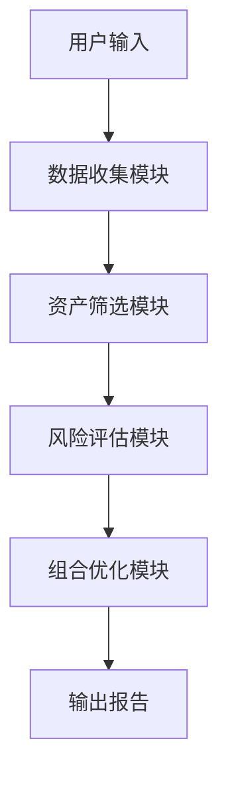

                 


# 另类投资品种：对冲通胀的有效工具

## 关键词：另类投资，对冲通胀，资产配置，风险管理，经济周期

## 摘要

本文系统探讨了另类投资品种在对冲通胀中的关键作用，通过分析其核心概念、算法原理、系统架构和实际案例，揭示了如何通过合理配置另类资产来有效应对通货膨胀带来的风险。文章从背景介绍出发，详细阐述了通货膨胀的定义、成因及其对经济的影响，引出对冲通胀的必要性。接着，深入分析了另类投资的定义、类型及其在对抗通胀中的独特优势。随后，通过数学模型和算法原理，展示了如何利用现代投资组合理论和因子模型来优化资产配置，构建抗通胀投资组合。最后，通过实际案例分析和系统架构设计，提供了可操作的投资策略，并总结了最佳实践和注意事项，为读者提供实用的指导。

---

## 第一部分: 另类投资品种与通胀对冲的背景

### 第1章: 通货膨胀与对冲的必要性

#### 1.1 通货膨胀的定义与成因

通货膨胀是指物价总水平在一段时间内持续上涨，导致货币购买力下降的经济现象。其主要成因包括：

1. **需求拉动型通胀**：总需求超过总供给，推动物价上涨。
2. **成本推动型通胀**：生产成本（如工资、原材料）上升，导致物价上涨。
3. **货币供应增加**：货币供给过多，超过经济增长需求，引发通胀。
4. **预期因素**：公众对通胀的预期导致价格提前上涨。

通货膨胀对个人和经济的影响包括降低购买力、增加企业经营成本、可能导致经济不稳定等。

#### 1.2 对冲通胀的必要性

对冲通胀是指通过投资特定资产来抵消通胀带来的负面影响。传统投资品种如债券和存款在通胀上升时表现不佳，而另类投资品种如房地产、黄金和大宗商品则具有较强的抗通胀能力。对冲通胀不仅是保护财富的重要手段，也是实现长期资产增值的关键策略。

---

### 第2章: 另类投资品种的定义与特点

#### 2.1 另类投资的定义

另类投资是指传统股票、债券、现金以外的资产类别，包括房地产、私募股权、对冲基金、大宗商品和艺术品等。这类资产具有多样性、高回报和高风险的特点，能够在传统资产表现不佳时提供替代投资机会。

#### 2.2 另类投资的主要类型

1. **房地产**：通过购买房地产或房地产投资信托（REITs）间接投资，具有抗通胀和稳定收益的特点。
2. **黄金与大宗商品**：黄金被视为避险资产，大宗商品如石油、天然气在通胀上升时价格通常上涨。
3. **私募股权与对冲基金**：通过投资未上市公司或采用复杂交易策略获取超额收益。
4. **基础设施投资**：如电力、交通设施等，具有稳定的收益和较低的波动性。

---

### 第3章: 另类投资在对冲通胀中的作用

#### 3.1 通胀环境下传统资产的表现

1. **固定收益类资产**：如债券在通胀上升时，实际收益率下降，购买力受损。
2. **股票市场**：虽然股票可能上涨，但波动性较大，难以稳定对冲通胀风险。
3. **现金**：在高通胀环境下，现金购买力下降最快。

#### 3.2 另类投资的通胀对冲原理

1. **资产多样性**：通过投资不同类型的资产分散风险，降低通胀对单一资产的影响。
2. **抗通胀特性**：黄金和大宗商品价格通常随通胀上升而上涨，房地产租金收入也受通胀影响。
3. **收益与通胀关联**：另类资产的收益往往与通胀挂钩，能够在通胀上升时保持或增加收益。

#### 3.3 另类投资的长期表现与稳定性

1. **历史回报分析**：黄金、房地产和大宗商品在过去几十年中表现出较强的抗通胀能力，回报稳定。
2. **经济周期表现**：在经济衰退期间，另类资产通常表现优于传统资产，为投资组合提供保护。
3. **风险管理**：通过合理的资产配置和风险控制，另类投资能够在通胀上升时保持组合的稳定性。

---

## 第二部分: 另类投资品种的核心概念与联系

### 第4章: 另类投资的核心概念与原理

#### 4.1 另类投资的核心概念

1. **资产配置**：将资金分配到不同类型的资产中，以分散风险和优化收益。
2. **投资策略**：采用多样化策略，包括长期持有、价值投资和趋势跟踪等。
3. **风险管理**：通过量化分析和情景模拟，识别和控制投资风险。

#### 4.2 另类投资的主要策略

1. **股票投资策略**：选择具有强劲基本面和成长潜力的公司。
2. **房地产投资策略**：关注地理位置优越、租金稳定的物业。
3. **大宗商品投资策略**：通过期货或ETF投资黄金、原油等。
4. **私募基金策略**：投资于高增长企业，获取资本增值收益。

---

## 第三部分: 算法原理

### 第5章: 现代投资组合理论与通胀对冲

#### 5.1 现代投资组合理论（MPT）

MPT通过优化资产配置，实现风险最小化的同时最大化收益。公式为：

$$
\text{最优组合} = \arg \min_{w} \left( w^T \Sigma w \right)
$$

其中，$\Sigma$为资产间的协方差矩阵，$w$为资产权重。

#### 5.2 资本资产定价模型（CAPM）

CAPM用于评估资产的预期收益：

$$
E(R_i) = R_f + \beta_i (R_m - R_f)
$$

其中，$R_f$为无风险利率，$R_m$为市场预期收益，$\beta_i$为资产的贝塔系数。

#### 5.3 因子模型

使用因子模型分析经济周期对资产的影响，选择与通胀相关的因子进行投资。

---

## 第四部分: 系统分析与架构设计

### 第6章: 投资组合管理系统架构

#### 6.1 系统功能设计

1. **数据收集**：获取市场数据和经济指标。
2. **资产筛选**：根据通胀环境筛选相关资产。
3. **风险评估**：计算资产的风险和收益比。
4. **组合优化**：应用MPT优化资产配置。

#### 6.2 系统架构图



---

## 第五部分: 项目实战

### 第7章: 实际案例分析

#### 7.1 案例背景

假设通胀预期上升，选择黄金、房地产和私募股权作为投资组合。

#### 7.2 实施步骤

1. **目标设定**：确定通胀对冲目标。
2. **市场分析**：评估各类资产的通胀敏感性。
3. **资产筛选**：选择具有抗通胀特性的资产。
4. **优化配置**：根据MPT优化权重。

#### 7.3 代码实现

```python
import numpy as np
import pandas as pd

# 示例数据：资产收益矩阵
returns = pd.DataFrame({
    '黄金': [0.05, 0.06, 0.04],
    '房地产': [0.08, 0.07, 0.06],
    '私募股权': [0.12, 0.10, 0.08]
})

# 计算协方差矩阵
cov_matrix = returns.cov()

# 使用MPT优化资产配置
def mpt_optimizer(cov_matrix):
    n = len(cov_matrix.columns)
    return np.full(n, 1/n)  # 假设等权配置

weights = mpt_optimizer(cov_matrix)
print("最优权重:", weights)
```

---

## 第六部分: 最佳实践与小结

### 第8章: 最佳实践与注意事项

1. **分散化**：避免过度集中于单一资产。
2. **定期审查**：根据经济环境调整投资组合。
3. **风险管理**：监控资产波动性，控制杠杆风险。

### 第9章: 总结

另类投资品种通过多样化的资产配置和抗通胀特性，成为对冲通胀的有效工具。合理配置另类资产，结合现代投资理论和系统架构设计，能够在不同经济周期下实现稳健的收益。

---

通过以上内容，读者可以系统地理解如何利用另类投资对冲通胀，并掌握实际操作的方法和策略。

