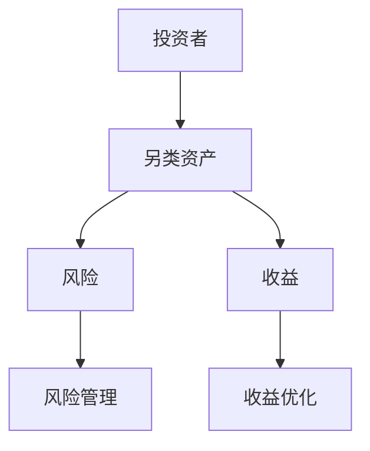
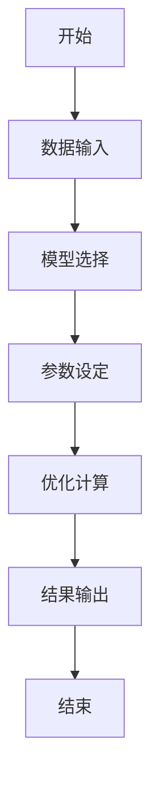
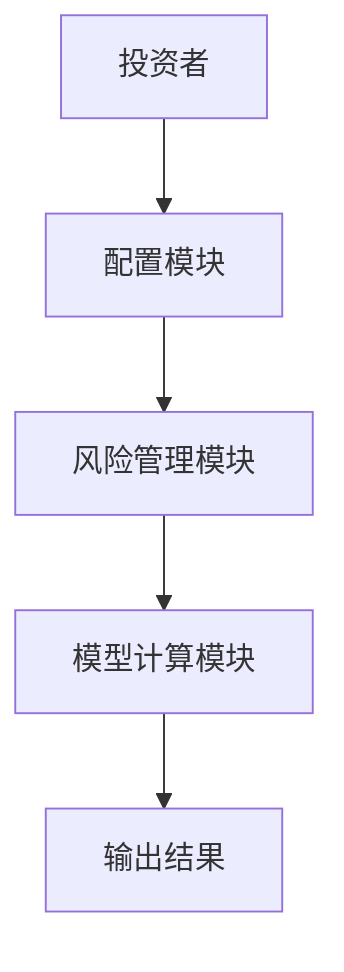

                 


# 另类投资在投资组合中的作用

> 关键词：另类投资、投资组合、风险管理、资产配置、收益优化、现代投资组合理论（MPT）

> 摘要：  
> 本文系统探讨了另类投资在现代投资组合中的核心作用，分析了其在分散风险、提高收益和增强资产配置灵活性方面的独特价值。通过深入解读另类投资的核心概念、数学模型和实际应用场景，本文为投资者提供了全面的理论框架和实践指导，帮助其更好地理解和运用另类投资策略。

---

## 第1章: 另类投资的定义与特点

### 1.1 另类投资的定义与核心要素

#### 1.1.1 传统投资与另类投资的对比
- **传统投资**：主要涵盖股票、债券、现金等标准化资产，具有流动性高、信息透明度高、估值相对容易等特点。
- **另类投资**：包括房地产、私募股权、对冲基金、大宗商品、艺术品等非标准化资产，具有较高的流动性风险、信用风险和市场风险。

| 投资类型 | 特点 | 优点 | 缺点 |
|----------|------|------|------|
| 传统投资 | 标准化、流动性高 | 信息透明度高 | 收益相对稳定，但难以超额收益 |
| 另类投资 | 非标准化、多样性高 | 分散风险、捕捉超额收益 | 流动性差、信息不透明 |

#### 1.1.2 另类投资的核心要素与属性特征
- **非流动性**：另类资产通常难以快速变现，尤其是在市场低迷时期。
- **复杂性**：另类投资涉及复杂的交易结构和法律合同，增加了操作难度。
- **杠杆效应**：许多另类投资（如房地产抵押贷款）依赖于杠杆，放大了收益和风险。
- **不对称性**：另类投资可能面临尾部风险，即在极端市场条件下损失惨重。

#### 1.1.3 另类投资的边界与外延
- **边界**：另类投资的边界通常以“非传统”资产为界，但具体定义因机构和投资者而异。
- **外延**：随着金融创新的推进，另类投资的外延不断扩展，包括加密资产、碳排放权交易等新兴领域。

### 1.2 另类投资的类型与分类

#### 1.2.1 不同资产类别的另类投资
- **房地产投资**：通过购买房地产或房地产信托基金（REITs）进行投资。
- **私募股权**：投资于未上市公司或创业公司，通过长期持有实现价值增值。
- **对冲基金**：采用多种策略（如套利、空头头寸）追求绝对收益。
- **大宗商品**：包括黄金、原油、农产品等，具有抗通胀和分散风险的功能。
- **基础设施投资**：投资于交通、能源等大型基础设施项目，收益稳定但流动性差。

#### 1.2.2 另类投资的分类标准与对比表格

| 分类标准 | 投资类型 | 特点 |
|----------|----------|------|
| 资产类别 | 房地产 | 高流动性风险、高收益潜力 |
| 投资策略 | 私募股权 | 高风险、高回报，周期长 |
| 交易机制 | 对冲基金 | 多策略、杠杆化、绝对收益 |

---

## 第2章: 另类投资在投资组合中的作用

### 2.1 投资组合管理的背景与目标

#### 2.1.1 投资组合管理的基本原理
- **分散化原则**：通过投资不同类型的资产降低整体风险。
- **风险与收益的平衡**：在可接受的风险范围内追求最大收益。

### 2.2 另类投资在投资组合中的角色

#### 2.2.1 分散风险的作用机制
- **非相关性**：另类资产与传统资产的相关性较低，有助于降低组合的整体波动性。
- **对冲风险**：通过做空或杠杆化策略对冲市场风险或通胀风险。

#### 2.2.2 提高收益的潜在可能性
- **超额收益机会**：另类投资可以通过复杂策略捕捉市场 inefficiency。
- **杠杆效应**：合理使用杠杆可以放大收益，但也会增加风险。

#### 2.2.3 灵活性与适应性分析
- **资产配置的灵活性**：根据市场环境调整另类资产的配置比例。
- **适应性策略**：在经济周期变化中，灵活运用另类投资应对市场波动。

---

## 第3章: 另类投资的核心概念与联系

### 3.1 另类投资的核心概念原理

#### 3.1.1 投资决策的逻辑框架
- **目标设定**：明确投资目标（如保值、增值）和风险承受能力。
- **资产配置**：根据目标选择合适的资产类别和权重。
- **风险管理**：通过分散化和对冲手段控制风险。

#### 3.1.2 另类投资的内在联系与系统性分析
- **系统性风险**：市场整体波动对另类资产的影响。
- **非系统性风险**：特定资产或行业特有的风险。

### 3.2 另类投资的属性特征对比

#### 3.2.1 不同投资类型的核心要素对比

| 投资类型 | 核心要素 | 风险 | 收益 |
|----------|----------|------|------|
| 股票 | 股权、流动性高 | 市场风险 | 较高 |
| 债券 | 利息、本金保障 | 利率风险 | 稳定 |
| 房地产 | 物业、租金收入 | 流动性风险 | 较高 |

#### 3.2.2 投资风险与收益的平衡分析
- **风险-收益曲线**：风险越高，潜在收益越大，但超过一定阈值后，风险急剧上升。

### 3.3 另类投资的ER实体关系图


---

## 第4章: 另类投资的算法与数学模型

### 4.1 投资组合优化的数学模型

#### 4.1.1 现代投资组合理论（MPT）概述
- **均值-方差优化**：通过最大化收益或最小化风险来确定最优资产配置。
- **数学公式**：
  - 收益：$$ E(r_p) = \sum w_i E(r_i) $$
  - 风险：$$ \sigma_p^2 = \sum w_i w_j \sigma_{i,j} $$

#### 4.1.2 布莱克-斯科尔斯模型的扩展应用
- **对冲基金策略**：利用衍生品对冲市场风险。
- **数学公式**：
  - 期权定价：$$ C = S_0 N(d_1) - K e^{-rT} N(d_2) $$

#### 4.1.3 风险调整后的收益评估公式
- **夏普比率**：$$ \text{夏普比率} = \frac{E(r_p) - r_f}{\sigma_p} $$

### 4.2 另类投资的算法流程


---

## 第5章: 另类投资的系统架构与实战案例

### 5.1 系统架构设计

#### 5.1.1 系统功能设计（领域模型）


#### 5.1.2 系统架构设计


### 5.2 项目实战

#### 5.2.1 环境安装
- **工具**：Python、Pandas、NumPy、Matplotlib
- **库安装**：
  ```bash
  pip install numpy pandas matplotlib
  ```

#### 5.2.2 核心实现源代码
```python
import numpy as np
import pandas as pd
import matplotlib.pyplot as plt

# 示例数据：另类资产的收益和风险
assets = ['房地产', '私募股权', '对冲基金']
returns = [0.12, 0.15, 0.08]
risks = [0.2, 0.3, 0.1]

# 绘制风险-收益散点图
plt.scatter(risks, returns, label=assets)
plt.xlabel('Risk')
plt.ylabel('Return')
plt.title('另类投资的风险-收益分析')
plt.legend()
plt.show()
```

#### 5.2.3 实际案例分析
- **案例**：某机构通过配置房地产信托基金（REITs）分散股票市场的波动风险。
- **分析**：REITs与股票的相关性较低，能够有效降低组合的整体波动性。

---

## 第6章: 总结与展望

### 6.1 总结
- 另类投资通过分散风险、捕捉超额收益和增强资产配置的灵活性，成为现代投资组合中不可或缺的一部分。
- 投资者需结合自身目标和风险承受能力，合理配置另类资产。

### 6.2 展望
- **技术驱动的创新**：大数据和人工智能在另类投资中的应用将更加广泛。
- **ESG投资的兴起**：环境、社会和治理因素将成为另类投资的重要考量。

---

以上是《另类投资在投资组合中的作用》的完整目录和内容框架，涵盖从理论到实践的各个方面，帮助读者全面理解和应用另类投资策略。

