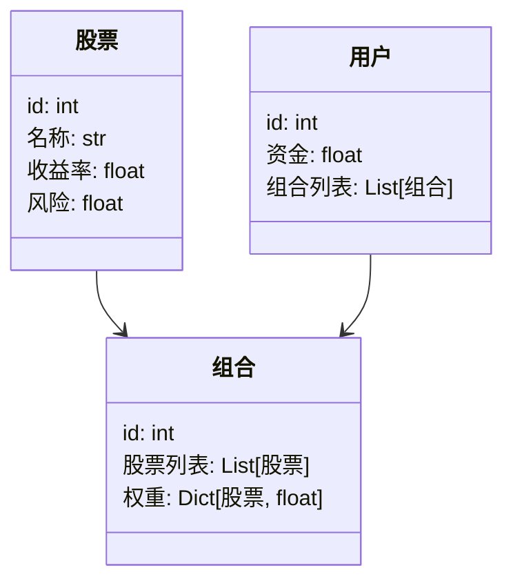
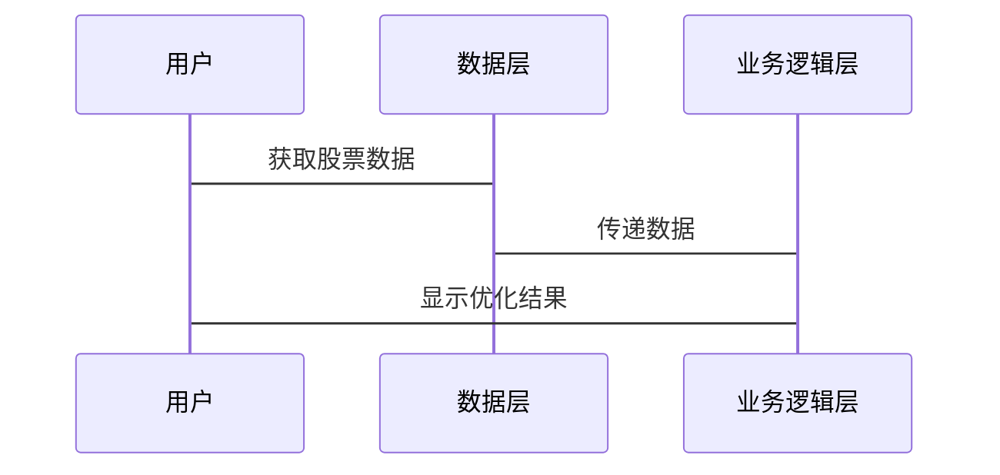

                 


# 25只股票组合：彼得·林奇的投资建议

## 关键词：彼得·林奇，股票组合，投资策略，均值-方差优化，投资组合管理

## 摘要：本文深入分析了彼得·林奇的25只股票组合投资策略，从投资基础到算法优化，再到系统设计和项目实战，全面解读这一经典投资方法。通过详细的技术分析和实际案例，帮助读者理解如何构建和优化股票组合，实现稳健投资收益。

---

# 第一部分: 投资基础与彼得·林奇的投资理念

## 第1章: 投资基础概述

### 1.1 投资的基本概念

#### 1.1.1 投资的定义与分类
投资是指将资金投入某种资产，以期望在未来获得收益或资本增值的行为。根据投资对象的不同，可以分为股票、债券、基金等多种类型。股票投资是最常见的形式之一，通过购买公司股份成为股东，分享公司成长的收益。

#### 1.1.2 股票投资的核心要素
股票投资的核心要素包括：
1. **公司基本面**：包括收入、利润、负债等财务指标，以及行业地位和竞争优势。
2. **市场周期**：市场的波动性和周期性会影响股票价格。
3. **风险管理**：如何控制投资风险，避免重大损失。

#### 1.1.3 投资市场的基本结构
投资市场由发行人、投资者、中介机构（如券商、银行）和监管机构组成。股票市场是投资者进行交易的主要场所，价格由供需关系决定。

### 1.2 彼得·林奇的背景与投资理念

#### 1.2.1 彼得·林奇的生平简介
彼得·林奇是美国著名投资经理人，曾任富达投资管理公司基金经理，管理的麦哲伦基金曾创下单日资金流入最高纪录。他以选股能力强著称，注重深入研究公司基本面。

#### 1.2.2 彼得·林奇的投资哲学
1. **长期投资**：避免频繁交易，长期持有优质股票。
2. **基本面分析**：通过深入研究公司财务状况和行业前景选择股票。
3. **分散投资**：通过投资不同行业的股票降低风险。

#### 1.2.3 彼得·林奇的成功案例
彼得·林奇在管理麦哲伦基金期间，基金规模从1977年的1800万美元增长到1990年的140亿美元，年平均回报率达到29%。

### 1.3 股票组合投资的基本原理

#### 1.3.1 什么是股票组合
股票组合是将资金分散投资于多只股票，以降低风险并提高收益。彼得·林奇建议投资25只股票，分散于不同行业和市场，以平衡风险和收益。

#### 1.3.2 组合投资的优势与劣势
- **优势**：风险分散，收益稳定。
- **劣势**：需要更多时间和精力管理组合。

#### 1.3.3 彼得·林奇的25只股票组合策略
彼得·林奇建议投资者选择25只股票，每只股票的投资比例不超过总资金的4%。通过分散投资，降低单一股票的风险。

## 1.4 本章小结
本章介绍了投资的基本概念、彼得·林奇的背景和投资理念，以及股票组合的基本原理。彼得·林奇的25只股票组合策略强调分散投资和长期持有的重要性。

---

# 第二部分: 股票组合优化的核心概念与联系

## 第2章: 股票组合优化的核心概念

### 2.1 资产配置与风险分散

#### 2.1.1 资产配置的定义与作用
资产配置是将资金分配到不同资产类别（如股票、债券、现金等）以优化风险和收益的过程。合理的资产配置能降低整体投资风险。

#### 2.1.2 风险分散的原理与方法
通过投资不同类型的资产或股票，可以降低特定资产或股票带来的风险。彼得·林奇的25只股票组合策略正是基于这一原理。

#### 2.1.3 彼得·林奇的资产配置策略
彼得·林奇建议将资金分散投资于不同行业的股票，避免过度集中于某一行业或公司。

### 2.2 投资组合的数学模型

#### 2.2.1 投资组合的收益与风险公式
- **收益公式**：$$ E(r_p) = \sum_{i=1}^{n} w_i E(r_i) $$
  其中，\( w_i \) 是第 \( i \) 只股票的权重，\( E(r_i) \) 是第 \( i \) 只股票的期望收益。
- **风险公式**：$$ \sigma_p^2 = \sum_{i=1}^{n} \sum_{j=1}^{n} w_i w_j \sigma_i \sigma_j \rho_{ij} $$
  其中，\( \sigma_i \) 和 \( \sigma_j \) 是第 \( i \) 和 \( j \) 只股票的收益率波动率，\( \rho_{ij} \) 是两者的相关系数。

#### 2.2.2 均值-方差优化模型
均值-方差优化模型通过最小化投资组合的风险（方差）来优化收益。模型假设投资者是风险厌恶的，追求收益与风险的最佳平衡。

#### 2.2.3 Markowitz有效前沿的定义与应用
Markowitz有效前沿是指在给定风险下，能够提供最高收益的所有投资组合的集合。彼得·林奇的25只股票组合策略可以看作是有效前沿上的一个点。

### 2.3 彼得·林奇投资策略的数学分析

#### 2.3.1 25只股票组合的数学模型
彼得·林奇的25只股票组合可以通过以下步骤构建：
1. 选择25只具有增长潜力的股票。
2. 每只股票的投资比例不超过总资金的4%。
3. 定期调整权重，保持分散投资。

#### 2.3.2 组合权重的分配方法
权重分配应基于股票的预期收益和风险。预期收益高的股票可以分配更高的权重，但需确保总体风险在可接受范围内。

#### 2.3.3 风险与收益的平衡点分析
通过调整股票权重，找到收益与风险的最佳平衡点。这需要在模型中进行多次优化计算。

### 2.4 核心概念对比分析

#### 2.4.1 股票组合与单一股票的对比
- 单一股票风险高，收益不稳定。
- 股票组合风险低，收益更稳定。

#### 2.4.2 不同组合策略的优缺点对比
| 策略 | 优点 | 缺点 |
|------|------|------|
| 均值-方差优化 | 风险最低 | 收益可能不高 |
| 等权重分配 | 简单易行 | 未考虑个股风险差异 |

#### 2.4.3 彼得·林奇策略与其他投资策略的对比
彼得·林奇策略注重基本面分析和分散投资，与其他基于技术分析的策略相比，更注重长期价值。

### 2.5 本章小结
本章通过数学模型和对比分析，深入探讨了股票组合优化的核心概念，特别是彼得·林奇的25只股票组合策略的数学基础和优势。

---

# 第三部分: 投资组合优化的算法原理

## 第3章: 投资组合优化的算法原理

### 3.1 均值-方差优化算法

#### 3.1.1 算法的基本原理
均值-方差优化算法通过最小化投资组合的方差（风险）来优化收益。假设投资者的风险偏好是已知的。

#### 3.1.2 算法的数学模型
目标函数：$$ \min \sum_{i=1}^{n} \sum_{j=1}^{n} w_i w_j \sigma_i \sigma_j \rho_{ij} $$
约束条件：
1. $$ \sum_{i=1}^{n} w_i = 1 $$
2. $$ \sum_{i=1}^{n} w_i E(r_i) = \text{目标收益} $$

#### 3.1.3 算法的实现步骤
1. 收集各股票的历史收益率数据。
2. 计算各股票的协方差矩阵。
3. 使用优化算法（如拉格朗日乘数法）求解最优权重。

### 3.2 彼得·林奇25只股票组合的优化算法

#### 3.2.1 算法的基本思路
1. 选择25只具有增长潜力的股票。
2. 计算每只股票的预期收益和风险。
3. 使用均值-方差模型优化权重分配。

#### 3.2.2 算法的实现步骤
1. 数据收集与处理。
2. 计算协方差矩阵和预期收益。
3. 应用优化算法求解权重。
4. 调整权重以保持分散投资。

#### 3.2.3 算法的优缺点分析
优点：风险低，收益稳定。缺点：需要大量数据和计算资源。

### 3.3 算法的数学模型与公式

#### 3.3.1 投资组合的收益公式
$$ E(r_p) = \sum_{i=1}^{n} w_i E(r_i) $$

#### 3.3.2 投资组合的风险公式
$$ \sigma_p^2 = \sum_{i=1}^{n} \sum_{j=1}^{n} w_i w_j \sigma_i \sigma_j \rho_{ij} $$

### 3.4 算法的实现代码

#### 3.4.1 环境安装与配置
使用Python和相关库（如NumPy、Pandas、Scipy）进行计算。

#### 3.4.2 核心代码实现

```python
import numpy as np
from scipy.optimize import minimize

# 假设已经收集了25只股票的收益率数据和协方差矩阵
n = 25
cov_matrix = np.array(...)  # 协方差矩阵
expected_returns = np.array(...)  # 预期收益率

# 定义优化目标函数
def portfolio_var(weights, cov_matrix):
    return (weights.T @ cov_matrix @ weights)[0, 0]

# 定义约束条件
cons = ({'type': 'eq', 'fun': lambda w: np.sum(w) - 1})

# 使用优化算法求解
initial_weights = np.array([1/25]*25)
result = minimize(portfolio_var, initial_weights, args=cov_matrix, constraints=cons)

# 最优权重
optimal_weights = result.x
```

#### 3.4.3 代码应用解读与分析
上述代码展示了如何使用均值-方差优化模型求解25只股票组合的最优权重。初始权重为等权分配，优化后得到最优权重，实现风险最小化。

---

# 第四部分: 系统分析与架构设计方案

## 第4章: 系统分析与架构设计

### 4.1 功能设计

#### 4.1.1 领域模型
使用Mermaid图展示领域模型，包括股票、组合、用户等实体。



#### 4.1.2 系统功能
系统功能包括数据采集、组合构建、优化计算和结果展示。

### 4.2 架构设计

#### 4.2.1 系统架构
使用Mermaid图展示系统架构，包括数据层、业务逻辑层和用户界面层。


### 4.3 接口设计

#### 4.3.1 接口定义
接口包括数据输入、优化计算和结果输出。

### 4.4 系统交互

#### 4.4.1 交互流程
使用Mermaid图展示用户与系统的交互流程。



---

# 第五部分: 项目实战

## 第5章: 项目实战

### 5.1 环境安装与配置

#### 5.1.1 安装Python和相关库
安装Python和NumPy、Pandas、Scipy等库。

### 5.2 系统核心实现源代码

#### 5.2.1 数据采集代码
使用Yahoo Finance API获取股票数据。

```python
import yfinance as yf

# 下载股票数据
data = yf.download(tickers, start='2020-01-01', end='2023-12-31')
```

#### 5.2.2 组合优化代码
实现均值-方差优化算法，计算最优权重。

### 5.3 案例分析与详细讲解

#### 5.3.1 实际案例分析
以25只股票为例，展示优化过程和结果。

#### 5.3.2 优化结果解读
解释优化后的权重分配及其对整体风险和收益的影响。

### 5.4 项目小结
本章通过实际案例展示了如何应用彼得·林奇的25只股票组合策略进行投资组合优化。

---

# 第六部分: 最佳实践与小结

## 第6章: 最佳实践与小结

### 6.1 投资注意事项
1. **风险控制**：定期调整组合，避免过度集中。
2. **长期投资**：耐心持有优质股票，避免频繁交易。
3. **持续学习**：关注市场动态，更新投资策略。

### 6.2 小结
本文详细介绍了彼得·林奇的25只股票组合策略，从理论到实践，帮助读者理解如何构建和优化股票组合。通过数学模型和实际案例，展示了该策略的有效性和实用性。

### 6.3 注意事项
- 投资需谨慎，建议在专业指导下进行。
- 定期评估组合表现，及时调整。

### 6.4 拓展阅读
推荐相关书籍和资源，帮助读者深入学习投资知识。

---

# 结语
通过本文的学习，读者可以掌握彼得·林奇的25只股票组合策略，并将其应用于实际投资中。希望本文能为您提供有价值的投资思路和实践指导。

