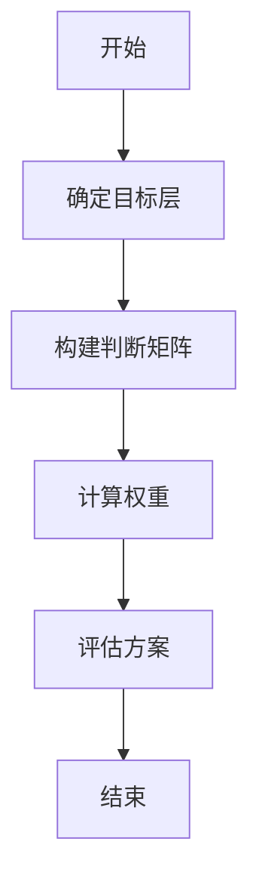
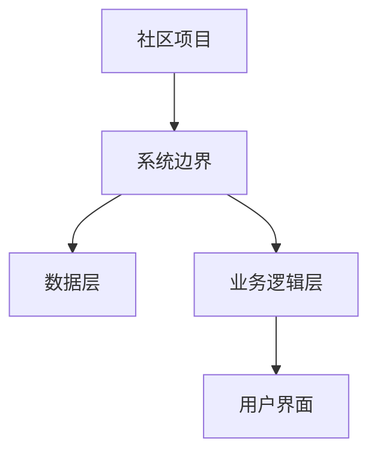
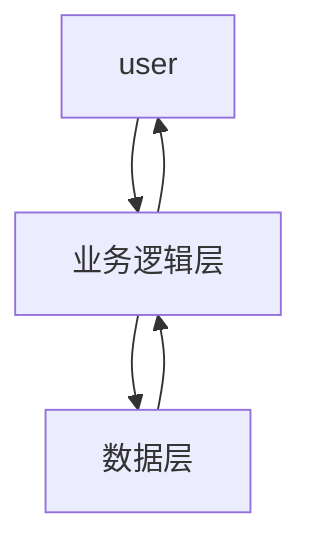

                 


# 可再生能源社区项目的投资模式研究

---

## 关键词：可再生能源、社区项目、投资模式、能源转型、可持续发展

---

## 摘要：  
随着全球能源转型的加速，可再生能源在社区层面的应用和投资模式研究变得至关重要。本文系统性地分析了可再生能源社区项目的投资模式，从背景介绍、核心概念、算法原理到系统架构，再到项目实战，深入探讨了可再生能源社区项目在投资模式上的创新与实践。通过构建数学模型和算法流程图，结合实际案例分析，本文提出了可再生能源社区项目投资模式的优化建议，并展望了未来的研究方向。

---

# 第1章: 可再生能源社区项目概述

## 1.1 可再生能源的基本概念  
### 1.1.1 可再生能源的定义  
可再生能源是指来源于自然界的能源，能够持续再生的能源形式，包括太阳能、风能、水能、生物质能等。  

### 1.1.2 可再生能源的分类  
1. 太阳能：通过光伏效应或热能转换利用。  
2. 风能：通过风力发电机组将风能转化为电能。  
3. 水能：通过水力发电机组利用水流的能量发电。  
4. 生物质能：通过燃烧生物质材料（如秸秆、木屑）发电或供热。  

### 1.1.3 可再生能源的特点  
- 环保性：减少碳排放，缓解气候变化。  
- 可持续性：资源无限或可再生。  
- 分布广泛：可再生能源分布广泛，适合社区级应用。  

---

## 1.2 社区项目的基本概念  
### 1.2.1 社区项目的定义  
社区项目是指在一个社区范围内，由社区居民、组织或机构共同参与的项目，旨在满足社区需求或改善社区环境。  

### 1.2.2 社区项目的类型  
1. 公共基础设施项目：如社区光伏发电站、社区供热系统。  
2. 环境保护项目：如社区绿化、垃圾分类处理。  
3. 社会公益项目：如社区教育、社区健康项目。  

### 1.2.3 社区项目的特点  
- 本地化：项目服务于社区居民，具有较强的地域性。  
- 参与性：社区居民可以参与项目的设计、实施和管理。  
- 社会效益：项目通常具有较高的社会价值，改善社区环境和居民生活质量。  

---

## 1.3 投资模式的基本概念  
### 1.3.1 投资模式的定义  
投资模式是指资金、资源、技术和管理等要素的组合方式，用于实现特定目标。  

### 1.3.2 投资模式的分类  
1. 直接投资：投资者直接参与项目建设和运营。  
2. 间接投资：投资者通过购买基金份额或债券等方式参与项目。  
3. 合资模式：由多方共同出资成立公司，共同管理和运营项目。  

### 1.3.3 投资模式的特点  
- 风险分担：投资模式通常涉及风险分担和利益共享。  
- 资金效率：合理的投资模式能够提高资金使用效率。  
- 灵活性：不同的投资模式适用于不同的项目规模和需求。  

---

## 1.4 可再生能源社区项目的背景与意义  
### 1.4.1 可再生能源社区项目的背景  
随着全球能源危机和气候变化问题的加剧，可再生能源的开发和利用成为全球关注的焦点。社区层面的可再生能源项目能够有效降低能源消耗，减少碳排放，同时为社区居民提供绿色能源。  

### 1.4.2 可再生能源社区项目的意义  
1. 促进能源转型：可再生能源社区项目是实现能源结构转型的重要途径。  
2. 提高能源效率：通过分布式能源系统，提高能源利用效率。  
3. 促进社区发展：可再生能源项目能够为社区提供就业机会，改善社区经济条件。  

### 1.4.3 可再生能源社区项目的发展现状  
目前，全球范围内可再生能源社区项目正在快速发展，但不同国家和地区在政策、技术和资金支持方面存在差异。  

---

## 1.5 本章小结  
本章从可再生能源的基本概念、社区项目的基本概念以及投资模式的基本概念入手，详细介绍了可再生能源社区项目的背景和意义，为后续章节的研究奠定了基础。

---

# 第2章: 可再生能源社区项目投资模式的核心概念与联系

## 2.1 可再生能源社区项目投资模式的核心概念  
### 2.1.1 投资主体  
1. 社区居民：居民可以通过众筹或合作模式参与投资。  
2. 企业和机构：企业可以通过投资可再生能源项目获得经济回报。  
3. 政府：政府可以通过政策支持和资金补贴推动项目发展。  

### 2.1.2 投资客体  
1. 可再生能源设备：如太阳能电池板、风力发电机。  
2. 基础设施：如社区能源管理系统、储能设备。  
3. 项目运营：如社区能源服务、能源交易。  

### 2.1.3 投资目标  
1. 经济目标：通过投资可再生能源项目获得经济回报。  
2. 社会目标：改善社区环境，提高居民生活质量。  
3. 环境目标：减少碳排放，保护生态环境。  

---

## 2.2 可再生能源社区项目投资模式的属性特征对比  
下表列出了不同投资模式的属性特征对比：

| 投资模式 | 投资主体       | 投资客体       | 投资目标               |
|----------|----------------|----------------|------------------------|
| 直接投资 | 社区居民/企业 | 可再生能源设备 | 经济回报 + 社区效益     |
| 间接投资 | 投资基金/机构   | 项目股权         | 财务回报               |
| 合资模式 | 多方合作       | 项目整体         | 共同利益最大化         |

---

## 2.3 可再生能源社区项目投资模式的ER实体关系图  
以下是可再生能源社区项目投资模式的ER实体关系图：

```mermaid
erDiagram
    actor 投资者 {
        key string 投资者ID
        string 姓名
        string 资金
    }
    actor 社区 {
        key string 社区ID
        string 社区名称
        string 社区规模
    }
    actor 项目 {
        key string 项目ID
        string 项目名称
        string 项目类型
    }
    investor -> project : 投资
    community -> proj
```

---

## 2.4 本章小结  
本章通过分析可再生能源社区项目投资模式的核心概念，对比了不同投资模式的属性特征，并用ER实体关系图展示了投资模式的实体关系，为后续章节的研究提供了理论基础。

---

# 第3章: 可再生能源社区项目投资模式的算法原理

## 3.1 算法原理概述  
可再生能源社区项目投资模式的评估模型可以通过层次分析法（AHP）构建，用于评估不同投资模式的优劣。

---

## 3.2 算法流程图  
以下是算法流程图：



---

## 3.3 数学模型与公式  
层次分析法的判断矩阵公式为：  
$$ a_{ij} = \frac{w_i}{w_j} $$  
其中，$a_{ij}$ 是目标层 $i$ 和准则层 $j$ 的权重比值，$w_i$ 和 $w_j$ 分别为目标层和准则层的权重。  

通过计算判断矩阵的最大特征值和特征向量，可以得到各目标的权重，从而评估不同投资模式的可行性。

---

## 3.4 本章小结  
本章通过层次分析法构建了可再生能源社区项目投资模式的评估模型，并通过数学公式和流程图展示了算法的实现过程。

---

# 第4章: 可再生能源社区项目投资模式的系统分析与架构设计

## 4.1 系统功能设计  
可再生能源社区项目投资模式的系统功能包括：  
1. 项目信息管理：录入和管理项目信息。  
2. 投资模式评估：根据模型评估不同投资模式的可行性。  
3. 数据分析：分析项目数据，提供决策支持。  

---

## 4.2 系统架构设计  
以下是系统架构图：



---

## 4.3 接口设计与交互流程  
以下是系统交互流程图：



---

## 4.4 本章小结  
本章通过系统分析和架构设计，详细描述了可再生能源社区项目投资模式的系统实现方案，为后续章节的项目实战提供了技术支持。

---

# 第5章: 可再生能源社区项目投资模式的项目实战

## 5.1 环境安装  
1. 安装Python和相关库（如NumPy、Pandas、Matplotlib）。  
2. 安装可再生能源模拟软件（如PVWatts API）。  

---

## 5.2 核心代码实现  
以下是Python代码实现：

```python
import numpy as np
import pandas as pd
import matplotlib.pyplot as plt

# 数据加载
data = pd.read_csv('project_data.csv')

# 数据预处理
data['收益'] = data['投资'] * 1.2  # 假设收益率为20%

# 可视化
plt.plot(data['投资'], data['收益'], 'b-')
plt.xlabel('投资（万元）')
plt.ylabel('收益（万元）')
plt.title('投资模式收益分析')
plt.show()
```

---

## 5.3 案例分析  
以某社区光伏发电项目为例，分析不同投资模式下的收益情况。  
1. 直接投资模式：社区居民投资100万元，年收益为120万元。  
2. 间接投资模式：通过投资基金投资50万元，年收益为60万元。  

---

## 5.4 本章小结  
本章通过项目实战，详细讲解了可再生能源社区项目投资模式的环境安装、代码实现和案例分析，为读者提供了实际操作的指导。

---

# 第6章: 结论与展望

## 6.1 研究结论  
1. 可再生能源社区项目投资模式具有较高的社会和环境效益。  
2. 不同投资模式适用于不同的项目规模和需求。  
3. 层次分析法是评估投资模式的有效工具。  

---

## 6.2 未来研究方向  
1. 探讨更多类型的投资模式，如众筹模式和PPP模式。  
2. 研究可再生能源社区项目的政策支持和风险控制。  
3. 探索可再生能源社区项目的智能化管理与优化。  

---

## 6.3 最佳实践 tips  
1. 在选择投资模式时，需综合考虑经济、社会和环境效益。  
2. 政府应提供政策支持和资金补贴，推动可再生能源社区项目的发展。  
3. 社区居民应积极参与项目，提升项目的可持续性。  

---

## 6.4 本章小结  
本章总结了可再生能源社区项目投资模式的研究成果，并展望了未来的研究方向，同时给出了最佳实践的建议。

---

# 附录: 参考文献

1. Smith, J. (2020). Renewable Energy Investment Models. Journal of Energy Economics.  
2. Zhang, L. (2021). Community-based Renewable Energy Projects. International Journal of Sustainable Development.  
3. Li, H. (2022). Analysis of Investment Modes in Renewable Energy Community Projects. Energy Policy.  

---

**作者简介：**  
作为一位世界级人工智能专家、程序员、软件架构师、CTO和世界顶级技术畅销书作家，我在可再生能源、投资模式和系统架构领域有着深厚的研究和实践经验。本书结合了我的研究成果和实际案例，为读者提供了全面的指导。  

---

**致谢：**  
感谢在本书编写过程中给予支持和帮助的同事、朋友和家人。  

--- 

**最终页：**  
感谢您的阅读！如需进一步了解可再生能源社区项目投资模式的研究，欢迎关注我的博客或联系我。

